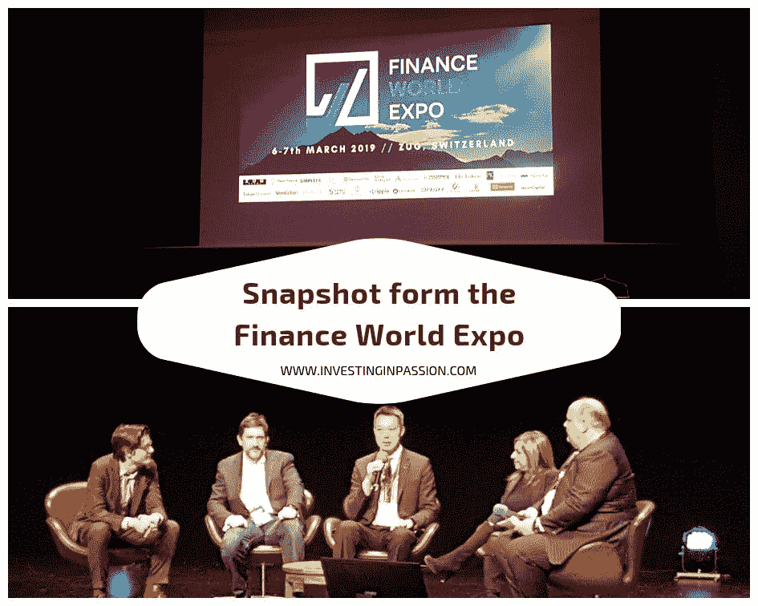
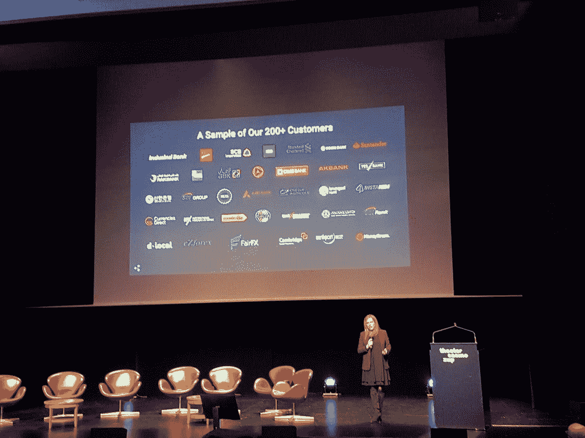
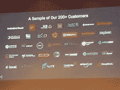
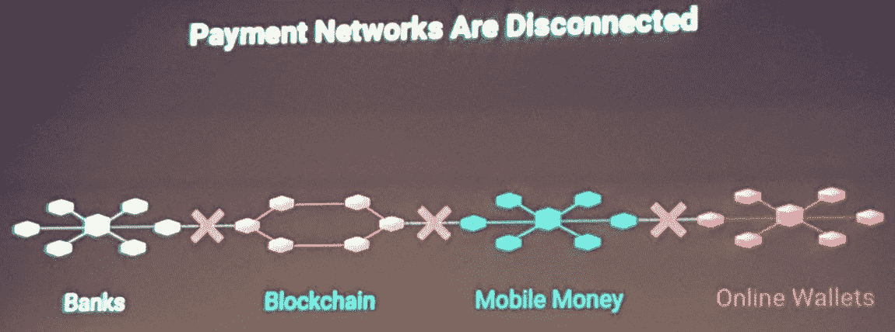
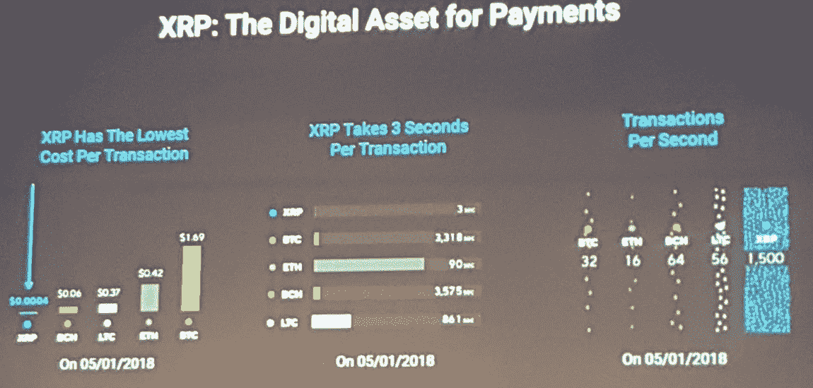
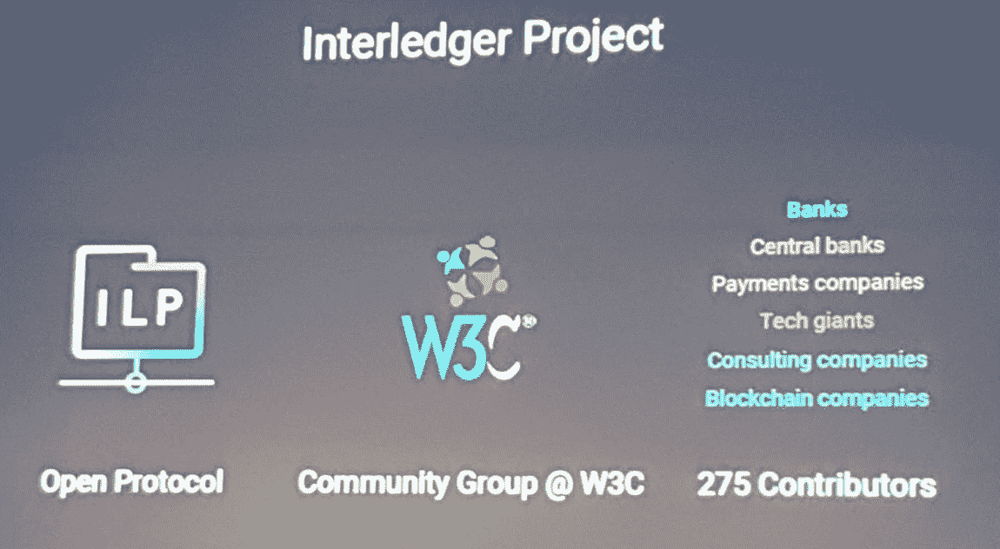
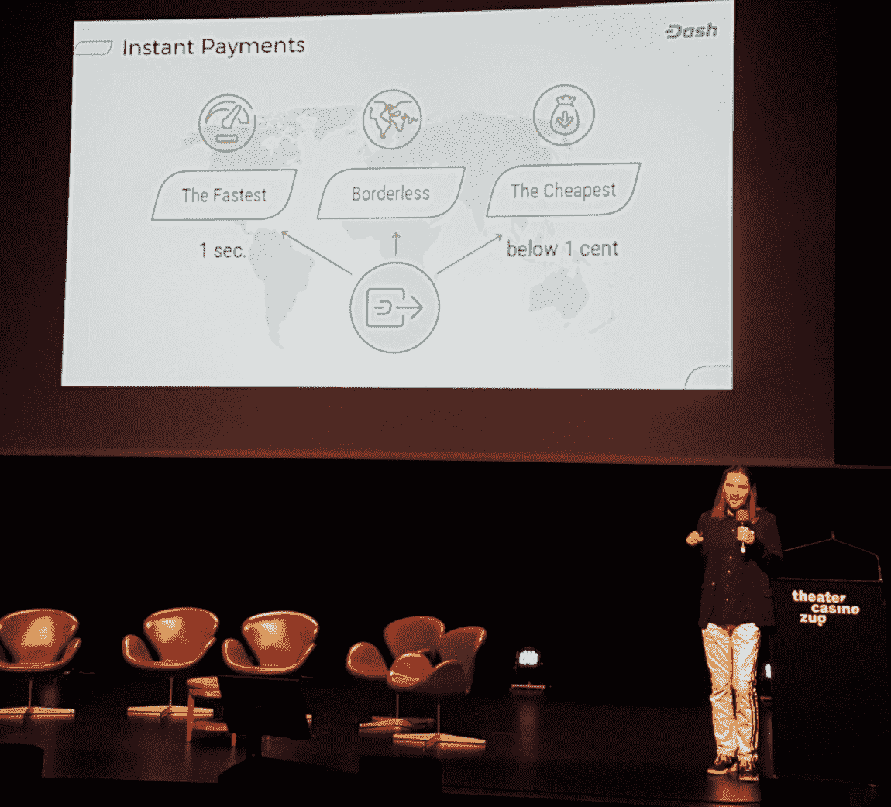
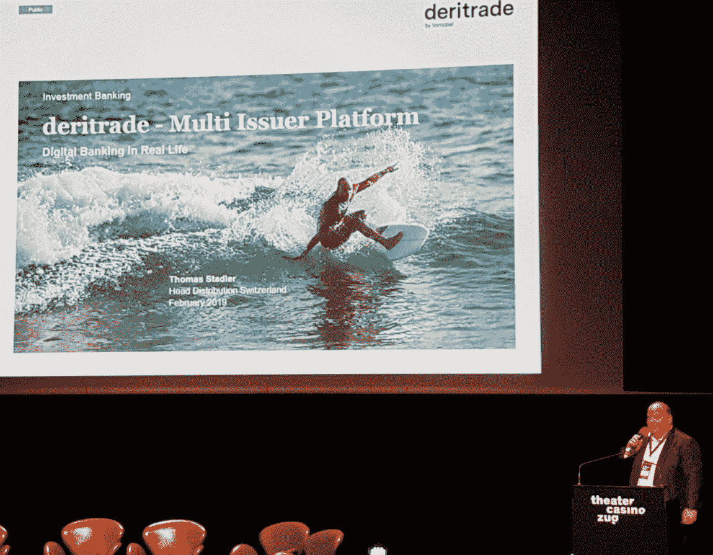
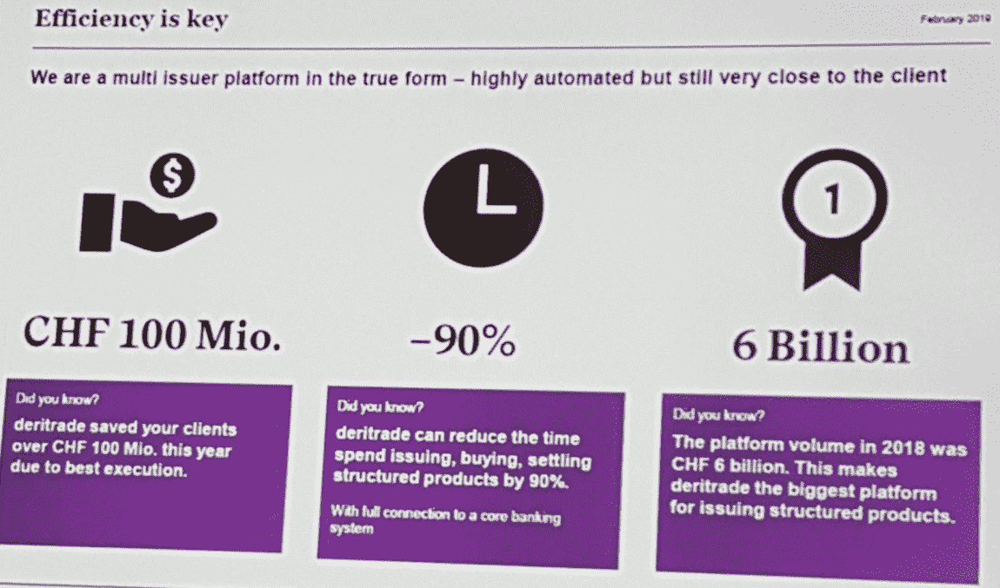
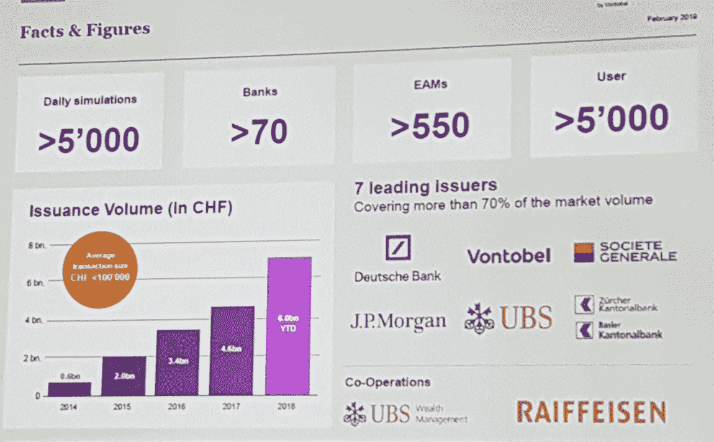

# 金融世界博览会快照

> 原文：<https://medium.datadriveninvestor.com/snapshot-form-the-finance-world-expo-d7b382a96073?source=collection_archive---------11----------------------->

第一个这样的金融世界博览会本周在楚格举行。它特别关注市场上广泛的支付解决方案。如果您对即将上市的最新区块链和非区块链相关产品感兴趣，您可能希望查看以下在 Crypto Valley 活动期间展示的项目。

 [## 正在改变行业的 5 个真实世界区块链应用——数据驱动的投资者

### 除非你一直生活在岩石下，否则我相信你现在已经听说过区块链了。而区块链…

www.datadriveninvestor.com](https://www.datadriveninvestor.com/2019/02/13/5-real-world-blockchain-applications/) 

Marjan Delatinne 代表 [**Ripple**](https://ripple.com/) 担任全球银行业务主管。她介绍了最新的 ripple 的成就，以及他们如何迎接这一具有挑战性的使命，即让支付变得更容易、成本更低、更加透明。很高兴看到女性管理如此有意义的项目，并成功领导 ripple 的全球业务。

你们中的一些人，或者说你们中的大多数人听说过 ripple 及其在市场上的地位，并且是第一批采用区块链的人之一。
自 2017 年以来，他们的规模已经增长了两倍，并拥有许多公认的商业合作伙伴和客户。

Ripple 专注于金融普惠，努力简化金融交易。像支付这样简单的交易应该是容易的，短暂的，可获得的，它们不应该产生这么多的成本，多个账户和几天的时间，直到钱到达收款人的手中。支付世界必须民主化，这种变化已经发生了。使用区块链，他们解决了几乎所有目前存在的可能性。现在情况是，我们最终会有多个区块链，但我们不能允许再次出现支离破碎的网络。

Dash Core Group Inc .[**Dash**](https://www.dash.org/)代表是 Dash Core Group Inc.
的首席运营官·罗伯特·威科(Robert Wiecko)，Dash 是一种数字货币，是现有支付方式的替代方式。这是为了个人，也是为了商业。你可以买咖啡，买机票，或者付账。Dash 正在成长，每天都有新的企业接受它。交易速度为 1 秒，2018 年第四季度的支付量超过 10 亿美元，每天处理超过 48，200 笔交易。

这确实是令人印象深刻的数字，增长率也在快速增长。该解决方案即时、安全，而且每次转账的成本不到一便士。

[**冯托贝尔**](https://www.vontobel.com/en-ch/) ，由冯托贝尔平台解决方案瑞士分销负责人托马斯·斯塔德代表。他带来了新的但已经深入实施的解决方案——deri trade。这是一个交易结构化产品的平台，不使用区块链技术，但简化了交易过程。它已经被许多公认的金融实体使用，他们有超过 5000 名注册用户。

我还喜欢由【】Andriotto Financial Services 的创始人兼总裁 Mauro Andriotto 经营的“众筹、代币、市场”以及由 [SVS 资本合伙人](http://www.svs-capitalpartners.com/)的首席执行官斯文-罗杰·冯·席林(Sven-Roger von Schilling)经营的“为雄心勃勃的公司融资的创新和现代方式”。请随意查看他们的个人资料和他们管理的公司。需要熟悉的好话题和多年的金融市场经验。