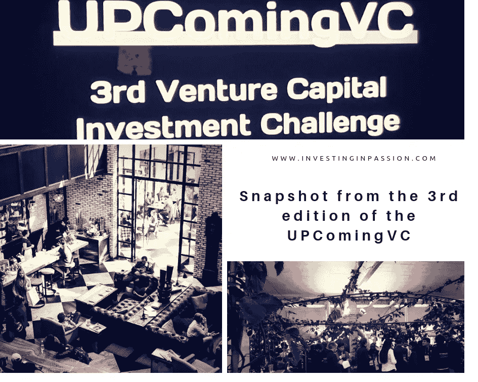
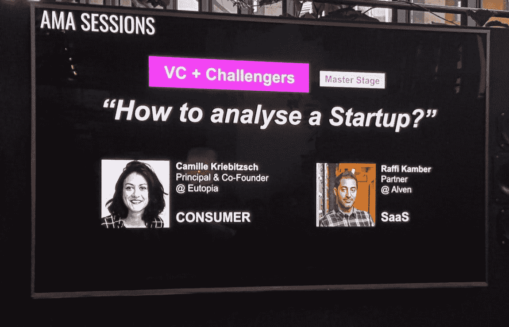
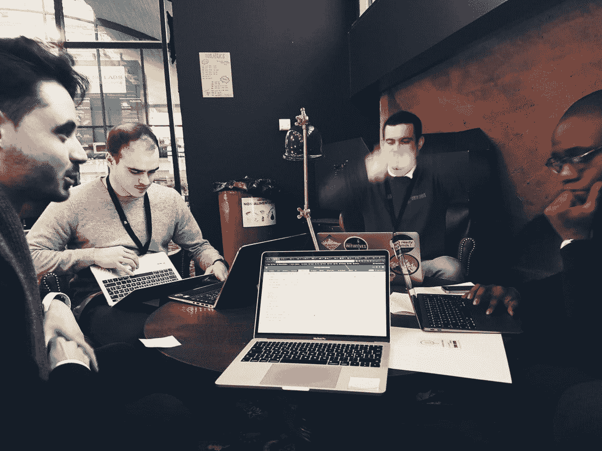
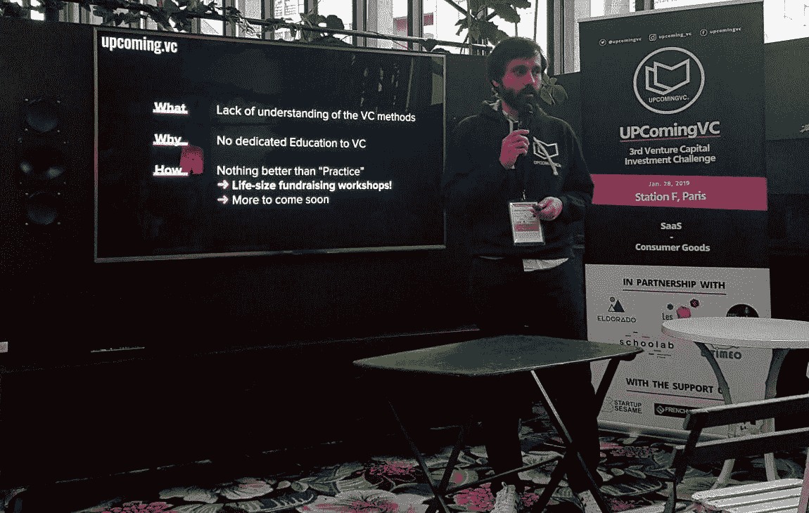
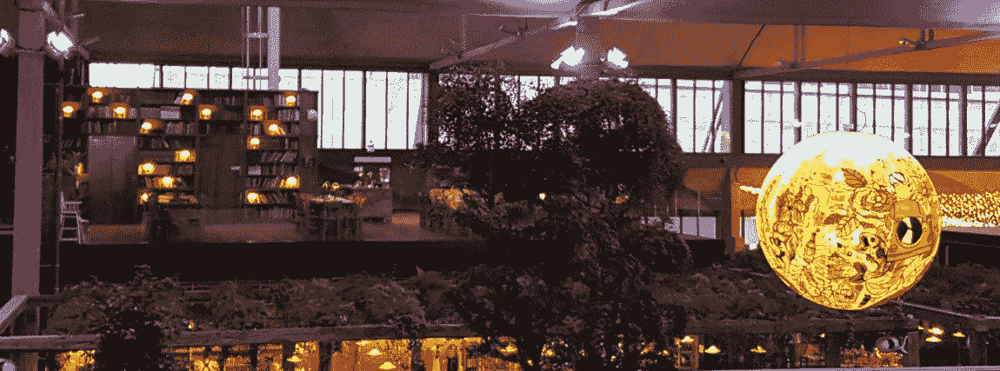
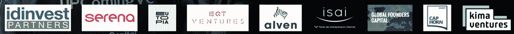

# 来自巴黎第三届即将到来的 VC 的快照

> 原文：<https://medium.datadriveninvestor.com/snapshot-from-the-3rd-edition-of-the-upcomingvc-in-paris-c2c8cd0210ff?source=collection_archive---------4----------------------->

[UPComingVC](http://www.upcoming.vc/) 是一个唯一的风险投资教育平台，不仅面向初创公司，而且最重要的是面向早期&成长期的企业家、投资者和有抱负的风险投资家，即所谓的“想成为风险投资家”。

最近的一次，即第三届 UPComingVC 于 1 月底在巴黎举行，聚集了 50 多名志同道合的个人。
8 家创业公司、8 个年轻投资者团队和 8 个知名本地风投共同合作，从初步筛选出的 8 个商业创意中挑选出最佳创业公司，让他们穿上风投的鞋子，就像真正的投资者一样玩，没有几百万可以花。

真正的风险投资家(VC)是初创企业和挑战者的导师。他们分享了他们的想法、方法、见解和最佳实践，以帮助年轻的专业人士正确地与初创公司进行对话，并获取最必要的信息，以决定是否只资助一家最有前途的企业。

这是非常忙碌和活跃的一天，你可以真正专注于分析收集的信息，评估潜在的早期公司，并与团队合作，决定向你的风险投资伙伴展示什么。你需要稍微舒展一下自己，因为没有太多时间考虑所有的利弊，但这确实让你对风投的工作有了一个大致的了解。

这个挑战让你练习风投们是如何思考的，帮助你意识到应该关注什么，以及如果谈判偏离了预期方向，该如何结束谈判。这是现实生活中的对话和舞台上的表演。这需要团队合作和时间管理练习。
这是紧张的一天，充满了情绪、新朋友、社交机会和深度学习会议。

总而言之，我强烈推荐你申请即将在网站上发布的下一个版本。活动的质量和组织团队做得很好！所以如果你是:

**一家初创公司**你可以期待融资过程的全面培训，有机会与风投联系，并为你即将到来的潜在融资回合做准备，
**一位有抱负的风投**，你将能够在与真正的初创公司和经验丰富的风投进行的真人大小的测试中测试你的投资&尽职调查技能，获得关注并被聘用为潜在的实习生/分析师/合伙人，
**一位风投**，你可以为你的团队(实习生、分析师、合伙人)物色有才华的有抱负的风投

最后，但绝不是最不重要的，关于几年前想出这个绝妙主意的人的几句话。拉斐尔·格列科参与创业社区已经有好几年了。他是 Seedstars，MassChallenge Switzerland 的创业导师，与 SKEMA Business School，Product Hunt Switzerland 合作。他是一个非常鼓舞人心的人，对创业和创新充满热情。他们和他的团队一起承担了一项任务，那就是发掘早期&成长期投资者和企业家的才能，他们做得很好，为对风险投资、初创企业和个人机构投资者感兴趣的广泛人群提供了一个很好的网络和教育平台。

今年，活动在[站 F](https://stationf.co/) 举行。它是世界上最大的创业园区，由 Xavier Niel 提供支持，位于巴黎。这是一个令人惊叹的空间，你可以在一个舒适但安静的角落里工作，或者坐在一张大桌子前与其他人一起头脑风暴。

到目前为止，与即将到来的风险投资合作的风险投资基金有:

[*https://www.upcoming.vc/#participate*](https://www.upcoming.vc/#participate)

*O* *原文发表于*[*【www.investinginpassion.com*](http://www.investinginpassion.com)

# DDI 特色商业课程:

*   [完成商业教育](http://go.datadriveninvestor.com/mbacourse)

**DDI 可能会从这些链接中收取会员佣金。我们感谢你一直以来的支持。*