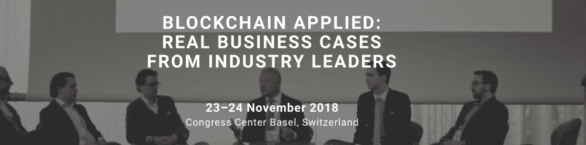
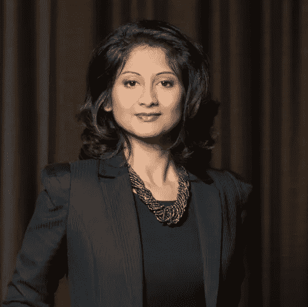
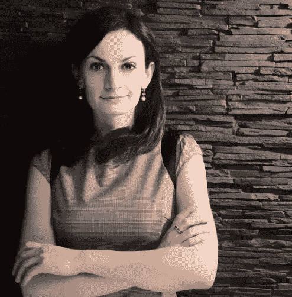
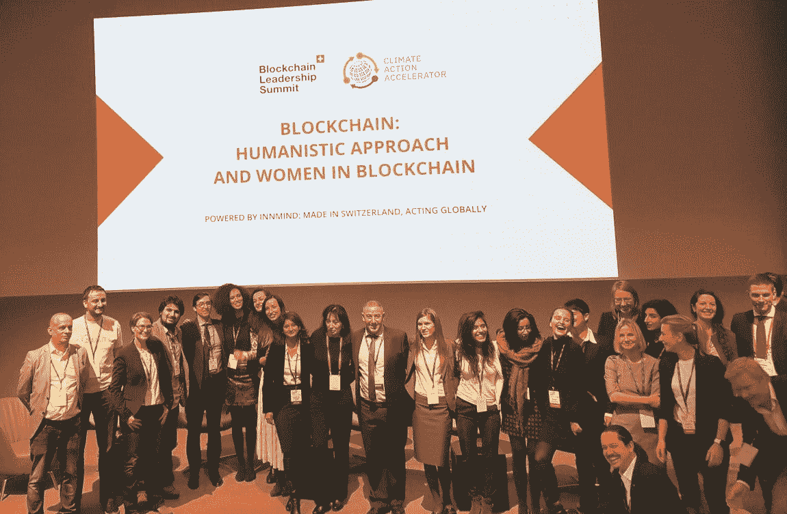
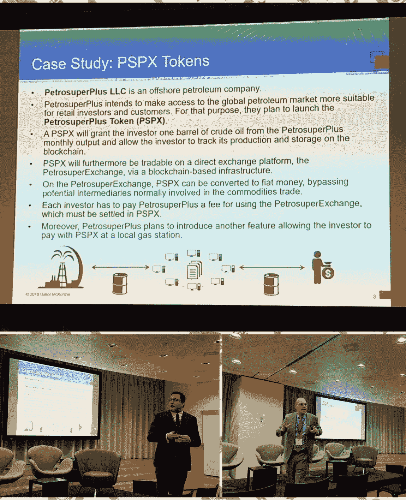
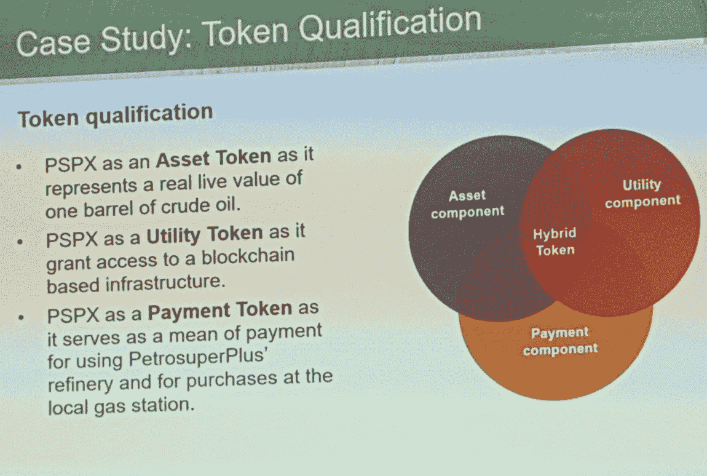

# 区块链领袖峰会快照和市场上的女性形象

> 原文：<https://medium.datadriveninvestor.com/snapshot-from-the-blockchain-leadership-summit-and-about-women-presence-on-the-market-e3c6ab106c1a?source=collection_archive---------13----------------------->

区块链领袖峰会引发了很多新的倡议、商业关系和创业想法。在为期两天的会议中，数百名嘉宾、 [70 多名演讲者和 50 多个合作组织](https://innmind.com/articles/1379)齐聚一堂，共同探讨区块链技术的未来，并观看其实施的真实案例。该峰会由瑞士首个全球商业生态系统全球创新社区[inmind](https://innmind.com/)发起。

顶级专家、积极投资者和公认的远见卓识者花了一些时间在工作会议和定期演讲中讨论全球效应、区块链一体化的金融监管以及下一次工业革命的真实案例。他们谈到了集中流动性统治、DEX 开发、市场上的旅鼠，并展示了区块链投资的利弊。

我将在下面列出一些我个人认为非常鼓舞人心的话题(详尽的发言人名单和完整的议程你可以在这里找到):

**人文主义方法和区块链中的女性**

Kamales Lardi
Co-founder and President of Women In Blockchain Switzerand (WIBS.io) and founder of BloomBloc
*Social Impact Leaders
Switzerland*

Emi Lorincz
Co-founder of Women In Blockchain Switzerand (WIBS.io)
Director Business Development Europe at ShapeShift AG
**Crypto Market Leaders**
*Switzerland*

**Monica Oravcova**
COO and co-founder of Naoris
Cyber-security entrepreneur
**Blockchain Technology Leaders**
*United Kingdom*

在区块链做女人是什么感觉？从女性的角度来看，区块链技术是什么样的？如何推进多样性和减少不平等？为什么我们要鼓励女性去区块链工作？所有这些问题都试图由 Kamales，Emi 和 Monica 来回答。丹尼斯·萨卡主持并帮助我们，他直截了当地提出了非常正确的问题！
这三位女性都对区块链技术完全着迷，其中两位独立经营自己的公司，她们都展示了区块链世界是多么令人兴奋。就是为了被发现！深入这个新项目或加入现有的倡议将会让你看到区块链技术的真实的、无限的好处和巨大的潜力。
尤其对女性而言，似乎每个人都理解并支持 IT/技术行业的包容性和性别平等，所以现在轮到我们采取行动，积极参与市场了。会计、金融、咨询也是区块链地区的一部分，所以不仅仅是编码和修理电脑。这比大多数人想象的要广阔得多。

最后，女人和男人没有区别。观众中的一位女士完美地比喻道，在区块链，指示女人和男人就像是用蓝色和棕色的眼睛来区分人。已经没什么意义了。世界几乎是统一的，如下图所示。男人和女人一起站在舞台上，随后进行了精彩的讨论。

此外，这是一个很好的机会在这里提到 WIBS，一个新成立的对区块链感兴趣的女性团体。“瑞士区块链妇女”是由 Kamales 和 Emi 成立的，几个月前才开始运作。欢迎访问[网站](https://www.wibs.io/)，加入区块链女性领导协会。

**区块链与环境影响**

我是因为你是。这就是马马杜·图雷对区块链的总体看法。区块链应该是创造财富，而不是减少贫困。为人们创造财富和幸福的愿景是正确的，而不仅仅是让坏事变小。**区块链顾名思义就是社交**。我们需要有远见的人，好的例子，这样人们可以从真实的情况中学习。此外，应该在大范围内进行，以真正看到影响。法律系统和当局可以在侧面提供帮助，并允许这种项目的发展，但我们的任务是传播这个词，并开始在现实生活中实施小程序。

**构建 ICO**

如果您正在考虑构建 ICO，请随时联系 Manuel Meyer 博士和 Yves Mauchle 博士。他们举办了关于 ICO 的大型研讨会，介绍了不同类型的代币，以及他们在与人合作和协助初始硬币发行时看到的趋势。你可能听说过，大多数 ICO 项目都失败了，但也不一定是这样。具有正确愿景的可靠项目、人们喜欢和需要的产品、经验丰富的顾问和友好的法规环境可能是成功的关键。

**创业推介和获奖者公告。**

没有人预料到两家初创公司可能会获得完全相同的票数，但这种情况确实发生了！恭喜你，继续前进！期待有关项目开发和市场推出的消息。

[https://investinginpassion.com/2018/11/25/snapshot-from-the-blockchain-leadership-summit-and-about-women-presence-on-the-market/](https://investinginpassion.com/2018/11/25/snapshot-from-the-blockchain-leadership-summit-and-about-women-presence-on-the-market/)

**演讲者的主要经验教训和建议:**

俄国正在制定“对区块链投票”的解决方案。查看 [Polys](https://www.linkedin.com/company/polys-online-voting-systems/) 了解更多关于在线投票系统的信息。

说出你的想法，诚实，你最终会得到支持和投资。如果你在这个领域，有好的想法并且相信你正在创造的东西，这需要时间，但是你的决心会有回报的。

你投资哲学。比特币，以太坊，现金，它们都是不同的哲学，所以只要跟随你的感觉，以及更接近你的现实和理性。

革命听起来是好的，但要获得大运动的所有好处，我们需要思考并引导发展向好的方向发展。

越来越多的分散交易使得加密货币更容易获得，流动性更强。

**End note:**
这个会议是一个活跃交流、交换商业观点以及获得更多关于感兴趣话题的知识的空间。因此，对于参与组织区块链领袖峰会的人来说，这是一个巨大的挑战。我们需要越来越多的机会来连接和创造市场上的附加价值。

**免责声明:** *来自[https://swissblockchainsummit.com/](https://swissblockchainsummit.com/)的演讲者图片