# 瑞士金融科技奖快照

> 原文：<https://medium.datadriveninvestor.com/snapshot-from-the-swiss-fintech-awards-c43e50d652fe?source=collection_archive---------6----------------------->

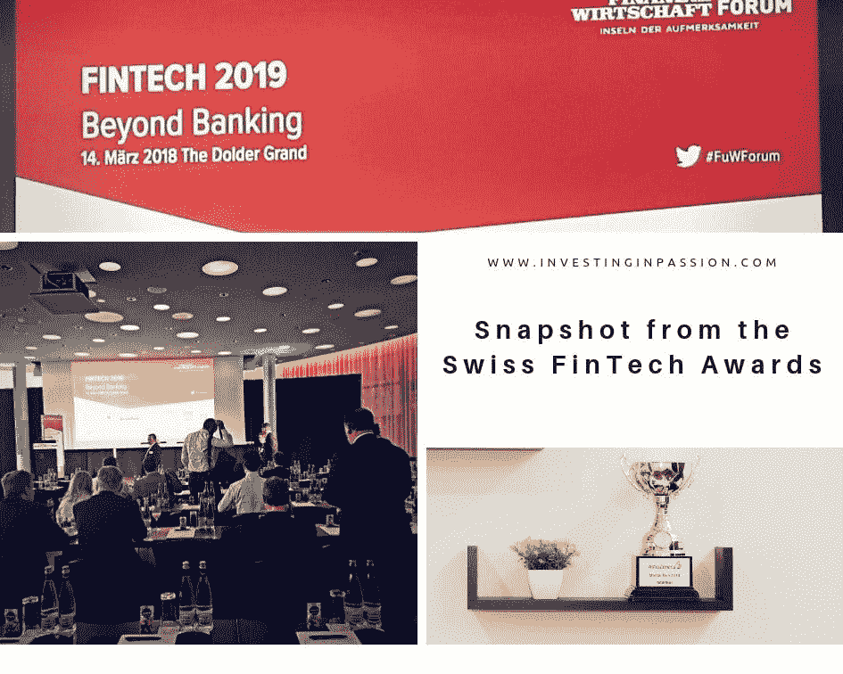

我很高兴能与顶尖的金融科技代表在山上迷人的瑞士卡斯特尔酒店度过令人兴奋的一天，在那里可以看到城市的美景。这一切都要归功于本周在苏黎世多尔德大酒店举行的瑞士金融科技奖颁奖典礼。

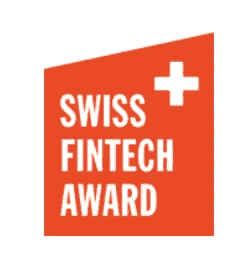

瑞士金融科技奖年度活动的目的是促进当地发展，加强瑞士金融科技生态系统，并鼓励创始人更积极地参与市场。最有趣的瑞士金融科技解决方案(已经有一些吸引力)由金融科技专家和当地企业代表颁发。

 [## 金融科技初创公司正在扰乱世界各地的银行业-数据驱动的投资者

### 传统的实体银行从未真正从金融危机后遭受的重大挫折中恢复过来…

www.datadriveninvestor.com](https://www.datadriveninvestor.com/2018/10/20/fintech-startups-are-disrupting-the-banking-industry-around-the-world/) 

如果你对谁被评为年度早期创业公司、年度成长阶段创业公司和年度金融科技影响者感到好奇，请继续阅读。

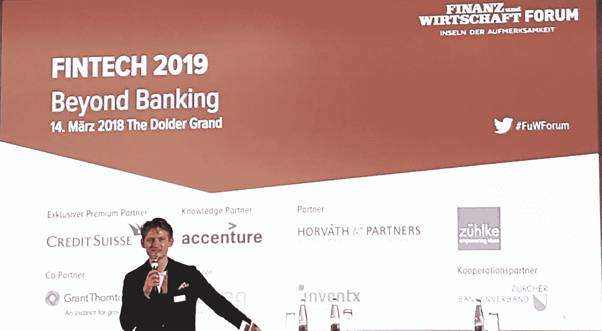

该活动本身是众所周知的，聚集了来自不同行业的专家和企业家，但它非常关注瑞士市场。申请标准如下:

*   瑞士公司
*   瑞士的目标市场
*   与瑞士市场的紧密联系

**现在让我宣布每个类别的获胜者！**

**1。当年早期启动**(*2 年以下或资金不足 250 万瑞士法郎)*

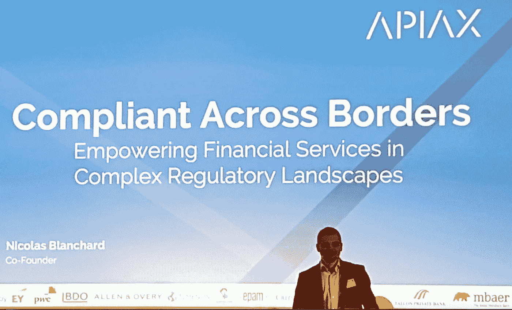

**2。当年的成长阶段启动** ( *不满两年或拥有超过 250 万瑞士法郎的资金)*

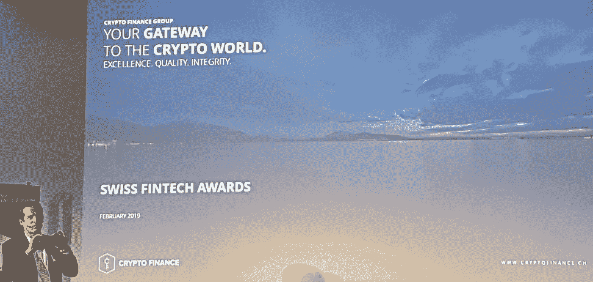

**3。年度金融科技影响力人物**

**施耐德安曼**。他是一个有企业家背景的雄心勃勃的经济推动者。他是联邦经济事务、教育和研究部长。关于他推进瑞士金融科技生态系统的杰出工作的更多信息，你可以在这里找到。

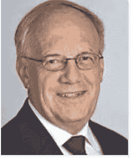

[*https://pl.wikipedia.org/wiki/Johann_Schneider-Ammann*](https://pl.wikipedia.org/wiki/Johann_Schneider-Ammann)

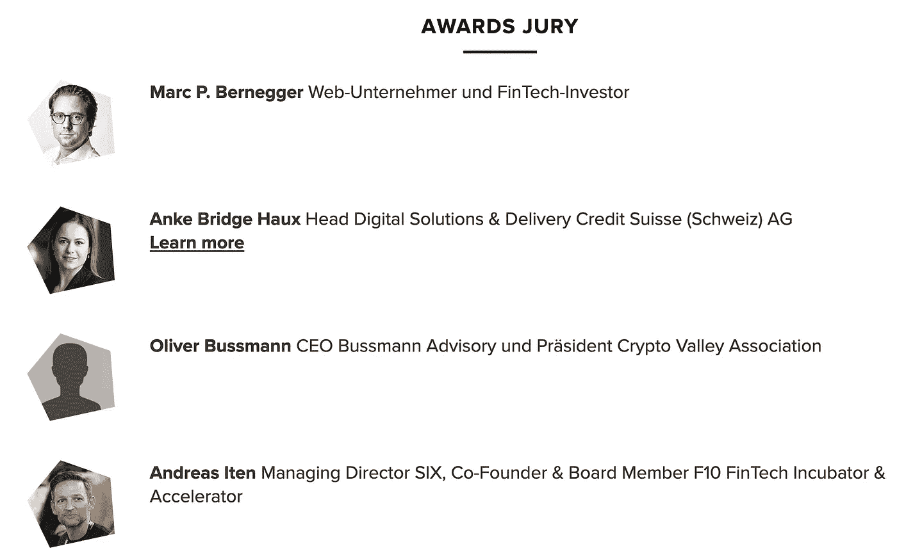

[*https://www.fuw-forum.ch/swiss-fintech-awards-2019/*](https://www.fuw-forum.ch/swiss-fintech-awards-2019/)

**此外，大会还提供了许多鼓舞人心的研讨会和讲座。**

亚马逊效应:传统企业如何转变为数据驱动型公司？《华盛顿邮报》记者沙尔利什·普拉卡什

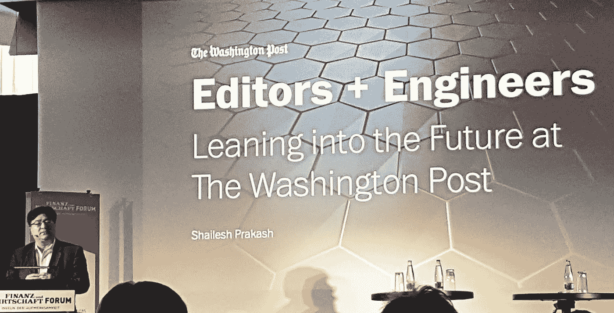

**挑战者银行:建立一家银行的人究竟想用什么？特里斯坦·托马斯·蒙索·班克著**

**区块链现实检验:炒作之后，突破之前**由 Markus Infanger — Ripple，STéphane Rey—Lombard Odier Investment Managers，Heinrich zetl Meyer—block chain Valley Ventures

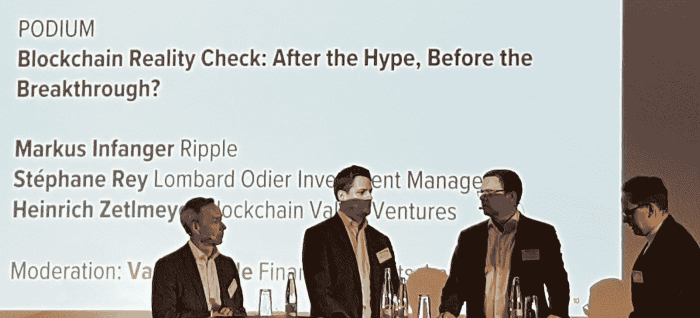

社交媒体和金融的未来:现任者能从颠覆者身上学到什么

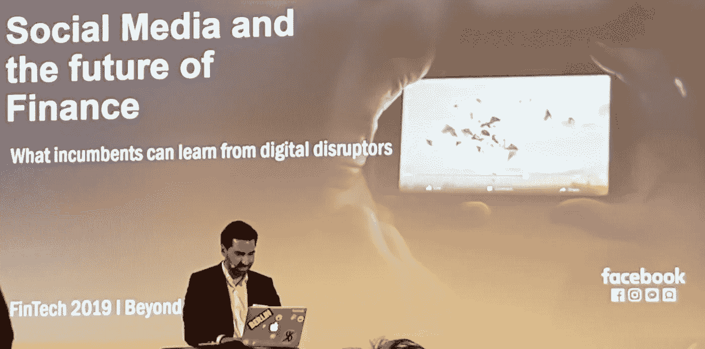

非常荣幸能够表彰最具创新性的金融科技初创公司和杰出的影响者，他们聚集在一起建立联系，相互了解，并建立新的商业关系。看着那些成功的人追寻自己的激情，并将其业务推向全球，这是多么鼓舞人心。该会议是一个非常有用的网络平台，可以了解最新的新闻，享受轻松的一天，同时学习和建立一些商业联系，最终可能成为成功的跨公司合作伙伴。

*剩下两家有资格进入决赛的创业公司是: [Traxia](https://www.traxia.co/) 和 [Sonect](https://www.sonect.net/) 。

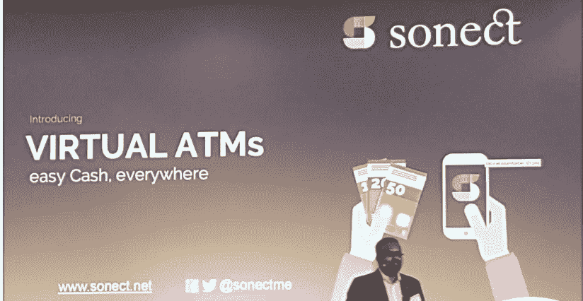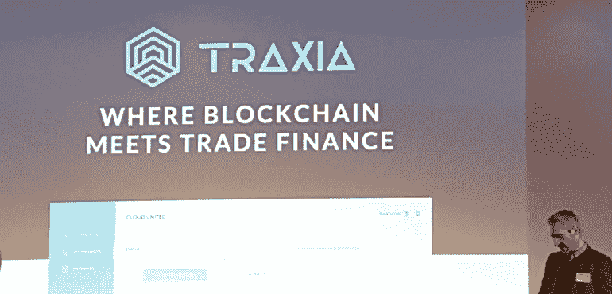