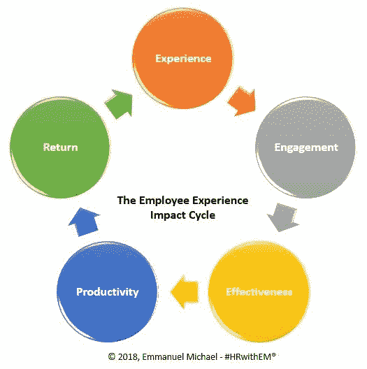

# 在冲突爆发前将其扼杀

> 原文：<https://medium.datadriveninvestor.com/snuff-out-conflicts-before-they-explode-d4b4f876aaca?source=collection_archive---------18----------------------->

## 小问题得不到检查会给团队带来不必要的问题

冲突在日常生活中是不可避免的，尤其是在工作场所。人们来自不同的背景，性格各异。

艾米·特纳说:“虽然工作场所的冲突并不总是坏事，但如果不加以解决，忽视它会把一个小挑战变成一个更大的问题。”她是人力资源顾问，也是 T2 G 合伙人公司盐湖城办公室的团队领导。

该公司是一家人力资源和行政外包公司。它提供关于公司文化、工作场所动态、福利和其他事项的人力资源专业知识和见解。

特纳和 G&A 合伙人公司休斯顿办公室的人力资源助理 Catherine Coats 与 [Emmanuel Michael](https://twitter.com/enmichael) 讨论了如何最好地预防和解决冲突，以及公司可以采取哪些措施来实施这些流程。

迈克尔被评为 [100 名最具影响力的全球人力资源领导者](http://worldhrdcongress.com/images/WHRDC%2718_Brochure_WF.pdf)。他还是一名作家、公共演说家和导师。

 [## 激情爆发时，沟通会受到影响

### 论坛帮助人们聚集和解决冲突

medium.com](https://medium.com/datadriveninvestor/communication-suffers-when-passions-erupt-affa2e520268) 

虽然公司可能有解决工作场所分歧的策略，但公布的冲突解决指南必须得到行动的支持。否则就是诋毁领导的空话。

“开放的交流和信任的环境是最好的，”特纳说。"在处理冲突时，始终把注意力放在问题上，而不是人."

同时，每个工人都需要关注。

“我们的领导把了解每一个在他们手下工作的员工作为一个个体放在首位，”科茨说。“建立信任关系有助于员工在发生冲突时放心地向经理报告问题。

“重要的是要重视思想的多样性，真正接受由此产生的想法和关系，”她说。“同样，公司需要在他们的文化中灌输开放沟通。这可以在问题出现之前解决很多问题。”

# 特异性融合

迈克尔同意，泛泛的药方是不够的。他提出了一种融合方法:

*   f-关注手头的问题和与问题相关的要点。
*   u——理解对方的观点和看法。
*   s——具体说明你的想法或需求。
*   我——使用“我”的语言，而不是“他们”、“他”和“我们”来掌控对话。
*   o—*准备好*处理不同意见的选项。
*   没有“热点”语言，如“你总是这样。”如果可能的话，尽量避免使用“你”这个词，多用“我”。

 [## 一次，两次，三次一个领导

### 伟大的领导者有同理心和善良——并倾听

medium.com](https://medium.com/datadriveninvestor/once-twice-three-times-a-leader-ab554765231c) 

解决冲突最有效的工具是积极倾听。那就是[听明白](https://medium.com/datadriveninvestor/tips-for-entrepreneurs-not-spoken-for-9de87df8653)而不是准备下意识的反应。这种策略做得好的话，也能从一开始就防止冲突。

“耐心倾听，”特纳说。“听人说完。重复他们的话，这样你们就在同一页上了。然后询问相关人员如何达成一致。”

科茨强调每个人都有发言权。

“在任何人能够有效地达成解决方案之前，双方都需要感到自己被充分倾听和理解，”她说。“避免‘责备游戏’。”如果员工开始相互指责，将谈话重新引回到中心问题，将焦点放在他们能控制的事情上。"

正如迈克尔解释的那样，每个故事都有两个方面。

“倾听并给每个人一个机会来陈述他们理解的情况会有很大帮助，”他说。

“建立一个结构化的争议解决系统也很关键，”迈克尔说。"这让每个人都知道在这种时候该做什么."

# 相互尊重

当双方都理解并尊重对方的观点时，冲突就有更好的解决机会。激烈的冲突可能源于麻木不仁或简单的沟通失误。

特纳说:“健康的冲突会引发对不同观点的讨论。”。“那可以提出创新的想法。一些最好的概念来自冲突讨论。”

 [## 公司啦啦队员对你赞不绝口

### 敬业的员工向公众宣传他们的公司

blog.markgrowth.com](https://blog.markgrowth.com/company-cheerleaders-shout-your-praises-b0b24ca1014c) 

迈克尔说，这是一个寻找让员工变得更强大、更优秀的机会。

“当问题得到妥善解决时，双方都应该成为更好的人，”他说。“公司应该会受益，因为我们现在知道如何为了企业的利益而相互联系。”

团队合作是阻止或解决冲突的有益步骤。然而，它不应该被视为一个银弹，特别是对那些不到敏感，感情。

应该从上到下真正努力促进沟通和理解。

“团队凝聚力至关重要，”特纳说。“信任在团队中至关重要。如果你不能信任一个人，你就不会和他分享想法。这就减少了合作或创新的机会。”

科茨补充说，团队合作活动“有助于减少工作场所冲突的可能性。他们教授合作，而不是竞争。”

人们只是简单地与人交谈，这一点不能被高估。

“团队合作很有帮助，因为这给了各方互动和进行建设性沟通的机会，”迈克尔说。“团队建设是在工作场所的员工之间建立信任的机会。”

如果第一次一对一解决冲突的尝试失败了，邀请一个公正的第三方，他可以对局势做出平衡的看法。

特纳说:“经理们应该努力创造一种信任的关系，这样他们的员工就可以放心地公开分享他们的担忧。”"只有到那时，他们才能有效地找到问题的根源。"

# 没有等待

现在不是坐以待毙的时候。

“管理者总是应该在意识到冲突的时候就解决它，”科茨说。“那些等待的人可能会失去他们所领导的人的尊重。冲突愈演愈烈，并有可能变得有害。

“卷入冲突时，人们很容易专注于细枝末节，”她说。“经理有责任让各方回到现实中来，帮助解决眼前的主要问题。”

 [## 良好的一致性将你的价值观放在首位

### 核心价值观需要与员工相关并反映员工

medium.com](https://medium.com/datadriveninvestor/good-alignment-puts-your-values-top-of-mind-88bab188f6d8) 

解决冲突并不容易。

“经理应该制定团队的基本规则，”迈克尔说。“这包括沟通、合作和高效工作的最佳方式。简而言之，建立和塑造积极的群体规范。

他说:“经理应该澄清期望以避免误解，因为这是工作场所冲突的原因之一。”“我们怎么强调倾听和不带偏见地倾听的必要性都不为过。这是确保负面冲突最小化、消除或解决的关键。”

冲突会在整个工作场所引起反响，促使人们选择立场。士气低落，生产力在怀疑和指责的海洋中停滞不前。

“它创造了一个有害的工作环境——一个生产力低下、负面竞争激烈的环境，”迈克尔说。“这会导致挫败感，并可能导致*高流失率*。目标无法实现，因为每个人都是为了自己，没有人是为了企业。”

特纳补充说，未解决的冲突“绝对会造成业绩赤字。”

科茨说:“如果员工认为解决方案不公平，未解决的或有害的冲突可能会导致缺勤、离职甚至诉讼。”"然而，迅速而有礼貌地解决冲突有助于提高生产力和士气."

# 公众的赞扬

无论冲突是表现上的还是个人的，私下咨询。当众表扬。

“业绩问题可以很容易地用数据显示出来，而个人问题则不能，”特纳说。“不合标准的个人行为的例子可以通过揭示对员工职业形象和团队的损害来讨论。”

 [## 向右飞行以保持领导地位

### 你的性格太重要了，不能妥协

medium.com](https://medium.com/datadriveninvestor/fly-right-to-sustain-leadership-55618250d413) 

管理者可以把自己想象成人事医生——寻求诊断。

“当涉及到基于绩效的冲突时，经理们应该总是首先试图发现原因——缺乏动力、缺乏培训、缺乏资源，”科茨说。“那就确定合适的方案。

“如果手头有私事，经理应该向员工表示他们很关心，”她说。“然后，确保员工了解公司提供的帮助他们解决个人问题的任何资源。这包括员工援助计划或休假。”

迈克尔依赖于他的融合方法，他说这种方法“对所有类型的冲突都非常有效。”

他说:“关注问题(T0)而不是人(T1)将迅速解决冲突，并使各方达成一个(T2)双赢(T3)的局面。”。“迅速听取各方意见*以避免问题被隐瞒的情况。否则，*爆炸*必然发生。”*

# *积极的领导者*

*领导者可以通过积极参与工作来减少冲突。这不是微观管理，也不是让公司自动驾驶。只是了解和关心他们的人民。*

*特纳说:“很少有人天生就有解决冲突的天赋，但解决冲突的技能对于那些被提升为领导者的人来说至关重要。”*

*“雇主可以研究有效的沟通培训，专门解决如何处理和解决冲突，”他说。"然后他们可以将它传授给组织的所有层级."*

* [## 跟随领导者的脚步

### 走动式管理将领导者与团队联系起来

medium.com](https://medium.com/datadriveninvestor/walk-in-the-footsteps-of-leaders-6ca0b8dc7b49) 

有空是必不可少的——只要不只是嘴上说说。

科茨说:“开放政策可以极大地帮助减少工作场所的冲突，但前提是领导者真正能够接触到他们的团队。”“经理越平易近人，员工就越有可能乐于提出问题。

“走动式管理是另一种策略，已被证明可以通过改善人际关系来提高组织效率和积极性，”她说。

迈克尔认为，最好的领导者是指路的，而不是发号施令的:

*   领导应该提供*指导*，而不是解决方案。促进透明文化，让人们在情绪变得消极之前畅所欲言。
*   领导层应该投资培养他们的追随者，使他们成为管理冲突的领导者。让他们看到积极解决冲突的好处。
*   领导不应偏袒任何一方，而应保持专业态度，确保每次都能友好解决问题。生意应该会因此变得更好。

**关于作者**

吉姆·卡扎曼是拉戈金融服务公司的经理，曾在空军和联邦政府的公共事务部门工作。你可以在[推特](https://twitter.com/JKatzaman)、[脸书](https://www.facebook.com/jim.katzaman)和[领英](https://www.linkedin.com/in/jim-katzaman-33641b21/)上和他联系。* 

**原载于 2018 年 10 月 9 日*[*www.datadriveninvestor.com*](http://www.datadriveninvestor.com/2018/10/09/snuff-out-conflicts-before-they-explode/)*。**