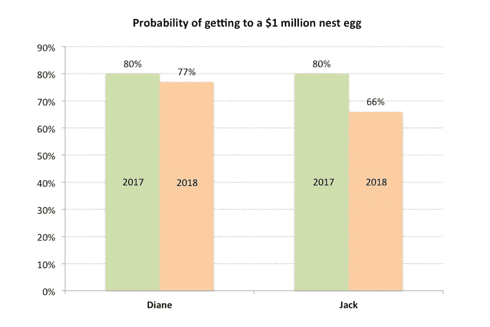

# 那么，你如何衡量财务成功呢？

> 原文：<https://medium.datadriveninvestor.com/so-how-do-you-measure-performance-67738d240b5?source=collection_archive---------18----------------------->

Photo by [Kolleen Gladden](https://unsplash.com/photos/ij5_qCBpIVY?utm_source=unsplash&utm_medium=referral&utm_content=creditCopyText) on [Unsplash](https://unsplash.com/search/photos/performance?utm_source=unsplash&utm_medium=referral&utm_content=creditCopyText)

说到财务上的成功，你可能会想到投资业绩。但我真正的意思是:

你如何衡量自己是否在实现财务目标的轨道上？

这当然是最重要的。

更多时候，财务建议的重点是提出“最佳”投资组合。然后衡量投资组合相对于某个基准的表现，比如整体股票市场。或者更糟，把你的结果和晚宴上的某个人比较。

大多数人将一生工作的积蓄投资，以便将来可以花在退休生活、旅行和/或孩子的大学教育等目标上。

在这种情况下，你的投资组合在过去几个月或一年的表现在多大程度上告诉你，你是否正在实现你的财务目标？

这类似于节食和锻炼。你可以测量你今天少摄入了多少卡路里，或者计算你的步数。你可以将它与前一天、前一周、前一个月等进行比较，甚至与同事或配偶进行比较。然而，最终你想衡量对你健康的影响。说你的体重，胆固醇等。

去年对投资股票市场的人来说是艰难的一年。美国股市下跌了 4.4%，而一篮子全球股票下跌了 8.7%。

 [## 数据驱动投资的兴起——数据驱动投资者

### 当 JCPenney 报告其 2015 年 2Q 的财务结果时，市场感到非常震惊。美国零售巨头…

www.datadriveninvestor.com](https://www.datadriveninvestor.com/2019/02/28/the-rise-of-data-driven-investing/) 

真正的问题是这有多重要？2018 年真的让你偏离了实现财务目标的轨道吗？

让我举一个例子，或者说两个例子来说明。首先，我们回到 2017 年。

**黛安和杰克**

考虑两个人:黛安 35 岁，杰克 60 岁。两人都想在 65 岁时退休，这意味着黛安还有 30 年，而杰克还有 5 年。

当 2017 年结束时，黛安的退休账户余额为 12 万美元，而杰克已经积累了 92 万美元的养老金。两人都打算在退休前的每个剩余工作年投资 12，000 美元。

现在他们每个人在退休之初都需要 100 万美元来资助他们所有的目标。为了简单起见，我将忽略通货膨胀(但请阅读我的[上一篇关于为什么考虑通货膨胀很重要的文章](https://medium.com/datadriveninvestor/how-can-i-run-out-of-money-if-i-earn-6-average-return-in-retirement-4407d9d9bb01))。

黛安和杰克的退休投资组合投资于一篮子全球股票，平均预期年回报率为 7%。然而，围绕这一点或风险(用投资管理行话来说)存在相当大的可变性。例如，年度投资组合回报可能如下所示:

18%，7%，-25%，30%，15%，6%等等…

它可能最终平均达到每年 7%，但这并不意味着投资组合的回报率每年都是 7%。

截至 2018 年的 15 年间，全球股票投资组合的平均年回报率**接近 7%。然而，年度回报有相当大的可变性。最高的是 33%(2009 年)，最差的是 2008 年，投资组合损失了近 41%。对于那些熟悉统计数据的人来说，这种全球股票组合的可变性或*标准差*几乎是每年 15%。我将在当前示例中使用哪个数字？

回报率可变性的问题是，我们无法得到一个精确的答案，即退休时的养老金值多少钱。我们只能得出一个概率估计。正如我在上一篇文章中所讨论的，问题是特定的回报序列可能看起来像

18%，7%，-25%，30%，15%，0%等等…,

而另一个可能是

20%，-18%，7%，0%，4%，10%等等。

所以我们用计算机模拟***得出 10，000 个这样的序列。然后我们计算成功序列的数量——那些投资组合增长到至少 100 万美元的序列。这给了我们一个“*成功概率*，即成功序列数除以 10，000。

对于黛安和杰克来说，考虑到他们目前的投资组合规模和储蓄率，模拟显示他们有 80%的机会在退休时达到 100 万美元。哪个在"*舒适区*"的中间:70%到 90%。

**市场动荡会改变赔率，但会改变多少**

现在快进一年。2018 年全球一篮子股票下跌-8.70%。因此:

Diane(现在 36 岁)看到她的退休投资组合从 120，000 美元下降到 109，560 美元。尽管她每年缴纳 12，000 美元，使她的退休金账户达到 121，560 美元。

杰克(现在 61 岁)看到他的退休账户从 920，000 美元下降到 839，960 美元。他每年 12，000 美元的捐款使余额达到 851，960 美元，但这很难填补缺口。

那么，2018 年的糟糕回报让他们偏离了轨道多远？

我再次运行了模拟——这次计算了黛安和杰克分别在 29 年和 4 年内将他们的储蓄增加到 100 万美元的几率(因为我们提前了一年)。

如图表所示，黛安的几率变化不大。这一比例降至 77%，但仍处于舒适区。

与此同时，杰克实现退休目标的几率已经跌至 66%。那是因为他只剩下两年时间了。

这确实提出了一个问题，杰克是否应该在如此接近退休的时候投资一个激进的股票投资组合？

**提高杰克的胜算**

让我们稍微改变一下杰克的情景，假设他的退休储蓄在 2018 年投资于 50/50 的股票/债券投资组合。在这种情况下，债券提供了一些保护，投资组合损失了-4.2%(相比之下，只有股票的投资组合损失了-8.7%)。

因此，到 2018 年底，杰克的退休投资组合余额将为 893，452 美元。这比我们上面看到的 851，960 美元要好。

那么几率会怎样呢？

这一比例仍在下降，但降至 73%左右，而不是 66%。

杰克甚至可以在接下来的四年里增加自己的储蓄，以增加退休时达到 100 万美元大关的几率。他要挖的洞要小得多。

**保持在轨道上**

当然，黛安和杰克的情况完全是虚构的，但我的目标是阐明一个重要的观点。

回顾投资组合的表现很重要，但最终，你真正想知道的是，你是否正在实现所有的财务目标。

如果糟糕的市场表现让你明显偏离了轨道(比如实现目标的几率降低了 10-15%)，你需要问问自己或你的顾问，哪里出了问题。同样重要的是，需要做些什么才能回到正轨，并付诸实施。

***脚注***

标准普尔 500 指数代表的美国股票。

*全球股票投资组合:55%在标准普尔&500 指数，35%在摩根士丹利资本国际 EAFE 指数(net)，10%在摩根士丹利资本国际新兴市场指数(net)。*

*50/50 投资组合:标准普尔 500 指数 27.5%，摩根士丹利资本国际 EAFE 指数(net)17.5%，摩根士丹利资本国际新兴市场指数(net)5%，彭博巴克莱美国综合指数 50%。*

*在 2004 年 1 月至 2018 年 12 月期间，每月对投资组合进行再平衡。*

*退货数据依赖于假设指数，不包括所有费用和开支。回报假设所有股息的再投资。投资指数是不可能的，过去的表现也不能保证未来的结果。*

** *平均回报是指复合的年几何平均回报，而不是简单的算术平均回报。*

****Portfolio Visualizer 用于本文的所有模拟。不考虑税收、交易成本和其他费用。*