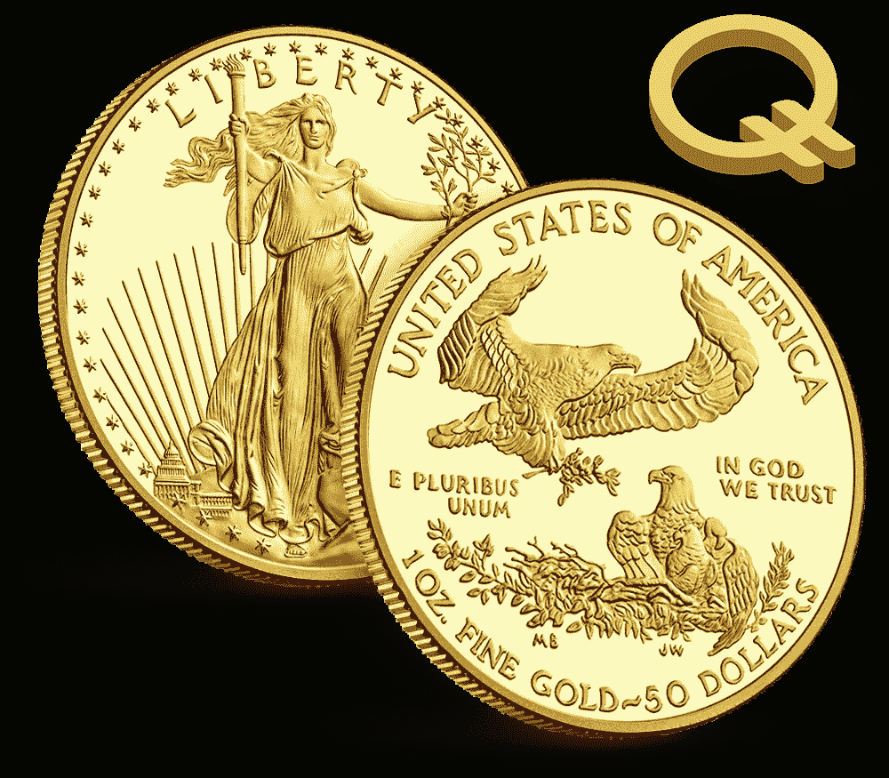
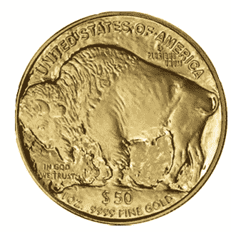

# 那么金特到底是如何运作的呢？

> 原文：<https://medium.datadriveninvestor.com/so-how-does-quint-work-anyway-ff106415a108?source=collection_archive---------0----------------------->

初学者快速入门

在最近的一些谈话之后，加密货币社区中的一些人似乎仍然不完全确定五分之一系列的令牌以及这些特定货币是如何工作的。鉴于这是加密货币市场的一个新的创新概念，我们完全理解为什么会有一些混乱。然而，我们想要花一些时间来解释代币家族背后的创建思想以及它们到底是如何工作的。

# 这个概念

五分之一系列代币的诞生是为了将颠覆金融科技行业的革命性技术——分布式账本技术——与让一种货币实际上具有*价值*的老派方法相结合。

以前美元是由黄金支持的，所以如果你想的话，你可以把你的黄金支持的货币(美元)换成等值的黄金。尽管货币体系已经脱离了资产支持货币的传统根基，但 [Quintric](https://quintric.com/) 正在努力让它回归。五分之一系列的代币完全由金银等货币支持。这是最基本的概念。

# "价值与黄金挂钩，这是怎么回事？"

这才是重要的部分！金特不是简单地捆绑一种货币的价格，然后说它值一大笔黄金，而是实际上在这么做。

当购买五元代币家族中的任何代币时，相应数量的真实的、有形的、合法的硬币货币被购买并被储存以构成货币。例如，让我们看看“金特”

[金特代币是由真正的美国法定货币黄金制成的。](https://medium.com/@michaelx777/5-reasons-why-the-quint-will-outlast-other-currencies-50cf74efa38d)这意味着当人们购买金特代币时，他们实际上是在购买一定数量的美国法定货币黄金。对于某人购买的每一个金特代币，代币实际上构成五个美国金币美分(一盎司的美国法定货币金币的 1/1000)，然后在需要时以一次 1000 个代币的增量支付。

由于这个系统，如果你持有 1000 枚金特代币，这意味着你可以根据需要用它们兑换面值为 50 美元的美国鹰或水牛金币。具体来说，就是这个小家伙。

当人们购买金特代币，或任何其他五分力家族的代币时，五分力团队将购买相应数量的硬币来持有。该采购计划以 1，000 金特为增量。因此，每当有人从 Quintric 购买 1000 枚金特时，就会购买一枚真正的美国法定货币金质美洲野牛/鹰币，并将其放入金库妥善保管。

此后，这枚硬币可随时以 1000 金特的增量兑换。所有的定价都包括保险、维护和终身保险库存储的成本。不算太坏，是吗？这意味着无论发生什么，你通过金特购买和持有的黄金将永远是安全的。

许多人喜欢实际拥有一种可用的、价值驱动的货币的想法，这种货币不仅仅基于名字的认可和接受，但很少有人真正实现它。Quintric 正在让这一切成为现实:安全地。

*作者不是律师或财务顾问。* *作者希望读者注意，他是 Quintric 的联合创始人和董事会成员。呈现的任何内容都不应被解释为投资建议或法律建议。*