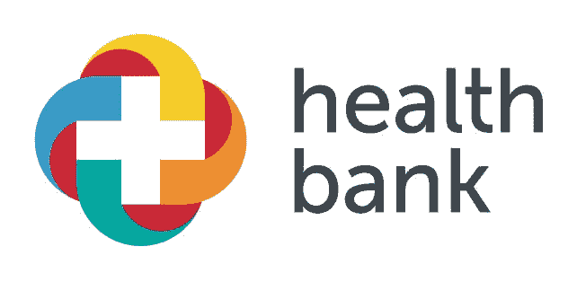

# 这么多 ico，这么少时间…

> 原文：<https://medium.datadriveninvestor.com/so-many-icos-so-little-time-1e362535e175?source=collection_archive---------56----------------------->

[https://icobench.com/ico/healthbank](https://icobench.com/ico/healthbank)

不幸的是，我们生活在一个知道所有东西的成本，却不知道任何东西的价值的社会……

每天都有新的图标出现。ICO 代表首次公开募股，基本上是 IPO 的一个简单版本。自 2017 年以来，这种创新的投资和融资形式一直是区块链和金融界关注的焦点。因为这比首次公开募股简单得多，所以 2018 年出现了太多这样的公司，对于荒谬的公司来说，这是伟大的一年。

由于 ico 一般包含比特币、区块链、人工智能等流行语，因此成为自称这些领域专家的人的投资天堂。但实际上，由于它是一门相对较新的科学，真正的专家很少。

我们已经看到了**日本猫**的 ico、**圣诞币**的 ico，甚至还有**耶稣币*的 ico、*** *的 ico，“与道德沦丧的加密货币不同，耶稣币具有独特的优势，它提供了全球访问耶稣的途径，比以往任何时候都更安全、更快捷*”。

事实上，有几个简单的要点可以区分一个伟大的 ICO 和一个骗局。但最重要的一点经常被忽视，那就是**ICO 实际上代表什么。它想达到什么目的？**当然有所有标准的分析工具可供参考，如团队、时间表、媒体、代码样本、法规、发行、白皮书、全球潜力和流通供应，但最常被忽视的方面是**目的**。

一个真正有价值的 ICO，应该在以上所有矩阵上得分很高，但也应该有一个使命，一个让世界变得更美好的使命，而这样的 ICO 就是 healthbank。

> *“你是我的创造者，但我是你的主人”*
> 
> *玛丽·雪莱(1818)*

这句话摘自玛丽·雪莱的《弗兰肯斯坦》,是我们对数据的现代态度的完美类比。**我们创造数据，并成为数据的奴隶……**

我们将被定义为放弃隐私权的一代人。2012 年，IBM 估计平均每个人每天会留下 500 兆字节的数字足迹。如果您只想备份全世界某一天的数据，并决定将其打印在 A4 纸上，双面，字体大小为 12，然后将它堆叠起来，它会形成一叠纸张，可以够到太阳 4 次。每天…

但同时，每个人都害怕数据。我们一直在动摇数据安全的幽灵。如果不使用，数据就没有价值。但是如果它被匿名地用于医学研究、流行病学研究，以拯救生命，那么它就有巨大的价值。

[https://icobench.com/ico/healthbank](https://icobench.com/ico/healthbank)

healthbank 是目前评级最高的 ico 之一，因为 healthbank 触及了一个每个人都在谈论但没有人知道如何解决的主题，即数据安全和医疗数据使用。杜克大学心理学和行为经济学教授丹·艾瑞里因一句名言而闻名，他说大数据就像青少年性行为:“*每个人都在谈论它，没有人真正知道如何去做，每个人都认为其他人都在做，所以每个人都声称自己在做*”。这是当今医疗数据使用的真实情况…

健康银行正在彻底改变个人健康数据的交换、存储和货币化方式。如今的健康数据非常复杂，通常存储在封闭的生态系统中，处于休眠状态，最终用户(患者)几乎看不到这些数据。交换个人健康数据很困难——患者和医护人员很少有个人的完整记录。

健康消费主义正在推动医疗服务的提供和获取。患者越来越多的数据和选择唾手可得，healthbank 的生态系统使用户能够安全地存储数据，并与一系列医疗保健、制药、健康和生活服务提供商交换数据。

通过运营一个健康数据交换平台，healthbank 应用户的要求，将健康生态系统中的不同利益相关者联系起来。健康银行提供了一个独立和中立的解决方案，只有用户有权使用。

想象一下，如果我们能够在没有任何繁文缛节的情况下推动罕见疾病的医学研究，仅仅为了让世界变得更美好而进行研究…这就是健康银行…

我们现在可以看到我们的梦想成为现实，一个人们为了人类的利益而分享他们的数据的梦想。

**这就是你如何判断一个好的 ICO…**

点击了解健康银行 ICO