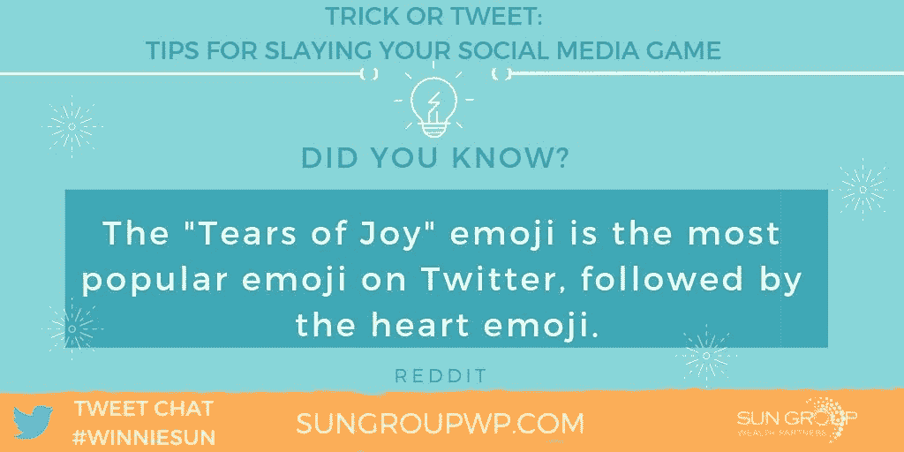
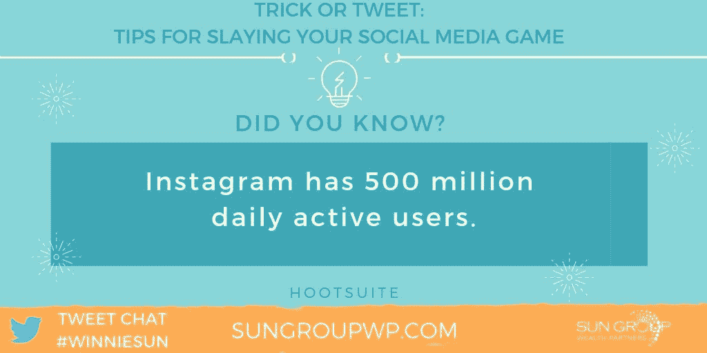
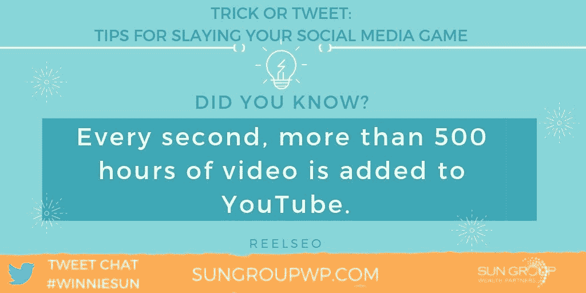
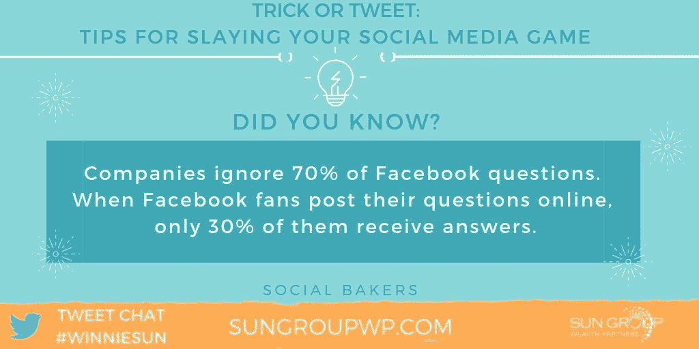

# 社交媒体的技巧和款待可以让你的生意蒸蒸日上

> 原文：<https://medium.datadriveninvestor.com/so-socially-good-theyre-scary-c13e93cacb45?source=collection_archive---------50----------------------->

## 内向的人在被激励为他人做好事时会大赚一笔

任何时候都不会太晚。这适用于中年危机激发的渴望，以及更明智但令人不快的想法，如跳入社交媒体。这对于内向型——也就是内向型——有商业头脑的企业家来说尤其具有挑战性。

[温妮·孙](https://twitter.com/winniesun)、[贝瑟妮·贝勒斯](https://twitter.com/BethanyBayless)和[贝丝·斯陶博](https://twitter.com/AdventureGlass)各自不情愿地走出了公司的舒适区，现在正在社交场合“厮杀”，无论是通过[推特](https://twitter.com/Twitter)、[脸书](https://twitter.com/facebook)、播客还是其他方式。总的来说，他们发现社交媒体对商业是有益的，也是必不可少的。

孙称自己为“财富密语者”她是福布斯、美国消费者新闻与商业频道和好日子的撰稿人，是金融行业最受欢迎的专业人士之一。

 [## 通过几个简单的步骤来管理你的钱

### 最难的部分是进入正确的心态

medium.com](https://medium.com/financial-strategy/take-charge-of-your-money-through-a-few-easy-steps-2ab642841684) 

需要一个公共演讲者，主持人或播客？联系贝勒斯。这位有趣、乐观的播客 [The Money Millhouse](http://themoneymillhouse.com/) 的共同主持人以其独特的喜剧风格和充满活力的演讲而闻名。

作为冒险汽车玻璃的所有者，斯陶博以透明为荣。作为一名专业摄影师，她同样游刃有余。

在过去的一年里，每一位企业家都提升了自己的水平，以他们希望在职业生涯早期拥有的方式来促进参与。

“我应该早点使用社交媒体，”孙说。“我记得当脸书开始的时候，我丈夫告诉我的。作为一个内向的人，我很抗拒。然而，迟做总比不做好。

“我学到的最好的社交媒体技巧是 LinkedIn 视频和 Twitter 制作人，”她说。"我们正全力以赴，始终如一地制作小尺寸、有教育意义的内容."

# 订婚生效

对于 Bayless 来说，视频越多越好。

“我们有一个播客，并开始做脸书直播来称赞这个播客，”她说。“我们注意到参与度大幅上升。当我们有客人时，我们喜欢使用 [Ecamm](https://www.ecamm.com/) ，这使得它平滑无缝。”

尽管 Staub 本人并不拘束，但他对上网还是心存疑虑。

“这听起来很蹩脚，但却非常诚实，”她说。“我希望我对自己的幽默感更有信心，不要那么害怕‘羞辱’自己。《做你自己》走了很长很长的路。”

 [## 你的专业头像向世界讲述你的故事

### 摄影师和拍摄对象的融洽关系抓拍出引人注目的效果

medium.datadriveninvestor.com](/your-professional-headshot-tells-your-story-to-the-world-74c26f8e1f5b) 

就像僵尸大灾难一样，人们会犯下巨大的错误，影响和恶化他们的社交媒体游戏。这包括那些变得无所事事的自视甚高的人。离跌入影响者的深渊只有一步之遥。

“人们在社交媒体上犯的最大错误是在一个平台上不一致，”孙说。“这是你需要投入大量时间去做的事情。

“其次是负面内容的分享，”她说。“你可以通过避免消极对话和让自己置身于志同道合的积极社区中来生存。”

基本原则是社会救助。

“这又回到了社交媒体的核心——[真实性和透明度](https://blog.markgrowth.com/know-like-and-trust-drive-conversion-and-sales-51c791e7c6b6)，”贝勒斯说。“如果你的观众不信任你，他们就不会参与进来。永远做你。”

另一个禁忌是把销售放在社交之前。

“人们拼命想拿走我的钱，”斯陶博说。“你不要这样理解。我是关于[关系和友谊权益](https://blog.markgrowth.com/put-relationships-back-into-business-marketing-b9c8a9d58704)。不要“推销”我。令人作呕的！”

相比之下，一些营销趋势非常有趣。这有助于业主专注于他们的业务。

“现在的营销比以往任何时候都更有趣，”孙说。“多亏了社交媒体和其他技术，[小公司现在可以和大公司一样快速有效地竞争。](https://blog.markgrowth.com/large-business-or-small-everyone-can-play-23fa24e2c160)

“对我们来说，我们都是关于视频和音频，”她说。“这种情况明年可能会改变。”

贝勒斯对她主要的热情没有那么短暂。

“我爱上了视频，”她说。“真是太好玩了。无论是通过脸书直播、 [Instagram stories](https://blog.markgrowth.com/igtv-opens-video-venue-for-business-83d8fade57cd) 还是 YouTube，我喜欢以这种方式与观众互动。”

# 转换前共享

社交活动可以随时支持财务底线，尽管有一个正确的方法来产生客户。

“我不相信改变人们的信仰，”孙说。“我相信分享积极有益的内容，让个人自己决定是否参与。强制客户端是临时客户端。我喜欢和我相处很长时间的客户。

她说:“我们需要对我们的企业负责，并积极主动地接触我们希望与之会面或做生意的人。”。“如果人们不知道[你的存在](https://blog.markgrowth.com/talk-triggers-spark-word-of-mouth-2d83a7c5813b)，他们就无法与你做生意。因此，你需要在发展业务的同时不断分享你的信息。”

 [## 人际关系网让你能够抓住你的完美客户

### 警惕会议成为浪费你时间的时候

medium.datadriveninvestor.com](/networking-lets-you-reach-out-to-catch-your-perfect-client-8fea800b60be) 

有了诱惑，转变变得更容易。

“永远要有行动的号召，”贝勒斯说。“通过让潜伏者发表评论、点赞、分享等方式，把他们变成参与者。[给他们一个参与的理由](https://blog.markgrowth.com/lead-magnets-attractive-ways-to-get-your-foot-in-the-door-2005d8be6f96):折扣、竞赛、奖励、资源或免费产品

斯陶博并不这么乐观。

“如果我发现了跟踪者，我会根据他们的‘跟踪性’屏蔽他们。"如果不太令人毛骨悚然，我会找出发生了什么，并把它们放到网上."

任何对未知的冒险，第一步都可能是令人生畏的。

“社交媒体最让我害怕的是负面影响和 1%的在线‘疯狂’人群，”孙说。“作为父母和配偶，我非常在意并保护社交媒体上的家庭隐私。”

# 最好做你自己

Bayless 承认害怕匿名。

“那些低参与人数和被视为无足轻重可能会令人害怕，”她说。“但是继续走。

“我收到的最好的建议是，‘不要把你的开始和别人的中间相比，’”bay less 说。“只要走出去，全力以赴。每一个。单身。日。”

接受社交媒体最初可能不太有利于自尊。

“我吓得自己几乎相信了消极的自我对话，”斯陶博说。“想得开。不是真的。”

做得好的话，社交媒体策略可以让你的观众欢呼雀跃。

“我试着去听我们的客户问什么，人们想知道关于商业、金钱和企业家精神的什么，”孙说。“我围绕这一点制作内容。

“我们喜欢围绕[我们的社区在问什么](https://medium.com/@JKatzaman/strategic-social-listening-is-real-life-90c8a07b7c3f)”她说。"我们也会去谷歌和推特上看看有什么趋势."

 [## 流行巨星告诉一切

### 在社交媒体上迅速传播是一件值得欢迎的事情

medium.datadriveninvestor.com](/trending-superstar-tells-all-97499a0c2aa9) 

共同努力大有希望。

“我喜欢，喜欢，喜欢和团队一起工作，提出[新的有趣的想法](https://medium.com/datadriveninvestor/have-a-little-fun-and-profit-4dd7b69d6a90)，”贝勒斯说。“找到志同道合的人，与激发创造力的人合作。

“我们都在一起，”她说。“我每周都和我的团队开会。我是每月聚会一次的智囊团的一员。”

斯陶博补充说，她向天才低头，雇佣了一个年轻人来接管迷因和博客。

“我试图通过保持稳定来保持领先，”孙说。“社交媒体很容易启动，但很难长期维持。

“我做了大量的研究，并向社交媒体领域最有影响力的一些人学习。”。“他们是我的虚拟老师，不在我的行业。”

文字和图片支配时间并产生回报。

“我专注于推出令人敬畏的内容，”贝勒斯说。“不断提出有创意的想法和新事物来吸引你的观众。永远把注意力放在你的观众身上，把他们放在第一位。”

她和孙也向其他领导人寻求灵感。

“有很多人在社交媒体上做得很好，”孙说。“数字当然重要，但积极的参与才是最大的赢家。”

贝勒斯与金融教育家蒂芙尼·阿利什有着密切的关系，蒂芙尼·阿利什“正在杀死它”

根据他们的经验，Sun 和 Bayless 拥有在社交媒体活动中最能吸引观众的魔法药剂，包括长视频或短视频。

“因为它与视频有关，长格式和短格式都很受欢迎，”孙说。“在我的行业，越短越好，因为这是一个沉重的话题。人们希望快速而中肯。

“然而，根据主题和受众的不同，长篇大论是非常强大的，”她说。

# 运用你的权威

Bayless 根据场地和她最有发言权的地方进行创作。

“我喜欢做长视频和短视频，”她说。“这取决于你的平台。我发现我更喜欢 Instagram 的短格式，以及脸书直播和 YouTube 的长格式。

“在数量和获得更多关注者方面，我有目标——谁没有呢？”贝勒斯说。“但这往往是我们无法控制的。我可以控制我的[一致性和内容质量](https://medium.com/@JKatzaman/value-content-as-you-would-a-pizza-7b2111b67640)。我一直专注于在这些事情上变得更好。”

网上许多人可以伸出援助之手。

“我向很多人寻求社交媒体的建议，”孙说。“对于 YouTube，我去找我的好友[陈迈克](https://twitter.com/mikexingchen)。他在那里和脸书粉碎它。公平的警告:不要在你饿的时候看他的视频。”

贝勒斯利用了大量资源。

“我喜欢看企业家兼作家妮可·沃尔特斯和她所做的一切，”她说。“我也谷歌一切。一切。我所有的疑问和挣扎，我都在谷歌上搜索。我发现了如此多的好资源，会让我不断回来寻找更多。”

 [## 优秀的播客嘉宾会努力做好准备

### 熟悉制作，知道自己想说什么

medium.datadriveninvestor.com](/great-podcast-guests-make-the-effort-to-prepare-well-d435665c8e82) 

斯陶博的顾问中有社交媒体专家卡罗尔·斯蒂芬和布丽奇特·威拉德。

放弃她的网站很难，但孙的退路是 LinkedIn 或脸书。贝勒斯更喜欢 Instagram。

“我看到很多了不起的人在 Instagram 上经营他们的整个生意，”Bayless 说。“他们正在杀死它。我也发现在那个平台上更容易和你的观众联系。这太有趣了。”

对她来说，享受与有利可图的商业联系结合在一起。

“我通过社交媒体建立的最好的商业关系之一是与爆米花财经播客的克里斯·勃朗宁的合作，”贝勒斯说。“因为我们都是播客，所以我学到了很多。

“我也喜欢在金融专业人士的博览会 [FinCon](https://finconexpo.com/) 上见到 [Cashcrunch Games](https://twitter.com/CashCrunchGames) 创始人保罗·瓦西本人，”她说。“这么多伟大的关系。”

**关于作者**

吉姆·卡扎曼是拉戈金融服务公司的经理，曾在空军和联邦政府的公共事务部门工作。你可以在[推特](https://twitter.com/JKatzaman)、[脸书](https://www.facebook.com/jim.katzaman)和 [LinkedIn](https://www.linkedin.com/in/jim-katzaman-33641b21/) 上和他联系。

*原载于 2019 年 1 月 15 日*[*www.datadriveninvestor.com*](http://bit.ly/2RtvDWu)*。*