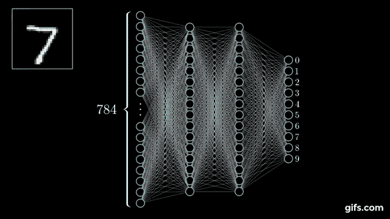

# 那么，什么是神经网络？

> 原文：<https://medium.datadriveninvestor.com/so-what-is-a-neural-network-e71cb81ea6f4?source=collection_archive---------10----------------------->

我们经常在媒体、流行文化和公司董事会上听到人工智能(AI)的潜力和危险。关于人工智能是巨大的平衡力量还是社会紧张的催化剂，众说纷纭。技术传播者称赞人工智能的到来，而末日怀疑论者警告那些会听的人。高管们期望人工智能通过释放新的收入和改变就业市场来改变商业经济。我们会有更多的时间花在实现个人追求上，还是会变得毫无意义？这种哲学话语很快就超越了对基础技术本身的理性讨论。

虽然是一个耸人听闻的话题，但人工智能正在推动切实的进步。自动驾驶汽车、癌症检测、基因测序、药物发现、面部识别、自动化股票交易等各种各样的应用都至少有一个共同点:人工智能对每一个应用都至关重要。考虑到这种广度，非从业者应该对这些产品和服务的基本概念有所了解。因此，这篇不起眼的文章将试图在开发者和受其影响的人之间架起沟通的桥梁。这些人工智能的核心是基于一种受人类认知启发的数学模型，即人工神经网络(ANN)。然而，为了理解它，首先触及 ANN 背后的动机是很重要的。

人工智能的实践者旨在设计能够执行人类自然任务的计算机程序，但这些任务太难用基于规则的逻辑编码。例如，一个人看到一个橙子，很容易就能认出来。为了编写一个传统的计算机程序来做同样的事情，人们必须定义一套描述橙子是什么的规则。颜色、质地、气味、形状、大小、重量等特征都可以考虑。然而，可能的组合和场景的数量使得这种基于规则的方法不可行。相反，解决办法是给计算机足够多的例子，让它自己发现最能定义橙子的特征。进入，安。

AI is not immune to this problem (source: [xkcd](https://imgs.xkcd.com/comics/tasks.png))

最简单的形式是，生物神经元接收电信号并将其向前传递。它只是将感官输入映射到最终行为或结果的一连串冲动中的一步。就橙子而言，光线照射到我们的视网膜上，激活了生物神经元的特定结构，促使我们的大脑将我们看到的东西记录为橙子。人工神经网络被设计成以类似的方式工作——输入数据，比如图像的像素值，触发正确的神经元组合来准确识别橙子。这是通过进行一系列计算，将先前的输出输入到下一个来实现的，就像我们大脑中的生物神经元接收信号并传递信号一样。

如果人工神经网络中的神经元是一个单一的计算节点，那么网络就来自于每个节点都与许多其他节点相连的事实。这种联系由权重表示，权重是一个可以随时间变化的数字。它代表了两个神经元之间传递信息的重要性。然而，找到这些重量的合适值需要反复试验。网络在提高其准确性的方向上递增地调整它们。起初，人工神经网络识别橙子的能力很差。然而，经过足够的迭代后，它内部化了最能识别橙子的神经元及其连接的配置，尤其是对于它从未见过的例子。

Example ANN recognizing a 784-pixel representation of the number seven (source: [3Blue1Brown](https://www.youtube.com/watch?v=aircAruvnKk))

澄清在人工神经网络环境中“学习”的含义是很重要的。通过提供例子，一个反馈回路可以减少它在识别什么是橙子，什么不是橙子时的累积误差。通过微积分，网络知道每一个神经元对其整体误差的贡献。因此，它可以在总的方向上调整每个神经元的相关权重，以提高其识别橙子的能力。称这个过程为智能猜测是公平的——这些权重的最佳值永远不会真正知道或定义，但是，给定足够的数据和计算资源，人工神经网络可以逼近理想的配置。

另一个经常被忽视的重要方面是人类在开发基于人工神经网络的人工智能系统中所起的作用。众所周知，这是一个复杂的过程，有时，与其说是科学，不如说是艺术。除了了解相关的编程语言，对数学概念有直觉，加上处理不同的数据，从业者还必须知道如何设计人工神经网络。后者对系统的性能至关重要。这类似于给吉他或引擎调音——决定技能的是经验，而不是教育。真正的工作是测试不同的网络架构，或者设置权重更新的激进程度。当调整人工神经网络和解释结果以指导开发决策时，有大量的实验技术不是微不足道的，也不是显而易见的。

The job of the human is to basically stir (source: [xkcd](https://imgs.xkcd.com/comics/machine_learning.png))

理解人工神经网络是了解人工智能进展的基础。它也是许多其他变异的基础，这些变异同样从生物学中获得灵感。卷积神经网络基于我们的视觉皮层，使它们成为基于图像的信息(如摄影或视频)的理想模型。另一方面，递归神经网络试图包括一种有利于预测语言或金融应用中常见的顺序事件的记忆机制。人工神经网络的其他衍生结合了多个网络，产生了惊人的结果。这些模型虽然多样而复杂，但都始于人工神经网络。这些技术受生物学启发，用数学定义，用计算机科学实施，正在推动改变世界的创新。