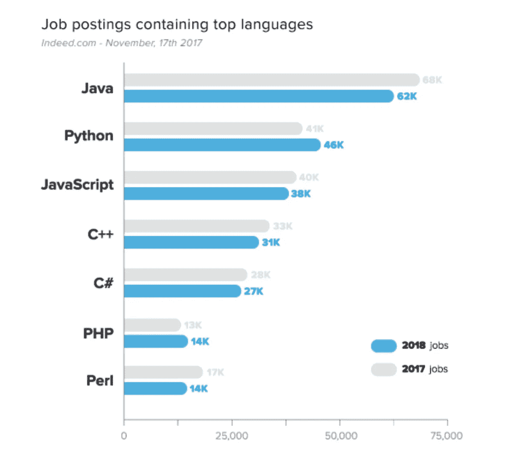

# 所以你想成为一名开发者

> 原文：<https://medium.datadriveninvestor.com/so-you-want-to-be-a-developer-74dd0d9c3dc5?source=collection_archive---------26----------------------->

当你开始编程时，很难决定先学习哪种语言。根据你以前的经历和你的目标，每个人的正确选择是不同的。是为了求职吗？在这种情况下，你可能更喜欢关注当前工作行业中最热门的语言。是因为个人原因你在自学吗？也许你想从一种不那么抽象的语言开始，然后从那里开始。无论你的推理是什么，在所有的选择中进行分类是很困难的。根据语言列表显示，大约有 2500 种计算机语言，包括流行语言和任何在杂志上发表过的语言。[另一方面，HOPL](http://hopl.info/) 列出了大约 9000 种不同的编程语言。这可能很难驾驭！

# **高电平对低电平**

你如何比较编程语言？

在基础级别，有两种不同类型的编程语言——**高级**和**低级**。低级语言很少或不提供对计算机指令集的抽象。这意味着命令或功能与处理器指令密切相关，通常指机器代码或汇编语言。单词“低”指的是实际语言和机器语言之间的少量或不存在的抽象，并且可以在没有编译器或解释器的情况下转换成机器代码。由于这个原因，低级语言经常被描述为“接近硬件”，因为它们被设计成直接在硬件上操作。这种语言的吸引力在于它们运行速度非常快，占用的内存很少。

另一方面，高级编程语言是指从机器语言中抽象出更高层次的语言。这些语言的重点是可用性，而不是最佳的程序效率，因为它们的程序不如使用低级编程语言构建的程序运行得快。高级语言通常处理变量、数组、对象、复杂算术、表达式、循环等特性。本质上，执行的责任和权力掌握在程序员手中。

# **编译语言与解释语言**

让我们进一步分解高级编程语言。

高级编程语言通常分为编译语言和解释语言。那是什么意思？

与低级语言类似，使用编译语言编写的程序运行速度要快得多。主要区别在于，使用编译语言，您输入的代码在保存为可执行文件之前会被简化为特定于机器的指令。另一方面，解释语言以你输入的相同格式保存，只在运行时减少。尽管使用编译语言构建的程序可能运行得更快，但使用解释型语言编写通常更容易，因为您不必在每次想要测试一小部分时都重新编译应用程序。

# **2018 最受欢迎的编程语言有哪些？**

如果你想让自己更受雇主欢迎，拓展潜在的工作前景，你可能对最受欢迎的编程语言更感兴趣。根据对 Indeed.com 招聘信息的分析数据，2017 年最受欢迎的语言包括 Java、Python、JavaScript、C++、C#、PHP 和 Perl。

**你选哪个？**

这么多编程语言可供选择，你怎么决定？好的一面是，与编程相关的逻辑通常是可全面翻译的，主要区别仅在于语法或语言提供给你的能力。

如果你是一个初学者，一般的共识是动态语言更容易，因为它们灵活，具有简单和直观的语法，程序员可以立即可视化代码。一些适合初学者学习的语言包括:

1.  **JavaScript** :一种非常流行的客户端脚本语言，它被所有的网络浏览器所支持，并被用于构建我们所知的大多数网站。您还可以使用 JavaScript 进行移动应用程序开发和 web 应用程序。
2.  Ruby :一种动态的、通用的语言，它的语法是主要的吸引力——它可读、灵活、易学。用于开发网站、web 应用程序和移动应用程序。Airbnb、Shopify、Hulu、彭博等等都是用 Ruby on Rails 构建的。
3.  **Python** :被广泛认为是初学者最容易学习的编程语言之一，代码简单可读，类似于 Ruby。可用于创建桌面和网络应用程序。谷歌、DropBox、Pinterest、Reddit 等等都是用 Python 打造的。

学习上述任何一种语言的最大好处是每种语言都有大量的在线资源。无论你是通过课程、应用程序还是视频学得更好，这些语言中的一种都有适合你的东西。对于您在学习过程中可能遇到的任何错误或问题，在线上也有许多支持和文档。 [StackOverflow](https://stackoverflow.com/) 是提问或寻找以前可能被问过的类似问题的绝佳资源。

# 你已经学会了你的第一语言……接下来呢？

在你学会了你的第一语言的基础之后，你可能会考虑是继续掌握它还是学习另一种语言。这里的问题是数量多于质量，在编程中，答案可能没有你想的那么简单。

当然，虽然你应该努力掌握至少一门 T2 语，但你不应该只局限于那门语言。建议您应该熟练使用 3-5 种语言进行编码，因为在这一点上，您应该足够精通跨越所有编程语言的算法、数据结构和范例，如果您愿意，您可以很容易地使用另一种语言。在这一点上，它不是关于语言，而是概念。如果只是关于概念而不是语法，你会问为什么要学习一个以上的概念？

虽然各种语言通常非常相似，但它们之间也有重要的区别。解决问题的方法和你如何应用各种概念可以因人而异，如果你有这样做的经验，让你自己适应任何和所有的语言并不困难。尝试不同类型的语言，而不是只关注动态、函数、脚本等。让自己接触不同类型的问题会让你对编程有更全面的了解。