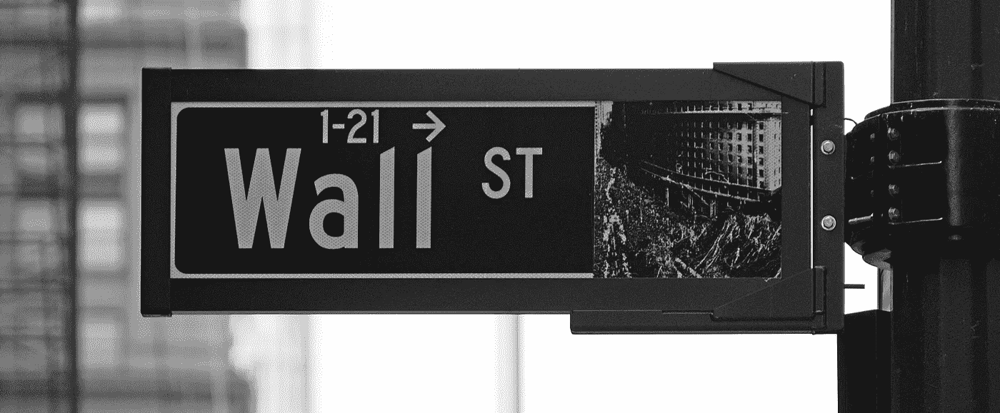
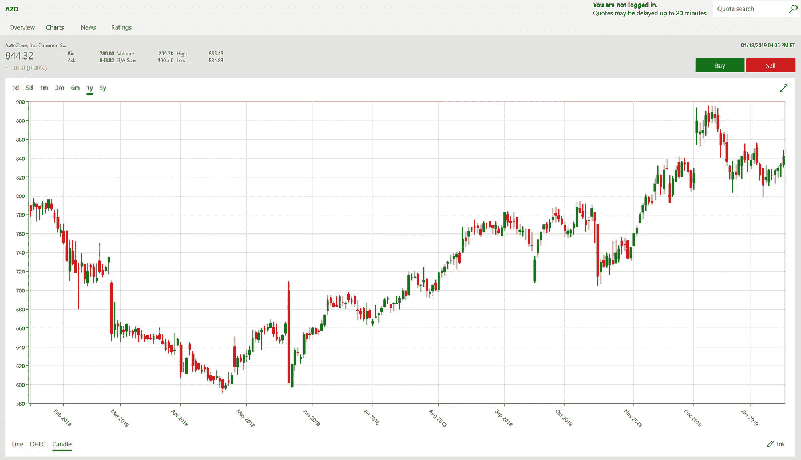
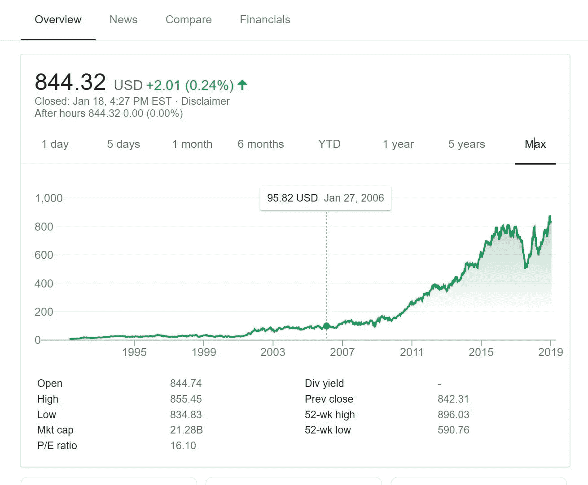
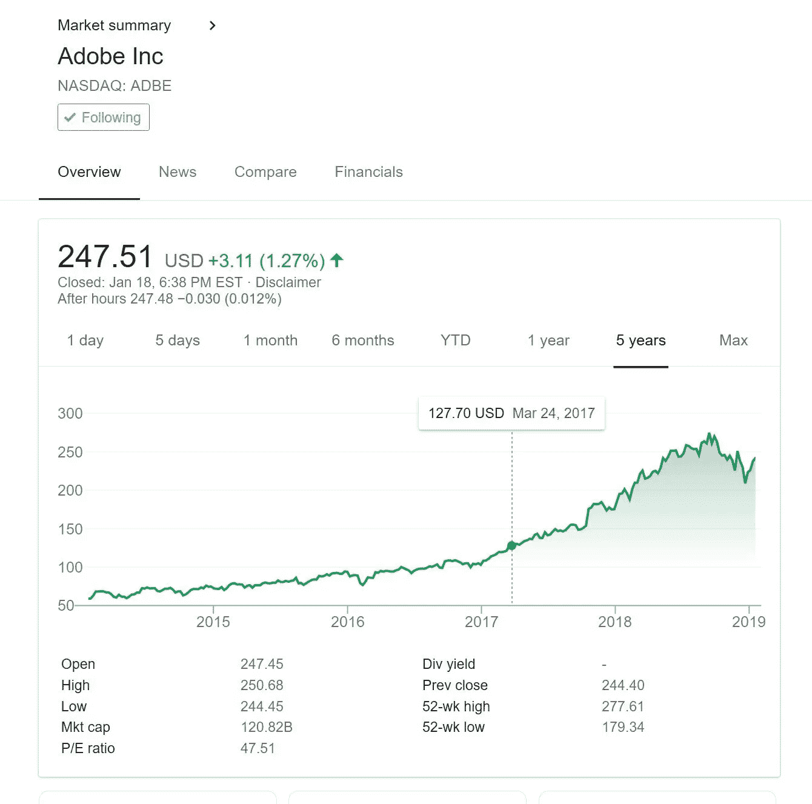
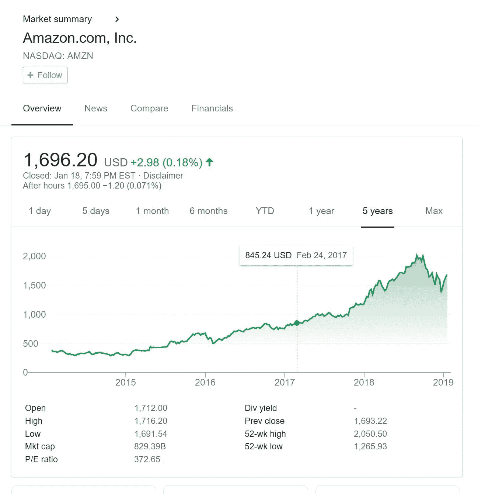

# 所以你想成为百万富翁？

> 原文：<https://medium.datadriveninvestor.com/so-you-want-to-be-a-millionaire-23e4ffb51806?source=collection_archive---------16----------------------->

## 随着时间的推移，你能做出 10 个明智的决定吗？

Photo by [Rick Tap](https://unsplash.com/photos/uJhgEXPqSPk?utm_source=unsplash&utm_medium=referral&utm_content=creditCopyText) on [Unsplash](https://unsplash.com/search/photos/stock-market?utm_source=unsplash&utm_medium=referral&utm_content=creditCopyText)

> 你知道有多少百万富翁是通过投资储蓄账户变得富有的？我停止我的案子。——罗伯特·g·艾伦

我敢打赌你们大多数人会回答是的！很好，继续读下去，我会告诉你一个 10 步、5 天或 5 年的计划来赚一百万。

很长一段时间，我想涉足股票市场。在我 20 多岁的时候，我的圈子里没有一个人知道怎么玩。所以，我的注意力还是在其他事情上，比如聚会，还有，嗯…让我们回到计划上来。十年后，我变得更认真了，创建了一个“玩耍”投资组合并跟踪它。

我做的许多选择都显示出大幅增长，很快我想知道更多。很明显，我有观察趋势的能力。毕竟，我管理过企业，实际上是多次，现在我所需要的只是一个股份，一些储蓄，一点现金，情节变得复杂了…

为了这个故事的目的，

我希望你从 2000 美元开始。 别激动，我们只是装装样子，但是，我很认真。这是我的第一个导师建议的数量。现在就开始存钱，不是开玩笑，谁说的“赚钱需要钱”是对的，至少在这个例子中是这样。

下一步是给券商打电话，开一个交易账户。这非常容易，而且有很多好处你以后会学到。

> 我将告诉你在华尔街致富的秘密。当别人恐惧的时候，你试图变得贪婪。当别人贪婪的时候，你试着恐惧。—沃伦·巴菲特

对我来说，我知道开始很重要，这是我学习的方式。对我来说这是一件很实际的事情，通常我会找到答案，因为下一步需要这些信息。我假设你们大多数人都知道股票的前提，你以低价买入一只股票，然后希望以更高的价格卖出。后来是相对的，它可能意味着在几分钟内。

让我们在下一段看一个适时的例子…..

[TD Ameritrade Chart](https://www.tdameritrade.com/home.page)

这第一张图让我觉得有点不舒服，是给 AutoZone 的，我来告诉你为什么。如果你看看图片的左上角，你可以看到该股周五收于 844.32 美元。2006 年 1 月，当我第一次交易这个符号时，它是在 95.00。我作为一个没受过教育的交易者进出，再也没有回来。该股在 12 年间增长了近 900%。让我们算一算…

## 2000 美元除以当时的价格 95 美元，等于 21 股。21 股 x 844.32 = 17，775 美元。

我称之为第一次翻倍，因为 AutoZone 在过去 6 个月中几乎翻了一番。

Google Finance Chart

在 6 个月内，你在 Autozone 中第一次翻倍，从 2，000 美元涨到 4，000 美元。

> **正规教育会让你谋生；自我教育会让你发财。—吉米·罗恩**

所以，想象一下，轻松获得，你只需要再找到 9 个。你能想象下一场比赛会发生什么吗？你现在有 4000 美元，你把它投资在下一只股票上，有什么想法吗？也许我知道……哦，是的，我知道你听说过的那个，这个怎么样……

[Google Finance Chart](https://www.google.com/search?tbm=fin&ei=XYlDXIroOY290PEPnu2_kAM&stick=H4sIAAAAAAAAAONgecRoyi3w8sc9YSmdSWtOXmNU4-IKzsgvd80rySypFJLgYoOy-KR4uLj0c_UNzKtyjcqSeABJQictOgAAAA&q=NASDAQ%3A+NFLX&oq=netfl&gs_l=finance-immersive.1.0.81l3.612163.612990.0.614180.5.5.0.0.0.0.180.538.3j2.5.0....0...1..64.finance-immersive..0.5.536....0.s7BzCbFO7xw#scso=_2otDXPrzKIqM0gLq_LeADA2:0)

让我们看看网飞。2014 年，我还从网飞取出了 3000 美元，这是个大错误。左图显示他们在 2017 年 8 月的交易价格为 166.54 美元，猜猜看，17 个月后，他们的交易价格为 339.10 美元！

你决定打电话给你的经纪人或者上网按下卖出按钮，已经够近了，我称之为你的第二次翻倍！你现在有将近 8000 美元，而且你刚刚开始这个项目。你已经在 a 呆了一年半，刚刚选股两次，你的钱翻了两番。现在，很有可能你正在向前跳跃，对吗？但是，让我让你慢下来，这是所有的决定，慢就是快！

许多人绕道这里，去做一些有点愚蠢的事情，比如，买车！如果你想成为这个故事中的百万富翁，你不能这样做！但是我会告诉你你能买什么…也许一个保险箱是合适的，因为你会需要它。

> **当其他人都在卖的时候买入，直到其他人都在买。这不仅仅是一个朗朗上口的口号。这是成功投资的精髓。—j·保罗·盖蒂**

答好的，所以如果你一直在关注，你可能会有一些问题。一个可能是在哪里可以找到这些公司？如何知道未来会发生什么？而且，可能还有其他的，它会变得复杂，所以从你知道的开始。你制造太阳能电池板吗？你在餐馆工作吗？您携带哪种移动设备？

## 第三交易 8000 美元翻倍至 16000 美元，Adobe 在 22 个月内从 127.70 美元涨到 247.51 美元。

我已经向你展示了这是可能的，让我们看看接下来几笔交易的数学。这将变得更加有趣！每次当你的交易增加到…

## #4 $32,000

## #5 $64,000

## #6 $128,000

## #7 $256,000

## #8 $512,000

就像升级你的电脑内存一样，一个动作，能力翻倍。嗯，有点像。

如你所见，你的下一笔交易让你成为百万富翁，而这只是你的第 9 笔交易…

你问的投资在哪里，嗯，让我去看看…

# 亚马逊怎么样？该图表看起来与 Adobe 非常相似。

## 你在 2017 年 2 月 24 日投资亚马逊的 512，000 美元，今天将价值 1，024，000 美元！

[Google Finance Chart](https://www.google.com/search?tbm=fin&ei=-o1DXPzGIeGQ0gK9-YiQCw&q=amazon&oq=amazon&gs_l=finance-immersive.3..81l3.319345.320358.0.320493.6.6.0.0.0.0.117.525.5j1.6.0....0...1..64.finance-immersive..0.6.524....0.jQttca65sTU#scso=_O49DXJ_fOMma0gKAjb2YCA2:0)

> 对知识的投资回报最高。—本杰明·富兰克林

## 所以你现在是一个只做了第九次交易的百万富翁了！

你能用 10 号交易做什么？最终获得这一知识后，让我惊讶的是美国梦的可行性。如果我停止抱怨和寻找错误，分配一些资金，做一些研究，并采取行动，惊人的事情就会发生。

在这个级别，你不再需要全押，你可以在下一次交易前买房子或岛屿。既然你已经是百万富翁了，我就让你来决定如何处理 10 号。开始研究的一个好地方是订阅《投资者商业日报》。

我希望你在这篇文章中发现了一些价值，如果你确实发现了，请点击下面的链接阅读更多我最近的作品，也许另一篇会引起共鸣。

克里斯托弗

*克里斯托弗·博斯韦尔 2019。保留所有权利。*

当克里斯托弗不在任何地方写作时，他可以在美国的某个地方旅行或拍摄照片。他可能正在进行平面设计、建立网站、处理图像或视频、驾驶他的无人驾驶飞行器、遛狗，或者背包旅行和划独木舟。他住在华盛顿州的塔科马。我们邀请您在[***Real Window Creative***](http://www.RealWindowCreative.com.)了解更多关于 Christopher 的信息

 [## 转折点

### 一段美好伙伴关系结束的故事

medium.com](https://medium.com/@christopherboswell/the-turning-point-4f2cfc8e75a5)  [## 感觉不到很大热情的时候怎么创作

### 我想知道在收获前的 120 天里，一个农民的积极性有多高？

writingcooperative.com](https://writingcooperative.com/how-to-create-when-you-dont-feel-great-enthusiasm-7e0833f2024)  [## 在永恒的幸福中书写过去的日子

### 人们不是说过，当时间消失时，我们可能会找到自己的使命吗？

writingcooperative.com](https://writingcooperative.com/writing-the-days-away-in-timeless-bliss-a7f682ee2ca9)