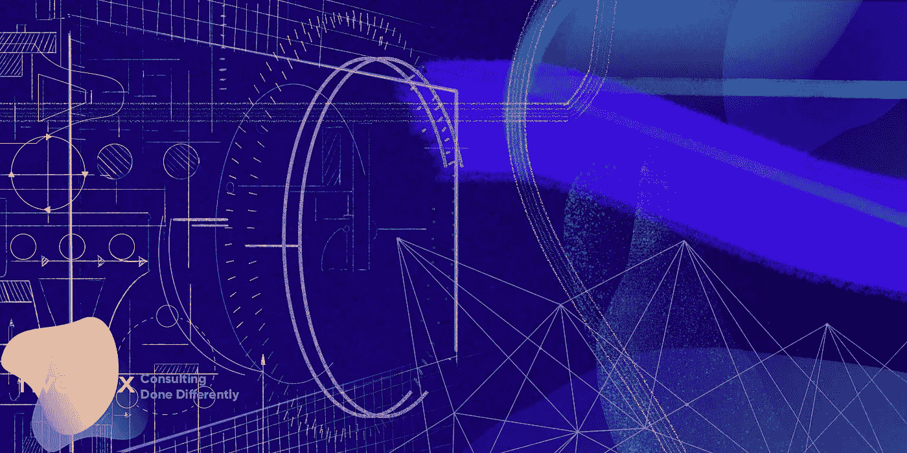
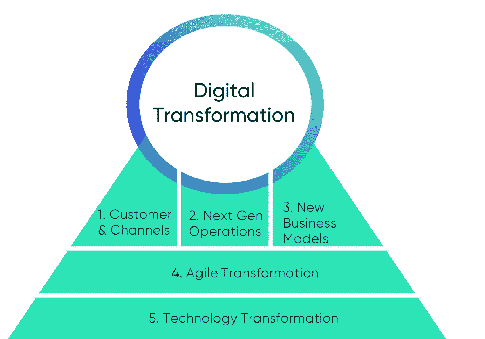
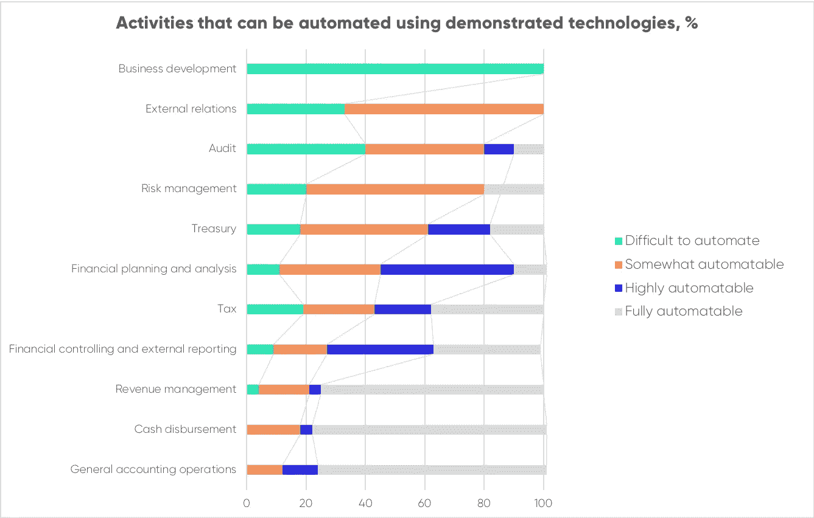
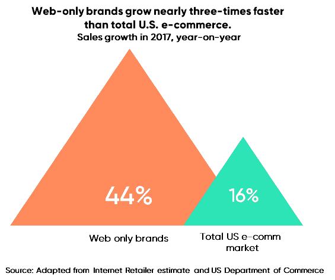

# 你负责数字化转型，这到底意味着什么？

> 原文：<https://medium.datadriveninvestor.com/so-youre-in-charge-of-a-digital-transformation-what-exactly-does-that-mean-part-1-8c7c0aef9a41?source=collection_archive---------4----------------------->

数字化转型无处不在。然而，人们通常不清楚他们真正的意思。虽然已经有成千上万篇关于数字化转型的文章，但许多都很模糊，有些甚至不准确。这些出版物非但没有驱散组织中围绕数字变革的迷雾，反而增加了困惑。什么是数字化转型？需要考虑哪些关键的变革领域？什么优先？如果你是领导、赞助或支持数字化转型的少数幸运儿之一，这些只是你脑海中出现的一些问题。

尽管你会在网上看到大量的文章，但很难找到一份关于组织和执行数字化转型的准确指南。通过这篇文章，我们开始了信息系列数字转型做得好，我们希望这将改变这一点。在未来几个月的一系列帖子中，我们将解释推动组织数字化变革的步骤，这些帖子是由真正做过这项工作的专家撰写的。

有这么多不同的项目打着“数字化转型”的旗号大肆宣传，这篇初始文章解决了一个非常基本但重要的首要问题:“我们如何为一个组织定义数字化转型？”。这是由哪些类别的变更组成的，我们如何思考整个组织中涉及的不同团队的范围从哪里开始和结束？本文旨在作为我们深入探讨不同转型主题的系列后续文章的初始参考框架基础。

阅读本文后，您将能够:

1.  确定数字化转型范围内的变革广度，以及不同利益相关方可能带来的不同观点。
2.  快速区分不同的数字化变革目标，为什么它们很重要，以及每种变革的一些重点领域。

我们未来的文章将进一步深入数字化转型的主题，更具体地阐述不同方面以及如何取得成功。但是现在，让我们谈谈雄心壮志吧！

# 定义数字化转型

从最广泛的意义上来说，数字化转型包括嵌入数字技术，以提高企业的效率和/或效益。然而，目标不仅仅是复制流程和用技术支持它们，而且还要重新设计它们，以使整个系统或服务明显更好。除此之外，最成功的变革也从根本上解决了组织的思维模式。业务和技术能力交织在一起，建立了持续改进和创新的文化。通过新技术快速提升业务的过程变得系统化。

这是一个高层次的定义，我们再具体一点。下图概述了数字化转型中的典型领域。每一个都有不同的目标和重点。类别 1 和 3 更关注于*企业创造的数字输出，而类别 2、4 和 5 则关注于 ***如何将数字工作方式*** 嵌入到企业中以创造其输出。数字化转型解决了这些领域的结合——确保它不仅解决了**企业需要什么样的数字输出**,还解决了**如何整合数字化工作方式**以实现一致、系统和高质量的数字化输出。*

**

*现在，让我们依次仔细看看每一个类别。*

1.  ***客户&渠道***

***为什么这一数字变化如此重要？***

*数字化为客户发现企业并与之互动开辟了多种新方式，导致客户偏好和行为的整体转变。企业可以通过网络、手机、社交和电子邮件等数字渠道向客户进行营销、销售和服务；需要与零售、客户交付和活动等更多模拟接触点携手合作。*

*能够通过数字渠道满足和争夺客户的需求是公司投资数字能力的主要催化剂。不同市场领域的早期数字初创企业促使现有企业也通过数字渠道进行竞争，尽管它们在传统市场渠道中占据主导地位。一些例子包括亚马逊(在大众商品之前以书籍和光盘起家)、易贝(印刷分类广告)、ASOS(时尚)和 Expedia(旅游)。*

*尽管第一波颠覆始于 90 年代末，但由于几个原因，它现在仍然和当时一样重要。首先，客户对利用数字渠道的偏好持续增长。这意味着数字渠道的业务增长潜力也是最大的。其次，数字创新的步伐不断加快。随着数字竞争的门槛越来越高，企业必须不断提升自己的竞争力。*

*今天，大多数数字化转型仍然包括努力推动客户渠道的改善。如果您正在领导或支持以数字渠道为重点的数字化转型，那么探索一些成功的例子可能会有所帮助。首先，我们建议探索约翰·路易斯的[全渠道转型](https://www.i-cio.com/innovation/it-infrastructure/item/john-lewis-s-journey-to-omnichannel-retail)，或者[阿迪达斯的数字增长战略](https://www.ispo.com/en/companies/adidas-goes-after-nike-digital-strategy)。尤其是因为它们是现有的企业，在如何应对新旧数字渠道的结合以接触客户方面有着额外的复杂性。*

***推动客户数字化变革的三个重点领域&渠道***

*由于需要解释许多变化领域和相互依赖性，我们将在以后的文章中进一步深入这个主题。但是现在，我们想强调作为“数字渠道转型”前沿和核心的 3 个关键变化领域:*

1.  ***顾客为王。**以客户为中心的思维模式是这一变革的核心。您的业务正在数字渠道中增长，因为客户越来越喜欢将这些渠道作为发现、学习、选择和购买所需产品和服务的媒介。*
2.  ***了解顾客并采取行动**。这种数字化变革意味着提高组织的学习能力，优化面向客户的方法。根据我们的经验，许多企业说他们这样做，但实际上很少有人这样做。这种对客户的承诺将平均业绩与行业领先的增长区分开来。成功意味着采用设计思维方法，并建立更好地捕捉、分析和利用客户数据/反馈的能力。不只是说说而已，而是去做！*
3.  ***跨渠道协作**。促进品牌、营销、销售和服务团队之间的协作对于将商业思维和行动联系起来以提供卓越的客户体验至关重要。这不是一项简单的任务，但对于实现你所期待的转变至关重要。实际上，一旦相关部门和人员掌握了诀窍，他们会从中获得很多乐趣。*

***2。下一代操作***

***为什么这一数字变化如此重要？***

*虽然在过去十年中，专注于改善客户体验和数字渠道能力的变革计划一直是数字化转型的主流，但我们越来越多地发现，数字化转型侧重于改造运营和后台能力。这值得更多的关注。数字技术在提高内部业务运营的效率和有效性方面具有巨大的潜力。我们对下一代运营的定义是将非面向客户的运营数字化，以优化效率和效果。你想在这个领域关注的数字化变革是“数字化工作场所”、“数字化人力资源”、“数字化财务”和“RPA —机器人流程自动化”或“RCA —机器人认知自动化”。让我们接触一下本文中的两个领域，让您了解一下下一代操作。*

***数字化工作场所***

*这与知识、学习和协作平台有关，这些平台采用互联网上开发的网络和社交技术，并将这些机制用于内部员工。Slack、Trello、吉拉、Google docs 等简单廉价的平台已经在初创企业和数字化运营中得到证明，可以有效提高生产率，并匹配数字化和精益的工作方式。这种工具现在正被整个企业所采用。*

***RPA 和 RCA***

*在后台职能中，机器人流程自动化(RPA)和机器人认知自动化(RCA)技术提供了巨大的前景。它们使计算机能够接管重复性的任务和流程，从而从根本上提高财务和人力资源运作的速度和效率。*

**

*Data according to McKinsey: [Bots algorithms and the future of the finance function](https://www.mckinsey.com/business-functions/strategy-and-corporate-finance/our-insights/bots-algorithms-and-the-future-of-the-finance-function)*

***推动新一代运营变革的三个重点领域***

1.  ***推动业务采用。**管理业务变革是内部数字化转型的关键。从具体且可扩展的用例开始，快速证明价值，并在扩展时提供指数级收益。*
2.  ***以用户为中心的设计。**正如客户为王对于客户&渠道变革，用户为王对于内部业务变革。在过去的几十年中，许多技术开发团队已经转向以用户为中心的设计实践，但是在许多情况下，变更的优先级和速度可以提高。*
3.  *业务和 IT 协作。随着员工越来越精通技术，数字技术变得越来越直观，我们看到最终用户可以控制越来越多的配置选项。RPA 是一个通常由业务驱动、使用供应商技术的计划示例。对企业来说，技术是一种诱惑。然而，这是一个严重的错误。当您试图扩展时，会遇到障碍，出现安全问题，形成数据孤岛，并且没有抓住新技术的真正潜力。不要犯这个错误。让 IT 部门参与进来，并对定义正确的技术架构和遵守设计原则的重要性给予应有的重视。从长远来看，它在短期内花费的额外时间将会得到更多回报。*

***3。新的商业模式***

*数字化正在从根本上重塑一些市场。为客户和企业开辟建立关系和交换价值的新途径，对组织来说具有巨大的潜力。因此，数字化转型计划通常包括开发新的商业模式。丝毫没有为其核心服务产品的创新和数字化所需的投资提供资金。比如，在金融服务业，加密货币、区块链和人工智能等创新提供了巨大的业务增长潜力。因此，一些金融机构已经着手进行数字化转型，以便能够更好地推出新的数字化产品和服务。*

*在消费者业务和零售领域，数字化本土垂直品牌( [DNVBs](https://www.digitalcommerce360.com/2018/04/05/what-is-a-dnvb/) )的崛起值得一提。过去，建立一个成功的品牌需要多年的巨额投资，但互联网和社交媒体的影响力为 Warby Parker、Harry's 和 Bonobos 等新品牌提供了完美的滋生地。DNVBs 将数字化在营销、分销和支付方面的优势与垂直整合的商业模式相结合。其结果是，企业的增长速度比典型的电子商务企业快 3 倍。*

**

***推动新业务模式发展的三个重点领域***

1.  ***采用精益创业实践。**因埃里克·里斯的书《精益创业》而走红。我们将精益原则应用于新业务/产品/服务的开发。核心思想是在探索创新的过程中不断平衡投资水平和风险水平*
2.  *管理组织的免疫系统。抵制变化是人的天性，这是开发和推出新产品、服务和相关业务模式时最难管理的因素之一。创新团队必须考虑他们可以使用的工具来应对这一挑战(包括组织设计、激励结构和公关沟通)*
3.  ***走数据驱动。**这是精益创业方法的一部分，但它本身也值得一书。建立量化、测量和处理数据(反映真实的业务绩效)的能力对于新业务模式的成功至关重要。您需要明确您的业务目标，确定这些目标背后的驱动因素，然后定义适当的指标，以确保您准确地衡量成功。建立 KPI 框架/ OKRs ( [目标和关键结果](https://rework.withgoogle.com/guides/set-goals-with-okrs/steps/learn-the-abridged-history-of-OKRs/))将有助于您将流程正式化并嵌入到您的业务系统中。*

***4。敏捷转型***

***为什么这一数字变革如此重要？***

*数字化变革的步伐和快速上市的需求要求新技术或产品快速上市。能够对客户反馈或竞争对手的行动做出反应需要敏捷性和灵活性。创建一个能够对内部和外部刺激快速行动和反应的企业，可以创造非常强大的竞争优势。这一点的关键是业务和技术部门之间的紧密协作，以避免内部效率低下拖累速度。*

*在过去的几十年里，商业实践有了显著的改善。像亚马逊、谷歌、苹果和脸书这样的组织已经展示了如何取得难以置信的成功——以技术为核心经营组织。这些企业使用的工作方式通常在数字化转型的范围内被采用。他们是跨团队协作、以客户为中心以及将技术能力大规模集成到业务系统中的优秀推动者。*

*敏捷转型是对企业转型的追求，以便企业能够有效地交付业务技术，从而快速实现客户价值。其核心是敏捷方法，这是一种技术开发的迭代方法，在这种方法中，在最早的机会寻求用户反馈，企业作为产品所有者直接参与到团队中，开发团队的自主权增加了。作为传统瀑布式开发方法的替代，敏捷的成功刺激了 scrum、看板或 SAFE 等方法的采用。*

*这个主题是数字化转型的关键推动因素，我们将在未来的文章中详细介绍如何应对这一数字化变革举措。*

***推动敏捷变革的三个重点领域***

1.  ***确保领导层理解并支持变革:**敏捷绝对不是要建立一个新的交付流程，而是要创造一种新的协作、责任和价值交付的文化。领导层需要真正理解这一点，因此他们不再强化旧的行为，而是开始塑造新的行为。良好的领导力和榜样作用是敏捷转型成功的关键。*
2.  ***适当地重组和资源团队:**敏捷交付团队需要致力于团队目标的关键角色。隔离资源是很重要的，因为它确保跨职能团队的创建具有来自业务的正确代表，而不仅仅是技术..除非您创建这些专用的交付单元，否则它们仍然会面临环境切换和混合优先级的挑战，这会降低它们的速度。*
3.  *实践，实践，实践:敏捷听起来很棒，是教科书中的常识，但像大多数事情一样，它是一门需要花时间学习的手艺。所以建议是开始小规模地做，而不是提前计划太多或者太理论化。以敏捷的方式进行转换。关键是你在短时间的迭代中进行有效的回顾，所以在每一次的结尾你都会学到新的东西——并在下一次应用它。*

***5。技术改造***

***为什么这一数字变化如此重要？***

*为了在当今的数字时代竞争，组织必须能够高效、高速地交付技术。技术转型侧重于创建基础组件和能力来实现这一目标。它使 It 职能部门成为变革的推动者和创新的驱动力。从高层次来看，我们可以将技术转型总结为三大变化。*

*首先，让我们从技术领域的现代化开始。用更现代的技术和架构模式取代背负技术债务的遗留系统。不仅增加了对用户的功能价值，还提高了安全性、可伸缩性和敏捷性。云、移动、社交和大数据是通常需要实施以适应未来业务增长和发展的一些技术。*

*其次，在更新系统景观的同时，技术改造方案也推动了对更新工作方式的需求。自动化、测试驱动开发(TDD)、行为驱动开发(BDD)、持续集成和持续开发(CI/CD)以及 DevOps 实践是实现速度、敏捷性和持续改进的关键。*

*第三，技术转型需要实施一种适合目的的组织模式。这不仅要满足新的工作方式，还要开始考虑 IT 在组织中不断演变的角色。未来的 IT 职能不再是供应商的职能，而是迫切需要成为一个有效的合作伙伴——跨业务团队协作。此外，您寻找供应商和与供应商合作的能力也应该得到评估，以满足数字时代的需求。仅仅在 SAP、Oracle 和微软之间做出选择已经不够了。未来的 IT 职能必须无摩擦地参与和利用组织外部的创新生态系统。这意味着您需要能够发现、参与、加入更多不同的供应商，并在这些供应商之间切换，同时增加多样性(规模、文化、地理、目的)。*

*这应该会让您对数字化转型的这一重要方面有所了解。我们将在以后的文章中讨论更多细节。*

***驱动(数字)技术变革的三个焦点领域***

1.  ***先解决基本问题。**为了成为强大的业务合作伙伴，必须首先具备 IT 基础知识。确保提供强大的服务，确保日常运营正常进行，在服务级别协议范围内提供良好的服务。赢得讨论战略话题和推动创新的席位&增长始于可信——可靠地实现基本面。*
2.  ***顾客至上，企业主导。**技术是变革的重要催化剂，但永远不会从解决方案开始。只有当技术解决了真实的客户或业务问题时，它才能创造价值。*
3.  ***从人开始。**技术转型最终是为了能够交付出色的技术，但起点是人。确定业务的发展方向，以及未来需要哪些功能。回到 IT 职能部门必须提供的内容。老实说，评估你在 IT 部门的能力和技能。就您未来需要的内部能力做出战略决策，并在您需要的地方获得外部支持。太多的团队变得兴奋，忙于构建东西，却发现他们不能随着时间的推移继续有效地执行或维持解决方案。*

***那么让我们开始吧！***

*数字化转型是为了在数字化时代保持组织竞争力而进行的根本性变革。我们列出了市场上追求的五种常见口味，但你的转变不会整齐划一。它当然应该由不同的成分混合而成。您需要的确切组合将取决于您独特的目标和背景，这反过来将使您专注于推动竞争优势所需的数字能力。*

*这是一个激动人心、充满活力的过渡时期。每个人都可以成为数字化转型过程中的领导者，我们鼓励您拿起推动变革的火炬。我们希望第一篇文章能为你提供一些有用的背景知识。我们希望您能够反思自己的转型目标，这样您就可以与自己的团队一起突出重点。*

*这只是我们数字化转型系列的开始。接下来还有更多。与此同时，我们欢迎任何意见和反馈，以改善我们的想法，并与数字领导社区进一步分享学习成果。现在，祝你在数字领域取得成功！*

***下面是关于 Riverflex 和创作团队的更多信息:***

*Riverflex 是一家新型的咨询公司。我们通过将顶级顾问与独立专家的力量相结合，提供数字咨询、人员扩充和临时管理服务，从而提供数字专业知识和价值。*

*本指南的撰稿人:*

***Victor Hoong** ，前德勤数字合伙人，Riverflex 创始人兼董事。过去的客户包括阿迪达斯、宜家和 Ahold Delhaize
**Andre Azadehdel**，前德勤(Deloitte)，Riverflex 创始人兼董事。过去的客户包括 Canon Clear Channel International、O2 Telefonica、SAB Miller
**Arjen de Ruiter、**前首席技术官 Coosto、ex-bol.com，以及现在的 IT 战略顾问&运营顾问
**Sohrab Hosseini、**前首席技术官 Transdev、前麦肯锡，以及现在的 IT 数字战略顾问&在财富 500 强公司
**Kenny Cruden、** ex-ThoughtWorks 设计并实施了多项数字化和敏捷转型*