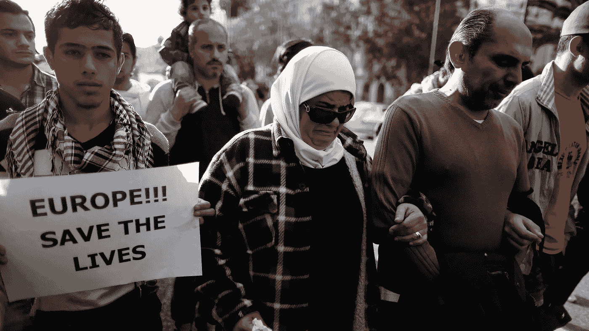
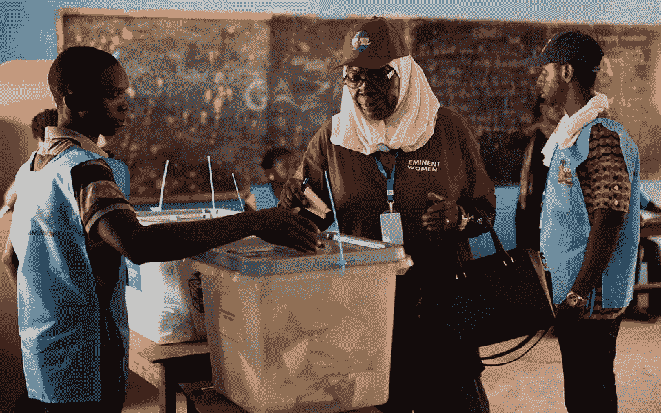

# 什么是社交区块链？

> 原文：<https://medium.datadriveninvestor.com/social-blockchain-1e2236d7c2b9?source=collection_archive---------3----------------------->

随着加密货币从顶端滑落，不同国家的政府通过了对其监管的法律，越来越多的初创公司建议使用区块链来改善人们的生活。

# 医疗保险

在医疗保险系统中使用区块链技术的想法相当普遍。目前，有许多项目在这个领域提供解决方案。这些项目的精髓在于将个人健康状况的所有数据储存在区块链中。由于这一点，一个人无论在哪里都可以得到医疗援助，任何医院的任何医生都可以看到他的病例报告。

美国国际集团、渣打银行和 IBM 开发了第一个使用区块链技术的跨国保单。该项目的作者建议以智能合同的形式为肯尼亚、英国、美国和新加坡的公民写下保险条件。它允许跟踪保险的类型，投保事件和付款。该系统允许第三方——保险公司、经纪人等——访问数据。

# 移民护照

去年，芬兰移民局提出利用区块链来帮助难民。MONI 项目建议将他们的所有数据存储在一个区块链中，并将包含芬兰政府拨款的难民支付卡连接到区块链数据库。也就是说，一个流动人口将获得一张身份证和一张普通卡。由于将这些信息存储在区块链中，他们找工作变得容易多了。此外，区块链系统允许跟踪这些卡的购买情况以及消费方式。事实上，该项目代表了区块链上一个普通的支付应用，只是它是为了解决一个社会问题而创建的。

# 住房和社区服务费用

俄罗斯车臣共和国政府引入区块链用于住房和公共服务支付。据推测，区块链不仅可以跟踪支付历史，还可以在未来进行计数器读数和公民调查。究竟为什么决定利用区块链来达到这一目的还不清楚，人们只知道，车臣政府一年多来一直对这一领域的发展感兴趣，正如共和国元首拉姆赞·卡德罗夫在一个电报频道中宣布的那样。

# 区块链选举

在选择将区块链应用于社会项目的变量时，我们不能忘记区块链的选举。此外，这个系统已经在塞拉利昂的[选举中得到了检验，几乎所有大型欧洲媒体都对此进行了报道。然而，事实上，区块链的选举并没有在整个国家进行，而只是在人口稠密的西部进行，而这项技术只是用来验证签名。也就是说，严格来说，这不是一次区块链选举。尽管如此，这种想法本身有存在的权利，但目前只能在相当小的范围内使用，例如，在校长选举期间在一所大学的范围内。在州选举中直接使用区块链教因法律问题而变得复杂。](https://medium.com/@alexstargame/elections-on-blockchain-95aa2e723599)

# 国家购买中的区块链

一个更受欢迎的想法是在反腐败斗争中使用区块链，也就是说，在为国家买东西的时候。通过区块链，你可以跟踪手段的支出和任务的实际费用。然而，尽管这一想法已经存在一年多了，但这一领域还没有任何项目得以实现，这再次表明，尽管有了这些技术，人性依然如故。

# 区块链的社会赌博

赌博成瘾是一个严重的社会问题，解决这个问题的方法之一是区块链。在线赌博的一个严重问题是作弊。由于区块链没有赌场，没有玩家或其他人会操纵奖金。这项技术能够使赌博更加安全，并减轻赌博的负面后果。区块链开发者，例如 [FairWin](http://fairwin.io/) 团队，非常注重他们游戏的玩法、图形和设计，这样玩家不仅可以享受公平的奖金，还可以享受游戏过程本身。引人入胜的游戏性和漂亮的设计是安全社交赌博的必要条件。

区块链技术真的能让生活变得更好。更常见的是，在区块链实现任何好想法的道路上有两个障碍——人性和技术的不完善。也许，这就是为什么区块链的许多社会观念还没有开花结果。

> 但是，我希望，一切还在前方。

# 关注我们:

推特:【https://twitter.com/FairwinGambling
T4:[https://www.facebook.com/fairwin.gambling/](https://www.facebook.com/fairwin.gambling/)
insta gram:[https://www.instagram.com/fairwin_team/](https://www.instagram.com/fairwin_team/)

# 与我们聊天:

不和:[https://discord.gg/Hbardp2](https://discord.gg/Hbardp2)Reddit:[https://www.reddit.com/user/fair-win](https://www.reddit.com/user/fair-win)电报:[https://t.me/fair_win](https://t.me/fair_win)