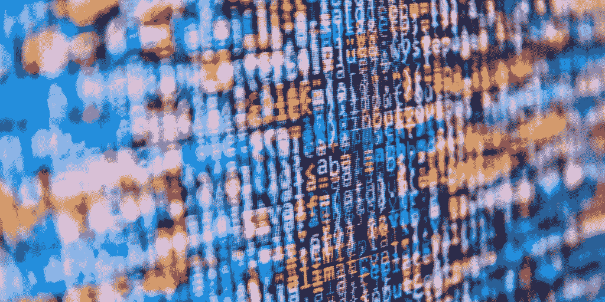

# 社交冷却:在数据驱动的社会中作为人的重要性

> 原文：<https://medium.datadriveninvestor.com/social-cooling-the-importance-of-being-human-in-a-data-driven-society-53b27b5abd80?source=collection_archive---------17----------------------->

你有没有在社交媒体上发布一些东西的时候三思而行，因为害怕它会在未来对你产生负面影响？我们在网上做的事情永远会被别人看到和评判。

在一个大数据和在线监控的世界里，我们的行动和行为越来越多地被监控、衡量、解释和评级。这会导致一个我们害怕冒险或说出自己想法的社会吗？

技术评论家 Tijmen Schep 将这种效应描述为“社会冷却”，因为它对社会有潜在的寒蝉效应。它是这样工作的。

首先，收集并存储您的数据。我们这里谈论的不仅仅是个人细节，而是你喜欢、搜索、购买或评论的所有东西——你的整个数字足迹。

然后你的数据被数据经纪人购买，他们使用基于社会趋势的算法来预测关于你、你的生活和你的习惯的成千上万的额外细节。

这些新数据构成了你的“数字声誉”，可能会被用来对付你。一个简单的例子是招聘人员如何扫描你的社交媒体历史，对你的生活方式和个性做出假设——太多的聚会照片，你可能会错过理想的工作。

更进一步，在你意识到之前，算法正在利用你的数字声誉告知潜在雇主你的人格缺陷和精神健康状况。问题是，我们不知道我们今天产生的数据将来会如何被用来对付我们。

因此，人们正在改变他们的行为，以提高他们的数字声誉，并获得更好的机会。虽然保护你的数字声誉可能意味着更好的工作或更大的贷款，但它也有沉重的代价。

**顺从——否则后果自负**

社会降温已经开始了。从避开可能对自己不利的网页，到在上传愚蠢的假日照片时三思，我们都因为害怕负面后果而参与在线自我审查。

中国在这方面更进了一步，政府正在测试一个系统，该系统使用公民的数字声誉来授予社会信用评分，该评分代表他们在国家眼中的表现如何。如果你买了“错误”的东西或以“错误”的方式行事，国家会给你降级。得分低的人会受到惩罚，限制他们的机会，这是一种强有力的大规模强制手段。

在一个一切都是在线和相互联系的世界里，社会信用系统可以用来授予或拒绝使用公共空间、交通、产品和服务，创造一个公民被迫顺从或被剥夺充分参与社会的机会的社会。这些都可以在没有任何阻力的情况下发生——因为阻力会损害你的社会信用评级。

你的评分是多少？

如今，对几乎任何产品、服务或体验进行评级都是可能的。像猫途鹰、Yelp 和 Glassdoor 这样的网站允许我们在一到五的范围内对企业甚至个人专业人士进行评级。

这给了日常消费者前所未有的发言权，以及获得大量反馈和评论的机会，让我们能够避开营销噪音，听取真实的意见。在 Glassdoor 的案例中，员工现在有机会评价他们的雇主，重新设定两者之间的权力平衡。

但是这种度量标准的扩散，以及我们对它们的重视，可能会产生不必要的后果。

获得更好分数的动机可能会导致那些接受评级的人不择手段地获得更好的分数。这可能意味着利用系统，无论是付钱让人写虚假评论还是写关于竞争对手的负面观点。

即使是真正的客户评级也很少能准确反映产品或服务的质量——大多数人只有在经历了特别好或特别坏的事情后才会写评论。

**无法预料的后果**

在某些情况下，评级方式存在固有的问题。例如，如果我们根据死亡率对医生进行评级，那些接诊绝症患者或生存机会渺茫的人(这种人非常需要一个好医生)的得分将低于那些只选择有可能存活的患者的人。因此，医生会避免治疗最需要他们的病人，因为害怕损害他们的声誉。

一些雇主现在允许他们的员工互相评价，迫使他们在一个残酷的环境中生存，在这个环境中，人们被他们的同事抛弃，或者评价其他人以获得回报。这个系统的主观本质是非常有问题的，因为人类的互动被情感而不是逻辑所蒙蔽。

有争议的应用程序 Peeple 更进一步，允许我们发布普通人的评论——我们的朋友、邻居、同事甚至是我们的伴侣。尽管由于负面反馈，这款应用已经有所减弱——你现在只能对那些给予许可的人进行评级——但它暗示了一个基于评级的社会的潜力，在这个社会中，我们所有的互动都经过仔细衡量，以避免负面评论。

收视率效应或类似的东西也通过社交媒体悄悄进入我们的私人生活，人们对“喜欢”、“观点”和“追随者”的痴迷改变了他们的行为，使他人的认可成为他们所做事情背后的真正动力，而他们所做的事情只是获得认可的一种手段。这种伪装创造了一个虚假体验的虚拟世界，通过 Instagram 帖子、Youtube 视频和推文整齐包装和呈现。

在所有这些例子中，我们都成了衡量标准的奴隶。害怕被糟糕的评价驱使我们去做一些我们不会自然而然去做的事情，这通常会带来负面的或者不可预见的后果。

正如杰瑞·穆勒在他的书《度量的暴政》中所说:

*“有些事情是可以衡量的。有些事情值得衡量。但能衡量的并不总是值得衡量的；被测量的可能与我们真正想知道的没有关系。衡量的成本可能大于收益。被衡量的事情可能会分散我们对真正关心的事情的注意力。而测量可能会给我们提供扭曲的知识——看似坚实但实际上具有欺骗性的知识。”*

**我们的自由和权利呢？**

大数据和数字监控的兴起引发了一些关于自由的巨大问题。虽然我们仍然有权上传一个醉酒之夜的照片，但这样做的后果越来越让我们三思。这代表了一种非常微妙和难以捉摸的控制形式。

为了更好的数字声誉或评级，我们冒着使我们的生活失去人性的风险，对我们的思想、活动、关系、工作场所和社会进行消毒。最终的游戏将是一个没有个人主义和个性的世界，没有人敢做任何不符合常规的事情。

Tijmen Schep 指出，隐私是犯错误的权利。犯错是人之常情。在这个世界上，我们的每一个错误都可以被记录下来并用来对付我们，我们真的可以自由地做人吗？

**职场经验**

大数据革命已经席卷了工作领域，改变了企业的决策方式，并提供了几年前难以想象的洞察力。但我们应该小心地运用它的力量，以避免我们相信盲目的算法做出影响真实人类生活的决定。

我们有可能创造一个充满恐惧和不信任的工作环境，就像办公室里的老大哥一样，员工的一举一动都被监控、记录，并被用来做出雇佣决定。同样，评级系统在工作场所也很成问题，将真实的人降低到数字分数，并导致我们在追求更高的评级时表现得不自然。

大数据有可能让我们的工作生活变得更好、更有效率，但前提是以人为本的方式使用大数据。它提供的见解应该为人类的决策提供信息，而不是做出决策。

在 People First，我们使用人员分析来帮助个人改善他们的工作体验。我们的软件捕捉关于表现、情绪、焦虑和幸福水平的数据，并使用它们来提供关于是什么让那个人成功的见解。但这些数据是由个人而不是他们的经理拥有的，这意味着结果只能是积极的，员工可以随心所欲地成为人类。

*最初发表于*[*【people-first.com】*](https://people-first.com/blog/the-importance-of-being-human-in-a-data-driven-society/)*。*

