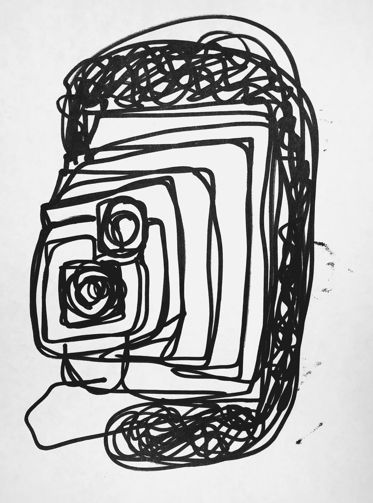

# 社交媒体:一个判断

> 原文：<https://medium.datadriveninvestor.com/social-media-a-judgement-8b9ea480b714?source=collection_archive---------8----------------------->

果断的批评。(读作:殴打)。

社交媒体是我们都在谈论的问题，但它是我们永远也吃不够的药物。作为一个年轻人，我相信她对社交媒体的使用有很好的理解，我想分享一下我对社交媒体的想法，以及我是如何避免被过度使用和滥用的。

Photo by Author

社交媒体是多方面的。为了修复你的社交媒体引发的抑郁和成瘾，我们必须对社交媒体进行分类。首先，社交媒体最基本的分类是作为娱乐的社交媒体。

我们来谈谈娱乐。大多数人都会同意娱乐——为了娱乐而做(或不做)而不是为了任何类型的生产力——是好的，只要你没有做任何有害或过度的事情。当我们将社交媒体作为一种娱乐形式时，它似乎是一种很好的打发时间的方式，只是社交媒体往往是有害的，可能会被过度使用。

我们对使用社交媒体进行娱乐的第一个担忧是，它是有害的，这体现在使用社交媒体来广播我们的生活，并进而将我们的生活与其他人的生活进行比较。有人说，比较是快乐的小偷，在社交媒体上将自己与他人进行比较也是如此，即使你只是在私下里将自己的帖子与他人的帖子进行比较。这种行为的习惯只会让你感到沮丧。如果你不能从逻辑上推断出这一点，试试 Instagram，看看你的情绪会如何。同样，传播和自我推销令人嫉妒的比基尼照片和度假是一场老鼠赛跑，除非你赶快离开，否则它会危及你的幸福。

在漫长的一天工作并从足球训练中接回孩子后进行的自我推销和秘密比较是社交媒体作为娱乐存在的很大一部分。社交媒体受到了很多抨击，因为这些都是不好的事情。它们是不好的东西。一个以简单易懂的方式制造人类绊脚石的应用程序对任何人都没有好处。

我们可能会听之任之，只做一点对我们不利的事情，但许多人也有在社交媒体上花费太多时间的问题。现在，我不认为在社交媒体上浪费时间是不可克服的。我也不认为你会沉迷于基本的社交媒体行为——编辑、抓拍、点击和浏览——但这些行为让你如此容易屈服和沉迷的恶习非常像上瘾。一旦你开始比较并主动嫉妒，你就无法停止。

这种对他人和自己的嫉妒和判断的有形循环让你被抓住，不让你走。尽管人们过去常常通过看着邻居的农场，垂涎他们的奶牛，感觉自己像狗屎一样，或者过度，愚蠢地为自己的奶牛骄傲，但我们现在可以用手指触摸看每个人的“奶牛”。看着奶牛并试图达到标准是很有趣的，除非你达不到标准，而你永远也不会达到标准。这就是为什么你花这么多时间在社交媒体上，看下一个人的帖子，下一个，希望找到比你更糟糕的人，这样你就可以对自己感觉更好。

你花这么多时间上网可能是出于不同的原因，但我不知道是什么原因。据我所知，比较陷阱是我们被吸进去的主要原因。

现在，有些人会说，不，社交媒体不是为这些卑鄙的目的而创造的，它是为我们的第二个分类而创造的:一种用来与老朋友保持联系的交流工具。那可能是真的。但是在所有使用社交媒体的方式中，用它来交流和建立关系可以说是最愚蠢的。

你可能会问，通过这些应用程序与熟人和朋友联系的想法怎么会值得被嘲笑为愚蠢呢？这很愚蠢，因为 Instagramming 和 snap 是不足以在很大程度上建立关系的工具。

人际关系是复杂的、感性的，时而微妙，时而稳固。拥有一个真正的朋友或家人是生活给予我们的最好的东西之一。我们通常通过见面和交谈成为朋友或家人。我们互相帮助度过困难时期，我们庆祝美好时光。成为朋友意味着太多的意义，社交媒体这种致命的工具不足以让某人成为“朋友”。

为了成为朋友，你必须表达想见某人的愿望。你不得不冒着与一个被拒绝的人失去友谊的风险。你必须和这个人进行第一次对话……我们不要撒谎，这将是一次尴尬的第一次对话。你必须气喘吁吁地穿上真正的裤子，去和他们共进午餐……在公共场合……即使你宁愿呆在床上。

Snapchat 和 Instagram 将我们关系中的所有努力、拒绝、承诺和美味的社交尴尬都带走了。然而，在现实生活中，当我们向某个我们已经抓拍了好几天的人挥手时，他们却没有抬头，我们确实对这种尴尬有一种补偿。

社交媒体不同于打电话甚至发短信，正是因为缺乏身体或情感上的投入。如果有人用 Snapchats 和你聊天，而你没有接，他们会比给你打电话或发短信时感觉更少被拒绝，因为我们都知道，错过查看 snap 比错过短信或电话要容易得多。因此，如果一个电话或一条短信被拒绝，这将比啪的一声更令人伤心，而且，电话和短信更有可能被拒绝，因为它们需要更多的时间来回复。这样，当 Snapchatting 增加，call 减少时，人类互动中的懒惰就变得更容易被社会接受。然而，这种对懒惰的助长和制裁可以说是自火与铁以来的大多数技术进步。然而，随着每一个新的进步，我们失去了部分使我们的手势有意义的努力，这在社会进步中尤其如此。在某一点上，我们可能会进步太多，以至于在人类的大计划中，我们会倒退。

这就是为什么多年来社交媒体不足以保持牢固的关系。我想，如果你对你的朋友在网上，以及随之而来的微薄的承诺感到满意，你的网上朋友也对从远处认识你感到满意，那么你应该享受这些关系。就我而言，我从来没有满足于在一个周五晚上拥有 400 名 Instagram 粉丝，却没有人可以一起出去玩，我不相信这是一个只为我自己保留的职位。

然而，如果你通过社交媒体与你不想失去的人联系在一起，这是一个可悲的结论。在这种情况下，我建议你努力打电话给他们，通过一次真实的对话来交流。这是很困难的，因为他们可能不会像你一样，回报给你打电话的愿望。在这种情况下，他们值得你花时间吗？

这就是我要说的。社交媒体只有用坏了才是坏的。但是它的两个主要目的都有不好的结果或者不足以达到预期的目的。

最后一点，我觉得你知道的一些信息是，我没有大多数社交媒体应用程序。我确实在 Medium 上花了时间，但我认为 Medium 不太容易被归类为社交媒体，因为我在这篇文章中对它进行了大量的负面描述，Medium 似乎没有我提到的其他应用程序中存在的缺点。我曾经有过 Instagram 和 Snapchat，一用就是好几年，但我不喜欢它们，因为它们对我的人际关系和幸福没有任何帮助。自从放弃社交媒体后，我偶尔会看看朋友手机上的 Instagram，以此作为消遣，但每次看了我认识的人的 insta gram 后，我的情绪下降都是如此明显，我发现即使偶尔小剂量的社交媒体也不是一件好事。既然一旦开始就很难停下来，那么避免使用 Instagram 或 Snapchat 对我来说更好。