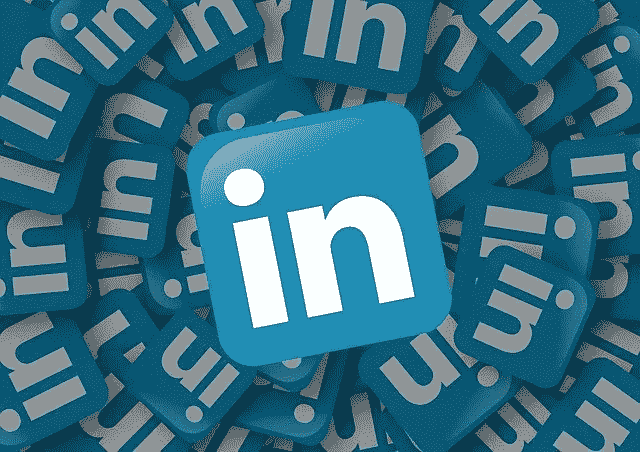
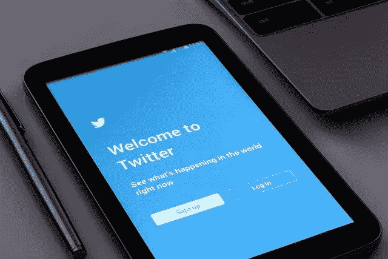

# B2B 创业的社交媒体最佳实践

> 原文：<https://medium.datadriveninvestor.com/social-media-best-practices-for-your-b2b-startup-619df2d05832?source=collection_archive---------13----------------------->

*内容副总裁安妮·苏斯泰克·塔尔博特，* [*BX3*](https://bx3.io)

Image by [Gerd Altmann](https://pixabay.com/users/geralt-9301/?utm_source=link-attribution&utm_medium=referral&utm_campaign=image&utm_content=1989152) from [Pixabay](https://pixabay.com/?utm_source=link-attribution&utm_medium=referral&utm_campaign=image&utm_content=1989152)

如果网站在数字经济中的功能相当于店面，那么社交媒体就相当于传单:公众分发、分享、传播信息。在电子商务占主导地位的商业环境中，没有网站的商业没有路标也是有效的。相反，活跃的社交媒体是向世界——特别是我们的潜在客户和我们希望报道的新闻来源——表明我们还活着，正在蓬勃发展，正在思考和开发当今关键问题的解决方案。

坦率地说，强大的社交媒体也是公司的冰箱:这是展示我们最新项目、媒体提及或新解决方案的最佳场所。

Image by [Simon Steinberger](https://pixabay.com/users/Simon-3/?utm_source=link-attribution&utm_medium=referral&utm_campaign=image&utm_content=76532) from [Pixabay](https://pixabay.com/?utm_source=link-attribution&utm_medium=referral&utm_campaign=image&utm_content=76532)

## **脸书**

大约 60%的企业在脸书有业务。鉴于平台的个人性质，脸书战略的主要目标是让世界知道你的存在。在脸书上发帖也有助于谷歌和其他主要搜索引擎找到你，并提醒全世界注意你的存在。

一般来说，我们建议每个工作日在网站上发布一篇内容。如果可能的话，我们会将当天发布到 LinkedIn 上的内容替换掉(稍后会有更多相关内容)。对于主要的公司新闻，用 LinkedIn 双重发布就可以了，只要引入文本至少略有不同。

要记住的提示:

*   记得标记与帖子相关的关键人物，以最大化浏览量/互动量(反过来，提高我们在算法中的页面排名)。相关参与者包括:
*   发表这篇文章的媒体
*   帖子中提到的实体。例如，关于贵公司与某个组织的合作关系的帖子应该标记其他组织，以提高可见性并激励其他组喜欢和分享您的帖子。
*   鉴于网络的悠闲本质——毕竟，这是人们消磨时间的地方——脸书的帖子可以比 Twitter 等更关注新闻的平台或 LinkedIn 等商业平台上的帖子更轻松。
*   最吸引人的脸书帖子是那些要求读者参与互动的帖子。试着用一个问题来结束帖子，询问他们对这个故事的看法。例如，一篇关于创业的帖子可以以问读者一些类似“你在融资方面遇到了什么障碍，你学到了什么？”

Image by [Gerd Altmann](https://pixabay.com/users/geralt-9301/?utm_source=link-attribution&utm_medium=referral&utm_campaign=image&utm_content=911794) from [Pixabay](https://pixabay.com/?utm_source=link-attribution&utm_medium=referral&utm_campaign=image&utm_content=911794)

## **领英**

LinkedIn 是一个面向志趣相投的专业人士、潜在客户和投资者的社交网络，他们希望与下一个伟大的思想和公司建立联系。

1.  争取每个工作日至少发一篇文章。如果在你的圈子里没有来自你的公司或客户的消息，发布与你公司利益相关的内容。一些例子可能是风险投资技巧，远程工作技巧，或如何发现下一个伟大的项目。
2.  让思想领导满足于双重任务。在出版物上署名？在你的媒体频道上发布一些有趣的东西？在 LinkedIn 上获得双重优势:
3.  署名的人应该从他们的页面/账户上发表一篇摘录作为思想领袖的帖子，并带有故事的反向链接。一旦 LinkedIn 帖子上线，就与运营你公司 LinkedIn 页面的人分享。(如果你正在读这篇文章，表面上那可能就是你。)根据最佳实践，在你公司的 feed 上创建一个帖子/更新(稍后会详细介绍)。
4.  记得标记关键人物。任何与帖子中标记的人和公司有联系或关注的人都可以在订阅源中看到该公司的帖子。主要参与者包括但不限于:

*   文章中提到/引用的人
*   该出版物
*   故事中涉及的合作公司

5.LinkedIn 使用标签来帮助分类内容，并相应地引导受众。Pepper 标签以一种读起来很自然的方式贯穿文章的介绍文本。(也就是不要强行把它们写进你的散文里。写大纲的时候会出现#venturecapital 或者#entrepreneurlife101 吗？太好了。如果没有，就不要勉强。文章末尾应该有与尚未使用的文章相关的关键标签。

Image by [Photo Mix](https://pixabay.com/users/PhotoMIX-Company-1546875/?utm_source=link-attribution&utm_medium=referral&utm_campaign=image&utm_content=1795652) from [Pixabay](https://pixabay.com/?utm_source=link-attribution&utm_medium=referral&utm_campaign=image&utm_content=1795652)

## **推特**

[Twitter](https://twitter.com/home) 是我们与媒体世界互动的地方，也是我们与粉丝和关注者快速评论的地方。微博平台也有助于保持我们的数字存在的新鲜度，因为关于某个特定公司的搜索引擎结果通常会显示其最新的推文。

1.  争取每个工作日至少发三篇帖子:东部时间上午一篇，下午一篇，晚上一篇。有些工作日，我可能会发四五条微博，其他的会在午餐前和/或下午三点左右发。
2.  周末和节假日，尽量每天至少发一条推文。转发没问题。(一分钟后更多关于 RTs 的内容。)
3.  记住标签。标签是人们找到你的内容的方式——在趋势标签的情况下，你的目标受众和媒体如何找到你来获取信息——或者在记者的情况下，在故事中引用你的话。
4.  通过对以下内容进行谷歌新闻搜索/提醒来查找要发布的内容:

*   你的公司
*   客户
*   与您提供的服务相关的主题:如风险投资、企业家精神、区块链；
*   第三方内容的可靠来源包括适合您所在行业的出版物，以及您目前所处的位置—中等！

1.  每当你被媒体提及时，至少发布四次:

*   当故事开始时
*   至少三次以上；因为这个故事仍然有意义。

2.发帖时，@-标记关键人物，以鼓励帖子的互动和可见性，进而提升您的品牌:

*   出口
*   写这篇报道的记者
*   提到过任何客户吗

3.RTs 和评论是与关键思想领袖(如媒体、记者和我们领域的影响者)互动和互动的好方法。如果你正在打电话，有空的话，代表我们与一些有影响力的高层人士接触。回复 Twitter 帖子让我们在几个层面上看得见:

*   根据定义，影响者拥有成千上万的追随者。通过回复活跃的主题，其他关键人物将会看到我们的品牌。
*   与关键影响者的接触提高了你在算法中的排名，这意味着更多的人可能会看到你的帖子。

Image by [fauxels](https://www.pexels.com/@fauxels) on [Pexels](https://www.pexels.com)

## **中等**

[Medium](https://medium.com) 是互联网精英汇聚的新地方。(显然是这样，因为你已经在这里了。)

主要是博客平台，一点点社会媒体，媒体是一个伟大的地方，让我们发光，让我们看起来聪明(不是说我们已经没有)。

1.  表现最好的帖子一般在 500 到 2000 字之间。一般来说，我们的帖子倾向于在 100 字到 1000 字之间徘徊，但这不是一个硬性规定。
2.  每 300 字左右包括多媒体内容；即，对于 1000 字的故事，包括三张照片、嵌入的视频等。 [Pixabay](https://pixabay.com/) 、 [Pexels](https://www.pexels.com/) 和 [Unsplash](https://unsplash.com/) 是免费库存图片的良好来源。
3.  如果有一个可靠的引用，使用巨大的引用标记功能，在文章中包含一个引用。
4.  确保每 200 字左右包含锚链接。旨在以搜索引擎优化友好的方式链接短语；也就是说，一个人可能会在搜索引擎中输入的短语，如“如何确保筹款”目标是混合链接到我们自己的内容(如我们网站的登陆页面和其他媒体帖子)，以及来自高流量、备受尊敬的网站的相关内容，如 [*【纽约时报】*](https://www.nytimes.com)[*【快速公司】*](https://www.fastcompany.com)[*【企业家】*](https://www.entrepreneur.com)[【投资媒体】](https://www.investopedia.com)等。

Image by [fancycrave1](https://pixabay.com/users/fancycrave1-1115284/?utm_source=link-attribution&utm_medium=referral&utm_campaign=image&utm_content=820272) from [Pixabay](https://pixabay.com/?utm_source=link-attribution&utm_medium=referral&utm_campaign=image&utm_content=820272)

## **链接缩短器:减少对指标的搜索**

只要有可能(可行的话，在笔记本电脑前)，在发帖前使用链接缩短工具[ [bit.ly](https://app.bitly.com/Bi7km9SuLIc/bitlinks/32PcX4l) 是一个常用工具]来缩短链接。除了创建更简洁的社交媒体帖子，登录后，该工具还可以跟踪缩短的链接被点击的次数；哪些次；和读者所在的国家。Bit.ly 还允许保存缩短的链接供以后使用。进入平台的任何已经自动缩短的链接将与原始链接一起归档，以实现无缝跟踪。

## **结论**

有效的社交媒体营销策略的诀窍是以一种方式定位关键内容，将我们的目标受众引向他们，就好像他们实际上不是目标受众一样。相反，关键是自然的参与:以一种激发对话和兴趣的方式利用我们的聚焦内容。如果你发现某个内容引起了你的兴趣，很可能有人会分享这种情绪，反过来，也会分享这个内容。