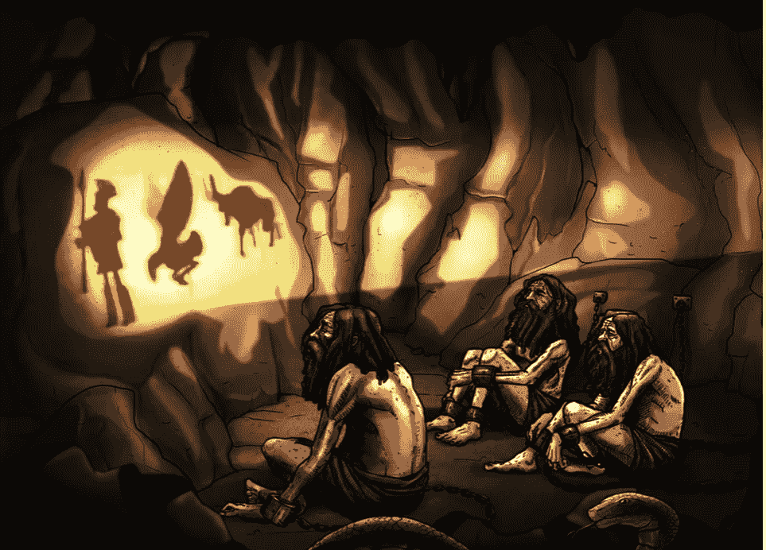

# 社交媒体“不可思议”

> 原文：<https://medium.datadriveninvestor.com/social-media-is-incredible-95cb1519381?source=collection_archive---------1----------------------->

人工智能咨询公司**的首席执行官戴夫·科普林说:**

> **"*令人信服的崛起*[***deep fakes***](https://en.wikipedia.org/wiki/Deepfake)*是一件可能真的有问题的事情，除非我们有这样的对话。公众需要知道制作令人信服的假视频有多容易。***

**社交媒体在这个词的真正意义上确实是“不可思议的”，而不是狭隘地与令人惊讶的事情相关联。真正意义上的不可思议是“太不可思议而不可信”。互联网，主要是社交媒体，已经变得难以置信，这可能会导致它的灭亡。**

** [## 社交媒体倾听让你时刻保持联系——数据驱动的投资者

### 虽然社交媒体倾听是一种顶级趋势，但它应该是每个现代营销策略的一部分。保持和谐…

www.datadriveninvestor.com](https://www.datadriveninvestor.com/2019/02/26/social-media-listening-keeps-you-plugged-in/) 

当我想到现代互联网，尤其是社交媒体，比如脸书，我就想起了古希腊的洞穴故事。据说，人类被锁在一个山洞里，无法转动他们的头。他们所能看到的只是他们面前的洞壁。

然而，在人类燃烧的火焰后面，在火焰和人类之间，有一个栏杆，木偶操纵者可以沿着它行走。在囚犯后面的操纵木偶的人举起木偶，在洞穴的墙上投下影子。人类看不到这些从他们身后经过的木偶，真实的物体。人类看到和听到的是他们看不见的物体投射的阴影和回声。这里有一幅洞穴的插图。

随着时间在洞穴中流逝，人类将外表误认为是真实的，并认为他们在墙上看到的东西(影子)是真实的；他们对阴影的真正原因一无所知。

当人们谈论他们在洞穴墙壁上看到的物体(比如说一本书)时，它们在墙壁上投下了阴影，他们可能会说“*我看到了一本书！尽管他们认为他们在谈论一本书，但他们实际上是在谈论一本书的影子，尽管他们使用了“书”这个词人类错了。他们用自己语言的术语来指代在他们眼前掠过的阴影，而不是投射阴影的“真实事物”。*

社交媒体已经成为现代的洞穴。它降低了我们的存在感，让我们只能看到洞穴墙壁上的阴影。我们不知道我们在社交媒体上看到和听到的东西是真实的还是别人想让我们看到和听到的东西的影子。几个例子很有启发性。

*   脸书拒绝撤下一段视频，这段视频被篡改成众议院议长南希·佩洛西喝醉的样子，凸显出脸书打击假新闻的承诺存在漏洞。

*   一群网络暴民**错误地将一名 Chipotle 员工**描绘成种族主义者。

 [## 一群网络暴民如何错误地将一名 Chipotle 员工描绘成种族主义者

### 一名 Chipotle 员工因其在一些 Twitter 用户认为是种族主义事件中的角色而在网上遭到鄙视。然后…

www.cnn.com](https://www.cnn.com/2019/05/25/us/false-racism-internet-mob-chipotle-video/index.html) 

通过被称为“T4”的 Deepfakes ，可以通过训练**卷积神经网络**来生成高度逼真的人类头部图像。

“Deepfakes”是“深度学习”的合成词，本质上需要机器通过例子进行学习，而“fake”不仅用于创造不存在的人，还用于**歪曲真实的人。例如，一个人可以把一个人的脸放到另一个人的身体上。这也引发了对治安的担忧。现在，如果你有某人犯罪的视频，这几乎是他们犯罪的确凿证据。随着制造 deepfakes 的技术的发展，无辜的人可以被陷害，有罪的人可以提供一个巧妙的新的不在场证明。**

虽然单独来看，所有这些篡改过的视频和 deepfakes 可能看起来影响甚微，但它们越来越多的数量正在彻底摧毁互联网和社交媒体可能已经拥有的任何可信度。我们都有可能被锁在一个山洞里，把所有的社交媒体都当成墙上的影子。

如果你认为唐纳德·特朗普在上次选举中疯狂使用推特和社交媒体，那就等着看他在 2020 年选举前掌握一些 deepfake 技术吧。**