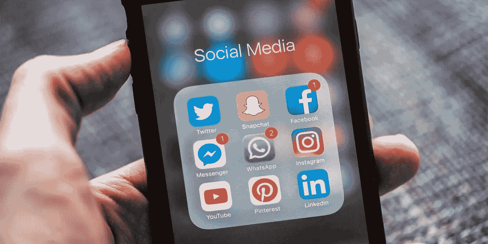
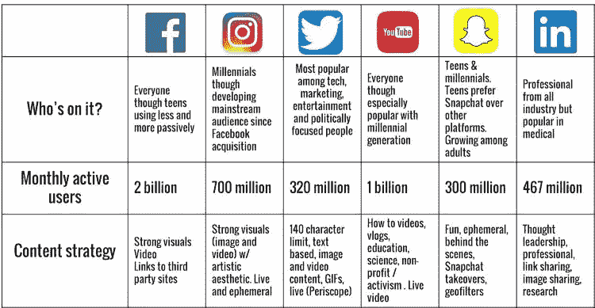
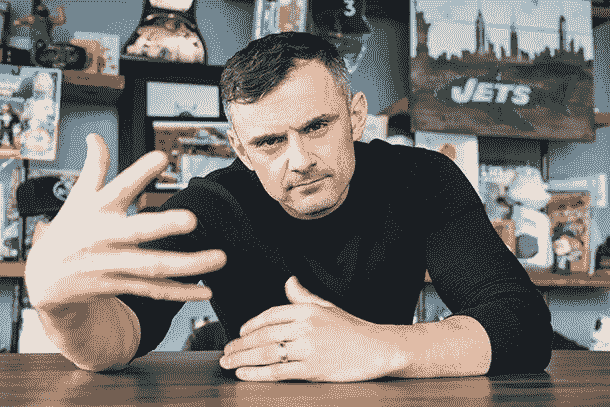

# 社交媒体矩阵

> 原文：<https://medium.datadriveninvestor.com/social-media-matrix-b1da38f4decb?source=collection_archive---------5----------------------->

在社交媒体上建立一个品牌，同时拥有这么多不同的媒体平台是一个挑战。为了有效地吸引消费者，品牌需要通过社交媒体营销有机地参与对话。根据研究，品牌创建吸引人的内容，激发分享，并为不同的社交媒体平台管理和创建内容，这一点至关重要。以及战略性地在社交领域导航，并包括有影响力的人，以使其对观众来说更加个性化。同样重要的是要理解社交媒体和营销是不同的学科，彼此独立。在 Web 2.0 之后，公司获得了信息的所有权，并独立发布信息，而不是通过传统媒体渠道。Mangold 和 Faulds 认为，社交媒体应该是营销组合中促销组合的要素之一，其主要目标应该是与受众沟通。

脸书是一个很好的社交媒体平台，可以与老朋友建立关系并保持联系。它建立了你现有客户群的忠诚度。脸书的缺点是很难吸引新的观众；由于人口众多，脸书邮政的覆盖范围有限。Twitter 是一个通过标签建立品牌知名度的平台。搜索标签，消费者可以了解人们在谈论什么，并以这种方式写推文来参与流行的对话。YouTube 是最大的搜索引擎平台之一，搜索基于“如何做”视频。因此，提供这类内容的企业在这个平台上运作良好。

“关于社交网络和社交媒体，如果有一件事我想告诉人们，尤其是企业家，那就是耐心。听着，我是一个企业家，我很疯狂，我很热情，我在很多方面都很不耐烦。但我的耐心是社交对我如此重要的原因。社交，不同于 SEM 和 SEO，不同于电子邮件营销，不同于直邮，不同于大多数事情是短跑世界中的马拉松。营销是一场冲刺，而社交对于人们来说真的有点像一个难以理解的矩阵，因为它有时可能是一场冲刺，但更多时候，它关乎终身价值。这大约是花费钱包的一个百分比，所以我会说要认真对待它，但是要理解，要得到结果，你要看一点点时间。你必须首先带来价值，我喜欢说内疚，但有权获得价值的回报，因为这是一个人的平台。不仅仅是一个推送平台。”加里·维纳查克

参考资料:

h .布凌格(2002 年)。科学与实践中的技术管理:IAO 弗劳恩霍夫 20 年。*技术管理，*1–11。doi:10.1007/978–3–642–56347–8 _ 1

h .布凌格(2002 年)。科学与实践中的技术管理:IAO 弗劳恩霍夫 20 年。*技术管理，*1–11。doi:10.1007/978–3–642–56347–8 _ 1

加里·维纳查克:你必须对社交媒体有耐心。(未注明)。检索自[https://www . Inc . com/Gary-vaynerchuk/social-media-patience . html](https://www.inc.com/gary-vaynerchuk/social-media-patience.html)