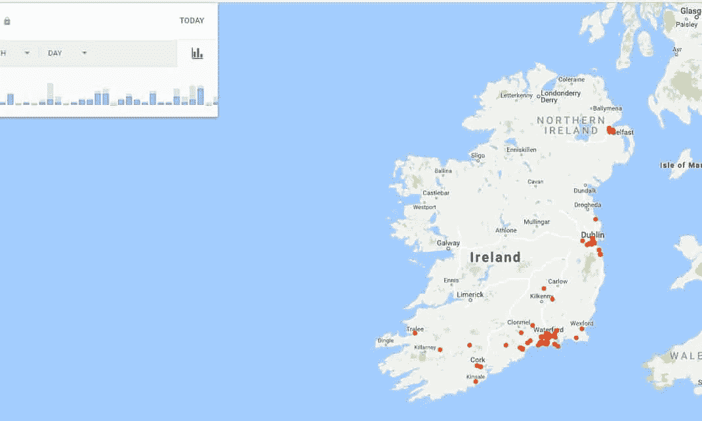
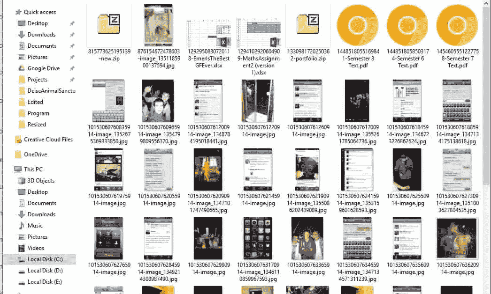

# 社交网络:无害媒体还是隐私侵犯？

> 原文：<https://medium.datadriveninvestor.com/social-networking-harmless-media-or-privacy-intrusion-9b8e30402d5?source=collection_archive---------14----------------------->

[{​https://www.emigrandoamerica.com/ee-uu-vigilara-uso-redes-sociales-inmigrantes/​}](http://{​https://www.emigrandoamerica.com/ee-uu-vigilara-uso-redes-sociales-inmigrantes/​})

随着关于个人隐私和密集数据收集的争议通过现代揭发者在互联网上掀起风暴，社交媒体的两大巨头受到质疑。

迪伦·柯伦(Dylan Curran)是揭露这一问题的人中比较受欢迎的一位，“一位数据顾问和网络开发人员，他对传播技术意识和改善数字礼仪进行了广泛的研究”【theguardian.com，。

> “今年我在爱尔兰去过的每个地方的谷歌地图”(柯伦)

*下面的图片显示了谷歌收集的柯伦在拍摄这张照片的最后 12 个月里去过的每个地方的数据。*

[{Photograph: Dylan Curran (theguardian.com)}](https://www.theguardian.com/commentisfree/2018/mar/28/all-the-data-facebook-google-has-on-you-privacy)

根据 Curran 的说法，如果开启了位置追踪，谷歌将会在一个允许的移动设备上记录下每一个不同的位置。该信息还与存储位置的日期和时间的时间码成对出现。这就形成了一个时间线，可以显示最近时间记录的每个位置，这通过地图上的红点来表示。

***在这里****[***人们可以发现谷歌是如何深入追踪他们的位置并查看他们记录的时间线的。***](https://www.google.com/maps/timeline?pb)*

*仅仅触及表面:谷歌的个人信息收集并不仅限于地点。事实上，谷歌的记录包括:曾经搜索过的一切，所有删除的搜索历史，用户的广告资料，使用的所有应用程序，书签，电子邮件，联系人，发布的 YouTube 视频，拍摄的照片，Google Drive 文件，日历信息，Google Hangout 会话，听的音乐，使用的移动设备，购买的业务，创建的网站，甚至每天走过的步数。提到的这些只是谷歌收集的一些更私人的信息，是一个大文件的一部分，该文件包含了收集的关于每个用户的数百万个 word 文档的信息。*

****完整的搜索历史报告从谷歌可以找到*** [***这里***](http://myactivity.google.com/myactivity) ***。****

> *"脸书保存在我身上的数据快照."(柯伦)。*

**

*[{Photograph: Dylan Curran (theguardian.com)}](https://www.theguardian.com/commentisfree/2018/mar/28/all-the-data-facebook-google-has-on-you-privacy)*

***个人信息面临风险:**在众多公司中，脸书是争议中较为突出的公司之一。脸书积累了大量数据，包括用户曾经发送的所有消息(包括所有文件、联系人和音频消息)、登录时的数据(包括位置、时间和设备)，以及连接到脸书的每个应用程序的数据。这尤其关系到他们的首席执行官马克·扎克伯格，他必须在 2018 年 4 月就他们与剑桥分析公司的业务在国会作证。丑闻涉及脸书向该公司出售数百万份个人资料，然后该公司利用这些信息制作各种政治广告，导致该公司完全关闭。由于对其商业行为的道德和法律担忧的投诉，以及对其在 2016 年选举中的影响的担忧，这也使脸书受到质疑。关于滥用信息以及他们可能参与所谓的俄罗斯篡改，脸书面临美国政府的新法规。*