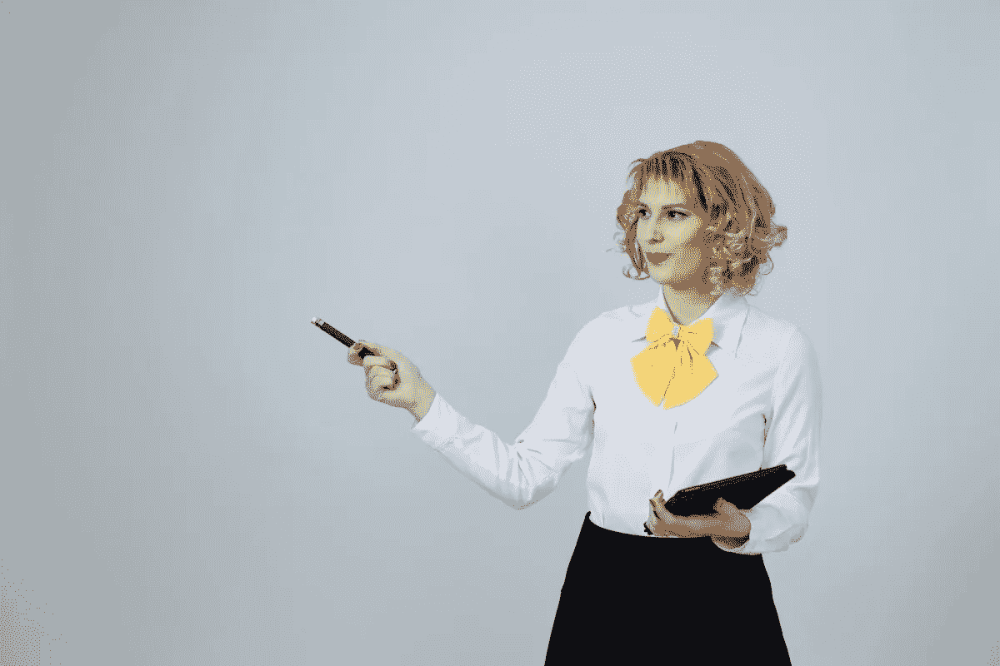

# 社会科学是人工智能偏见的解毒剂

> 原文：<https://medium.datadriveninvestor.com/social-science-is-the-antidote-for-bias-in-artificial-intelligence-d062a79bca81?source=collection_archive---------2----------------------->

Image: Pixnio

在一个由 STEM 创立并主导的行业中，社会科学提供了一个打击人工智能偏见的强大工具。

偏见是我们这个时代对人工智能的巨大概念挑战，也是阻止它发挥全部潜力的主要绊脚石。专家发言人和对这一现象的研究发现了一个共同的主题:

> “需要多样化的开发团队和真正有代表性的数据集，以避免偏见被融入人工智能算法，这是一份冗长的上议院委员会报告的核心建议之一，该报告调查了人工智能的经济、伦理和社会影响”([英国议会](https://techcrunch.com/2018/04/16/uk-report-urges-action-to-combat-ai-bias/))
> 
> “让我们增加人工智能编码员的多样性，以消除算法中的无意识偏见”([鲁斯·肖](https://qz.com/1232285/ad-week-europe-2018-risk-and-rewards-of-ai-and-using-machine-learning-to-remove-bias/))
> 
> “目前，人工智能是一个稀薄的领域，只属于博士技术专家和数学家。背景更加多样化的团队自然会提出问题，指出盲点，检查假设，以确保这种强大的工具建立在一系列观点的基础上。”([威尔伯恩](https://www.fastcompany.com/40536485/now-is-the-time-to-act-to-stop-bias-in-ai))
> 
> “没有人能在所有方面都比任何人强，所以你自然需要补充你的缺点……一个好的研究者会正视你的缺点，会发现你的盲点，会扩展你的策略，会改进你的策略，会提高你的研究活力。”([陈欧内斯特](https://www.youtube.com/watch?v=akrWQxUqjq8))
> 
> “提供教程和工具来帮助经验不足的数据科学家和工程师识别并消除他们训练数据中的偏见也很重要。”([麻省理工科技评论](https://www.technologyreview.com/s/608986/forget-killer-robotsbias-is-the-real-ai-danger/))

为了解决人工智能中现有的偏见，并在未来防止这种偏见，不同的观点需要在开发团队中得到体现。除了跨越年龄、阶级、性别、种族和性取向的界限之外，多样化的团队还跨越了教育背景的界限。作为一个研究领域，社会科学为人工智能的发展增加了巨大的价值，既因为它对手头任务的高度适用性，也因为它与 STEM 领域的技术焦点相对应。

# **人工智能偏见难题**

人工智能系统有一个并非完全不劳而获的名声，首先是公正和有条不紊；虽然从技术上来说，数字不会说谎，但我们倾向于对自动化流程的盲目信任是不合理的。数字可以被操纵、歪曲或忽略，即使机器本身没有偏见，它们的创造者人类却有。偏见是我们人类固有的思维方式。它包含了无数个人的、无意识的假设，这些假设是每个人做出的，客观上是不正确的。这些假设在我们的工作中以扭曲的过程和/或遗漏的形式表现出来。人工智能系统创建时很小的偏差会随着算法的运行而放大，随着时间的推移越来越快、越来越大。

随着人工智能在几乎所有可以想象的服务中扩大参与，偏见的负面影响变得显而易见。已经有几个证据充分的有偏见的人工智能惨败:[面部识别错误](https://www.theverge.com/2018/4/26/17285034/axon-ai-ethics-board-facial-recognition-racial-bias)、[不当的判决和假释分配](https://www.propublica.org/article/machine-bias-risk-assessments-in-criminal-sentencing?__hstc=12316075.308fc97f2e072513af9666fb80acc192.1525211456405.1525211456405.1525211456405.1&__hssc=12316075.1.1525211456405&__hsfp=4130918321)、[银行贷款的不平等授予](https://www.technologyreview.com/s/604122/the-financial-world-wants-to-open-ais-black-boxes/)、[不合适的医疗诊断](https://qz.com/1023448/if-youre-not-a-white-male-artificial-intelligences-use-in-healthcare-could-be-dangerous/)，以及[无效的语音识别](http://techland.time.com/2011/06/01/its-not-you-its-it-voice-recognition-doesnt-recognize-women/)，仅举几例。在所有这些事件中，明显的输家是妇女、有色人种和其他少数民族。

偏见的一个主要来源是前面提到的人工智能开发缺乏多样性。编程偏见偶然发生，有意发生，或从缝隙中溜走，但导致我们看到的错误的疏忽在白人男性占劳动力如此大比例的领域也是相当可预测的。这也是那些几乎完全(逻辑上)围绕工程、数学、软件开发等构建的开发团队所期望的结果。底线是有相似背景和训练的人倾向于得出相似的结论，忽略相似的细节。

即使在一个精心设计的参数平衡的系统中，**偏差也会渗透到被不完整信息和不平等历史趋势污染的历史数据中**。例如，当一个算法用历史上包括更多白人男性的贷款记录或历史上包括更多有色人种的逮捕记录进行测试和训练时，如果不考虑创建这种数据的条件，它会根据这一因素，给申请贷款的女性和非白人或申请假释的有色人种分配过多的风险。

最后，**利用与人类的互动或人类的反应的人工智能也可以获得他们的主体的偏见，并将其内化到他们的过程中**。一个著名的例子是微软的 Tay chatbot，它在 Twitter 上与人类互动(并向其学习)不到 24 小时后，开始生成[极其令人反感的内容](https://www.theverge.com/2016/3/24/11297050/tay-microsoft-chatbot-racist)，不得不被关闭；从那以后，有人认为 Tay 是被互联网巨魔[故意操纵的](http://knowyourmeme.com/memes/sites/tay-ai)，但这并不意味着打算充当用户界面或执行[情感分析](https://blog.algorithmia.com/introduction-sentiment-analysis/)或[自然语言处理](https://www.sas.com/en_us/insights/analytics/what-is-natural-language-processing-nlp.html)的人工智能不会(或不会)因为偏见而经历类似的挫折。

# **社会科学带来了什么？**

一般来说，社会科学研究不同的社会和社会中个人的相互作用，包括人类学、社会学、政治学、心理学、经济学和历史学等领域。它的主要使命是通过剥离先入为主的观念、传统、符号和其他社会结构和个人过滤器(也就是说，偏见)来揭示真相，使用经验和可记录的方法。虽然重点和程序因专业而异，但基本方法是使用[科学方法](https://www.sciencebuddies.org/science-fair-projects/science-fair/steps-of-the-scientific-method)研究定量和定性现象。社会科学在公共政策、人力资源、打击犯罪、市场营销和广告以及公共和私营部门的战略规划等方面有着广泛的应用。

在人工智能的背景下，社会科学的应用揭示了是什么导致了算法中的偏差，或者首先阻止了它的发生。下一个问题——特别是对于一个非技术社会科学家来说——可能是“如何做到的？”在被动的情况下，可以通过对算法性能的详细分析，以及与参与创建算法的每个人的深入访谈(如有必要)，来确定功能障碍的根源以及应该采取什么措施来解决它。积极主动地工作，社会科学家可以利用他们的培训在人工智能系统的设计、参数和数据上进行合作，以确保它们是平衡的(或适当的补偿，如果需要的话)，并且系统在实践中按照预期运行，此外还可以向他们更定量的同事教授定性原则和分析方法。

这是对双方的行动呼吁。首先，对于对我们的社会未来将如何运作感兴趣并寻求创造影响的社会科学家来说，考虑一下在人工智能开发领域工作——如果你找不到愿意雇用你的科技公司，那就创办一家吧！对于现有的人工智能开发人员来说，需求已经被确定，挑战已经被抛出；帮你自己一个忙，在你的下一批雇员中包括一些社会科学家。

声明:我是一个天生有偏见的人，拥有人类学和经济学学位。