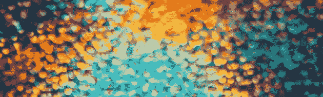

# 软数据挖掘

> 原文：<https://medium.datadriveninvestor.com/soft-data-mining-49b42e45c206?source=collection_archive---------13----------------------->

## 挖掘有组织智力的脉络

Photo by [fabio](https://unsplash.com/@fabioha?utm_source=medium&utm_medium=referral) on [Unsplash](https://unsplash.com?utm_source=medium&utm_medium=referral)

我以前写过关于诺罗圈和人类通过覆盖我们生存的错综复杂的无数网络收集、组织和分发信息的奇妙方式。

随着信息被蒸发并存储在大量的云系统中，带宽正以惊人的速度激增；随着接入本身在新的人类梯队、新一代和未开发的区域上级联，人类准备进入一个不同于我们所经历的任何其他时代的新时代。

 [## 为什么数据将改变投资管理|数据驱动的投资者

### 有人称之为“新石油”虽然它与黑金没有什么相似之处，但它的不断商品化…

www.datadriveninvestor.com](https://www.datadriveninvestor.com/2019/01/25/why-data-will-transform-investment-management/) 

这篇文章除了可能以不同的方式看待我们与信息的关系之外，不会呈现任何新的东西。这更是为了给我们的传播能力增加一线希望，以筛选无穷的知识，挖掘有组织的智慧的血管，并尊重我们的特权——我们真正的特权——地位。这是关于我们不断增强的扩展这些随着时间的推移而构建的信息圈的能力，以及我们为已经摆在我们面前的数年、数十年或数百年的努力做出贡献的能力(如果不是义务的话)。

> “问题的解决不是靠提供新的信息，而是靠整理我们早已知道的东西。”
> ― **路德维希·维特斯坦根**

这是一个迷人的现实——我们不需要一个博士学位或某个特定领域的某种崇高的专业知识来为今天的工作做出贡献或与之相关。我们可以接触到每一个概念，每一个想法，每一个理论，每一个被历史记录下来的假设。在我们之前有无数的前辈将某些概念组织成册，索引和编目，发展和扩大，推断和澄清。

而现在，我们在这里。

我们都花了一些时间在他人的作品上。事实上，这正是知识应该如何工作:随着时间的推移，当某些头脑开始理解事物或发现未知时，它就会折叠起来。这不是什么新的发现。

真正令人惊讶的是我们目前在数据顶端的位置。在过去的几十年里，随着一次又一次的上传，人类历史上所有的集体知识都已经数字化，任何人都可以通过 WiFi 信号获得。尽管这很了不起，为什么还要花时间写它呢？因为随着这个新的现实而来的是一种新的能力，我们不应该认为这是理所当然的。搜索和过滤这些数据现在是一项活动，一项技能——而且是一项有益的活动。除此之外，有些人可以说这是一种新的义务，我们应该承担，以利用我们的优势地位。

> “我们在知识中失去的智慧在哪里？
> 我们在信息中丢失的知识在哪里？”
> ― **艾略特**

我们可以举一个渴望成为职业铁人三项运动员的人的例子。仅仅几十年前，如果一个人想成为全国最好的铁人三项运动员，他们不得不依靠口耳相传的方法获取信息，偶尔还需要文学的帮助。今天，这是一个完全不同的景观。这位雄心勃勃的现代铁人三项运动员不仅可以依靠其他铁人三项运动员的公开报道，还可以整理无数旨在优化他们身体表现的生理学研究和发现。他们可以看看饮食和营养，恢复实践，训练方案，适当的齿轮和设备。他们可以观看视频，阅读，理解，与他人联系并做出贡献。他们可以抓住以前无法估量的机会，参与讨论，成为自己的专家，教导他人，并围绕这一热情发展整个生活。

**正如信息技术在其自身潜力下分成两部分一样，我们也可以在最大限度地利用知识的同时，在自身能力和前景的重压下分成两部分。**

我们可以学任何我们想学的东西。这不是什么新的范式，但也许我们应该更彻底地考虑一下我们的立场。我们可以成为专家、顾问、企业家，以前所未有的方式。

我们可以解决我们从未想过我们能解决的问题，并在我们通往解决方案的旅途中吸纳世界上所有人的意见。

> “当我们把所有数据都放到网上时，这对人类来说是一件好事。这是解决人类面临的许多问题的先决条件。”
> 
> —罗伯特·卡里奥

我们可以加入几十年前未完成的对话；还有无数的问题没有解决，需要我们去解决；我们的内容可以通过无数种方式影响新的信息流或重新引入旧的火焰。所有这些都是为了说明，我们现在处于一个更好的位置，可以与知识一起发展，利用知识为我们的利益和事业服务。

但是总有一个陷阱。

也许，现在，我们没有借口了。当我们有如此多的机会可以支配时，我们怎么能允许自己停滞在某个职业上——学习成为一名企业家比以往任何时候都更容易。

也许现在我们不应该因为隐藏在信息不足的背后而得到原谅，不管这些信息是帮助我们发展自己还是保护世界免受我们的影响。我们还能对不道德或破坏性的行为视而不见多久？我们还能无所事事，为没有充分利用这些机会而自怜多久？

是的，这是一个嘈杂、快节奏的世界，充满了我们不得不应对的持续不断的噪音，目前的景观仍然相当混乱和无序，但它仍然值得丰富的前景。

重申一下，这不是什么新的启示——这是关于崇敬，或许还有义务。这是乐观的希望注入到一个有时黑暗的世界，一个仍然在我们指尖的世界——但不会太久。

**因为有些等式是绝对的、不可辩驳的，这是千真万确的，其中一个公式化的普遍真理是，知识总是等同于权力。**

[**读下去:做就是做就是做——一个创造性的过程**](https://medium.com/datadriveninvestor/do-be-do-be-do-a-creative-process-25199cb57f6d)

“All the world of experience, including matter, is the material manifestation of transcendent forms of consciousness.”
― Amit Goswami