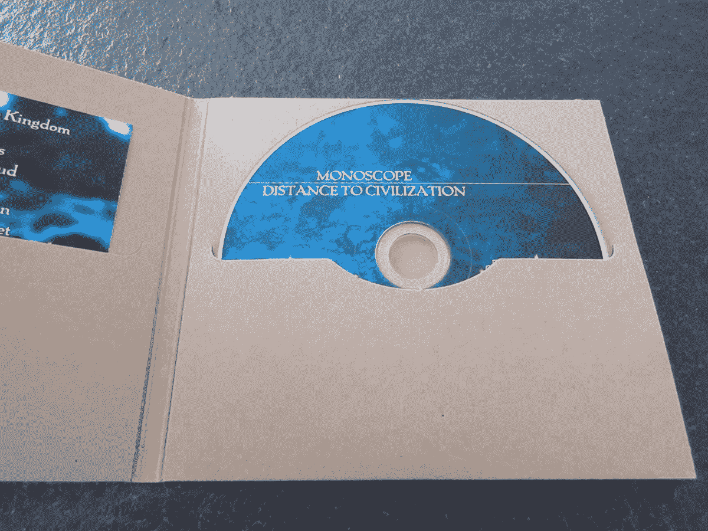

# 软件即服务——发展

> 原文：<https://medium.datadriveninvestor.com/software-as-a-service-the-evolution-868b350fe8d5?source=collection_archive---------15----------------------->

**互联网时代之前的软件**

追溯历史，软件最初是以软盘的形式出售的，从技术上来说，这是今天的孩子都知道的保存按钮。软件被加载到软盘上，当软盘被插入计算机时，加载的软件就像编写的程序，一旦运行，就可以进一步用于购买它们的目的。早期的航空公司管理系统使用这种用来存储数据的软盘。所有这些可以统称为，软件最初是以产品的形式销售出去的(准确地说是软盘)。虽然软件以产品的形式出现，但当软盘被光盘和 DVD 取代时，发生了一种变化，这种变化不能称之为一场革命。软件作为一种产品有一个特点，只有一个应用程序。

**互联网时代后的软件**

当软件作为产品的市场不得不经历巨大的衰落时，这可以被称为一场革命，因为人们开始直接从互联网上下载软件，而不是购买软件。尽管这是这一领域的一次巨大革命，但就软件而言，盗版相当简单，即使激活密钥出现了，因为软件作为产品需要时间来进行盗版过程，在此之前它们甚至有很好的市场。这恰好是最大的缺点，因为当竞争对手可以复制想法并增强它们，并在很短的时间内作为更好的产品发布时，编码变得很容易。

接下来是云计算时代，这使得过程更加简单，甚至不需要在计算机上安装软件。这有助于解决人们在安装等方面面临的许多问题。所有的工具如 word、excel 都可以在线使用，这使得它对每个人都很友好，因为只需要注册。所有的硬盘和计算机都可以在线使用。云计算成为软件即服务的起点。

**云的优势:**

1.  云的最大优势是销售因素，盗版和复制粘贴不能像从互联网下载软件那样进行。所有这些都无法完成，因为需要进行身份验证。
2.  这比以前的版本更加用户友好。
3.  一旦进行了更新，就不需要每次都更新软件。当软件工程师做出改变并推动它们时，每个使用云的人都可以很容易地看到这些改变。
4.  即使在很短的时间内，用户也可以获得许多更新。
5.  它提供了 30 天免费试用的优势，使人们能够在真正购买之前试用它们。取消也很容易。
6.  人们只需为他们使用的东西付费，而不是为他们使用云的时间付费。

早期打字机的使用被 word 取代，手工记账过程被 excel 取代。一旦云进入画面，甚至有更高级版本的 word 和 excel，这使得人们的工作流程更加简单。

**软件作为云航向何处？**

如今，社交媒体正成为公司与客户互动的工具。Instagram 正在成为客户关系管理的新工具。这使得过程更加简单，其中不需要维护客户数据库。相反，它变得更加令人兴奋，因为公司可以在社交媒体的帮助下直接与客户互动。大多数致力于软件即服务的公司如今都转向了社交媒体分析和整合。

未来正朝着一个新的范式发展，人们通过社交媒体、团体和社区成为公司的一部分，这一变化有望受到世界的欢迎。