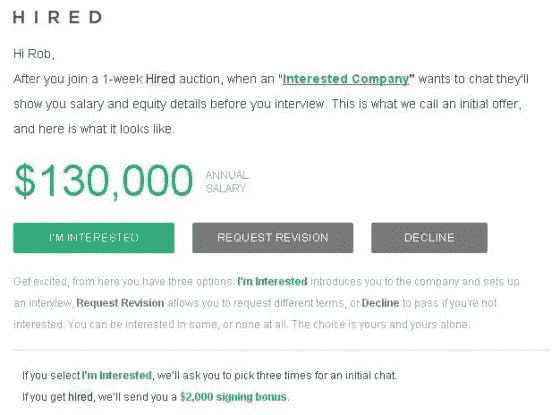
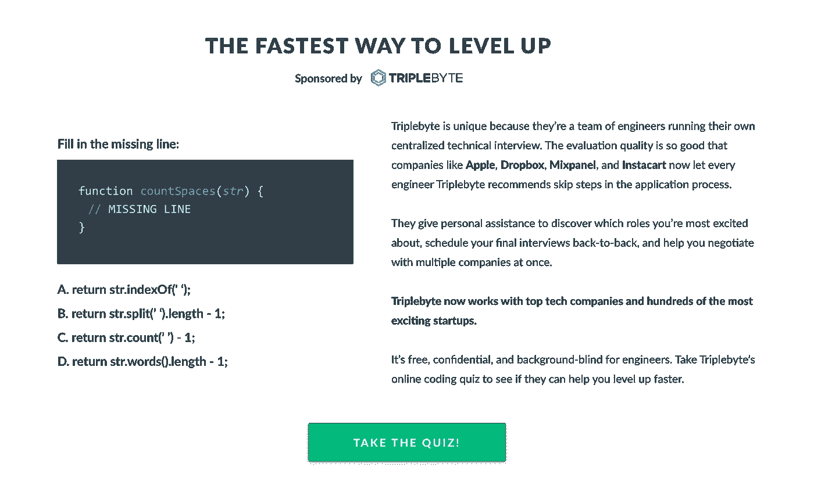

# 软件开发人员通过 Triplebyte 和 Hired.com 这样的平台跳过海峡去现场面试

> 原文：<https://medium.datadriveninvestor.com/software-developers-are-skipping-strait-to-the-onsite-interview-through-platforms-like-triplebyte-2ce9855c454f?source=collection_archive---------2----------------------->

***听起来像做梦。注册一个平台，展示你的技能，然后迅速进入会议室参加面试。不要跟踪 35 封后续邮件，不要写本周的第 20 封求职信，不要希望你在简历上使用的鲜红色字体和麝香味不会让人觉得你很绝望。***

# 但这是现实吗？

三年前，我报名参加了 Hired.com 的[和美国的](https://hired.com/x/1i3yb) [Triplebyte](https://triplebyte.com/iv/NHDFibe/cp) ，虽然当时我没有收到任何邀请，但总体来说，我有一个很好的体验，这些公司对有时令人心碎的过程的解决方案给我留下了深刻的印象。

本周，我做了一些调查，以了解使用这些平台并获得了闪亮新工作的开发人员有什么话要说。

但是，在我们深入了解他们的经验之前，让我们快速概述一下这是如何工作的，然后看看每个平台，并强调它们的差异和相似之处。

**方式** [**三字节**](https://triplebyte.com/iv/NHDFibe/cp)**[**雇佣**](https://hired.com/x/1i3yb) **赚钱是通过向公司收取每一个他们雇佣的候选人的费用。**这和标准招聘人员的工作方式一样。不同的是，这些平台投入了时间和金钱来了解如何将优秀的候选人与一般的候选人区分开来。作为一家公司，为优秀的候选人获得推荐可以节省大量的时间和金钱，所以他们很乐意付费。**

**有用吗？ [**三字节**](https://triplebyte.com/iv/NHDFibe/cp) **号称实现了 40%的现场成功率，大概是行业标准的两倍。这是一个重大进步。****

**开发人员很乐意，因为他们可以跳过农场联盟的电话采访，直接进入大时代:面对面的技术采访。至少，开发者在被钉住优秀的时候是开心的。**

****

**其他人可能最终会感到沮丧，比如帕特里克·奥达克雷，他在他的 [*博客*](https://www.codementor.io/patrickwho/my-frustrating-experience-with-hired-com-9vyuxxs2m) *中问道，“我真的很差劲吗，或者这只是另一个雇佣开发人员的糟糕方式的例子？”。***

**在我看来，目前这种集体喷洒并希望某些东西发芽的过程有如此大的改进空间，以至于对上述问题的回答是一个简单的*“不，都不是。”***

**招聘过程从来都不是完美的，甚至很少是公平的。**首先，创建一个既不会让糟糕的候选人挤过，也不会淘汰潜在优秀候选人的流程绝非易事。我很清楚，这些平台必须倾向于后者，以取悦他们的付费客户，即招聘公司。**这意味着绝对有一些优秀的程序员被平台的流程拒绝了。当然，传统的招聘流程也好不到哪里去。大多数读到这篇文章的人可能已经被一份他们非常擅长的工作拒绝了。**

**当然，这是一种公平。做人就是要有偏见，而这些偏见，无论多小，只要有可能，追踪和消除都是很重要的。尤其是面对不同年龄、背景和文化的人时。在我看来，在这一领域实现公平的关键是透明度。在我们进入每个平台之前，我想分享一下我对这两个平台的主要批评是它们过程的不透明性。你有一个让人人见人爱的奇特新方法吗？太好了！我被排除在外了(或者三年前是)？好的。但是*请告诉我为什么*。**

****

**也就是说，**作为一个更有经验、脸皮更厚的开发人员，以及一个总是在我的收件箱里收到报价的人的自信，缺乏透明度并不是一个障碍。不幸的是，这是大多数科技公司的运作方式。试着让 Instagram 解释一下为什么你的图片会被撤下，或者为什么只有一小部分粉丝会看到你的帖子。不会发生的。与传统方法相同。雇主没有必要告诉你他们为什么没有雇用你，就像他们没有必要告诉你首席执行官最喜欢的乡村歌曲一样。****

**我跑题了。人们想找工作，他们希望工作更容易。这些平台提供的机会比传统的“发送并祈祷”方式更好。让我们开始吃吧。**

# **雇用**

****

> **"[雇佣](https://hired.com/x/1i3yb)是一个将技术人才与世界上最具创新性的公司相匹配的市场。我们将智能工作匹配与公正的职业咨询相结合，帮助人们找到他们热爱的工作。目前专注于全球 14 个市场的软件工程师、设计师、产品经理和数据科学家--并迅速扩张(和招聘！)."——来自 Hired.com 的[的 LinkedIn 个人资料](https://hired.com/x/1i3yb)**

## **流程:**

**在 Hired.com 的，**网站上，你首先创建一个个人资料**，就像你在 LinkedIn 上做的一样。这需要几个小时才能恢复正常。然后，*如果你是合意的*，你将开始收到面试邀请。你可以接受你想要的工作机会，如果你通过了面试，你可能会被其中一家公司录用。**

**一旦被录用，你会从 Hired.com 那里得到一份丰厚的签约奖金以及一瓶非常棒的香槟！相当甜蜜！如果成功的话。**

**问题是，它不可能对每个人都有效。刚报名的时候，很沮丧。我花了几个小时来建立我的个人资料，但一无所获。为什么？我只是没有足够的经验。这不是被雇佣者的错，尽管我要说一件事——如果他们更清楚谁在他们的平台上被雇佣(即不是小开发者),这会节省我一些时间。但事情就是这样。**

**据我所知，对于正确体验的人来说，这个过程是美好的。仅仅是需要像你这样的人的公司邀请你去面试这个事实就令人惊讶。**

****

## **优点:**

**-出色的签约奖金
-简单明了的流程**

## **缺点:**

**-对小开发者来说不太好
-有限的地理区域
-缺乏透明度**

# **三字节**

> **“我们正在建立一个招聘工程师的新流程，该流程注重能力，而非资历。你可以在这里阅读更多我们的想法[，在这里](http://blog.triplebyte.com/)阅读我们的招聘宣言[——来自](https://triplebyte.com/manifesto) [Triplebyte 的](https://triplebyte.com/iv/NHDFibe/cp) LinkedIn 个人资料**

## **流程:**

**在[三字节](https://triplebyte.com/iv/NHDFibe/cp)中，它的工作方式有点不同。没有必要再创建另一个社交媒体档案了。**

****

**注册后，系统会提示您参加一个小测验。辛苦了！但是一个中级以上的程序员应该可以在谷歌的帮助下找到答案。**

****接下来，是对** [**三字节**](https://triplebyte.com/iv/NHDFibe/cp) **的技术采访。**[triebyte](https://triplebyte.com/iv/NHDFibe/cp)已经聘请了一些顶尖的人才面试官把你逼到角落里，拷问你，看看你是什么做的。恐吓？是的。方便吗？OMG 是的。你这样做一次，然后 Triplebyte 就会很好地意识到你有资格做什么。他们让公司知道你有多坏，这些公司会倾听。为什么？**

> **“我们实现了 40%的现场成功率，大约是行业标准的两倍。”—三字节**

**面试人贵！公司需要从他们正在从事的工作中抽调一些顶尖人才来评估候选人是否会成为主要的资产或负债。**

**外包这一重要步骤可以节省每个人的时间，并为公司节省大量资金。**

**如果你做到了这一步，你可以直接去面试公司。**

****

## **优点:**

**-跳过耗时的档案构建
-以 Triplebyte 的大力支持开始你的第一次公司面试**

## **缺点:**

**-地理区域有限
-缺乏透明度**

# ****哪个好？****

**根据我对这个过程的有限经验，其中不包括找工作，我发现 Triplebyte 有一个更创新、更合理和更精简的解决方案。但是让我们听听那些找到工作的人，以及他们是如何描述他们的经历的。**

## **Hired.com**

****罗科·巴尔萨莫**，通过[录用](https://hired.com/x/1i3yb)得到了一份工作，是本帖“酷名奖”的现任得主，他在博文[中描述了自己与 Hired.com](https://www.tintup.com/blog/getting-hired-with-hired-com/)一起被录用的经历**

> **我还需要选择要求的基本工资。这很棘手。我想要一个足够低的数字来获得一堆咬，但又足够高的数字，我不会因为我的教育、经验和努力工作而亏待自己。所以根据我多年的经验，我选择了一个比市场价格高一点的价格。**
> 
> **从那以后，事情进展得很快。我在一个星期四完成了个人资料，我在一个星期五被网站接受，并且在星期一早上有了我的第一个"提议"。**
> 
> **我很享受在 Hired.com 的经历。这没花我什么钱，我也避免了很多招聘人员打来的电话。我听说了一大堆寻求帮助的公司，否则我是找不到的。活跃的市场让我只能听到那些积极寻求招聘的雇主。**

****UX 设计师 Julia Xiu 在 Quora 上写道:****

> **我刚刚接受了[雇佣的](https://hired.com/x/1i3yb)给我的一份很好的工作。过程很顺利，很棒。这是一个比我自己找的其他报价更好的报价。这是我收到的两份很好的工作邀请，而这份是全垒打。**
> 
> **如果你住在旧金山湾区或纽约市，是一名开发人员、设计师或产品经理，并且想为一家初创公司工作，那么雇佣是很好的选择。**

## **[三字节](https://triplebyte.com/iv/NHDFibe/cp):**

**黑客新闻上的用户 **dmatteo** 说:**

> **大约 2 个月前我经历了这个过程，我真的很享受。
> 在最初的测验后，我与一个人进行了约 2 小时的面谈，其中包括 1 小时的“结对编程”挑战、我所在领域的随机技术问题、一般 CS 问题和体系结构(系统设计)类型的问题。**
> 
> **一旦我通过了这一步，我的人才经理(帮助促进与公司讨论的人)告诉我 IIRC，大约五分之一的人通过了人力测试。**
> 
> **根据我的技能和偏好，系统“提供”了大约 30 家公司，我选择了其中的 10 家进行介绍。每个公司都有一些背景信息，他们擅长什么(根据 TripleByte 的观点)，他们的总体规模和工程规模。一些公司(较大的公司)在现场之前有额外的步骤，比如另一个结对编程会议或带回家的练习。**
> 
> **通过这些电话，我们进行了 5 次现场面试，其中 4 次最终获得了聘用。此外，TripleByte 还在同一周内帮助安排了所有的现场工作，因此，如果你住在偏远地区，你就不必总是飞来飞去。**
> 
> **国际海事组织，顶级服务。**

****

# **摘要**

**如果你在网上看看，人们似乎对 Hired.com 和 T2 又爱又恨，这取决于他们是否成功！问题是，我们都知道旧的求职方式需要改进。虽然这两个平台都不适合所有人，这可能会令人沮丧，但它们都可以很好地让优秀的人获得好的职位——这就是本文的全部内容。**

**我个人可能会在下一次寻找全职开发工作时使用这两个平台中的一个或两个。我首先会考虑利用我的职业关系网，因为归根结底，没有什么比你的同事告诉他们的招聘经理你很棒更好的了。除此之外，还有 Hired.com 和 Triplebyte。**

****祝各位搜索顺利！****

*****如果你对职业教练、生活教练或一对一的技术指导感兴趣，请直接发邮件给我，他曾在 Dev Bootcamp 和 General Assembly 等地教授过 100 多名开发人员全栈编码，现在正全职周游世界*****

## **想了解更多关于成为数字流浪者的信息吗？**

**查看我关于旅行时使用 Paypal 和 Venmo 的文章[和关于使用 Google Fi 作为数字流浪者的文章](https://medium.com/datadriveninvestor/venmo-vs-paypal-which-is-better-for-digital-nomads-75e75ecd1cdc?source=your_stories_page---------------------------)。**

**我也可以一对一地指导你如何成为数字游牧者。给我发电子邮件，地址是[alexwhite5d@gmail.com](mailto:alexwhite5d@gmail.com)。我还为那些想要重新找回精神的人，以及那些想要走出自己的路，开始实现梦想的人提供生活指导。**

## **喜欢这篇文章吗？**

**查看我的[迄今为止最受欢迎的帖子](https://medium.com/datadriveninvestor/i-used-acorns-robinhood-and-stash-for-2-years-this-is-what-i-learned-and-earned-21baf91dda0e?source=your_stories_page---------------------------)，关于用投资应用 Stash、Acorns 和 Robinhood 投资 2 年。**

## **想了解我的旅行吗？**

**在 [Instagram](https://www.instagram.com/alexwhite5d/) 上查看我**

****

**This could be you! The life you dream of eagerly awaits you. Email me at alexwhite5d@gmail.com for help getting there.**

# **DDI 特色数据科学课程:**

*   **[**用于数据科学的 Python**](http://go.datadriveninvestor.com/intro-python/mb)**
*   **[**深度学习**](http://go.datadriveninvestor.com/deeplearningpython/mb)**
*   **[**数据可视化**](http://go.datadriveninvestor.com/datavisualization/mb)**

****DDI 可能会从这些链接中收取会员佣金。我们感谢你一直以来的支持。***