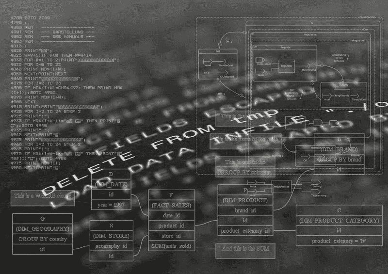

# 软件是一种价值投资，因为甲骨文赚了很多钱——市场疯人院

> 原文：<https://medium.datadriveninvestor.com/software-is-a-value-investment-because-oracle-makes-lots-of-money-market-mad-house-1cb66e68ddf6?source=collection_archive---------16----------------------->

我认为软件是一项价值投资，因为甲骨文赚了很多钱。具体来说，甲骨文在 2019 年 2 月 28 日的收入为 96.14 亿美元，毛利润为 76.38 亿美元。

此外，甲骨文(纽约证券交易所代码:ORCL) 报告称，在收入增长率下降 0.64%的季度，毛利率为 79.45%。具体来说，Stockrow [给予](https://stockrow.com/ORCL)甲骨文 2019 年 2 月 28 日的毛利率为 79.45%，收入增长率为-0.64%。

 [## 算法交易的机器学习-数据驱动的投资者

### 当你的一个朋友在脸书上传你的新海滩照，平台建议给你的脸加上标签，这是…

www.datadriveninvestor.com](https://www.datadriveninvestor.com/2019/01/30/machine-learning-for-stock-market-investing/) 

因此，我估计甲骨文在截至 2019 年 2 月的季度花费了 20.45₵制造 79.45₵。很能说明问题的是，Stockrow 估计甲骨文上个季度的收入成本为 19.75 亿美元。

最后，甲骨文在截至 2019 年 2 月的季度中，营业收入为 33.99 亿美元，净收入为 27.45 亿美元。尽管收入增长下降，甲骨文还是赚了很多钱。

# 甲骨文赚了多少钱？

我认为**甲骨文公司**是一项价值投资，因为它能产生大量现金。

例如，甲骨文记录了 131.99 亿美元的投资现金流；2019 年 2 月 28 日运营现金流 28.61 亿美元，自由现金流 24.18 亿美元。这些现金流使甲骨文在同一天积累了 147.2 亿美元的现金和等价物，以及 253.10 亿美元的短期投资。

因此，截至 2 月底，甲骨文拥有 400.3 亿美元的流动资产。因此，甲骨文的现金证明软件是一种价值投资，因为软件供应商可以产生高现金流，积累银行账户。如果你喜欢现金，你应该喜欢甲骨文。

# 甲骨文是一项廉价的价值投资

最重要的是，甲骨文现在非常便宜。事实上，尽管有现金，甲骨文股价在 2019 年 5 月 29 日仍为 51.62 美元。

在我看来，低价格使甲骨文成为经典的价值投资，因为它证明了市场先生并不欣赏这家公司。我的猜测是投资者不了解甲骨文的产品，财务软件；即使他们或他们的雇主可能会使用并支付费用。

此外，甲骨文不是一家性感的公司，因为它为银行制作软件，而不是杀手级应用、社交媒体应用、虚拟现实或视频游戏。因此，甲骨文没有什么魅力，也没有什么令人惊叹的因素。对于西装革履、在办公室工作的人来说，软件是有利可图的，但并不有利可图。

另一方面，许多投资者会欣赏甲骨文没有戏剧性。甲骨文公司最有争议的事情是首席执行官拉里·埃里森的游艇的长度。显然，一家公司可能会遇到更糟糕的问题。

# 甲骨文有很多价值

此外，甲骨文拥有并运营着一个大多数人从未见过的庞大生态系统。庞大的生态系统给甲骨文带来了巨大的价值，市场先生看不到。

值得注意的是，甲骨文声称在 2018 年在 175 个国家拥有 43 万客户和 2.5 万合作伙伴。有趣的是，Oracle 估计其产品支持 128 个国家的 630 多万学生。

此外，甲骨文声称在全球拥有超过 18，000 项专利。更重要的是，Oracle 估计它在 92 个国家的 484 个独立开发社区中拥有超过 100 万的成员。除此之外，您还可以添加 Oracle 开发社区中大约 500 万的成员。

除此之外，全球有 137，000 名员工和 25，000 个合作伙伴支持甲骨文的网络。具体而言，这些员工包括:38000 名开发人员和工程师。来源:*甲骨文概况介绍*。

# 甲骨文如何赚钱

甲骨文通过向使用其[云基础设施](https://www.oracle.com/cloud/infrastructure.html)和[甲骨文自主数据库](https://www.oracle.com/database/autonomous-database.html)等应用的客户收费来赚钱。

例如，一个自治的数据库理论上可以在没有人工监督的情况下进行自我管理。通过使用自治数据库，您可以存储来自政府项目或银行贷款项目的记录，而无需大量的文书人员。

这种数据库为甲骨文带来收入，因为客户需要支付年费或月租费才能使用。因此，甲骨文的许多解决方案产生了沃伦·巴菲特喜欢称之为[的浮动](https://www.omaha.com/money/buffett/where-does-warren-buffett-get-his-money-simply-from-the/article_ac9776a0-98e9-56cd-b7a5-d56f351a12ed.html)。

# Oracle 如何生成浮点

浮存金是公司可以无条件利用的持续收入流。例如，巴菲特最喜欢举的例子是保险费。

软件能产生浮点是因为；像保险一样，它是客户不断需要的产品。此外，用户需要定期支付许可费；或订阅，以合法使用软件。

软件供应商，像 [**微软**](https://medium.com/datadriveninvestor/is-microsoft-the-best-value-in-tech-market-mad-house-643a4b791636) **(纳斯达克:MSFT)** 、甲骨文、 [**Salesforce**](https://marketmadhouse.com/is-salesforce-crm-making-money/) **(纽约证券交易所:CRM)** 通过销售应用程序和其他解决方案的组织和个人来赚钱。理想情况下，软件供应商将收取这些应用程序的月订阅费或额外费用，这将导致浮动。

App 投资者应该寻找必须使用的应用；收取月费或年费。从战略上讲，甲骨文的[平台](https://oracle.apacciooutlook.com/vendors/25-most-promising-oracle-solutions-providers-rid-14.html)为企业提供了许多潜在的必备解决方案。

# 甲骨文是一只很好的分红股票

丰厚的股息是甲骨文众多好处中的最后一项。ORCL 于 2019 年 4 月 25 日支付 24₵股息。吸引人的是，5₵在 2019 年增加了股息，高于 2019 年 1 月 30 日支付的 19₵。

2019 年 5 月 29 日，甲骨文股东的股息收益率为 1.86%，年化 96₵派息率为 31.3%。我认为这样的数字让甲骨文成为一只可靠的收益股。

那些寻找安全可靠赚钱的科技股的人需要研究一下甲骨文。金融软件和数据库管理并不性感，但甲骨文证明了这类应用可以非常有利可图。

*原载于 2019 年 5 月 30 日*[*https://marketmadhouse.com*](https://marketmadhouse.com/software-is-a-value-investment-because-oracle-makes-lots-of-money/)*。*