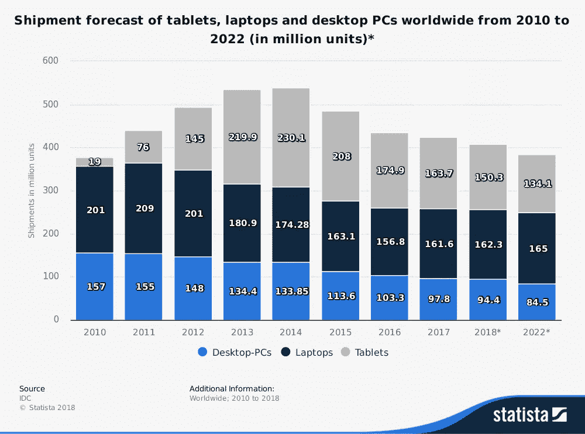
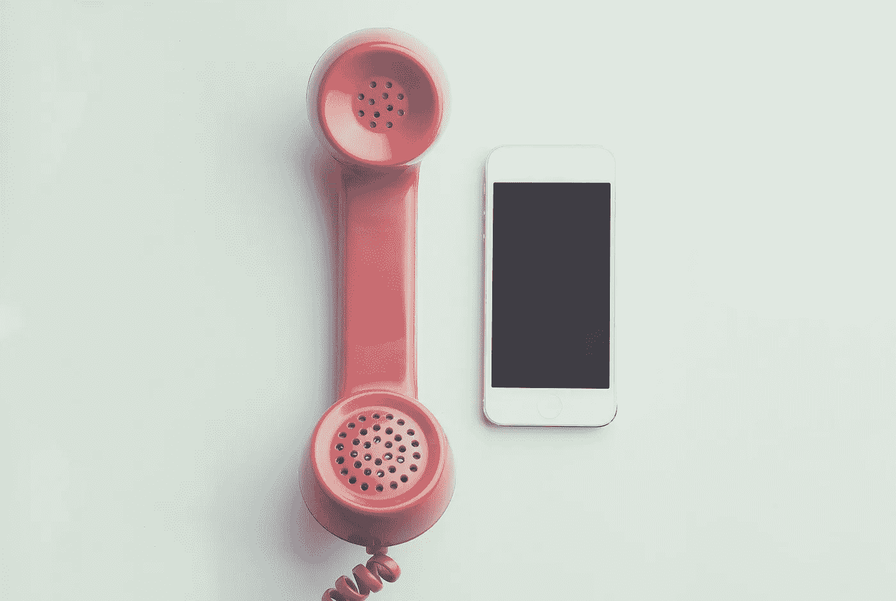

# 软件与硬件

> 原文：<https://medium.datadriveninvestor.com/software-s-hardware-d127f6150f52?source=collection_archive---------10----------------------->

## 电脑和智能手机的区别

随着年底的到来，我们发布了 Note 9，随后是 iPhone XS/XS Max/XR 和 Pixel 3/3XL，这只是其中的几个例子。看看[亚马逊](https://www.amazon.com/b?_encoding=UTF8&tag=eugeneteoyuji-20&linkCode=ur2&linkId=d681d888928487641147359b02447d66&camp=1789&creative=9325&node=7072561011)上的顶级智能手机，都是那么的相似。可能是一个高通足球，每部智能手机都运行 Android，除非是 iPhone，但如何在每次发布新手机时都有一个大的基调？看看电脑，除了微软的事件，几乎没有关于一款新笔记本电脑的炒作。为什么会这样呢？

# 五金器具

Photo by [Fancycrave.com](https://www.pexels.com/@fancycrave) from [Pexels](https://www.pexels.com/photo/green-ram-card-collection-825262/)

主流手机已经很久没有可拆卸部件了，甚至连电池都没有。笔记本电脑现在也越来越难维修，更不用说升级了。通常只有 Wi-Fi 卡，可能存储和内存是可替换的，其他部分是焊接或粘合的，基本上不可能替换。随着设备的大部分内部部件被锁定，对新硬件发布的兴趣越来越少，因为它通常对最终用户没有任何意义。当第九代英特尔芯片或锐龙 3 芯片问世时，我们在升级笔记本电脑方面无能为力，只能等到笔记本电脑制造商发布采用新芯片的设备。

对于智能手机，硬件似乎起着较小的作用，因为大多数应用程序都设计为在广泛的设备上工作，因此更好的 SoC 在很大程度上只会使手机体验更流畅。在 PC 上，有各种各样的游戏，每个游戏都有不同的图形设置，只有更好的硬件才能运行，这使得更好的 CPU 和 GPU 实际上是有趣和可取的。此外，随着 AMD 越来越突出，并对英特尔和英伟达构成竞争，有一个关于锐龙与英特尔酷睿处理器或 Vega 与 GTX 的实际辩论。虽然笔记本电脑大多是英特尔与英伟达，也有*选项*。

虽然台式机硬件肯定更有趣，更容易更换，但台式机的销量每年都在下降，笔记本电脑的销量现在是台式机销量的两倍。因此，我们将把它主要放在笔记本电脑和智能手机上。

# 软件

虽然智能手机和笔记本电脑的 Android 和 iOS 的比例相似，分别为 80%以上和 10%以上，Windows 和 10%以上的 MacOS，但这两类设备之间的软件差异很大。

在过去 30 年左右的时间里，Windows 一直是占主导地位的个人电脑操作系统，唯一的重要竞争对手是 MacOS。Windows 是一个封闭的系统，由微软在不同的 OEM 设备上维护和更新。虽然 OEM 可能会将某些应用程序与他们的笔记本电脑捆绑在一起，但在大多数情况下，无论您购买哪种笔记本电脑，您都会获得相同的 Windows 10 体验。MacOS 仅限于苹果电脑，选择 MacOS 只会给你留下苹果提供的几个 Mac 选项。

由于这些操作系统已经存在了很长时间，实际上不存在只有一个操作系统才能完成的专有功能。有些特定的程序只能在 Windows 或 MacOS 上运行，有些程序在特定的操作系统上运行得更好，但更多的是从众多备选程序中找到适合您和您的操作系统的程序，而不是选择适合您使用情况的操作系统。

How far phones have come. Photo by [it’s me neosiam](https://www.pexels.com/@neo8iam) from [Pexels](https://www.pexels.com/photo/apple-device-cellphone-communication-device-594452/)

在智能手机上，虽然大多数智能手机都运行在 Android 上，但 Android 的开源特性和启动器的使用使每个 Android 体验都不同。虽然许多在线评论者喜欢“普通安卓”，但三星等原始设备制造商投入大量精力来添加功能和特性，使他们的三星设备独一无二，令人满意。Gear VR 和三星 Dex 是最近的 Galaxy 手机才有的功能，而谷歌的 Pixel 手机享受着谷歌最快的更新，就像谷歌助手和 Android Pie 首先击中 Pixel 手机一样。不同的安卓手机有不同的软件功能。

虽然 iOS 是智能手机类别的先驱，但就市场份额而言，它已被 Android 取代，因为 iOS 仅限于苹果手机。作为价格昂贵的手机和发展迅速的安卓系统，iOS 只占有大约 10%的市场份额。尽管如此，与 MacOS 相比，iOS 在智能手机市场上是一个大玩家，这可能是由于 Android 的碎片化与 Windows 的统一性相比。iOS 往往会引领潮流，引领下一个“主流”。许多人可以很快指出已经在 Android 上存在多年的功能，因为 iOS 将它作为一个全新的功能引入，然而很少有人可以争论 iOS 最终引入这些功能时的影响。

虽然也可以认为每部手机都可以实现任何手机可以实现的相同功能，但在许多功能被锁定到特定设备的手机之间存在更多差异。这使得新手机的发布令人兴奋，备受期待，因为它们通常伴随着只有在购买设备时才能体验到的新功能。

# 结论

尽管每部新手机都令人兴奋，但它们的价格已经超过了笔记本电脑的价格。在这一点上，手机无处不在，而笔记本电脑通常是为了工作或上学而购买的。对手机的大肆宣传和需求使得市场竞争更加激烈，因此也更加令人兴奋，而 PC 市场已经放缓，许多我们曾经需要 PC 的事情现在可以在旅途中用手机轻松完成。我们需要更多的竞争来使个人电脑市场变得有趣，并对我们消费者有利。虽然竞争的程度可能永远不会达到智能手机今天面临的水平，但任何增加都会给我们带来更多的选择和更多的创新。支持像微软在 Surface 系列上所做的创新，但也批评他们在 2018 年 10 月更新灾难这样的错误上。在做出选择之前，考虑一下像 MacOS 和 ChromeOS 这样的竞争，而不是把它们扔到一边。

由于最近欧盟因反竞争行为对谷歌处以罚款，原始设备制造商可能会开始使用 Android 的分叉，与启动器相比，这给了他们更多的灵活性。对谷歌来说是坏消息，但对我们来说可能是好消息，因为谷歌现在可能需要更努力地让原始设备制造商继续使用谷歌的 Android 和他们的应用捆绑包，其他制造商可能会开发单独的 Android 分支，甚至可能超过谷歌。我期待着有一天微软、谷歌和苹果面临更激烈的竞争，我们可以坐下来选择。

如果你有兴趣购买，请记住这一切，并为自己做出选择。使用我的亚马逊链接购买[手机](https://www.amazon.com/b?_encoding=UTF8&tag=eugeneteoyuji-20&linkCode=ur2&linkId=735994d50c5d6f0ec5171c0e4f741bf1&camp=1789&creative=9325&node=7072561011)和[电脑](https://www.amazon.com/b?_encoding=UTF8&tag=eugeneteoyuji-20&linkCode=ur2&linkId=ac200a03bd4a685c325e9778edc670c8&camp=1789&creative=9325&node=565108)，免费支持我和我的博客！