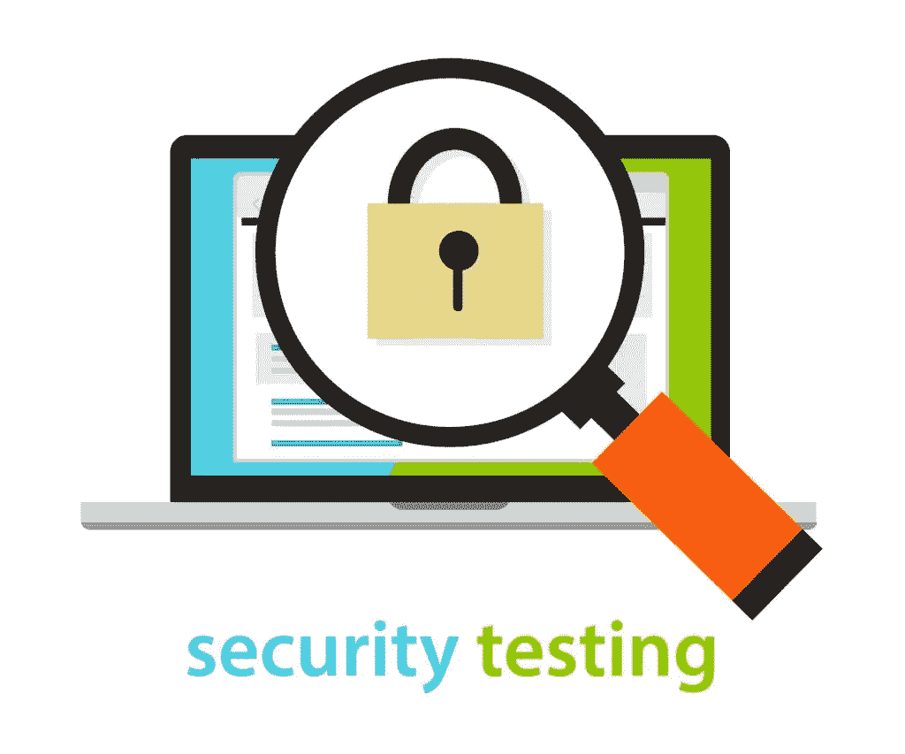

# 软件安全测试:类型、技术和标准

> 原文：<https://medium.datadriveninvestor.com/software-security-testing-types-techniques-and-standards-33582d3ef74d?source=collection_archive---------3----------------------->

当你创建一个新的软件产品时，你首先要考虑的是它的安全性。您必须确保黑客、病毒、恶意软件和其他网络威胁无法通过窃取用户数据造成严重破坏，这可能会导致巨额罚款和名誉损失。为了避免所有这些问题，安全测试是必要的，以便发现可能被利用的潜在漏洞。在我们进入所有不同的类型和方法之前，让我们先来定义一下什么是安全性测试。

# 安全测试基础

安全测试是一个宽泛的术语，包括识别威胁、风险或任何其他可能导致重大损失的漏洞的所有可能方法。此外，软件测试必须能够识别检测到的问题的严重性，并提供关于潜在后果的详细信息。这包括找出安全漏洞是如何被利用的，用户面临的潜在风险，以及系统在遭到破坏时是否能继续运行。安全测试有很多种类型，每一种都有自己的方法。让我们仔细看看。

 [## 数据科学和软件工程哪个更有前途？-数据驱动型投资者

### 大约一个月前，当我坐在咖啡馆里为一个客户开发网站时，我发现了这个女人…

www.datadriveninvestor.com](https://www.datadriveninvestor.com/2019/01/23/which-is-more-promising-data-science-or-software-engineering/) 

# 不同类型的安全测试

使用了七种主要类型的安全测试:

*   漏洞扫描—自动化软件将进行扫描，以发现任何潜在的安全缺陷。
*   安全扫描—发现系统和网络安全弱点，并提供降低风险的可行步骤。该测试可以是手动的，也可以是自动的。
*   渗透测试——模拟黑客的攻击。这包括分析特定系统以确定可能被黑客利用的地方。
*   风险评估—分析企业内部已经注意到的安全风险。风险的严重性分为低、中或高。
*   安全审计—对应用程序和操作系统进行内部审计，以发现可能的安全漏洞。这是通过逐行检查代码并发现任何可疑之处来完成的。
*   道德黑客——入侵公司的软件系统。
*   态势评估—这是道德黑客、安全扫描和风险评估的组合，用于确定公司的整体安全定位。

# 安全测试方法

谈到安全性测试，有三种主要的方法:

**黑盒测试**——这涉及到软件测试人员把自己放在黑客的位置上，试图通过各种方法攻破应用程序。从这种类型的测试中可以获得许多有用的信息，以更好地保护软件免受外部威胁。

**动态测试** —软件测试人员审计一个正在运行的应用程序，找出它对各种输入的反应。这有助于发现您是否符合当前的法规。

**静态测试** —这种方法通过自动化的解决方案审查源代码。虽然自动化测试过程将减少进行测试所需的时间，但它可能无法注意到动态测试能够识别的复杂威胁。因此，最好使用静态补体测试和动态补体测试。

当[为商业客户](https://skywell.software/)开发软件时，最好结合使用这些方法来确保敏感信息的安全。

# 软件测试中涉及的步骤

*   要求—检查任何误用和滥用案例，并分析安全要求
*   设计—提出一个测试计划，其中包括您计划进行的安全测试
*   编码和单元测试——进行静态和动态测试
*   集成测试—黑盒测试
*   系统测试—黑盒和漏洞扫描的结合
*   实施—渗透测试和漏洞扫描
*   支持—分析拼凑完成的影响

尽管所有不同类型的方法都有自己的安全测试技术，但它们都有一些共同的步骤:

# 测试的好处

如果您能够尽早发现可能的安全风险，这可能会节省大量成本。在开发阶段修复所有问题比使用补丁软件要便宜得多。一般来说，越早发现问题，解决问题的成本就越低。此外，安全漏洞可能导致用户信息被盗，从而导致罚款和损害您的声誉。尽管安全测试需要时间和金钱的投入，但从长远来看，您最终将会节省大量的金钱和头痛。

如果您的产品要求用户输入个人身份信息和财务数据，他们必须相信他们提供的一切都是安全的。否则，不管你的产品设计得有多好，或者它有多创新，用户都会对给出他们的信用卡号、电子邮件、地址和任何其他信息保持警惕。通过实施端到端的安全措施，您将能够避免许多公关问题和财务成本，甚至在它们开始之前。如今涌现出如此多的威胁，要跟上这些威胁是一项挑战。如果您一直觉得即使在测试完成后，特定的安全漏洞仍然存在，请考虑寻求外部测试服务，该服务可以提供最新的安全威胁。一旦你看到现代威胁是多么的发达和先进，你会很高兴你做了这个决定。

*最初发布于*[*https://sky well . software*](https://skywell.software/blog/software-security-testing-types-techniques-and-standards/)*。*