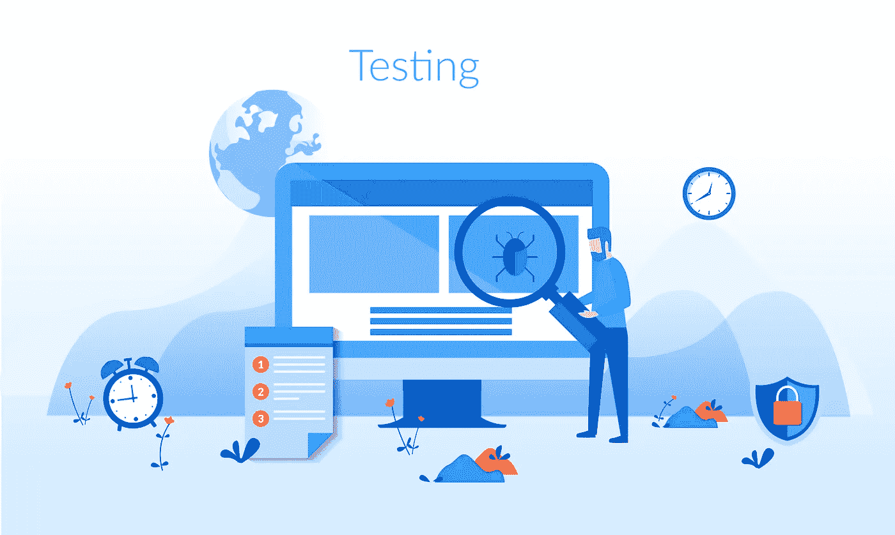

# 软件测试生命周期:类型和方法

> 原文：<https://medium.datadriveninvestor.com/software-testing-life-cycle-types-and-methodologies-4836a6b17762?source=collection_archive---------16----------------------->

我想你已经做出了产品的原型。尽管这是向用户交付产品的一大步，但是仍然有一个很大的障碍需要克服:软件测试。有许多类型的软件测试，但是你必须从一开始就做大量的尽职调查来推出高质量的产品。

为了帮助你踏上征程，我们提出了一些软件测试的类型和方法，让你顺利上路。但首先，让我们从基础开始。

# 什么是软件测试？

信不信由你，软件测试不仅仅是确保你的代码中没有错误或者所有的功能都正常工作。如果我们从大的方面来看，软件测试就是在你的产品上市之前，让潜在的投资者先睹为快。这将允许你获得资金来提供一个更好的产品，研究人员将获得一个投资下一个大项目的早期机会。

测试的基础相当简单。你必须确保一切:

1.  满足您最初计划的所有标准
2.  对各种输入做出必要的响应
3.  方便用户的
4.  可用于预期环境
5.  满足投资者的需求

为了确保您的软件包含上述标准，在测试时您有一些选择。让我们来看看其中的一些方法。

# 软件测试的类型

测试有很多种。在我们进入软件测试过程中的具体细节之前，这里有一个各种类型测试的概述。

**功能测试**——无论何时你在开发软件，你都有一套必须满足的需求。这些需求中的每一个都指定了这个软件必须执行的特定功能，以符合最初的计划。因此，这些功能中的每一项都必须经过彻底的测试，以防止在推广过程中出现任何故障。

**非功能性测试**——相反，如果在上一节我们谈到了功能性测试，这里我们将检查一个系统是如何运行的。术语“性能”是非常宽泛的，可以包括许多需求。

单元测试——通过单元测试，你试图确定一个单独的代码方面是否正常运行。有些功能需要反复测试，以确保即使在预期的环境条件之外也能正常工作。尽管这种方法本身不能确认整个产品的功能，但它被用来确保组成整个产品的各个部分相互独立地工作。

**集成测试** —这种方法的伟大之处在于它暴露了接口中的许多缺陷，以及集成组件如何相互协作的可能故障。在整体设计中起关键作用的大块被集成和测试，直到整个产品作为一个大的生态系统运行。

**系统测试** —一旦一切完成，就该测试集成软件了。这里，您需要做最后一次检查，以确认符合所有的要求。

请记住，这些只是软件测试的一些类型。虽然存在许多其他的，让我们继续测试过程本身。

# 软件测试方法

下面是关于如何测试软件的两种主要方法。第一种方法是传统的瀑布法。在瀑布环境中，测试是由完全不同的一组测试人员执行的，并且通常在功能开发完成后立即执行，并且通常作为一个安全毯来弥补各种项目延迟。话虽如此，在瀑布环境中，单元测试总是由开发人员执行，即使其他测试将由专门指派的测试人员完成。

然后是敏捷，软件工程师在编写单元测试时知道他们一开始会失败。在每个后续失败的测试之后，软件工程师编写最少的代码来获得及格分数，因此确保测试套件总是随着新的失败条件和极限情况的出现而更新。您可能想知道:为什么首先要进行这样的测试？从表面上看，它们似乎是对时间和金钱的巨大浪费，但是，如果我们看得更远，我们会看到最终的目标:持续集成。

# 软件测试生命周期

以下是通常的顺序:

1.  首先，你需要分析需求。在这里，您可以确定哪些方面可以测试，以及用什么参数来测试。
2.  然后你需要计划测试。规划是至关重要的，因为许多活动将同时进行。
3.  然后，您将准备程序、场景和案例
4.  现在您已经准备好实际执行测试了
5.  测试完成后，您需要生成一些指标并提供最终报告
6.  分析报告
7.  如果发现了缺陷，就需要进行额外的测试
8.  回归测试
9.  测试结束

尽管上面提到的软件测试过程看起来很复杂，但大多数定制软件开发服务会执行大量的测试，以保证按时按预算完成工作。测试可以让你安心，因为你知道当你的产品被推出时，它至少有能力马上起飞。随便问一个企业家，他们都会告诉你，没有什么比搞砸产品发布会更糟糕的了，因此，软件测试的重要性怎么强调都不为过。

*最初发表于*[*sky well . software*](https://skywell.software/blog/software-testing-life-cycle-types-and-methodologies/)*。*