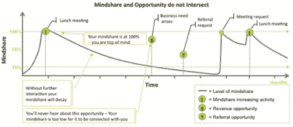
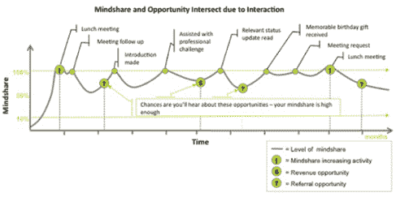

# 使用这个鲜为人知的商业策略，立即巩固你的商业网络

> 原文：<https://medium.datadriveninvestor.com/solidify-your-business-network-immediately-using-this-little-known-business-strategy-546a2b81abdf?source=collection_archive---------24----------------------->

早在“那一天”，专家们就吹捧“[吉拉德 250](https://www.synnovatia.com/business-coaching-blog/play-nice-with-your-small-business-network-to-net-new-clients) 定律”在创建和培育你的商业网络中发挥了重要作用。这是基于一个非科学的理论，即参加葬礼或婚礼的平均人数是 250 人。根据这一概念，假设个人职业网络的平均规模为 250 人。而且，从网络的规模来看，一个成功的、成长中的企业可能会启动。

当然，这是在谷歌出现之前。没有简单的方法来验证它的有效性。就像儿时的“电话”游戏一样，它被一代又一代的销售专业人士视为业务发展的试金石——平均与 250 人发展关系，确保你的成功。就这么简单。我们盲目地跟随它，用它来指导我们的关系营销。

[魔鬼成交之乔·吉拉德的 76 条黄金法则](https://www.joegirard.com/biography/)，被吉尼斯世界纪录确认为世界上最伟大的头号零售推销员，在他的[商业战略](https://www.synnovatia.com/businesscoachingblog)和[发展你的商业网络](https://www.synnovatia.com/business-coaching-blog/bid/129917/4-Must-Do-s-for-Entrepreneurs-to-Achieve-a-Networking-ROI)中并不是只有他一个人。

人类学家、进化心理学家罗宾·邓巴博士指出，个人社交圈的平均规模是 150 人。另一方面，皮尤研究中心将美国网络的平均规模记录为 634 个连接。

不管一个人的人际网络的平均规模如何，培养你的人际网络是关键——尤其是在获取和留住客户的时候。

# 关系:商业成功的关键

众所周知，5X 获得一个新客户比维持和留住一个现有或以前的客户成本更高。此外，在留住客户上增加 2%的支出将减少多达 10%的营销成本。对于一个囊中羞涩的小企业来说，这些数字令人印象深刻！

对于大多数小企业主来说，与我们的客户和潜在客户建立更有吸引力的关系非常重要。在交易之外与我们的客户建立联系是小企业所有权的一个有价值的——也是非常令人满意的——方面。

随着努力聚焦于满意度、体验和保留——而不是销售交易——信任的纽带开始形成。但是不要太舒服了。。。

# 心智共享的衰落:学习/遗忘循环

德国科学家赫尔曼·艾宾浩斯首先定义了学习曲线的概念。他发现，通过在一段时间内持续分配学习，我们可以从根本上提高我们的学习能力。此外，如果不定期重复，对所学材料的可及性会慢慢衰退到感觉好像被遗忘的程度。(嗯，我想起了高中的历史课。)

这和商业网络有什么关系？很多！

***关系发展和营销都是关于精神份额的。没有时间和关注，你辛辛苦苦培养的良好关系会迅速衰退。***

考虑一下:当有人第一次与你和你的企业互动时，你占据了他们的“思想份额”——至少在当前的时间框架内——因为他们“了解”了你。如果在“学习”期间有机会出现——当你仍然是我们的首选时——他们最有可能想到你。然而，随着时间的推移，很少重复与你的业务互动，他们很快就会“忘记”你。(不是针对个人吧？)

Mindmaven

然而，根据艾宾浩斯博士的说法，定期的互动(也称为学习)可以保持一定的知识水平，在需要的时候更容易获得。因此，结论是，定期与你的主要网络互动会带来更多的业务和推荐。

Mindmaven

# 培育网络

利用学习/空间曲线来培养你的人际网络的具体细节还没有很好地建立起来。然而，洞察这一现象可以大大提升你的关系营销游戏。

请将此视为建立和/或恢复网络信任的起步计划:

1)确定 20-30 名狂热的粉丝。《疯狂粉丝》一书的作者肯·布兰查德(Ken Blanchard)将疯狂粉丝定义为“一个对你的产品和服务如此投入的顾客，他们做梦都不会想到去别处做生意，他们会在屋顶上歌唱你有多棒。”

2)每天接触一个粉丝。
嘭！就是这样。每天花五分钟接触你网络中最有价值的成员——不是为了推销——而是打招呼，发现他们世界中的新东西，了解他们现在和将来的需求——向你表示关心，并对可能发生的任何事情保持高度警惕。

*最初发表于*[*【www.synnovatia.com】*](https://www.synnovatia.com/business-coaching-blog/solidify-your-business-network-immediately-using-this-little-known-business-strategy)*。*