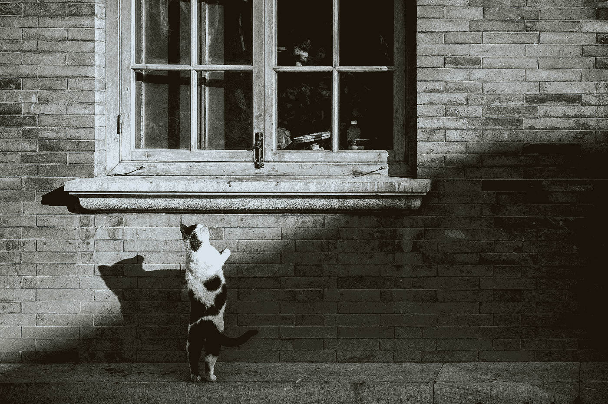
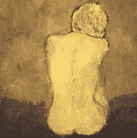

# 独唱女神

> 原文：<https://medium.datadriveninvestor.com/solo-goddess-97acbf3b94d7?source=collection_archive---------11----------------------->

Photo by [Bing Han](https://unsplash.com/@xrcj?utm_source=medium&utm_medium=referral) on [Unsplash](https://unsplash.com?utm_source=medium&utm_medium=referral)

Gerard O'Donovan 经营的教练博客，我们的目标是不断为那些寻求改善生活的人带来价值。因此，我们有一个政策，出版我们重视和欣赏的客座作者的文章和材料。今天的嘉宾作者是 [***格伦·拉德加德***](http://glenladegaard.com/) **。**

**带你从 Solo 到 Soulo！**

“你是作为一个独特的个体被创造出来的，有一个特殊的目的去实现。在你内心深处，你知道目标是什么，这是你一生中能做的最有价值的事情。”存在的女神，女神引导直觉卡片

在这个时代，作为一个单身女神(单身女性)单干并不像人们所说的那样。这也不容易。我们必须下沉或游泳，下沉意味着可能削弱或成为一个受害者或可怜的我类型。游泳意味着比我们通常会或想要做的更难，不得不独自做决定，并不断成为“你为什么不结婚或没有男朋友”的接受者。‘你有魅力、聪明、机灵……’——也许这就是原因！

 [## 摔倒不是失败。-数据驱动型投资者

### 你只有在放弃的时候才会失败。每个英雄都会倒下，我们活着就是为了失败者出现的时刻；上升到…

www.datadriveninvestor.com](https://www.datadriveninvestor.com/2019/01/17/falling-isnt-failing/) 

似乎越来越多的女性在没有伴侣的情况下独自生活，更不用说灵魂伴侣了。

事情在经济上更困难，否则作为一个独唱女神，我们必须在家里做两倍的工作，特别是如果我们是唯一的企业家。我们必须成为清洁工、厨师、购物者、勤杂工、洗衣妇、女主人(如果还有时间的话！)、秘书(对我们自己)、首席执行官、儿童出租车和园丁。我遗漏了什么吗？？

我们的伴侣朋友往往会忘记，我们没有人可以分享想法、思想、担忧、快乐、计划、梦想等。每天都休息。我想知道这对我们有什么影响？我记得我的一个好朋友说过，当你坠入爱河并有那个人在你身边时，你可以移动你自己想都不敢想的山，更不用说移动了。

无论我去过哪里，女性似乎总是比男性多，你也发现了吗？

如果这引起了你的共鸣，不要害怕！不要去最近的悬崖考虑跳下去。作为独唱女神，我们也学会了保持我们的女性气质和性感，保持幽默感，永不放弃希望，滋养和关心我们的朋友和爱人，甚至比平时更多地一心多用。

《永不放弃希望》是最能引起我共鸣的一句话。正如一个朋友的母亲常说的，橱柜里的每一个罐子都有一个盖子。因此，当我等待我的盖子以一个白色骑士的形状出现时(虽然我认为不是骑在白色的骏马上，而是可能骑在一只短腿的驴上)，我继续为我感觉被召唤去做的事情而努力，这些事情是我们出于纯粹的热情和爱而做的，也是为他人服务的。

我的新口号是，如果它不能激励我，让我兴奋，我就不会朝它前进。

我们都是独特的。聪明、聪明、强大到难以置信。问题是，我们真的相信吗？

嗯，最好是这样！我们都有一些特殊的事情要做，一个没有人能以我们独特的方式达到的目的，达到我们将要达到的目的，使用我们将要使用的语言。我们必须对此有信心和信任，并对自己充满信心。

你可能还不知道你的目标是什么——我花了大半辈子才找到我的目标，现在我 57 岁了——但是你会找到的。这将是你充满激情、热爱做的事情，也是你真正擅长的事情。这可能是你从未想过的事情，这是你的目标。一旦你着手去做，它甚至会改变。

你看，我们对自己的看法与别人对我们的看法大相径庭——通常更糟糕或更消极。我们不一定知道自己擅长做某件事，因为我们怎么知道呢？我们只是这么做，其他人也这么想。

最重要的是决定做一件事，然后去做。拖延或不做决定远比做出错误的决定更糟糕。而且不管怎么说，从大局来看没有错误的决定。

对我有帮助的是在一个非常不同的地方工作一年，给自己时间花在我喜欢的事情上——我的绘画。我发现我能更多地听到我的直觉，那个声音告诉我们为了我们自己的最高利益应该做什么。我发现人们突然从暗处走出来，在我前进的道路上支持和帮助我。

18 年来，我一直被一个比我强大得多的东西所领导和指引，现在依然如此。有时我完全失去了情节，不知道这是怎么回事。其他时候，我是如此地沉浸在流中，以至于事情毫不费力地就发生了，有着巨大的同步性和惊人的意外收获。

独自在一条道路上保持一致并不容易，即使你是一个女神！但是，倾听你内心的声音，你将踏上一段你做梦也想不到的旅程。

我相信有很多独唱女神(至少我知道我不是一个人！)那就是这是我们的时代，女人的时代——不管是独唱还是其他。在低处和高处。非常重要的是担任高级政府职位，金融机构的首席执行官，高级政府职位。诸如此类。

我相信随着我们这个时代的到来，作为女性，我们也将迎来很少或没有战争的和平。毕竟，我们知道暴力从来不是也不会是答案。总的来说，我们女人在精神上比男人更先进，我们来这里是为了引导他们去疗愈，让我们的地球再次完整。男人将会在那里支持我们作为一个已经存在的新世界的养育者、看护者和创造者的角色。

因此，独唱女神们占据了你们的位置，准备好迎接即将到来的变化，我们有很多工作要一起做。我们生活在一个激动人心的时代，新的范式是合作而不是竞争。我们每个人都以自己的方式为此做出贡献并有所作为。

此时有如此多的独唱女神是有目的和更高的原因的。对我们来说，为人类的更大利益服务需要我们在旅程的一部分或大部分时间里独自走这条路，保持我们自己的力量并提升我们下面的人，确保我们的翅膀保持张开。

一路上，愿我们的灵魂伴侣在我们最意想不到的时候出现，你将从 Solo 转变为 Soulo！永远保持希望，最重要的是，尊重你，相信你非常美丽和有能力的自己。

带着我的爱和祝福，

峡谷

生物:**格伦·拉德加德女士**

热情的艺术家和独唱女神导师

我和那些致力于在生活中做出积极改变并不断成长的单身女神们一起工作，那些知道自己想要走得更远、应该得到更好的女人，那些可能缺乏勇气、信心或自信去单干，但却以这样或那样的方式致力于实现目标的女人。我会带你从索罗到索罗！

查看我们在这里提供的课程:[https://www . noble-Manhattan . com/training-courses/coaching-courses/](https://www.noble-manhattan.com/training-courses/coaching-courses/)

并获得我们的免费报道:【https://www.coaching-reports.com/ 