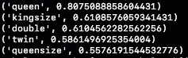
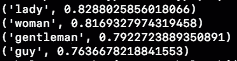
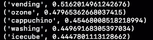
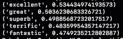
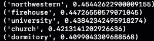
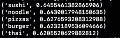
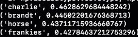
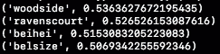

# 通过将单词表示为向量来解决类比问题

> 原文：<https://medium.datadriveninvestor.com/solving-analogies-using-word2vec-13b9e01eca1?source=collection_archive---------7----------------------->

在几周前的数学讲座中，我了解了如何将单词转换为高维向量来解决类比问题。类比题是要求你找出词与词之间关系的题。例如，这个问题的答案是:男人对女人，国王对 ____ 是“女王”,因为你必须用问题第一部分的关系来填空。这对我来说很有趣，因为单词之间的关系似乎很难编码。我很好奇，想看看高维向量是否能真正捕捉到这个词的意思，以及它与另一个词的关系。

课堂上描述的方案是首先将每个单词转换成一个高维向量。然后简单地从第一个词对的第二个向量中减去第一个向量，并将其加到第二个词对的第一个词上。向量最接近结果答案的单词就是答案。对于上面的例子，解决方案将是最接近国王+女人的向量——男人很可能是王后。

解决这个问题的第一步是找到一个好的数据集来训练 Word2Vec 模型(一种将单词转换为高维向量的模型)。我决定使用 OpinRank 数据集中所有酒店评论的汇编。我在一个文件中找到了所有酒店评论的串联列表:[https://github . com/kav gan/NLP-text-mining-working-examples/tree/master/word 2 vec](https://github.com/kavgan/nlp-text-mining-working-examples/tree/master/word2vec)文件是(reviews_data.txt.gz)。数据集中总共有 255，403 条评论。

我使用了 Gensim，这是一个 python 工具包，有助于向量空间和主题建模，以创建一个解决类比的模型。我用 Gensim 对 Word2Vec 的实现训练了 Word2Vec 模型。该模型通过传入一系列评论来训练。虽然，我不知道 Word2Vec 实现的技术细节，但公理“单词的含义可以从它所保持的公司中找到”可以用来在高层次上理解 Word2Vec 是如何实现的。对于每个单词，我们检查它的相邻单词，并以此来推断它的意思。在 Gensim 中，对应于每个单词的每个向量最终都是 150 维的。我使用下面的链接来确保我有正确的语法:[http://kavita-ganesan . com/gensim-word 2 vec-tutorial-starter-code/# . w7 hquhnkjbk](http://kavita-ganesan.com/gensim-word2vec-tutorial-starter-code/#.W7HQUhNKjBK)

一旦模型被训练好，我就完全按照讲座中提出的方案去做。我手动选择了三个单词，前两个是单词对，并将它们分别转换为向量。然后，我应用公式第 4 个单词=第 3 个单词+(第 2 个单词-第 1 个单词)，找到最接近结果向量的单词。关于语法相关的问题，我参考了 Gensim 文档。([https://radimrehurek . com/gensim/models/keyed vectors . html # gensim . models . keyed vectors . wordembeddingskeyedvectors . WM distance](https://radimrehurek.com/gensim/models/keyedvectors.html#gensim.models.keyedvectors.WordEmbeddingsKeyedVectors.wmdistance))

**结果:**

我发现类比解算器能够轻松地解决简单的类比，但却很难解决更复杂的类比。这里有一个尝试过的类比列表，以及最有可能是解决方案的单词。对应于每个单词的数字是该单词的向量和由假设中的公式计算出的解的向量之间的相似度。

注意:我不得不手动过滤掉一些答案重复了问题中一个单词的结果。

1.  男人对女人就像国王对 __？

Correctly got queen as the right answer! Big difference between first and second similarity means that the solution was very obvious.

2.男孩对女孩就像男人对 __？

correct answer!

2.水和冰的关系就像液体和 __ 的关系一样。

not a good result

3.坏对好就像悲伤对 __？

all these words make sense here, but “happy” would be the most accurate

4.医生对医院来说就像老师对 __？

fairly accurate

5.美国对于比萨饼就像日本对于 __？

Good results here!

6.人类和房子的关系就像鸟类和 __？

completely incorrect results

7.草对于绿色就像天空对于 __？

idk what happened here

似乎将单词转换成高维向量的方案是正确的，并且给出了相当好的结果。还有改进的空间，也许可以通过更大的数据集来实现。我将尝试使用不同的数据集进行实验，还将尝试使用 Word2Vec 的不同实现。

我很想知道这个模型对旧的 SAT 选择题(以前测试类比的考试)的表现如何。由于问题是多项选择，模型只需选择 4 个单词的向量中最接近预测向量的一个。我将尝试通过与参加测试的人类进行比较来查看该模型的准确性！

总的来说，这个模型的准确性给我留下了非常深刻的印象，而且在很大程度上，结果是合理的。这意味着将一个单词转换成 150 维向量可以封装单词的含义。这也意味着两个单词之间的关系也可以表示为一个 150 维的向量，这两个事实结合起来导致了模型的准确性。