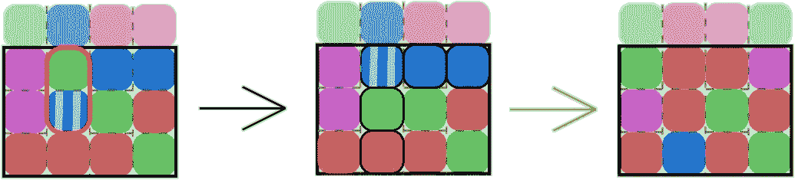
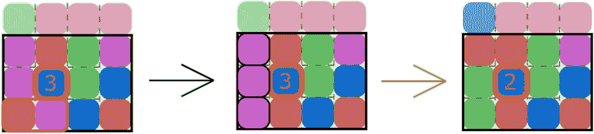
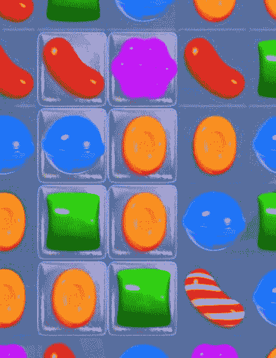

# 用特殊积木解决糖果粉碎问题，例如，用互换进行第三场比赛

> 原文：<https://medium.datadriveninvestor.com/solving-candy-crush-with-special-blocks-i-e-match-3-games-with-swaps-501878c9ef2b?source=collection_archive---------4----------------------->

欢迎回到我的系列[用图算法解决第三场比赛](https://medium.com/rideos/solving-match-3-games-with-graph-algorithms-27c3f2c56932)！在这第五篇文章中，我们将为第三场比赛添加更多的功能，使它更接近像[糖果粉碎传奇](https://en.wikipedia.org/wiki/Candy_Crush_Saga)这样的游戏。在我之前的帖子中，[我们讨论了只有彩色方块的简化版糖果粉碎传奇，并引入了广度优先搜索算法来解决游戏](https://medium.com/swlh/solving-simplified-candy-crush-i-e-match-3-games-with-swaps-54cb7975486b)。

在本帖中，我们将在第三场比赛中加入“特殊”方块！我说的特殊区块是什么意思？以前，Match-3 游戏中的方块除了颜色之外都是相同的，只能通过玩家的动作来移除，例如交换相邻的方块。移除后，这些方块会从游戏中消失，其他方块会因重力而掉落。

[](https://www.datadriveninvestor.com/2019/03/22/the-seductive-business-logic-of-algorithms/) [## 算法诱人的商业逻辑|数据驱动的投资者

### 某些机器行为总是让我感到惊讶。我对他们从自己的成就中学习的能力感到惊讶…

www.datadriveninvestor.com](https://www.datadriveninvestor.com/2019/03/22/the-seductive-business-logic-of-algorithms/) 

现在，我们会有一些方块由于玩家的动作而被移出游戏时会产生“特效”。例如，《糖果粉碎传奇》中的条纹糖果在被清除时会移除一整行(水平或垂直)。其他特殊方块可能需要玩家采取一个以上的动作才能移除。比如《糖果粉碎传奇》里陷在果冻里的糖果。关于《糖果粉碎传奇》中特殊模块的更多例子，[看看这篇维基文章](https://candycrush.fandom.com/wiki/Blocker)，或者看看下面的视频。

有趣的是，在我们的 Match-3 游戏中添加特殊的块并不会对图形表示产生很大的影响，这一点我们将在下一节中详细讨论。在我们之前的帖子中，我们讨论了广度优先搜索算法，就完成游戏的动作数量而言，它是最优的，但就获得的点数而言，它不是*最优的。在本帖中，我们将考虑一个相关的图搜索算法，即*相对于所获得的点数是*最优的。*

# 交换比赛-3 与特殊(SwapM3S)游戏

我们将扩展我们在上一篇文章中介绍的交换比赛 3 (SwapM3)游戏。我们将称之为交换比赛-3 与特殊(交换 3)游戏。我们将重用 SwapM3 中的许多定义，因为 SwapM3 是 swap m3 的扩展。正如您将看到的，SwapM3 和 swap m3 之间的定义和图形表示基本相同。

就像之前一样，SwapM3S 游戏将会在一个由***【n】***乘*的世界中，玩家可以在一个更小的由*乘 ***M ≥ m*** 的 ***n*** 棋盘中采取行动。玩家通过选择两个相邻的区块进行交换，其中相邻使用[4-连通性](https://en.wikipedia.org/wiki/Pixel_connectivity#4-connected)(即上、下、左、右)。此外，连锁效应还会继续发生，玩家的动作会移除一些方块，而其他方块会落在这些点上，这又会导致新的连续线条形成，然后被移除，如此等等。**

**SwapM3 和 swap m3 这两款游戏的主要区别在于“特殊”方块的存在。我们将考虑与《糖果粉碎传奇》中某些糖果类型相似的两大类特殊积木。**

**第一类特殊方块是那些由于玩家的动作而被移除时在棋盘上造成效果的方块。例如，水平条纹块在被清除时会移除它们所占据的整行，垂直条纹块在被清除时会移除整列(直到第 ***m*** 行)。《糖果粉碎传奇》包含了大量其他类似的条纹糖果，它们很容易被移植到 SwapM3S 游戏中，尽管我们在这里不会一一列举。条纹块不会自然地出现在棋盘上，即最初的*n 乘*世界不包含任何条纹块。但是，它们*是玩家动作创造的*。当清除垂直行中的 4 个或更多相同颜色的块时，创建水平条纹块，当清除水平行中的 4 个或更多块时，创建垂直条纹块。可以通过类似的方式创建其他条带块。****

****

***Fig. 1: When the vertical striped block is cleared, it also removes all the blocks in its column.***

**第二类特殊障碍是那些需要一个以上玩家动作才能清除的障碍。每一个这样的块体都有一种潜在的颜色(即**中的 1 种 *K*** 颜色与其他块体一样)，但它们也被一层厚度为 ***t*** (其中 ***1 ≤ t ≤ T*** )的最大厚度 ***T*** 所包围。这些*粗的*块自然地出现在游戏世界里，存在于最初的 ***n*** 经 ***M*** 世界里。当相邻块被清除时，或者当该行/列上的条带化块被激活时，厚块的厚度会减小。当厚块的厚度降至 0 时，它将成为一个常规块。同样，[糖果粉碎传奇有多种“拦截器”，可以翻译成 SwapM3S 游戏](https://candycrush.fandom.com/wiki/Blocker)。**

****

***Fig. 2: A thick block of thickness 3 being reduced to a thickness of 2.***

**这两类块也可以有特殊的交互作用。例如，条带化的水平块可以移除其行/列中超过 1 级厚度的块。这样，对于玩家来说，使用条带块来清除厚块可能是有用的。**

**在 SwapM3 中，我们将使用与 swap m3 相同的目标状态定义，即目标是使用最多 ***M*** 动作达到至少 ***P*** 点。然而，玩家从他们的行为中获得的点数有所不同。清除常规块和以前一样增加了***【V(I)***点，其中 ***i*** 是清除的块数。同样像以前一样，当玩家完成游戏，即他们至少有 ***P*** 点时，他们为剩余的每个动作获得 ***V(n + m)*** 点。这两个游戏的一个区别是 SwapM3S 中有更多种类的奖励点数。当创建条纹块时，玩家获得额外的 ***Vs*** 点数。当厚块被清除时(即其厚度降至 0)，玩家获得额外的 ***Vt*** 点。最后，玩家可以从一个动作中获得的点数(包括奖励点数，如 ***Vs*** 和 ***Vt*** )上限为 ***V(n + m)*** 。请注意，这意味着玩家的每个动作都有一个最大的点增益***【V(n+m)】***，并且当达到目标时，玩家仍然会为每个剩余的动作获得***【V(n+m)***点。在后面的讨论部分中，我们将描述为什么每个动作需要这个最大上限***【V(n+m)】***。**

# **SwapM3S 游戏示例**

**如上所述，SwapM3S 与《糖果粉碎传奇》非常相似，即使是在后期。条纹块类似于条纹糖果，厚块类似于凝胶糖果。**

****

**Fig. 3: A screenshot of Candy Crush Saga with jellied candies and a horizontal striped candy.**

**糖果粉碎传奇还有各种其他的[条纹糖果](https://candycrush.fandom.com/wiki/Striped_Candy)和[阻挡者](https://candycrush.fandom.com/wiki/Blocker)在上面的 swap m3 中没有提到，但是 swap m3 可以扩展到包括那些。比如《糖果粉碎传奇》中的彩弹糖果，去掉某个颜色的所有糖果，一个类似的块可以很容易的加入到 SwapM3S 中。同样，《糖果粉碎传奇》中的甘草漩涡也只能用特殊的糖果去除，在 SwapM3S 中可以表现为一个厚块，其厚度只能用条纹块来减小。**

**虽然 SwapM3 和 Candy Crush Saga 比 swap m3 和 Candy Crush Saga 更相似，但仍然存在一些差异。与《糖果粉碎传奇》相比，目标状态可能略有不同。在《糖果粉碎传奇》的某些阶段，目标可能是移除所有被困在果冻中的糖果(类似于 SwapM3S 中的厚块)。但是，我们将使用目标的 ***P*** 点来减少 SwapM3 和 swap m3 之间的差异。我们将在下一篇文章中讨论这个目标的其他定义。**

**还有，类似于 SwapM3，swa PM3 中的***n***by***M***游戏世界为玩家所熟知。在《糖果粉碎》中，由于重力而掉落的新糖果对玩家来说很大程度上是未知的，我们将在下一篇文章中考虑这些未知的重力影响。**

# **SwapM3S 的图形表示**

**由于 SwapM3 是 swap m3 的扩展，所以图形表示几乎相同。状态/顶点和边保持不变，目标状态和辅助函数也是如此。**

**然而，现在对玩家动作的点数计算进行了修改，因为增加了可能的奖励点数 ***Vs*** 和 ***Vt*** 分别用于形成条纹块和移除厚块，如上所述，最高可达 ***V(n + m)*** 。**

**因此，辅助功能*获取动作*、*采取动作(a)* 和*假设动作(s，a)* 与之前类似，但必须考虑额外奖励点和动作点最大值。此外，这些辅助函数必须处理特殊糖果的效果，例如当清除一个水平条纹块时删除一整行。像以前一样，我们将手工编写这些函数的定义，并深入研究解决 SwapM3S 的图搜索算法。**

# **求解 SwapM3S**

**在我们之前的帖子中，我们描述了求解 SwapM3 的广度优先搜索算法，该算法返回了关于所采取的动作数量的最优解，但是对于所获得的点数不是最优的。回想一下，最优性依赖于问题领域的定义，因此定义什么是最优对于任何领域都是重要的。**

**下面是 [Dijkstra 算法](https://en.wikipedia.org/wiki/Dijkstra%27s_algorithm)的伪代码，该算法*相对于所获得的点数而言是*最优的。我们稍后将比较和对比 Dijkstra 的算法和广度优先搜索。**

```
**function DijkstraSwapM3S(start, P) priority_queue = [(start, 0)]
  visited = []
  parents = {start: null}
  goal = null while !priority_queue.empty() and goal == null (currentState, cost) = priority_queue.dequeue()
    visited = visited + [currentState] // If the current state is a goal state, we’re done
    if currentState.p >= P
      goal = currentState
      break
    end if // Consider all possible actions from currentState
    possibleActions = GetActions(currentState) for action in possibleActions possibleNextState = HypotheticalAction(currentState, action) // If we’ve already visited this state, skip it
      if visited.contains(possibleNextState)
        continue
      end if // Compute the cost of the next state
      nextCost = cost + V(n + m) 
                 — (possibleNextState.p — currentState.p) // If the priority queue doesn’t contain the next state,
      // or if it contains the next state at a higher cost, then add
      // it to the priority queue.
      if !priority_queue.contains(possibleNextState) or
         (priority_queue.priority(possibleNextState) > nextCost)
        // Enqueue replaces any existing entry of possibleNextState
        priority_queue.enqueue((possibleNextState, nextCost))
        parents{possibleNextState} = (currentState, action)
      end if end for end while // Do we have a solution?
  if goal == null
    return null
  end if // Retrieve the list of coordinates corresponding to the actions.
  // Start from the goal and work backwards to the start
  actionsTaken = []
  currentState = goal while currentState != start
    actionsTaken = [metadata(parents{currentState}.action]
                   + actionsTaken
    currentState = parents{currentState}.state
  end while return actionsTakenend function**
```

**Dijkstra 的算法和广度优先搜索有很多相似之处，比如在一个边界上循环，直到找到目标，然后向后提取动作。**

**一个关键的区别是，Dijkstra 的算法在加权图上运行，而广度优先搜索使用未加权的图(即，边的权重都相等)。因此，与广度优先搜索中的标准 FIFO 队列相比，Dijsktra 使用优先级队列。因为 Dijkstra 使用优先级队列，所以节点必须以一定的优先级/成本入队，并且出列函数移除具有最低成本的节点。**

**当一个节点从优先级队列中出列时，可以保证 Dijkstra 算法已经找到了从起点到该节点的最低可能成本。只有当图的边是非负的(即大于或等于 0)时，这种保证才成立。于是，这个算法中一条边的代价被定义为***V(n+m)-(possible nextstate . p-currentstate . p)***。当从一个动作达到最大点数 ***V(n + m)*** 时，该边的成本将为 0。否则就是 ***V(n + m)*** 与那个动作的点增益之差，保证非负。这个概念类似于决策理论中的[后悔，除了后悔通常是针对最优行动计算的，而这里我们是基于理论上的最大值来计算成本的，这个最大值可能会也可能不会实现。我们将在后面讨论为什么选择这个成本函数。](https://en.wikipedia.org/wiki/Regret_(decision_theory))**

**Dijsktra 算法与广度优先搜索的另一个区别是从发现列表到访问列表的变化，以及在将节点及其成本添加到优先级队列之前的检查。在广度优先搜索中，当一个节点被添加到队列中时，可以保证没有到该节点的更短路径，因为边具有统一的权重。因此，一旦节点被发现，即被添加到队列中，就不需要再将它添加到队列中。相反，当一个节点被添加到 Dijkstra 算法的优先级队列中时，不能保证从起点到该节点不存在更短的路径(就成本而言)。Dijsktra 算法的保证是，当一个节点出队时(即，它是优先级队列中成本最低的节点)，则找到了到该节点的最短路径。**

**有关 Dijsktra 算法的更多信息，请查看本页的详细解释[。](https://medium.com/basecs/finding-the-shortest-path-with-a-little-help-from-dijkstra-613149fbdc8e)**

# **讨论**

**让我们从我们向广度优先搜索提出的相同的两个问题开始:Dijsktra 的算法是最优的和/或[完全的](https://www.quora.com/What-is-a-complete-search-algorithm)？**

**先说完整性:简短的回答是肯定的， *DijkstraSwapM3S* 是一个完整的算法，意思是如果有解的话它会返回一个解。其背后的直觉类似于广度优先搜索:最终，所有可到达的节点都将被扩展和考虑，因此如果这些节点中的任何一个是目标状态，那么它将被找到并返回。**

**最优性怎么样？和以前一样，最优性取决于它是如何定义的。如果我们定义一个最优解是步骤数最少的解，那么 Dijkstra 的算法是*非*最优，而广度优先搜索是。但是，如果我们定义一个最优解是点数最大的解，那么 Dijkstra 的算法*就是*最优。**

**首先，在加权图上，Dijkstra 算法在寻找从起始节点到目标节点的最短成本路径方面是最优的。请参考[本视频](https://www.coursera.org/lecture/algorithms-on-graphs/dijkstras-algorithm-proof-of-correctness-BcOfI)、[本页面](https://www.quora.com/What-is-the-simplest-intuitive-proof-of-Dijkstra%E2%80%99s-shortest-path-algorithm)或[本页面](https://web.engr.oregonstate.edu/~glencora/wiki/uploads/dijkstra-proof.pdf)的详细解释和证明。假设 Dijkstra 算法对于最短成本路径是最优的，我们如何证明我们用 *DijkstraSwapM3S* 找到的解决方案对于获得的最大点数是最优的？为此，我们将使用反证法，类似于前面提到的一些解释。**

# ***反证法***

**假设 *DijkstraSwapM3S* 从起始节点 ***S0*** 到目标节点 ***Sgoal*** 找到一个总成本为 ***Cgoal*** 的解。**

**假设到达目标的路径为***S0→……→Sn→s goal***，每个节点的总点数分别为 ***V0、…、Vn、Vgoal*** 。**

**为了符号的简单，让 ***Vmax = V(n + m)*** 。**

**由于节点的成本是通过 ***V(n + m)*** 与一个动作所获得的点数之差来计算的，
***Cgoal =【Vmax-(V1-V 0)】+【Vmax-(V2-V1)】+…+【Vmax-(Vgoal-Vn)】
= Vmax * n-Vgoal+V 0
= Vmax * n-Vgoal***(因为**

***设 ***Vtotalgoal*** 为 ***Sgoal*** 的总点数，包括剩余动作的加分。***

**由于采取了 ***n + 1*** 动作，玩家还获得了***【M-(n+1)】* Vmax***点的加成，所以:
***Vtotalgoal =【M-(n+1)】* Vmax+Vgoal
=(M-n-1)* Vmax+Vgoal***。**

**现在假设存在不同的路径***S0→S’1→……→S’k→S’***，其中在***【S’***获得的点是*，并且从 ***S0*** 到***S’***的路径的总成本是***C’******

**和之前类似，***' C ' = Vmax * k-V '***，***V ' total =(M-k-1)* Vmax+V '***。**

**假设***S’***比 ***Sgoal*** 总点数高，即***V’total>Vtotalgoal***。**

**于是，***(M-k-1)* Vmax+V '>(M-n-1)* Vmax+V goal*****

*****n * Vmax-(M-1)* Vmax-V goal>k * Vmax-(M-1)* Vmax-V '*****

*****n * Vmax-V goal>k * Vmax-V’*****

*****Cgoal>C’*****

**但是 *DijkstraSwapM3S* 在*之前发现 ***Sgoal*** ，所以***C goal≤C’***，这是一个矛盾！***

**因此，***‘S’***不能具有比 ***Sgoal*** 更高的总点数，因此 *DijkstraSwapM3S* 对于玩家获得的点数是最优的。 **QED。****

**既然我们已经证明了 *DijkstraSwapM3S* 是最优且完备的，那么让我们重新考虑我们在问题设计中所做的一个重大选择。即，将玩家的每个动作获得的最大点数限制为 ***V(n + m)*** 。这样做的主要原因是能够为搜索图定义一个正的权重，这样就可以运行 Dijkstra 的算法来找到对应于最优解的最短成本路径。**

**在寻找最短成本路径方面，可能想到的一种替代方案不是人为地将最大值限制为***【V(n+m)***，而是否定该动作所获得的实际点数。例如，如果一个玩家在一个动作中获得***【v 0】***点，那么该边的成本可能是 ***-V0*** 。这样，到达目标状态的最短成本路径将对应于关于所达到的点的最优解。虽然这是真的， [Dijsktra 的算法只能保证返回具有非负权重的图的最低成本路径](https://stackoverflow.com/questions/13159337/why-doesnt-dijkstras-algorithm-work-for-negative-weight-edges)。修改 Dijkstra 的算法以支持负权重是可能的，尽管不是微不足道，并且[这一页有一些关于如何做的讨论](https://stackoverflow.com/questions/6799172/negative-weights-using-dijkstras-algorithm/6799344)。**

# **下一篇文章**

**在这个系列的下一篇文章中，我们将进一步推广我们的第三场比赛！这一次，我们将移除已知的***n***by***M***世界，这样玩家就只知道***n***by***M***游戏棋盘，而新的、未知的方块在采取行动后进入游戏，非常像《糖果粉碎传奇》中发生的情况。敬请期待！**