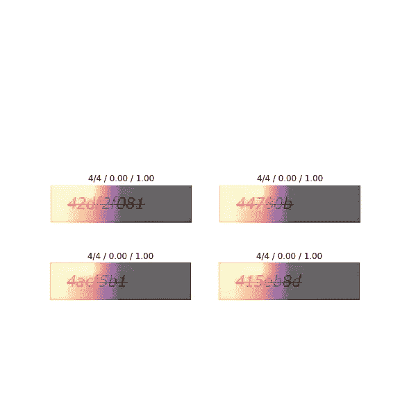
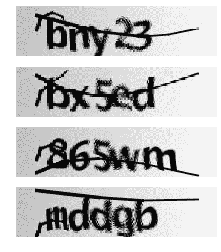
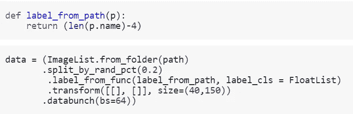
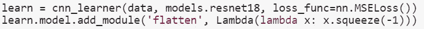
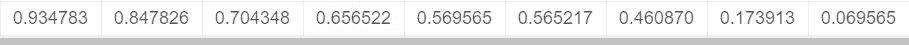
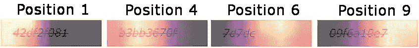

# 用深度学习解决验证码——额外:真实世界的应用

> 原文：<https://medium.datadriveninvestor.com/solving-captchas-with-deeplearning-extra-real-world-application-34417fa3cc82?source=collection_archive---------6----------------------->

利用深度学习破解真实世界的验证码！

# 介绍

在我关于“用深度学习解决验证码”的迷你系列中，我展示了这样做是可能的:

*   [检测验证码中有哪些字符](https://medium.com/@oneironaut.oml/solving-captchas-with-deeplearning-part-1-multi-label-classification-b9f745c3a599)
*   [建立一个简单的分类器，用于识别特定位置的字符](https://medium.com/@oneironaut.oml/solving-captchas-with-deeplearning-part-2-single-character-classification-ac0b2d102c96)
*   [建立一个分类器，解决整个验证码](https://medium.com/@oneironaut.oml/solving-captchas-with-deeplearning-part-3-one-model-to-solve-it-all-d1fbd51f7f9e)

 [## 2019 年深度学习的终极学习路径及更多...数据驱动的投资者

### 又一个美好的一周，一些好的教育内容将会到来。我最喜欢的&最受欢迎的帖子之一…

www.datadriveninvestor.com](https://www.datadriveninvestor.com/2019/01/07/the-ultimate-learning-path-for-deep-learning-in-2019-more/) 

我在本次演示中使用的验证码如下所示:

虽然它们被严重混淆，但它们有一个很好的特性，即每个验证码恰好由 5 个字符组成。这对于构建验证码求解器很有用。预先知道 captcha 的长度使得将它编码到模型架构中成为可能(5 个字符的输出)。

在[最后一部分](https://medium.com/@oneironaut.oml/solving-captchas-with-deeplearning-part-3-one-model-to-solve-it-all-d1fbd51f7f9e)的评论部分， [navneet chaudhary](https://medium.com/@navneet604779) 问我关于帮助一种不同的验证码识别。我很高兴能在现实世界中测试我的技能，所以当然，我接受了。事情是这样的。

自从上次我从 kaggle 转到 google colab。我发现你可以把它设置成一个相当舒适的环境来进行深度学习实验。在我的[另一篇文章](https://medium.com/@oneironaut.oml/setting-up-google-colab-for-deeplearning-experiments-53de394ae688)中有关于如何设置它的描述。

# 数据集描述

navneet chaudhary 已经为这个项目做了收集和解决验证码的艰苦工作。他收集了一套 1155 个验证码，每个验证码都标有文件名。验证码通常是这样的:

一些值得注意的属性:

*   字符是数字和小写字母
*   验证码的长度在 5 到 9 个字符之间
*   这些字符更容易辨认，只有一条直线使它们模糊不清

特别是对于最后一个属性，可以很容易地运行(经典的)分割算法，然后在分割的字符上训练 CNN。然而，我想继续使用纯 DL 方法。这意味着我在用 CNN 处理原始图像。

# 概念验证:验证码长度

就像验证码系列的第一部分一样，我喜欢做一个快速的概念验证。解决起来更简单，但仍能让人感觉到深度学习模型是否适合实际任务。在[第 1 部分](https://medium.com/@oneironaut.oml/solving-captchas-with-deeplearning-part-1-multi-label-classification-b9f745c3a599)中，这个概念验证是一个检测验证码中存在哪些字符的模型(缺少位置和数量的信息)。

对于这个项目，我的想法是看看一个模型是否可以计算验证码中出现的字符。如果一个模型能做到这一点，那么人们可能希望它也能对单个字符进行分割和分类。

有了神奇的 [fastai 库](https://www.fast.ai/)，这样一个模型可以用几行代码来构建。一个简单的函数从文件名中提取标签长度，剩下的是默认过程:

创建数据集中:

然后创建一个学习者:

几个时期的训练表明，该模型做得很好。以下是其预测的一些例子:

Actual length on the left, predicted length on the right.

既然 CNN 似乎有可能在这项任务上做得很好，让我们继续。

# 模型解释

对这个 captcha 求解任务建模的主要困难是变化的长度。有几种方法可以解决这个问题，从“最小-DL-方法”到“完全-DL-方法”排序。

*   使用传统方法分割成单个字符，然后运行 CNN 进行分类
*   通过填充“非字符”字符使验证码长度相同。然后使用与[第 2 部分](https://medium.com/@oneironaut.oml/solving-captchas-with-deeplearning-part-2-single-character-classification-ac0b2d102c96)或[第 3 部分](https://medium.com/@oneironaut.oml/solving-captchas-with-deeplearning-part-3-one-model-to-solve-it-all-d1fbd51f7f9e)相同的建模。
*   使用 CNN 将图像压缩成固定大小，然后将这个压缩版本输入到 RNN 以生成输出序列。

如前所述，我不想选择第一个选项。第三个很诱人，但我认为以我目前对 RNN 氏症的了解，这有点超出了我的能力范围。所以我坚持第二个。

我已经知道验证码的最大长度是 9，所以填充很容易。选择“/”作为填充字符，标签现在看起来像这样:

Padding the captchas to be of the same length

从这里开始，我尝试使用第 3 部分中概述的模型。然而，我不能让它工作。看起来它只能正确分类出 7-8 个可能的位置。总有一个位置是模型完全失败的。

Accuracies for each position indiviually. The last position only got predicted correctly in ~7% of all cases.

所以我在[第二部分](https://medium.com/@oneironaut.oml/solving-captchas-with-deeplearning-part-2-single-character-classification-ac0b2d102c96)的结尾用了一种简单的方法:为这一章的每个位置训练一个分类器，总共 9 个。正如预期的那样，该模型在正确识别所有字符方面的准确率达到了 94%!

# 结果

尽管有很多缺点，多分类器方法的好处是可以为验证码中每个位置的分类生成热图。

热图是我们模型中最后一层的 7×7 激活的上采样版本。由于输入图像不是正方形的，有效分辨率甚至更低，为 2×7。这解释了为什么有些热图并不完全符合目标:

有趣的是，在上面的例子中，位置 1、4 和 9“看着”它们应该分类的特定字符。然而，在位置 6 的例子中，没有这样的字符，因为 captcha 只有 5 长。因此，模型会“查看”最后一个字符之后的整个空间，确保那里确实没有需要识别的内容。

# 结论

这结束了我在解决一个真实世界的验证码问题的冒险。处理这些略有不同的验证码是一种有趣的体验。可以改进的地方有:

*   让一个单一的模型来解决填充验证码
*   让 RNN 方法发挥作用。这将具有独立于验证码长度的好处

如果你有一个类似的，甚至完全不相关的问题要解决，请让我知道！