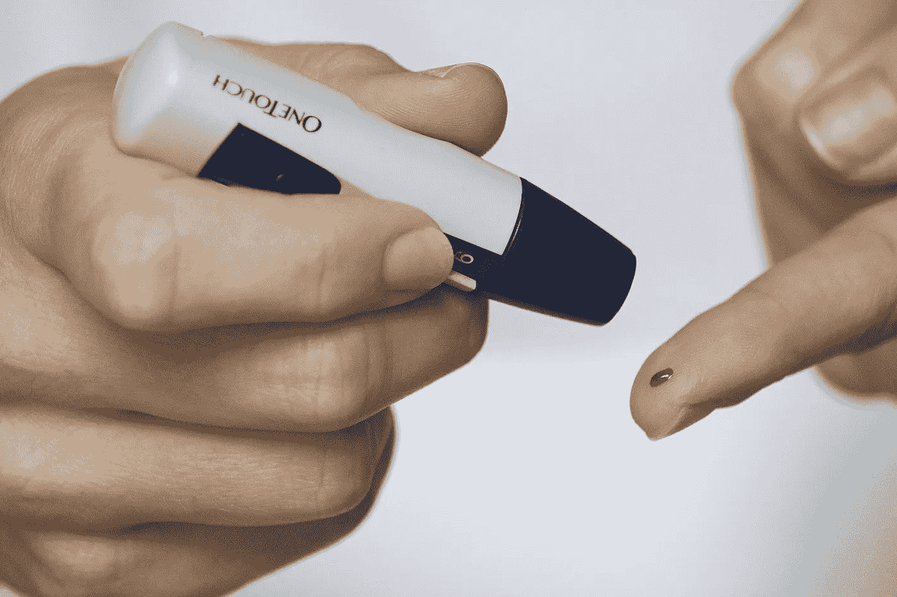
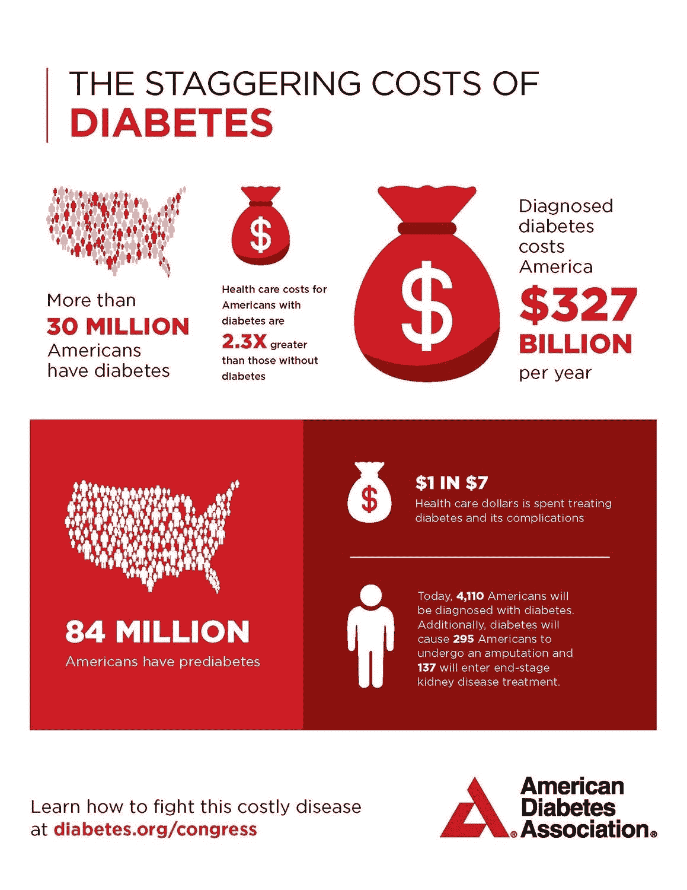

# 解决重要的问题——糖尿病

> 原文：<https://medium.datadriveninvestor.com/solving-problems-that-matter-diabetes-fe3cf881bca1?source=collection_archive---------10----------------------->

糖尿病有两种类型——I 型是一种遗传疾病，意味着你的细胞不能产生足够的胰岛素。第二类是 90%的情况，当你的身体由于反复接触葡萄糖而变得对葡萄糖不敏感。第二类本质上是一种生活方式的疾病，这也是本文关注的焦点，也是全球危机的核心，从加纳到 T2，从印度到美国。

 [## 大笔资金和尖端技术:人工智能/人工智能投资将如何革新医疗保健…

### 在过去几年人工智能(AI)和机器学习(ML)的显著发展中…

www.datadriveninvestor.com](https://www.datadriveninvestor.com/2018/03/22/big-money-and-cutting-edge-technology-how-investment-in-ai-ml-will-revolutionize-the-healthcare-industry/) 

在美国，根据[CDC 2017 年全国糖尿病统计报告](https://www.cdc.gov/diabetes/pdfs/data/statistics/national-diabetes-statistics-report.pdf)，超过 1 亿的美国人应该关注糖尿病。8400 万美国人处于糖尿病前期，另有 3030 万人符合糖尿病定义，其中 720 万人未确诊。翻译后面的数字——不到 10%的美国人患有这种疾病，1/4 的人不知道。美国糖尿病协会证实了这些数字，并发现仅在 2017 年，糖尿病就给该国造成了 3270 亿美元的损失。

技术在解决这场公共危机中扮演着重要的角色。以下是专注于这一领域的初创公司的三个主要趋势。

**1)生活方式管理——但对于初创公司来说，这种方法的长期效果尚未得到证实**

糖尿病是慢性疾病的标志，也是人类认知决策的祸根——长期的小决定，会在几年甚至几十年内产生无声的影响。因此，许多初创公司专注于帮助人们采用更好的生活方式来预防、管理甚至逆转糖尿病。想到的一些著名的名字包括 Omada、Glooko、WellDoc、Livongo、Virta Health 和 Vida Health。自然的假设是，如此巨大的市场将会有多个赢家，其中一些公司可能是独立的。

也就是说，到目前为止，几乎没有人退出。一个例子是罗氏，它在 2017 年 6 月以 8400 万美元收购了 mySugr。该应用程序提供了一个自我管理包——日志、胰岛素计算器、糖尿病教练、医生报告和带有家庭交付试纸的连接血糖仪。但是 M&A 仍然是一个例外，而不是一个规律。其他公司正在关注更广泛的生活方式管理。例如，Livongo 已经从糖尿病扩展到包括血压在内的其他领域。最后，立法仍然是经济模式真正规模化的关键——想想补偿数字生活方式管理的 CPT 代码。

**2)无创诊断——仍然是一个圣杯**

除了在你的体内安装一个连续测量胰岛素水平的装置，今天的糖尿病诊断需要你刺破你的手指。以下是一些正在试验的主要技术:

*   眼泪——谷歌通过隐形眼镜进行了著名的尝试
*   光——将光束照射到皮肤上并测量反应(折射、反射、衍射、吸收)
*   超声
*   红外线——测量身体发出的自然能量波
*   粘度——检查皮肤下组织中液体的厚度(类似于光的指标)
*   无线电——将无线电波应用于指尖

这些努力中有许多是很有希望的。但是在写这篇文章的时候，FDA 还没有批准一种商业的非侵入性方法。

**3)具有前瞻性思维的美国食品和药物管理局——改进监管**

美国食品和药物管理局在监管技术方面已经显示出有希望的迹象。2017 年，该机构[试行了数字健康应用](https://www.fda.gov/newsevents/newsroom/pressannouncements/ucm577480.htm)的快速通道，其想法是获得认证的公司将能够更快地推出未来的问题。就在一年前，它授权了[第一个完全可互操作的连续葡萄糖监测系统](https://www.fda.gov/newsevents/newsroom/pressannouncements/ucm602870.htm) —批准的新颖性在于它允许该设备与其他设备(自动胰岛素给药系统、胰岛素泵、血糖仪)接口。他们显示出对自动化的进一步接受，去年还批准了基于人工智能的糖尿病决策支持。创新的速度几乎总是快于政策制定者调整监管框架的能力，但行业共识是 FDA 正在尽自己的职责。

如果你从这篇文章中发现了什么，给个赞吧。有什么想法，请评论。

*这些都是专注于实践见解的短文(我称之为 GL；dr —良好的长度；确实读过)。如果它们能让人们对某个话题产生足够的兴趣，从而进行更深入的探索，我会感到非常兴奋。这里表达的所有观点都是我自己的。*