# 使用递归树方法求解递归-确定时间复杂度-#1

> 原文：<https://medium.datadriveninvestor.com/solving-recurrences-using-recursion-tree-method-determining-time-complexity-5e327c82e4d5?source=collection_archive---------0----------------------->

在过去的几周里，我一直在阅读由 Thomas H. Cormen 撰写的**算法简介-第三版，**在逐节阅读的同时，我感觉有些数学在步骤之间被跳过了，这花了我一些时间来弄清楚，但对其他人来说并不总是一样的，将来我可能需要再次记住这些步骤，所以我想到在这里写这些步骤。在这篇文章中，我将展示递归树方法的步骤，如果我在某个地方犯了错误，请随时在评论中提出来。

**第四章:递归树方法求解递归**

我将用递归树方法开始这个系列，给定的递归是

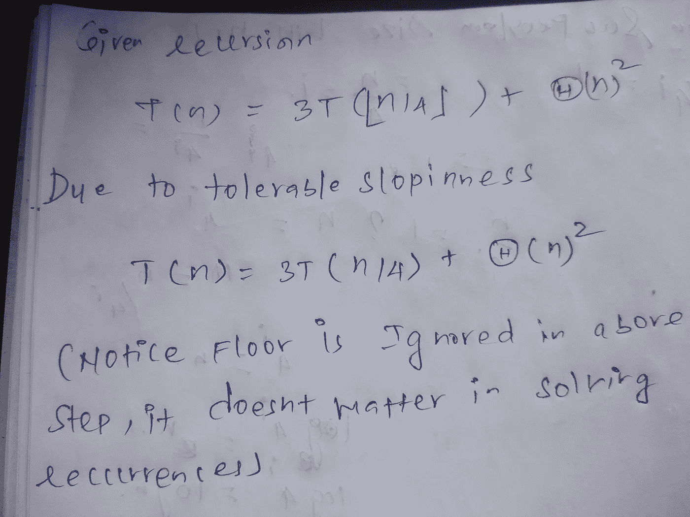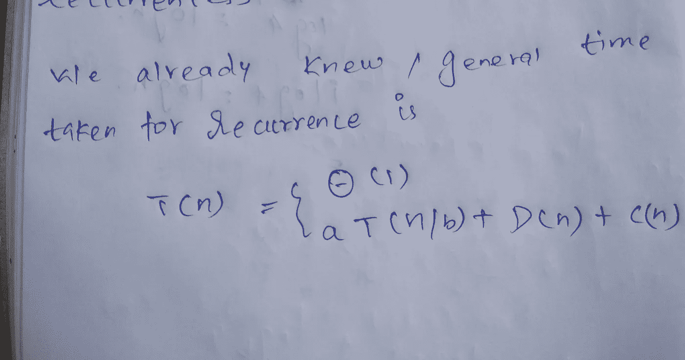

在给定的问题 a=3 中，它表示每个级别产生多少个子问题

 [## 创建折衷书架的程序员指南——数据驱动的投资者

### 每个开发者都应该有一个书架。他的内阁中可能的文本集合是无数的，但不是每一个集合…

www.datadriveninvestor.com](https://www.datadriveninvestor.com/2019/03/25/a-programmers-guide-to-creating-an-eclectic-bookshelf/) 

**所以我们可以画一个递归树，就像这样(我们需要在每一步把每个问题分成 3 个子部分)**

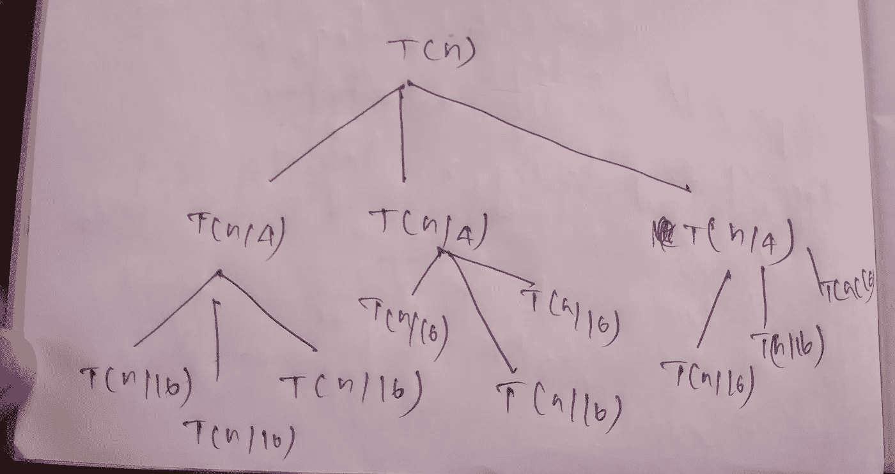

从这个树中，你可以看到子问题的数量以(3)的 I 次方增长，其中是深度，例如起始深度

当我= 0，3⁰ = 1，

当 i = 1，3 = 3 时，

当我= 2，3 = 9 时

> 因此，在任何第 I 个深度上的子问题的数量将是 **3 的 I 次幂**

我们要计算每一步的成本，所以我们可以画一个递归树，像这样

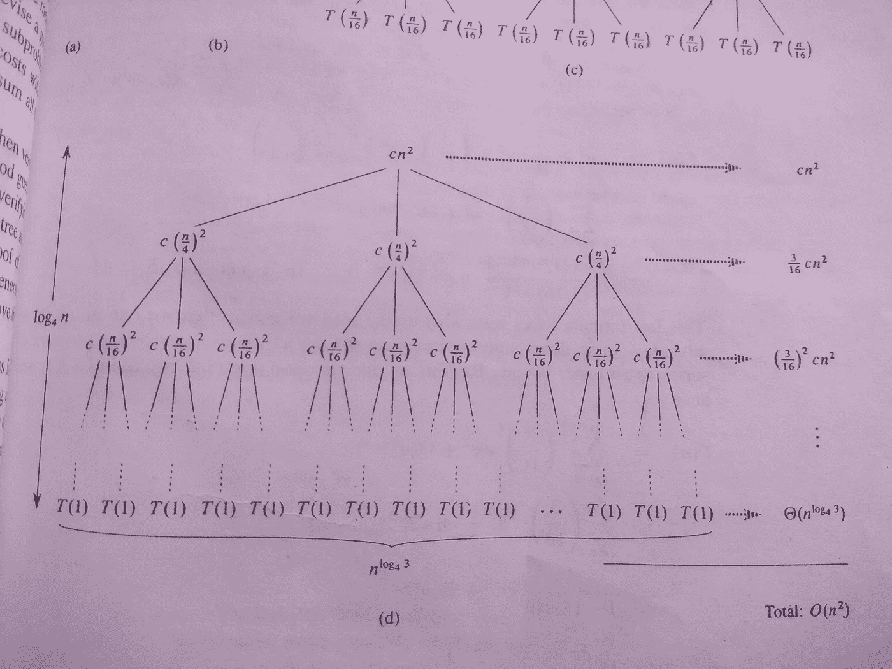

注意到了树顶层的 cn 吗？这是什么？突然出现？:-)

# **为什么成本是 cn？**

给定的重复是

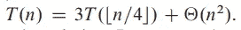

看一下第二项，

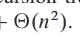

θ(n)代表下图(第 45 页)

它倾向于落在 c₁g(n 和 c₂g(n 之间)，在我们的例子中，g(n)是 n，所以边界是严格的，因为它位于 c₁和 c₂之间，让我们取一个常数 c，这样 f(n) = cn，这样 c > n ₀

这就是递归树在顶层使用 cn 的原因，我花了一段时间才弄明白。

所以我们还在等什么，我们可以加上成本，确定这次回收的运行时间…..还没有:-)，我们需要确定一些其他的因素，再加上每一步的运行时间。

在添加每一步花费的时间之前，唯一要确定的是找到最后一步花费的时间。在书中，跳过一些数学之后，它被给出为

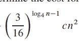

> 对我来说，乍一看没有任何意义，因此我试图找到在这个术语到来之前做了什么。在开始那个计算之前，让我做一个温和的余数

3-每一步的子问题数量

16-n 在每一步都被除的因子(在这个阶段有点混乱，如果你不明白就忽略它，在这篇文章的结尾会很清楚)

I 是递归 i ∈ 0，1，2…h 的深度，你能猜出递归到达底部时的深度是多少吗？(h 代表底部深度水平)

当问题达到底部条件时，我们还有另一个因素会受到影响，**子问题的大小，是的，你猜对了。当你接触底部或边界条件时，子问题的大小趋向于 1，你可能注意到在步骤 0，size = n**

步骤 1，大小= n / 16

步骤 2，大小= n / 256，或 n /16

在任一步骤 I，尺寸= n/4ⁱ(等式 1)

**我们知道，当它达到边界条件时，大小趋向于 1**

代入等式 1，我们可以得到下面的等式

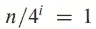

我们用两种方法求解这个方程(选择对你来说容易的一种)，**目的是找到递推最终达到边界条件的深度。**

**方法 1**

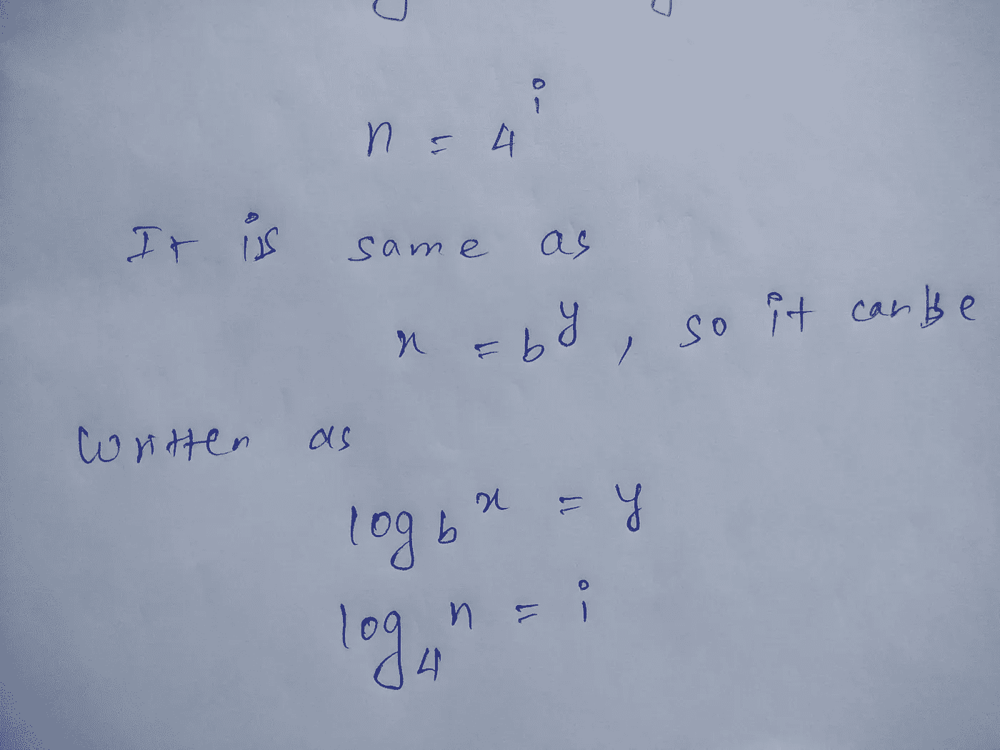

**方法 2(两面取原木)**

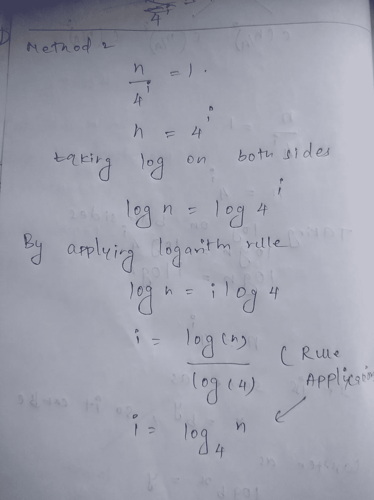

所以我们发现边界深度将是 log [₄](https://www.compart.com/en/unicode/U+2084) n，这是我们的循环停止的深度，所以我们的深度范围将从 0，1，2，…..日志₄

将深度 0 到测井记录的所有成本相加 [₄](https://www.compart.com/en/unicode/U+2084) n

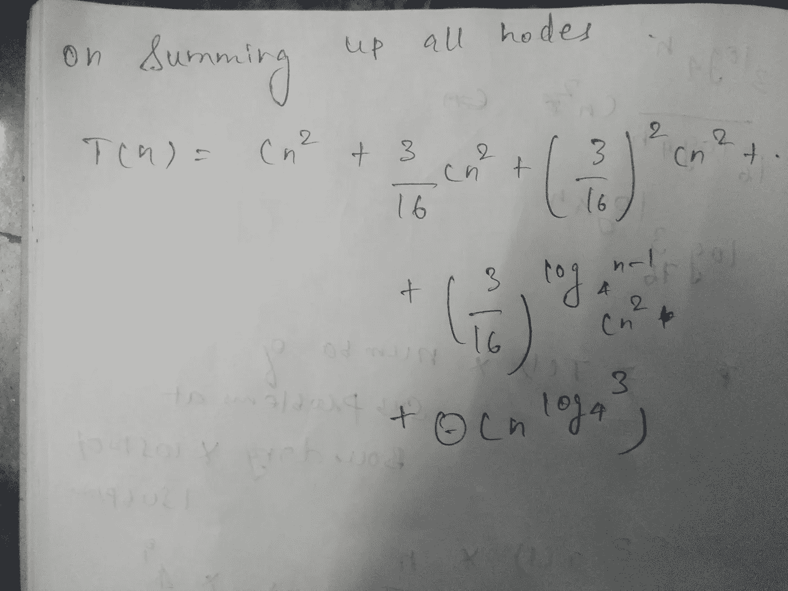

哇，这个等式怎么会凭空出现？，又来了

深度为 0 时，成本= cn

在深度 1 处，成本= 3 * c(n/4) ( 3 代表该节点处的子问题数量)**(求解该问题将得到第二项)**

在深度 2 处，成本= 3 * c(n/16)(注意，子问题以 4 倍的指数增长)

在深度 n-1 成本处(就在最后一项之前的一项，我们对最后一项有一个常数值，这就是我们在这里找到该项的原因)

深度 n-1 成本= 3 *c(n/16)^(log [₄](https://www.compart.com/en/unicode/U+2084) n -1)

最后一级，即边界级成本=

所以我们发现 n 个^ ( log [₄](https://www.compart.com/en/unicode/U+2084) n)子问题出现在最后一个深度。计算它们所需的时间是 T(1)，我们假设它是一个常数，这就是我们如何得到这样的和方程

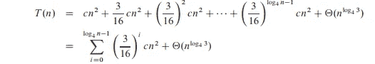

对第二步的解释是不必要的，但这个推导仍然是不完整的，我们需要从这个方程中推导出一个二次多项式，我们需要将上界设为无穷大，所以 T(n)肯定小于假设的上界。

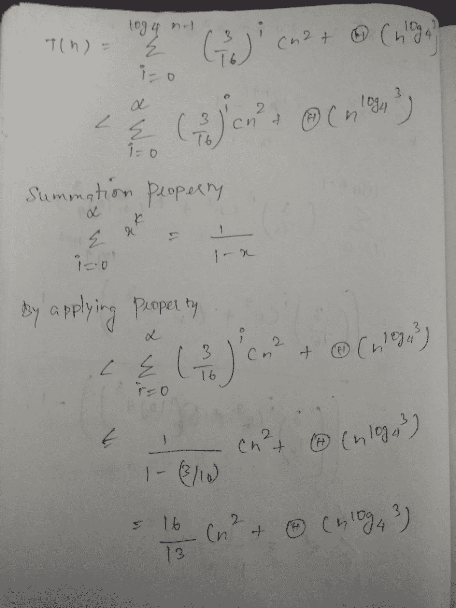

**最后,( 16/13) cn 项清楚地表明递归的上界为 O(n )**

本系列将继续…