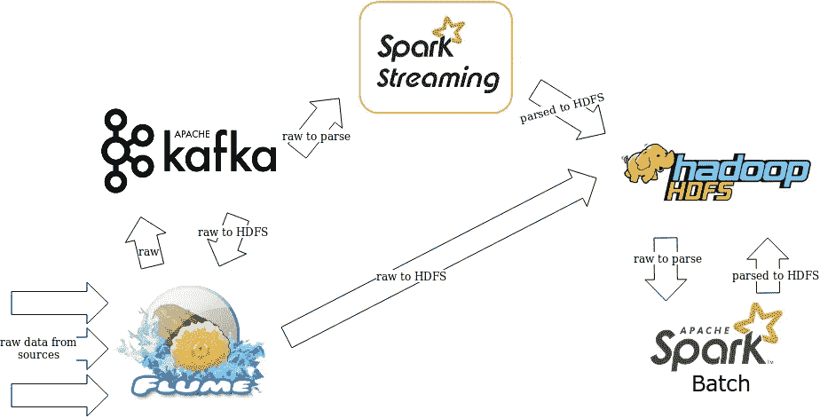
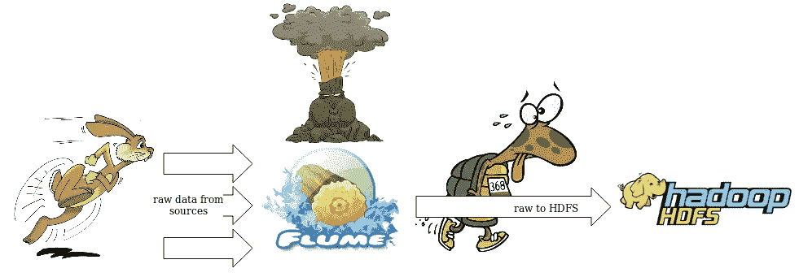

# 解决 Hadoop 集群中的稳定性问题——大数据与小数据

> 原文：<https://medium.datadriveninvestor.com/solving-stability-problems-in-hadoop-cluster-big-data-with-small-data-ce2989d91425?source=collection_archive---------4----------------------->

Fish in the lake. Image by [Quang Nguyen Vinh](https://www.pexels.com/@quang-nguyen-vinh-222549).

我目前是赛博湖大数据团队的一名团队负责人。

最初，项目从只有一个输入源的“小数据”开始(对于任何新项目来说，可能都是如此)。最终，当我们部署到生产时，我们有四个输入源。

 [## 为什么数据将改变投资管理|数据驱动的投资者

### 有人称之为“新石油”虽然它与黑金没有什么相似之处，但它的不断商品化…

www.datadriveninvestor.com](https://www.datadriveninvestor.com/2019/01/25/why-data-will-transform-investment-management/) 

稍后，我们的源代码将会有巨大的增加，缩放问题将会出现…

**背后的故事**

一开始，该团队在设置基础设施(Flafka、Hadoop 等)来接收和存储源时，遇到了性能问题。此外，他们在学习基础知识以克服这些障碍并充分利用当前服务器方面做得很好。

当我担任团队领导时，我们有大约九个流源和一个批处理输入，在 HDFS 使用 Parquet 格式进行接收、解析和存储。

自从上次性能问题得到解决后，我们没有遇到任何扩展问题。有一个巨大的资源我们无法扩展，我们在那个时候使用一个简单的 Scala 应用程序吸收了它，这个应用程序通过一些妥协扩展得更好(无论如何，这是另一个时代的故事)。

我们有一波新数据向我们涌来，尽管我们被每个源的数量和吞吐量蒙住了眼睛，我们甚至不知道有多少源将被连接。新连接的源由我们没有任何直接联系的第三方组织负责(与我们同一个组织中的一个中间人团队是此操作的 POC)。

每天都有意想不到的新数据源出现，而我所想的是，“我们可以把它们都消化掉！【内心的魔鬼】”。你现在可能会嘲笑我，但最终，我是对的！

当时，我们的任务是尽快接收这些新数据，也就是我们所说的“原始接收”。获取数据并以纯文本形式存储它(在我们部署合适的解析器之前的一个临时阶段)。

为了解析数据并将其转换成 Parquet 格式，我们使用了 Apache Spark。虽然我们对 Spark 有一点经验，但总的来说，我们有在 Spark 流中运行的解析器和作为 Spark 批处理操作运行的其他解析器。

在某个时候，我们连接了大约 23 个源(10 个从以前解析的，13 个新的原始源)。为所有新的原始数据建立了一个临时路径，与解析后的数据分开。

通常，我们在 HDFS 的所有路径都使用日期/时间格式进行索引，以每个源的小时数为单位(叶目录表示一天中的一个小时，以此类推)。

该架构很简单，如下图所示:

General architecture of our project.

**行动开始**

对于第一个用例，学习基础知识就足够了。然而，基础知识中没有涉及的是如何扩展。当我们试图摄取另一个大的来源(类似于前一个)，我们开始有稳定性问题，开始在水槽和 HDFS 结束。

缩放问题的难点在于检测它们。您不会在日志中看到一个可爱的错误:“错误:刚刚发生了缩放问题！请尽快解决这个问题”。你会发现一些奇怪的现象。

大约在解决方案出台前一个月，我们开始遇到无法解释的水槽服务故障。我们有三个运行高可用性(HA)的 Flume 实例，“随机地”，其中一个实例突然停止运行几分钟，然后由服务器上部署的监控代理重新启动。这些坠落受到监控，但没有任何通知(因为它们被归类为警告)。我的一个队友，无意间在查看监控历史的时候看到了这个问题。

当我们看到几乎每隔一两天就会发生同样的事情时，这是非常令人担忧的。我让同一个队友检查这些失败背后的原因，但是我们得到的都是关于内存不足异常和意外退出的错误日志。这些错误含糊不清，难以理解。

经过一天的调查，我们找不到任何解决方案的线索。除此之外，无论是管理层还是客户，都没有人为此烦恼；“只要数据完好无损，它就能正常工作……”

高要求的持续任务导致我们通过扩大 JVM 的 RAM 来修补问题，忘记它并继续我们的生活。

暂时的修补给了我们一些和平时期，但正是在这些时候，你会错过一些重要的东西。例如，我们的 HA 有限；并非所有来源都发送给所有三个代理(在另一个故事中，我们遇到并克服了一些技术限制)。

有一天，我们的一个用户在我们的数据中发现了一个漏洞！他让我们弄清楚发生了什么。我们彻底检查了一下，发现 Flume 以前的重启现在变成了几乎半个小时的停机时间，此外，跌落更加频繁，一次不止一次。

**解决问题**

在这种混乱的情况下，要确保每个人都意识到这个问题，更糟糕的是，会开始迫使每个人寻求解决方案。

我不会一步一步地解决这个具体问题，因为所有的稳定性问题看起来都很相似，但它们都是您的架构和配置所特有的。

最难的部分是理解日志，并将注意力集中在根本问题上，而不是症状上。当您阅读包含“内存不足异常”、“HFDS I/O 刷新错误”和大量“超时”的日志时，您会感到困惑。很快你就开始怀疑你所知道的关于弗卢姆、卡夫卡、HDFS 的任何东西，甚至你的代码。

这种情况的答案是专注于故事！日志只是试图讲述一个故事，当你单独阅读每一个日志时，你会错过更大的画面(故事)。当您运行标准的非分布式应用程序时，从日志中读取一行，甚至一系列行来理解问题非常有用。然而，它不再为你服务了。在开始的时候，浏览来自多个地方的成千上万行日志来连接这个故事似乎是不合理的，但是你会在没有任何其他选择的情况下找到它。

下图解释了问题的来龙去脉:

An illustration trying to explain the problem.

所以我们查看的所有日志都只是问题的症状。HDFS 日志中指出的根本问题是一个警告！日志中写道，“检测到 JVM 或主机暂停(例如 GC):大约 52372 毫秒的暂停等等。”

嗯，看起来警告(甚至括号)是这个故事中至关重要的一部分！他们填补了缺失的拼图。

HDFS 的 JVM GC 花了太多时间来完成它的工作。当 GC 工作时，你不能联系 HDFS，它停止响应。在这里，对于每个 DataNode，它每天在 53 次暂停中平均停止 37.8 秒(尤其是在高峰时间)。我敢肯定这不是一个好现象(想象一下，你在一分钟内有数百个来自 Flume 的连接，其中一半在每次暂停时都失败了)。

为什么会这样？我们是怎么到达那里的？这就是当你忘记软件的基本假设时会发生的事情。当我们忘记 HDFS 是用来存储大文件的时候，我们的伸缩问题就开始了。这是我们辜负了我们的 HDFS；我们直接存储原始源，这意味着存储了 8KB-2MB 的数千个文件，这意味着几乎每个文件在 HDFS 堆中都有一个块，这意味着我们有一个非常大的堆，这意味着堆已满，GC 很难响应，这意味着 HDFS 没有响应，这意味着 Flume 对 HDFS 的吞吐量低于源对 Flume 的吞吐量，这意味着 Flume 内存不足，因此会下降并重新启动。

完整的分辨率对于这篇文章来说太多了，所以我会在[后面的故事](https://medium.com/datadriveninvestor/big-data-small-files-problem-in-hdfs-ba8707ec46b)中解释。

**总结经验**

我们花了长达两周的时间才回到正常健康的集群(丢失了太多数据)。这是艰难的两周。我们觉得对这个问题负有很大的责任，但是我们不能理解它。我们通常是组织中非常受重视的团队。我们从零开始这个项目，之前没有任何大数据知识。这个问题突然搞乱了我们的名字，让我们所有人都非常震惊，包括管理层和我们的客户。我们拥有的坚如磐石的全能集群非常敏感，当不稳定袭来时，我们所有人都将度过一段艰难的时光。

因此，让我们和我们的客户回到现实的事情是，确保我的团队理解我们遇到的每一个难题以及为什么会出现这些难题(永远不要将任何事情归类为黑魔法)，此外，我给我的团队成员一个周期性的时间(有时作为任务的一部分，其他时间作为自由探索的时间)来重新学习基础知识并深入研究，检查并学习新功能，甚至理解我们使用的一些产品的源代码(当我们没有找到更好的信息源时)…

我们遇到的一件很棒的事情是检查我们拥有的关键产品的内部(只需搜索带有单词 internals 的任何内容)。我们开始分享我们学到的新东西，这样每个人都可以看到我们在精神上有多强大，并感受到我们巨大的责任感。

不要害怕拓展用户手册之外的知识；这就是你开箱即用的时候！