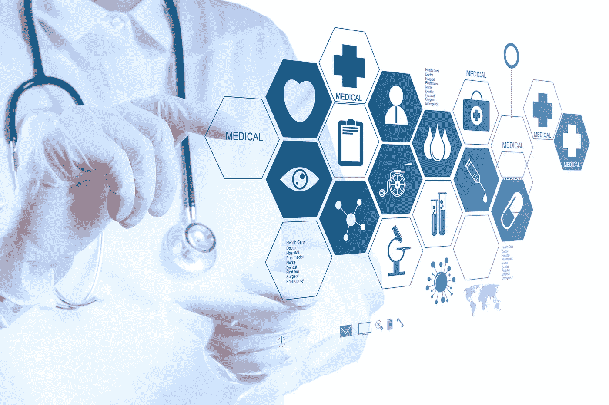

# 用人工智能解决医疗保健中的数据问题

> 原文：<https://medium.datadriveninvestor.com/solving-the-data-problem-in-healthcare-with-ai-aa238c754eb9?source=collection_archive---------4----------------------->

我们都听说过这样一句话:“一天一苹果，医生远离我。”但在现实中，一天几个小时的数据输入让医生远离。根据玛丽·米克尔的研究，全球医疗保健数据每年增长 48%。[医生最终花费了多达 2/3 的时间](https://www.forbes.com/sites/brucelee/2016/09/07/doctors-wasting-over-two-thirds-of-their-time-doing-paperwork/#5e907e9b5d7b)记录和整理数据，占用了患者的整体时间。即使医生能够与患者见面进行诊断，他们也经常会遗漏患者医疗和个人历史的关键累积数据点。

这就是人工智能拯救世界的地方。利用人工智能技术，医疗保健领域的数据问题和随之而来的时间问题可以得到有效处理。以 [Babylon Health](https://sciencebusiness.net/healthy-measures/news/your-virtual-doctor-will-see-you-now-ai-app-accurate-doctors-80-primary-care) 为例，这是一款新的智能手机医疗保健应用，可以诊断患者并提供治疗建议。Babylon Health 通过以下三个步骤开展工作:

*   收集关于患者症状的数据
*   挖掘数据并将患者信息与来自其他患者和研究论文的数据进行比较
*   做出诊断并建议治疗

通过数据挖掘和分析，Babylon Health 目前能够对 80%的初级保健疾病做出和医生一样准确的诊断。显然还有增长空间，但人工智能已经开始改变医疗保健行业。

**人工智能如何改变医疗保健**

数据驱动的人工智能技术可以解决医疗保健中的长期低效问题，并通过以下方式降低成本/时间负担:

*   实时分析数据并提供关键见解
*   预测潜在的未来状态
*   就最佳治疗提出建议，以满足医生和患者的目标

**为什么人工智能可以改变医疗保健**

现在，为什么人工智能能够显著改善医疗保健？以下是一些关键原因:

*   人工智能与不露面问题作斗争。平均 62%的预约被取消或错过，这导致每家医院损失[300 万美元](https://www.qminder.com/no-shows-affect-hospitals/)。
*   AI 可以方便地从一个人那里获得上下文和时间顺序数据。所有人需要做的就是用一个应用程序登记，而不是必须安排几个医生预约(可能不会出现，回到没有出现的问题。)
*   人工智能最终将提供同样准确的诊断，如果不是更准确的话。同样，人工智能可以访问更大的信息数据库，并更快地分析这些数据。

巴比伦健康只是整个可能性网络的开始。访问并理解医疗保健领域不断增长的海量数据是医疗保健转型不可或缺的一部分。通过利用数据驱动的人工智能技术和数据分析平台，医疗保健行业可以通过以干净高效的方式处理大量数字数据来实现转型。对于尚未欢迎人工智能的医疗保健公司来说，是时候利用它的强大功能了。

