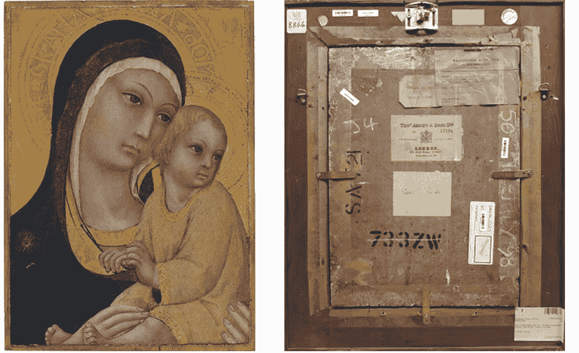
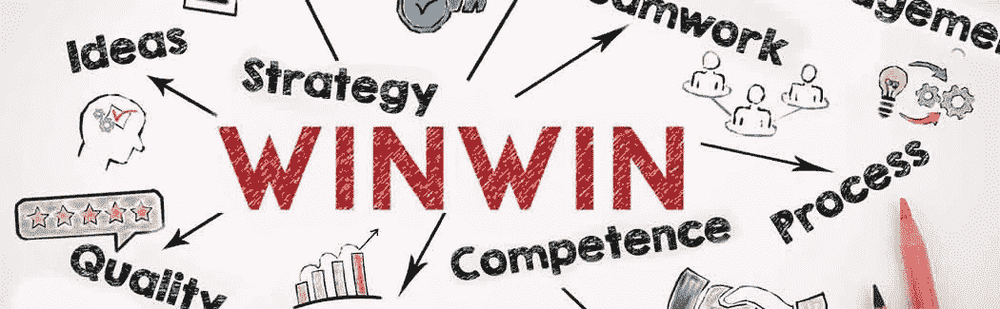
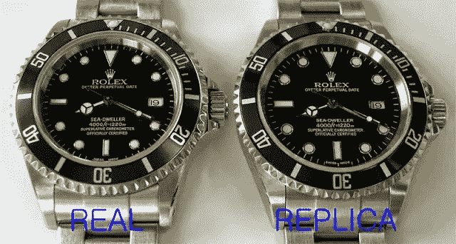
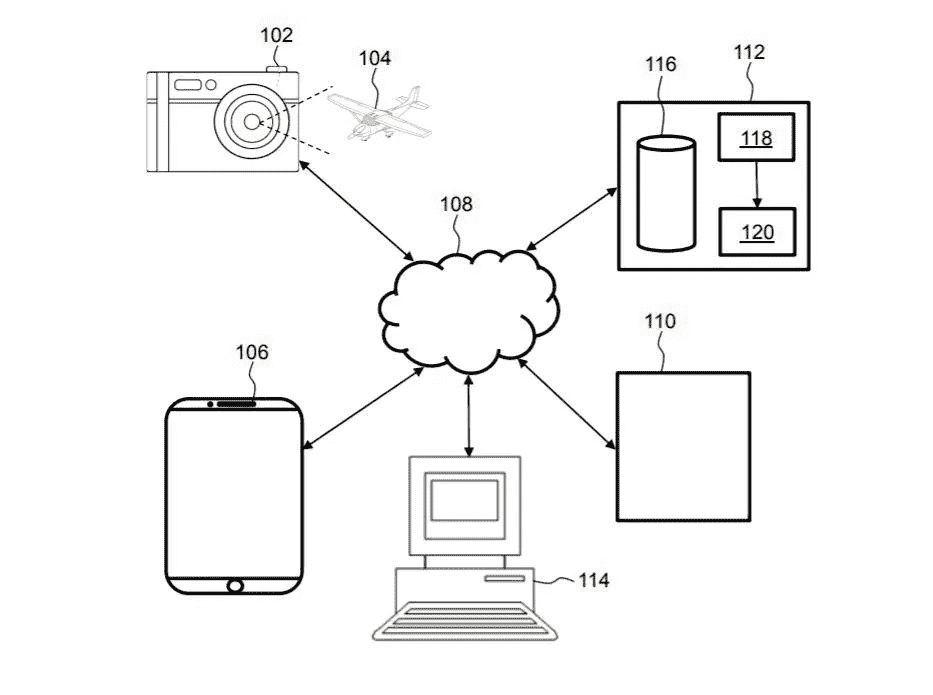
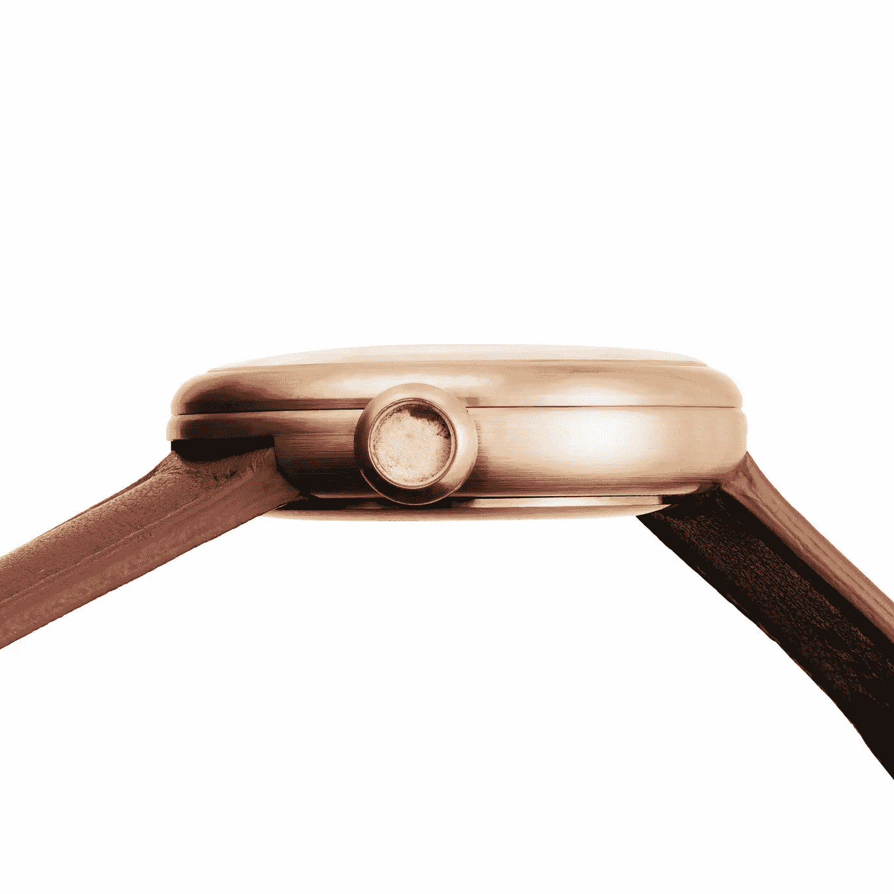

# SOMA——新的去中心化社交市场

> 原文：<https://medium.datadriveninvestor.com/soma-the-new-decentralized-social-marketplace-ad26dc70d6e8?source=collection_archive---------9----------------------->

2018 年 8 月 29 日，总部位于赫尔辛基的 SOMA 宣布从芬兰商业获得价值 5 万€的[首轮资金，芬兰商业](https://www.prnewswire.com/news-releases/soma-secures-first-round-of-funding-from-business-finland-to-grow-decentralized-social-marketplace-300703752.html)是芬兰经济事务和就业部的一个公共资助机构。按照标准，SOMA 有资格在第二轮获得高达€100 万英镑的资金，在第三轮获得高达€2000 万英镑的资金。

这些天来，大多数政府都对区块链项目持怀疑态度，这让我想知道为什么芬兰政府对这个项目感兴趣。我认为回顾和发现 SOMA 提供了什么是有趣的，它吸引了来自芬兰商业的资金。

首先，给它 50 次掌声，然后开始享受吧！

# 简介—问题

网上购物无疑改变了我们购物和生活的方式。它帮助人们在自己家里舒适地从世界任何地方购买新的或二手的产品。根据最新报告，全球[电子商务市场](https://www.grandviewresearch.com/industry-analysis/b2c-e-commerce-market)预计到 2025 年将达到 77，248 亿美元。目前，亚马逊、易贝、阿里巴巴等少数几家公司主导了市场，这导致了市场操纵，并带来了一系列集中化问题。

随着这个行业开始成长，很明显网上购物的世界并不总是美好的。这些问题包括过度集中、垄断、供应链管理、支付问题、透明度、费用、个人数据安全等。

不考虑网上购物提供的所有便利，网上购物者将缺少的一个重要方面是社交互动因素。如果你看看交易的历史，社会互动是一个关键因素，有助于建立信任，并给购物者一个独特的购物体验。

区块链项目 SOMA 已经准备好将社交互动因素带回来

# 那么什么是索玛呢？

> Soma 是一个革命性的去中心化平台，它通过区块链技术和本地加密货币(Soma Community Token，或 SCT)在 Soma 社区内实现流动性，从而促进贸易和社交互动。通过解除价值链的中介，买卖双方可以实现更大的利润。与此同时，创新的奖励系统激励有益的合作，并确保增值服务得到补偿——雅各布·安德拉，CMO @索玛

简而言之， [SOMA](https://soma.co/) 是无可争议的“第一种”分散市场，在这里，卖家和买家可以安全可靠地相互交易。不像传统的在线购物门户依赖于产品评论或评级(其中大部分是假货)，SOMA 利用了良好的社交互动因素(喜欢、分享等)。)来帮助买家做出决策，并向他提供真实的反馈。

对于参与平台的用户，SOMA 鼓励并奖励他们 SOMA 令牌(SCT)。由于所有的互动都是有偿的，这将有助于创造更多的用户参与，从而有助于产品接触更多的受众。SOMA 奖励系统还将积极参与者视为向目标受众推广产品的核心要素，并作为托管代理来保护所有交易。

# 索马生态系统一瞥。

SOMA 生态系统的核心组件将是计划于 2019 年推出的 marketplace。总部位于区块链的 SOMA marketplace 将采用基于以太坊的智能合约，使其用户能够创建正在申请专利的“互动物品卡(IIC)”。

[Sano di Pietro (1405–1481), *The Madonna and Child,* circa 1450](http://www.christies.com/lotfinder/paintings/sano-di-pietro-the-madonna-and-5916237-details.aspx). Sold for £170,500 in the [Old Masters and British Paintings evening sale](http://www.christies.com/salelanding/index.aspx?intSaleID=25138) on 9 July 2015\. Right: the reverse of the painting reveals dealers’ labels, exhibition labels, and old Christie’s stock numbers

让我们试着理解基于高价值艺术市场的“互动项目卡(IIC)”。大多数画廊会给他们买卖的艺术品贴上标签。背板上的画廊标签可以告诉你一个简短的历史，包括哪些画廊拥有这幅画，他们购买它的年份，修复年份(如果有的话)等。它还可以揭示对艺术品估价最重要的所有权链(出处)。如果所有权链中包括一位公爵或皇室成员，艺术品的价格就会飙升

与上面的标签类似，交互式物品卡提供了所列产品的数字标签。它将存储与项目相关的所有数据，如历史、质量、价格历史、产品状况、损坏等。不可篡改的区块链。久而久之卡的社会价值增加了，因为所有的交易都被记录下来并贴上标签，提供了产品的明确出处。由于物品卡是和产品一起传递的，它有助于购买者了解清楚的出处，并对产品有一个诚实的评价。

正如在 [SOMA 白皮书](https://soma.co/wp-content/uploads/2018/08/SOMA_Whitepaper.pdf)中所讨论的，互动物品卡不仅对买卖双方有利，对社区成员也有好处。任何社区成员都可以推广其他用户创建的 IIC，并获得 SCT 作为奖励。因为用户也可以通过在买卖双方的交易中充当可信的第三方来接收 SCT，从而保护双方的利益。所有互动物品卡数据都记录在以太坊区块链上，智能合约管理平台交易。这提供了非常高的透明度，并消除了对可信第三方或中央权力的需求。

让我们看看 SOMA 对个人和企业都有什么好处。

## 个人。

*   更好的价格实现(不涉及中间商)。
*   全球拓展(不像传统市场有区域限制，SOMA 是一个没有边界的开放市场)。
*   清晰的出处(IIC 卡提供了清晰的防篡改历史)
*   社会互动因素(与真实的人交易和互动)
*   去中心化(告别垄断)
*   参与并获得奖励。

## 企业。

*   更好地接触真正的客户
*   出处(有助于保护您的产品不被假冒)
*   更好的外联
*   大数据有助于更好的决策

# SOMA 用例——手表行业

## 问题是

T2，你能看出 12000 美元的劳力士真品和 120 美元的仿制品之间的区别吗？

原装劳力士由高质量的贵金属合金制成，如金、铂或钢，而复制品则由不合格的金属制成。不幸的是，大多数用户看不出区别，最终会购买复制品，有时会支付原价。

你会惊讶地知道，假表行业价值十亿美元。根据 24/7 Wall St 发表的一篇文章，假冒手表占海关收缴量的 11%。据报道，仅在 [2016](https://nobswatchmaker.com/blog/fake-watches-are-a-billion-dollar-industry) 一年，执法部门就查获价值 6.536 亿美元的货物。

根据数据，估计每年生产 4000 万只假冒手表，比瑞士的年产量多 25%。随着互联网的到来，仿制手表的销量开始增加，现在在阿里巴巴、易贝、亚马逊等在线购物网站上随处可见。

假冒对制造商和用户都有影响。虽然品牌遭受了声誉和财务损失，但用户却遭受了糟糕的体验，在某些情况下，他们最终还会为复制品支付更高的价格。

## 解决方法。

在开始之前，我们应该先了解一下正在申请专利的 SOMA**Heimdall 协议**。([来源](https://medium.com/@soma_sct/soma-usp-part-i-the-heimdall-protocol-cd23f02b0f45)

根据[官方消息。](https://medium.com/@soma_sct/soma-usp-part-i-the-heimdall-protocol-cd23f02b0f45)

> Heimdall 是一个正在申请专利的协议，用于以数字方式表示物理项目及其出处。它存储有关所有权历史、项目在关键时间点的状况(如所有权转移)的信息，以及适当的项目真实性验证。
> 
> 一旦为项目创建了 Heimdall 的实例化，它就可以被追加，但永远不会被更改。状态、条件或所有权的每一个变化都被保存为不可改变的记录。新的信息可以不断地添加到记录中，创造出越来越详细的物品、其出处及其随后的历史。

一旦制表师成为该计划的一部分，他就可以在 SOMA marketplace 中列出他的贵重时计以及一张互动物品卡(IIC)。互动项目卡(IIC)将作为数字信息存储器，存储有关钟表的 A 到 Z 信息，如所用材料、部件数量、产品的各种图像和视频等。

所有平台用户都将能够访问商品卡，该卡将为他们提供所列产品的详细信息。任何新的变化将被进一步记录在物品卡中，所有数据将被存储在防篡改的区块链中。用户既可以使用 SCT 作为支付方式，也可以选择使用其他货币(加密/法定货币)。

从营销的角度来看，由于 SOMA 平台中的所有社交互动(如，分享，评论)都以 SCT 作为奖励，因此平台用户将被鼓励推广物品卡，这使得产品能够更广泛地传播。

从购买者的角度来看，由于产品的所有数据都记录在防篡改的区块链中，这有助于他确定产品的来源。由于商品卡将在销售过程中转让给新的所有者，因此它也可以作为担保凭证。将来，如果当前用户希望转售该产品，他只需在 SOMA 平台上列出该产品以及商品卡，这将有助于他实现更好的价格。

SOMA 已经准备好运行一个试点项目，并为下一阶段的全球扩展做准备。该试点项目计划于 2019 年在 Q1 开始，并将于 2019 年在整个 Q2 开展。SOMA 已经开始与企业参与者合作，以便该平台在启动该计划的用户获取部分之前有足够的商品。

像[【萨沃特】](https://soma.co/2018/10/11/savot-watches-joins-soma-pilot/)[德维斯](https://soma.co/2018/09/30/dwiss-soma-swiss-watches-blockchain/)[西皮兰·凯洛](https://medium.com/somabusiness/sipil%C3%A4nkello-to-participate-in-soma-pilot-f40301a8c290)[迪芬多夫](https://soma.co/2018/10/01/diefendorff-luxury-watches-on-blockchain/)等领先的制表商已经签署了 SOMA 试点计划

如果你是手表制造商或零售商，你可以联系 partners@soma.co[公司](mailto:partners@soma.co)寻求合作。

# 里程碑和进展

SOMA 已经与 Q2 2018 发布的 **MVP 路线图保持一致。**过去的一些里程碑包括

*   2016 — Q3 — SOMA 开始
*   2016 年第 4 季度–第一轮融资
*   2017 年— Q2 —首个应用原型
*   2018 年— Q1 —安卓应用
*   2018 — Q2 — MVP 发布

说到 Github 活动，只有两个存储库是最少的。这可能会引发一个危险信号，但是在某些情况下，项目团队更喜欢保持代码私有。

# 组

SOMA 总部位于芬兰，联合创始人 Jukka Hilmola 和 Jacob Andra 在 SOMA 团队其他成员的帮助下推动公司前进

# 代币

SCT (SOMA 社区令牌)是一个 ERC20 令牌。SOMA 于 2017 年 9 月 27 日举办了 ICO，在 ICO 中销售了 400 万枚代币。

你可以在这里阅读更多关于令牌结构的信息

# 尾注。

目前，传统的电子商务市场被少数玩家控制，过于集中，最大的优势只有垄断者才能享受。另一方面，SOMA 基于一种分散的模型，这种模型为用户提供了更加真实、高效和个性化的交易体验。

在我审查的所有项目中，SOMA 是具有强大基础的项目之一。一个更积极的事实是来自芬兰商业的投资，以及顶级制表商越来越有兴趣参与试点项目。

SOMA 将面临的最大挑战是市场用户的增加。我们需要等到 2019 年，看看用户将如何回应这个创新和透明的市场。

# 加入 SOMA

网址:[https://soma.co/](https://soma.co/)
电报:[https://t.me/Somacommunity](https://t.me/Somacommunity)
推特:[https://twitter.com/SomaToken](https://twitter.com/SomaToken)
脸书:[https://www.facebook.com/socialmarketapp/](https://www.facebook.com/socialmarketapp/)
LinkedIn:[https://www . LinkedIn . com/company/soma-decentralized-social-market/](https://www.linkedin.com/company/soma-decentralized-social-marketplace/)
Medium:[https://medium.com/@soma_sct](https://medium.com/@soma_sct)
GitHub:[https://github.com/soma-mvp](https://github.com/soma-mvp)
Reddit:[http://www.reddit.com/u/soma_sct](http://www.reddit.com/u/soma_sct)

***免责声明*** *:本文无意作为投资建议。我没有任何代币。这只是我对 SOMA 项目的看法。一如既往的 DYOR。*