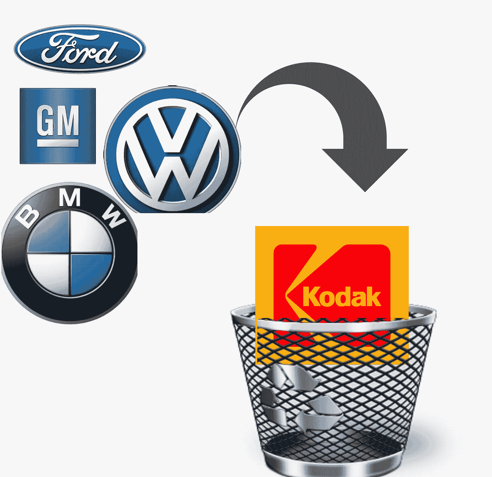

# 一些主要汽车制造商将在 10 年内步柯达的后尘

> 原文：<https://medium.datadriveninvestor.com/some-major-car-manufacturers-will-go-the-way-of-kodak-within-10-years-8ff99beb2229?source=collection_archive---------2----------------------->

Example companies not necessarily predicted to happen

汽车行业正在经历一场戏剧性的颠覆性变革，与柯达的相似之处不容忽视。

内燃机汽车将在未来 5-10 年内完全被电动汽车取代——拐点将是电动汽车的成本低于内燃机汽车的成本。电动汽车的总拥有成本已经降低了——它们的运行和维修成本更低，因为它们出问题的部件更少。

柯达是一家摄影胶片公司，在 1975 年生产了第一台数码相机，但后来因为担心它会侵蚀他们现有的基于胶片的商业模式而放弃了它——这是一个自杀的决定，导致了 2012 年申请破产保护。当诺基亚在 2003 年将数码相机引入手机时，他们确实重新进入了数码市场，尽管他们能够在数码领域竞争，但他们遗留的电影业务最终摧毁了他们。

通用汽车在 1996 年生产了一款名为 EV1 的电动汽车，并出租给消费者。1999 年，它迫使这些消费者归还他们的汽车，他们试图以此来阻止电动汽车革命。2010 年，通用汽车凭借雪佛兰 Volt 重返电动汽车市场。这是一款插电式混合动力车，不具备真正电动车的简单性。通用汽车，今天继续生产内燃机车作为其主要的商业模式。所有其他汽车公司都计划引入电动汽车，但它们的主要商业模式仍然是 ICE。只有沃尔沃宣布，从 2019 年起，所有新车都将是电动汽车。

公众对电动汽车的态度将遵循与数码摄影革命相似的模式。一旦分辨率接近胶片的相机价格下降到胶片相机的价格，就没有回头路可走了——转换发生得非常快，变化的速度让柯达大吃一惊——他们无法应对。不同之处在于没有冲洗成本，柯达的商业模式被摧毁。

特斯拉 Model 3 超过 10 年的总拥有成本低于大多数 ICE 汽车。尽管 35000 美元的 Model 3 基价高于一些 ice 汽车，但这实际上是美国新车的平均价格，因此客户突然转向的拐点已经不远了。这可能导致 5 年内没有人购买新的 ICE 汽车。

汽车市场还有一个更致命的因素。许多美国和欧洲人从汽车制造商那里租赁汽车。由于 5 年内没有人购买新车，没有多少人会在同一时期购买二手车。租赁金融模型假设租赁结束时汽车的剩余价格，如果该价值接近于零，那么汽车的所有者(通常是经营租赁的汽车制造商)将为负资产。仅此一项就能让汽车制造商破产，更不用说摧毁他们在现已过时的 ICE 汽车上的所有投资价值了。

柯达知道数码相机存在问题，并对其进行了大量投资。然而，他们没有意识到转变的速度会如此突然，因为他们继续他们的电影业务，他们被摧毁了。

汽车制造商将面临同样的突然变化。他们应该走沃尔沃的路线，立即停止生产任何 ICE 汽车，但他们仍然没有意识到将要发生什么。他们还需要在租赁协议中停止成为汽车的所有者。对汽车制造商来说，一切都将变得非常困难。