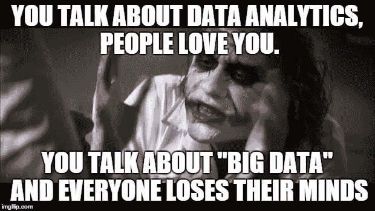

# 一些古怪的数据科学建议，以及学习经济

> 原文：<https://medium.datadriveninvestor.com/some-quirky-data-science-advice-and-the-thing-with-economies-of-learning-a3ccc8f708fe?source=collection_archive---------7----------------------->

Image credit: analyticsindiamag

随着数据科学领域的职业变得越来越普遍，您会从各种来源找到关于什么是数据科学，什么不是数据科学的学术建议。一般来说，这些都是真正的好建议。但有时这些很奇怪。

让我总结一下目前为止我见过的最厚脸皮的 5 个:

*   **银行家的观点:** *机器学习的债务现在锁定在 xx 亿美元，需要偿还！*

 [## 金融中的机器学习|数据驱动的投资者

### 在我们讲述一些机器学习金融应用之前，我们先来了解一下什么是机器学习。机器…

www.datadriveninvestor.com](https://www.datadriveninvestor.com/2019/02/08/machine-learning-in-finance/) 

-同意，机器学习只是整个数据管道中的一小部分，如果没有数据摄取、存储、清理、预处理和所有数据工程活动，我们在那个小小的 ML 盒子中所做的一切都无法完成。而是赋予它一个货币价值并要求偿还！太搞笑了。

*   **受压迫者的观点:** *多年来，机器学习一直对代表不足的人有偏见。*

-是的，但那是因为人工智能模型从数据中学习。当你不在数据中时，模型就很难考虑你在现实中存在的事实——不管你是男人还是女人，小孩还是老人，中产阶级还是无产阶级。

*   **商人的看法:** *ML 算法是打一毛钱的，你需要的只是 excel 和 power-point 来编织故事。*

-好的，给我举一个行业中 excel、PowerPoint 和讲故事能力不重要的例子。这条意见如何单独具体适用于机器学习领域？

*   **哲学家的观点:** *没有什么是永恒的！今天深度学习闪闪发光，明天它将成为一种商品。*

-没错，AutoML 服务将会使今天备受推崇的许多技能商品化。纵观任何领域技术进步的历史，技能来了又去——唯一重要的技能是学习新技能的能力。这正是我对这种片面表达的问题所在——它促使你不去学习什么是深度学习。对学习经济的一种解释是，你学得越多，你就越容易学到新东西。今天是技术-A，明天会有技术-B，但是你掌握了技术-A 的事实可能会让你更容易更有效地学习和适应技术-B。

*   **中层管理者的观点:** *做对就行。*
*   不，耐克广告歌的抄袭不是我的问题。这里的表达暗示，只要一项工作做得“正确”，如何做并不重要。这在任何其他工程/商业领域都是正确的，但在数据科学的世界里，这与事实相去甚远。数据科学既是科学，也是艺术——你如何定义艺术形式中的“正确”呢？今天“正确”的东西明天还会“正确”吗？通常情况下，数据科学没有对错之分，而是一个连续体，所有利益相关者都有责任在给定的环境下定义什么是“正确的”。你的老板或客户可能没有兴趣知道你使用了什么算法，或者为了达到那个结果你必须写多少行代码——这没关系。但是白天的组织对事情是如何做的视而不见，道德和诚信的观念被抛弃，一个 ***剑桥分析*** 诞生了。