# 关于金融时间序列的一些程式化事实——使用 Python

> 原文：<https://medium.datadriveninvestor.com/some-stylized-facts-about-financial-time-series-with-python-11148137fccf?source=collection_archive---------0----------------------->


## 展示股票收益的经验证据

时间序列分析在金融市场中至关重要，因为它主要基于对股票价格的分析和预测其未来价值的尝试。

在这篇文章中，我将详述一些关于时间序列的典型事实。为此，我将使用 Altaba 的历史股价。你可以在 [Kaggle](https://www.kaggle.com/szrlee/stock-time-series-20050101-to-20171231) 上轻松下载数据集。

[](https://www.datadriveninvestor.com/2019/03/06/top-4-artificial-intelligence-stocks-to-buy-and-why/) [## 值得购买的 4 大人工智能股票及其原因|数据驱动型投资者

### 人工智能(AI)在 2019 年继续进入大众意识。通过应用程序…

www.datadriveninvestor.com](https://www.datadriveninvestor.com/2019/03/06/top-4-artificial-intelligence-stocks-to-buy-and-why/) 

# 导入和准备数据

```
import pandas as pd
df=pd.read_csv('AABA.csv')

ts=df.iloc[:,[0,4]] #taking only the closing price
ts.set_index('date', inplace=True)
ts.head()
```

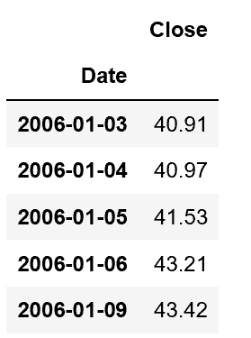

```
import matplotlib.pyplot as plt 
ts.plot() 
plt.xticks(rotation=45)
```

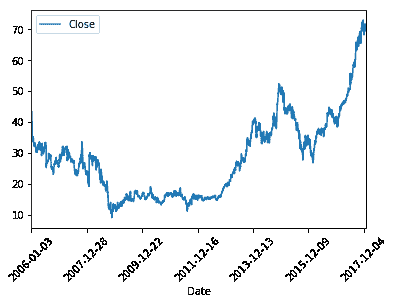

从直觉上看，价格序列看起来并不稳定，这可以从(随机或甚至确定性)趋势的存在和与无条件均值的长期偏离中推断出来。这意味着今天的价格可以解释明天的价格。

理想情况下，我们希望管理平稳的序列，以绕过时间序列的主要问题:在固定时间 t 不可能观察到股票/指数的所有可能实现。事实上，我们只观察任何给定股票在不同时间的一条实现路径。然而，如果我们假设平稳性，我们有:

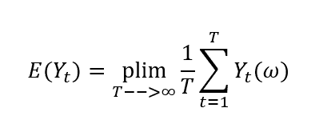

如果我们假设遍历性:

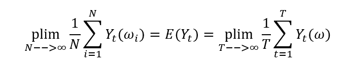

一般来说，收益序列更有可能是平稳的(或者至少是趋势平稳或综合过程:它们都很容易转化为平稳过程)。

```
prices=ts['close'] 
daily_return = prices.pct_change(1) 
ts['returns']=daily_return 
ts.iloc[:,1].plot() 
plt.xticks(rotation=45)
```

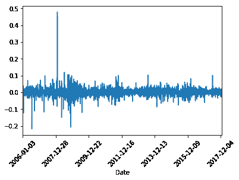

检查程式化事实之前的最后一步是再次将我们的回报转换成对数回报。

为什么我们使用 log-return 而不是 normal return？一个简单而有力的理由是，从数学的角度来看，它们很容易管理。实际上，让我们考虑一下我们拥有的一系列 n 笔交易的复合正常回报:

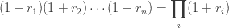

这个公式很难管理，因为正态分布变量的乘积不是正态的。相反，正态分布变量的和是正态的(仅当所有变量不相关时)，这在我们回忆以下对数恒等式时很有用:

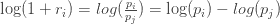

因此，复利是正态分布的。最后，这个身份引导我们:

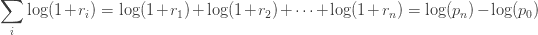

因此，对数收益具有时间可加性。

此外，如果我们*假设*价格服从对数正态分布(实际上，对于任何给定的价格序列，这可能是真的，也可能不是真的)，那么

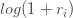

是正态分布的，因为:

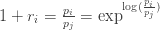

让我们来转换我们的数据:

```
ts['log_return'] = np.log(1 + ts['returns']) 
ts.iloc[:,2].plot() 
plt.xticks(rotation=45)
```

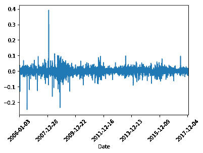

我们现在可以开始分析金融时间序列的一些共同方面。

# 收益不服从正态分布

价格往往不是对数正态分布的，因此对数收益也不是正态分布的。

```
mean = ts['log_return'].mean()
std = ts['log_return'].std()
ts['log_return'].hist(bins=20)

plt.axvline(x=mean, color='r', linestyle='--')
plt.axvline(x=std, color='k', linestyle='--')
plt.axvline(x=-std, color='k', linestyle='--')

plt.show()
```

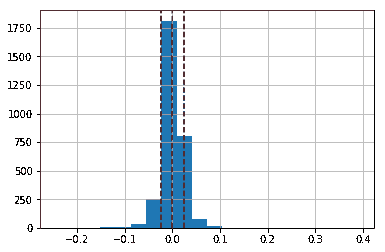

让我们用 Jarque-Bera 检验来检查它们的正态性，这里的[零假设](https://towardsdatascience.com/hypothesis-tests-and-p-value-a-gentle-introduction-4b52322bfc50)是“数据正态分布”:

```
from scipy import stats
x=np.asarray(ts['log_return'].dropna())
vstats.jarque_bera(x) #the second value is the p-value

Output:
(137611.29450582498, 0.0)
```

如果数据来自正态分布，JB 统计量渐近地具有两个自由度的卡方分布。事实上，这个测试只能在超过 2000 次观察的情况下在 Python 上运行。由于 p 值小于 *aplha* 的任何显著水平，我们可以拒绝零，并得出数据不遵循正态分布的结论。

# 回报序列是薄的

从经验数据来看，无论是负的还是正的，大回报都比正态分布更有可能出现。此外，非常小的回报，无论是正面的还是负面的，也更有可能发生。这意味着收益的分布有更大的概率集中在尾部(比正常情况下更重的尾部)和零的附近(更高的峰值)。在数字中，这意味着收益分布的峰度:

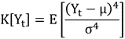

大于 3。因此，返回分布被称为“轻点分布”。

```
from scipy.stats import kurtosis 
kurtosis(x) Output: 33.06489953805719
```

# 回报受波动聚类的影响

考察 AABA 的回报，有证据表明，高波动性往往集中在一个时期，低波动性也是如此。

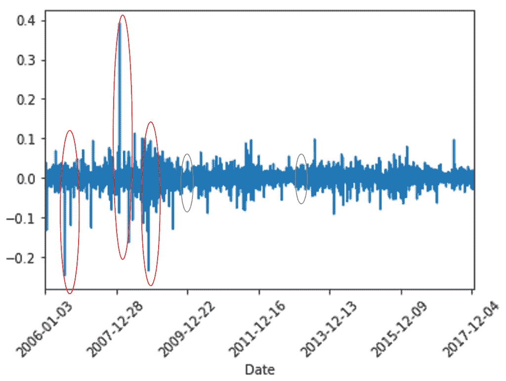

事实上，从图表中，我们可以看到高波动期(红圈)，而我们有低波动期(绿圈)。一旦有了这些证据，用考虑到这种现象(也称为异方差)的算法来模拟我们的时间序列可能是有用的。这些模型是 ARCH 和 GARCH，它不同于标准的自回归移动平均(ARMA)模型，因为不再假设同质性(你可以在这里阅读更多关于 ARMA 模型[)。](https://medium.com/dataseries/time-series-analysis-with-python-f5ab388b865a)

# 巨大的负回报往往伴随着高波动期

看上面的图表，我们可以看到，每一个高波动时期都是从回报下降开始的。背后的原因是经济主体对负回报反应过度，不良预期和不确定性在金融市场中蔓延，导致高度波动的局面。

# 日内回报受制于典型的交易时段效应

实证数据表明，在开盘和收盘时间，收益率的波动性更为显著。原因是在这些时刻，交易量高于一天中的其他时刻。因为我们在样本数据中没有足够高的频率，所以我们无法在图表上显示出来。

# 结论

记住这些金融时间序列中的重复元素，它们可以在构建股票价格预测模型时被纳入。举个例子，近年来，行为基金，一种使用行为金融作为其投资策略基础的共同基金，变得非常受欢迎，因为它们结合了代理人的行为特征(如对负回报的过度反应)。

*原载于 2019 年 9 月 6 日*[*【http://datasciencechalktalk.com】*](https://datasciencechalktalk.com/2019/09/06/some-stylized-facts-about-financial-time-series-with-python/)*。*