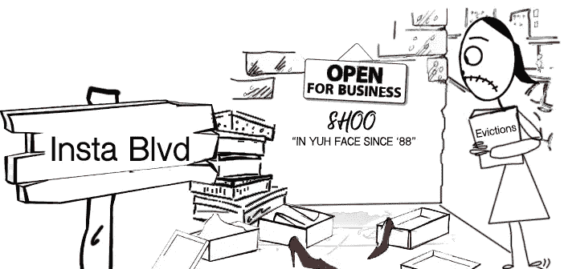

# 社交媒体还是网站？如何知道你的企业符合哪一个条件

> 原文：<https://medium.datadriveninvestor.com/something-greater-than-social-media-is-here-19a0583a85a0?source=collection_archive---------12----------------------->

有一段时间，我观察到一种非常强烈的针对本地创始人的行为，他们更喜欢社交媒体的舒适，而不是投资一个网站。撇开意图不谈，武力失败是因为它违反了明确的界限。你能想象有人在被拒之门外后跳窗而入是什么感觉吗？如果你明白谁是你的理想客户，这是完全不可避免的。拥有一家企业并不意味着一个人有资格拥有一个网站，就像去教堂做礼拜并不能让一个人成为基督徒一样。

这些盲点很容易让网页设计师和网页设计爱好者用错误的钥匙探索社交媒体的情况。[点击这里学习让你有资格拥有一个网站的 10 件事。](https://bit.ly/socialmediaonwebsite)

# 营销困境

对于那些沉迷于社交媒体的人来说，他们对于拥有一个商业网站意味着什么有一个错误的概念。他们认为这与其说是资产，不如说是负债。[(我在这里谈到了为什么会这样)](http://www.thebrandtub.com/single-post/DontSellDreamsSellReality)在上下文中，他们是绝对正确的。如果没有清晰的声音，不了解是什么让他们成为合作伙伴，或者不清楚谁最适合与他们合作，他们的投资将完全是浪费时间！但这不是他们的重点。除了他们的想法更多地停留在大量的附加成本，如域名，托管，设计，商业电子邮件，更新，等等。但是，意识到需要在线存在来跟上数字时代，他们放弃了在线营销业务，转而寻求社交媒体的“便利”。没有意识到他们在技术上已经决定成为一个棚户或路边小贩。

好吧，是的，这些平台允许我们免费使用它们，但是，这种安排的现实是，你在别人的商店里开店，却没有任何权利和所有权。你还能如何解释没有责任的清除账户的能力？因为你没有支付任何报酬或安全性，当脸书或 Instagram 因违反他们的社区准则而决定封锁或删除你的商业账户时，即使没有找到任何证据支持他们的说法，你也是一个坐以待毙的人。

# 难道你不想在属于你的财产上建造房屋吗？

这就是拥有一个企业网站相对于拥有一个企业社交媒体页面的优势:你不仅仅是在投资一项行为，你也为自己提供了一个安全网。把它想象成一个音乐家对他们的主人的所有权:通过(就网站而言)一个你控制的渠道，以你想要的方式发布内容的创作自由。为了防止电梯无法直达顶楼，如果你丢失了现有的社交媒体页面，你可以随意建议“创建一个新的社交媒体页面”，这是对本文所涵盖内容的紧迫性的一种麻木不仁的回应，也是你不适合拥有一个网站的原因。像你这样的人可能会让整整一年的托管费像水一样从你的背上滚下来:别担心。

如果你使用社交媒体来获得客户，那么一个新的页面将不会保护你免受未来恶意攻击的影响，这些恶意攻击可能会阻碍你营销服务的能力。是的，总是有报告的情况，但直到你真的参与了报告，你永远不会知道这些平台是多么无用。

我们都知道那些因为社交媒体账户被真正负责平台的人删除而失去追随者甚至生意的企业主的恐怖。我们不知道的是这些账户中有多少是被恶意攻击的。因此，你不仅受制于他们不与你分享的信息，这样你就可以保护自己继续前进，而且看起来，你也受制于他们的耐心。

…不公平？是啊，但这就是没有优势的现实。

# 比社交媒体更伟大的东西在这里！

你花时间做这些内容营销，但目的是什么？数字、份额、节省和您的参与度评级是实现特定目标的里程碑。你策略的一部分还应该包括将产生的兴趣驱动回你控制的空间，该空间能够将可见性之外的正确兴趣转化为实际业务。这个空间(对于我们这些有真正专业知识的人来说)叫做网站。没有它，你就失去了销售漏斗的一个基本部分。

这是对工具的误解；不知道它们适合什么地方，什么时候你需要它们，以及谁真正需要它们。

你的社交媒体页面并不是网站的替代品。但是，你也不应该投资一个网站，如果你没有声誉杠杆，但我跑题了。避免陷入“社交媒体的便利”的叙述中；这是一种错觉。问问你自己，拥有一个网站的成本是否大于你无法回复工作查询的成本，或者某人真正的兴趣因链接中断而被发掘的成本。

我是**品牌桶的创始人和视觉品牌策略师**