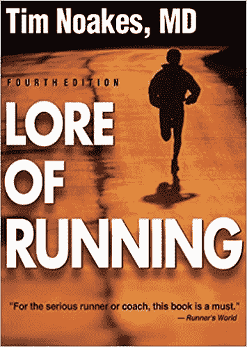

# 有时你必须烧船

> 原文：<https://medium.datadriveninvestor.com/sometimes-you-must-burn-the-boats-57f487849b89?source=collection_archive---------34----------------------->

“person standing near cliff” by [Leio McLaren (@leiomclaren)](https://unsplash.com/@leio?utm_source=medium&utm_medium=referral) on [Unsplash](https://unsplash.com?utm_source=medium&utm_medium=referral)

## 为什么恐惧设置会在你接受大目标时对你不利

我最近看了 Tim Ferriss 的一个 Ted 演讲，关于定义你的恐惧而不是你的目标。他的讲话摘要指出:

> “艰难的选择——我们最害怕做、问、说的事情——往往正是我们需要做的事情。怎样才能克服自我麻痹，采取行动？”

四个月前(2018 年 6 月)，我离开了亚马逊的工作，去追求一个职业生涯的梦想，那就是建立一家科技创业公司。

在离开亚马逊之前，我故意没有建立对恐惧环境至关重要的后备计划和风险缓解策略。如果我这么做了，我现在还会坐在亚马逊的办公桌前，琢磨着什么时候是合适的时机。事实是，永远不会有离开的好时机。

我知道我需要变得勇敢。创业成功的统计概率是个位数。说到高风险的目标，我认为你必须破釜沉舟。

> "如果你想占领这个岛，你需要烧船."——托尼·罗宾斯

深入探索你的恐惧，并找到限制或修复想象中的损害的方法(也称为风险缓解)可能会帮助你克服恐惧，但它实际上可能会损害你的整体成功机会。为什么？*你的大脑。*

早在 2009 年，我刚刚开始痴迷于耐力运动，我读了蒂姆·诺克斯教授写的一本书，名为《T4 跑步常识》。

[Buy it on Amazon!](https://www.amazon.com/Lore-Running-4th-Timothy-Noakes/dp/0873229592) :-)

诺克斯博士在他的书中概述了他的中央总督理论。中央调控理论基于这样一个前提，即在你对自己造成严重或永久性伤害之前，大脑会超越你奔跑的身体能力，并“关闭身体”。这就是为什么你可能会觉得你不可能在赛跑中跑得更快，然后终点线出现在眼前，你突然踢了一脚！

中枢调控理论围绕着大脑在保护体内平衡中的作用；还记得马斯洛的需求层次理论吗？体内平衡的原则超越了我们的身体，包括安全、归属和尊重。马斯洛认为，所有这些需求都是生存需求。

值得我们关注的大目标意味着把我们推出舒适区。他们应该是可怕的！为了成功，你需要你大脑中的每一个神经元都相信你必须成功。给它一个“更容易”或更理性的备选方案，我保证你的大脑会说服你接受它。

我在燃烧我的船，敢于失败。

> "只有敢于彻底失败的人才能取得伟大的成就."—罗伯特·F·肯尼迪