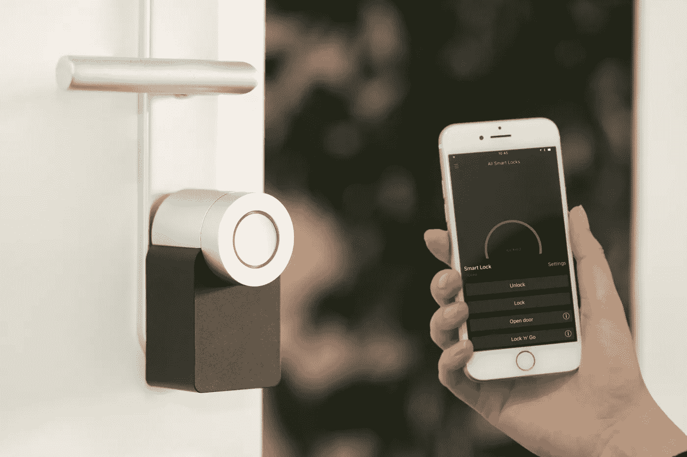

# 很快，“智能家居”将只是一个家

> 原文：<https://medium.datadriveninvestor.com/soon-a-smart-home-will-just-be-a-home-bb259fa67e9b?source=collection_archive---------10----------------------->

随着互联网和现实世界之间的界限越来越模糊，网上便利设施进入现代家庭也就不足为奇了。智能家居的增长预计将在未来几年内大幅增长，原因不难理解。它们为家居生活提供了便利和现代光泽，但更重要的是，它是一个高科技的安全层，使房主能够更好地保护他们的住所和家人的安全。

对房主和投资者来说，这是一个令人信服的理由。根据 Statista 提供的统计数据，分析师预计智能家居市场的收入将同比增长 15.43%。家庭普及率[目前为 27.5%](https://www.statista.com/outlook/279/109/smart-home/united-states) ，预计到 2023 年将进一步达到 47.4%。智能家居无疑是受欢迎的；对投资者来说，不断增长的市场可能会有利可图。

 [## 物联网解决方案如何改变供应链中的机遇|数据驱动型投资者

### 物联网(IoT)可能开始时规模很小，但它正在成为世界经济中的一个重要因素。事实上…

www.datadriveninvestor.com](https://www.datadriveninvestor.com/2018/11/14/how-iot-solutions-are-shifting-opportunities-in-the-supply-chain/) 

这就是为什么房主们都涌向智能家居技术——以及为什么精通技术的房地产投资者应该注意到消费者日益增长的兴趣。

**通过科技保持警戒**

大多数家庭最脆弱的地方是最常见的入口:前门。专家估计，超过三分之一的入室盗窃是由于前门未锁或不安全造成的，这意味着一个安全上锁的入口通道是阻止入侵者的最佳方法之一。通过家庭 wifi 远程激活和关闭的智能锁让房主放心，因为他们知道他们的家在他们不在时是安全的。像 Nest 这样的安全应用程序可以监控所有入口通道的状态，这意味着当你在工作或度假时，可以为可信的客人或服务人员解锁前门或侧门。你手机上的警报可以让你知道是否有人破门而入，这意味着你的家庭安保公司一发现有人闯入，你就知道了。虽然这不会取代实际上在那里调查问题，但它让你安心地知道，当你联系不到的时候，你的家庭技术正在让你了解正在发生的一切。

**以 WiFi 的速度发出危险警报**

犯罪并不是智能技术可以帮助房主面对的唯一主要危险。技术并没有消除房屋火灾的危险，但是[尖端的烟雾探测器](https://www.thisoldhouse.com/ideas/upgrade-to-smart-smoke-detector)提供了一种安全水平，只有在包括最现代的安全功能时才能发现。光电传感器可以根据类型识别火灾，甚至可以比传统探测器更快地捕捉到几乎没有火焰的闷烧火灾。连接到智能家庭音响系统，烟雾探测器甚至可以通过家庭扬声器使用语音通知来提醒你，火灾发生在哪里以及如何最好地逃离。在瞬息间的决定可以改变生活的情况下，智能技术是房主及其家人的强大保障。

**警告的话**

当然，当谈到安全时，智能家居技术呈现出一个全新的漏洞，过去的房主从来不用担心。这听起来可能很奇怪，但在锁、烟雾报警器和其他装置都可以上网的世界里，家庭黑客的威胁是一个真正的危险。今天的飞贼可能手里拿着笔记本电脑或智能手机搜寻受害者，准备用旨在破坏家庭安全的恶意软件进行攻击，或者只是通过关闭电器和灯来骚扰和骚扰房主。

幸运的是，针对智能家居黑客的安全措施与我们在网上已经采取的措施相似。专家对安全漏洞的研究[发现了一些修补程序，这些修补程序对于任何习惯于执行基本网络安全程序的人来说应该是熟悉的](https://link.springer.com/chapter/10.1007%2F978-3-319-75208-2_1)。双因素身份验证、强密码和定期安全更新可以保护智能家居技术免受在线和个人恶意攻击。虽然我们大多数人可能都不习惯下载门锁的安全更新，但更智能地控制家庭安全的好处很容易超过这种相对较小的不便。

在过去的十年里，便利性和新颖性并不是智能家居吸引买家的唯一原因。上述安全功能使今天的房主能够更好地控制自己的财产，即使他们远在千里之外。为了保护你的财产、你的家和你的家人的安全，智能家居代表了控制我们家发生的事情的下一步。虽然这个新的机会确实带来了新的挑战，但它的好处应该会吸引任何想要巩固城堡的人，不管城堡有多大。在未来，我们当然可以期待房主买入和投资者兴趣的增长。

Bennat Berger 是一位居住在纽约的企业家、投资者和科技作家。他是 Novel Property Ventures 的联合创始人和负责人，这是一家房地产公司，专门从事纽约市多户住宅单元的积累和管理。他还是投资公司 Novel Private Equity 的创始合伙人，负责监管各种兴趣领域的投资，从体验式零售到娱乐再到超市技术。