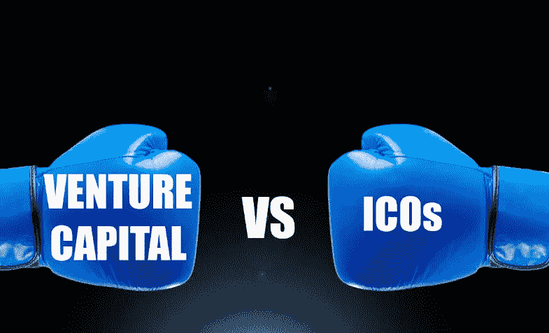

# 抱歉，迈克尔——ICO 正在成熟，并不完美，但它们肯定不是癌症！

> 原文：<https://medium.datadriveninvestor.com/sorry-michael-icos-are-maturing-not-perfect-but-they-are-certainly-not-cancer-488f333a41e1?source=collection_archive---------5----------------------->

Image with thanks to Google (search: VC industry and Cryptocurrency)

正如我的标题所暗示的，这篇文章将在某种程度上反驳迈克尔·弗拉克斯曼先生最近的博客，标题为“ [ICOs 是癌症](https://medium.com/@michaelflaxman/icos-are-cancer-c404594f181b)”

我相信我们都是我们环境的产物。我在迈克尔的评论中看到的是一个传统风投业内人士的观点，这个群体的成员在很大程度上被首次公开募股(ICO)机制的民主化力量所扰乱。我的风险投资经历与 Michael 的有些不同，从 2007 年到 2010 年，我在自己的软件即服务初创企业中获得了风险投资。

我并不支持 ICO 流程的纯洁性或成熟性。我认为 ICO 流程是不断变化的，在过去的 18 个月中不断成熟，并将继续成熟。我的这个评论是基于我个人有幸支持的一些 ICO 的经验。我支持的是中断事件本身，ICO 看到传统行业看门人的机制，在这种情况下，风险投资行业被驱逐，从其传统的权力席位上移走。这种颠覆见证了风险和回报的民主化，以及创始人和企业家对初创企业运营的控制权和权力的更公平分配，而不是风险投资者。

Michael 在他组织有序的博客中描述了:(I)他认为 ICO 正在试图解决的问题，以及(ii)为什么他认为 ICO 的机制正在制造远多于它们正在缓解的问题。我将跟随迈克尔的领导和评论，在那里我可以用另一种观点来帮助读者。

## 了解新的 ICO 商业模式

ICO，俗称众卖或代币销售，是指 ICO 参与者发布自己的数字货币，以换取另一种或其他加密货币，如比特币或以太坊，这些货币具有流动的可交易价值。

一个 ICO 可以支持无数不同的“特殊”区块链技术的例子和执行。ICO 公司使用数字公用令牌参与其平台和市场的商务活动。根据架构，该平台将支持和鼓励微交易，这是一种目前传统法定货币不支持的交易。这是平台设计的一个有利特征，有助于聚集其他行业参与者，在平台服务范围内从事扩大和改进的行业服务。

由此产生的数字令牌及其价值将因此成为整个平台和生态系统业务成功的衡量标准。此外，通过用开源密码系统的不变性和分布式数字分类账取代单一的专有流程和实践，还可以实现更大的价值和规模经济。不支持聚合服务生态系统平台的 ICO 公司可能会发现很难论证 ICO 的必要性，除非筹集资金，这本身是一项有益的努力。

## ICO 的成熟面孔

随着 ICO 需求的增长，创始人和企业家对如何最好地支持参与社区和 ICO 参与者的想象力也在增长。此外，创始人还必须考虑监管机构(包括美国证券交易委员会)日益增长的兴趣，以及该团体在未来 ICO 活动中日益增长的重要性、相关性和监督。因此，新的有抱负的 ICO 在了解其生态系统、竞争环境以及在 ICO 过程中准备和公开哪些信息方面，表现得更像一家传统公司是很重要的。

## 迈克尔斯#1 政府法规

我相信，迈克尔所说的“合格投资者”指的是美国证券交易委员会条例 D 第 506 条和证券法第 4(a)(2)节。任何符合法案和法规规定的公司均可使用该豁免条款。这是美国法律，仅适用于美国居民，并且仅适用于那些有意与美国公民就远景 ICO 进行合作的公司。值得注意的是，Michaels 的文章中没有提到，在 ICO 活动结束后，当代币在支持加密货币的交易所上市时，所有美国居民都可以购买代币。不用说，这是在 ICO 现象之前就存在的规定。公司遵循 ICO 的道路，并希望为美国居民提供优惠，只是利用当前的美国法律和最佳的法律咨询，以达到他们想要的观众。

数字代币是“证券”还是“基础设施公用事业代币”的问题是一个复杂的问题，也是一个具有客观价值的问题，值得经常逐案考虑，至少在通过裁决和随后的判例法确定一种处理办法、公式或定义之前。关于“什么是证券”和“什么是公用事业代币”的相关性和适合性问题将由他人决定。区块链社会的基本精神是政府，监管，监视，监督，行动和惩罚性的执行既不需要也不想要。

我承认，成为合格投资者意味着你很富有，因为测试的是净财富和收入，因此，小投资者将被排除在美国 ICO 融资之外。然而，这是现有待遇(法律)的延续，而不是由 ICO 制定的。认为是 ICO 机制导致了“穷人”的进一步孤立，而有利于“富人”的说法是无稽之谈，也是完全不公平的。

这篇文章没有阐明的是，ICO 和各自的数字货币定义了非常不同的价值主张和结果，支持了无数不同的“特殊”区块链技术的例子和执行。单看数字货币本身，并不是对数字货币现象的准确评估。这不是新数字值产生或驻留的地方。新数字货币的价值是(或者应该是)对区块链和支持流程的破坏性有多大的整体衡量，这取决于它们所破坏的东西的成本节约和价值经济学，在大多数情况下，是完全革命性的。

## 迈克尔的#4 平台利润分享(又名“公用事业代币”)

迈克尔说:“大多数公司实际上并不是具有强大网络效应的平台，所以早期用户增加的价值并不能证明授予他们公司的所有权是合理的。”

公用令牌不同于普通股。在上述公司中，不存在对该公司公用令牌的占有和控制的所有权分配。2006 年，在 ICO 机制出现之前，我做了一个初创企业，我意识到建立一个面向全球的企业的成本和时间限制。ICO 和公用令牌的发行，通过奖金和奖励计划，看到了翻译、营销、广告、推广和有时测试(等)的常年成本。)推出到公司的支持社区。这项重要、耗时且昂贵的工作的费用最终以公用事业代币支付，这意味着在现金流方面节省了大量资金，并有望在发行活动之前看到平台投入运营。这是一种将创业风险从 ICO 公司分散到参与 Bounty 计划的参与者(对项目充满热情的社区成员)中的聪明方法。进一步运作各种形式的 ICO 奖金计划，并在适当的情况下将这种监督分配给参与的社区成员，使 ICO 公司能够通过利用团队可用的最宝贵的资源“他们自己”来创造时间(这是爱因斯坦永远无法实现的)

*迈克尔说，“钱的全部意义在于它解决了需求的双重重合问题，这使得物物交换变得非常无效。要求客户购买你的代币才能使用你的服务是主流采用的巨大障碍。”*

一个设计良好的“平台即服务”(SaaS)架构将支持内部交换，见证法定货币和数字货币在服务边界的融合。据我个人所知，许多成功的 ICO 平台即服务公司已经支持开放式电子商务的这一功能。成功执行真正的平台即服务架构，看到来自所有生态系统参与者以及社区成员的各种形式的输入和输出，预示着新的规模经济，这是传统管道业务模式根本不可能实现的。

迈克尔说:“它混淆了价值在哪里。客户使用你的产品是因为他们喜欢它(因此愿意付钱)还是因为他们希望其他人都使用它，他们的代币会变得有价值？前者是一个持久企业的基础，后者是你如何创造一个纸牌屋。代币可能会鼓励创始人追逐错误的客户。

希望支持任何新的数字硬币产品的 ICO 参与者应该了解数字硬币和支持平台为当前生态系统带来的独特价值主张，包括其竞争环境。就 ICO 而言，参与者正在购买公用事业令牌。这些令牌将在平台和生态系统中使用。基础设施令牌的价值将由其支持的平台和生态系统的价值来定义。潜在的 ICO 参与者还应了解潜在价值或产品价格的适当性。我相信这种程度的尽职调查正在由最有见识的人进行。我相信 ICO 流程的参与者了解“现状”的价值和潜在价值，通常是通过数字账本可以提供的综合成本节约矩阵。然而，孤立地理解技术是远远不够的，就区块链技术而言，已经有很多关于这种截然相反的技术所能带来的颠覆性能力和价值的文章。

我对迈克尔的“解决方案”段落的评论如下:

## #1 缺乏基本的投资者保护

那些希望支持 ICO 的人应该在做出任何承诺之前做好自己的尽职调查。对于初学者和那些倾向于支持的人来说，或许通过赏金计划进行一次警示性的‘试水’是一个好的开始？并非所有的 ICO 都是平等的，因此请阅读白皮书并了解技术。考虑团队的构成，包括公司员工和顾问，是至关重要的。此外，如果发布预测，了解产品供应、发展路线图和客户获取时间框架也会有所帮助。你不是股东，不拥有股东权利。你确实有“利益在内”,但是请支持你的公司，成为社区的积极成员。在一天结束时，一个明智的策略可能是分配一小部分你可以承受损失的资金给你的投资组合。如果你有一个投资组合，它可能会降低回报的标准差，从而提高你的投资组合风险调整后的回报。毕竟，这些资产可能与市场不相关。支持 ICO 数字硬币不是一项投资——参见下面的#3。

## #2 不一致的公司激励

谨慎的资本管理和成功与增长规划至关重要。大幅提高 ICO 并不意味着管理团队都驾驶保时捷汽车。我相信，如果公司章程允许，对股东协议的商定变更将允许在进一步的资本需求中筹集更多的资本。管理团队和 ICO 参与者应该有一个共同的目标，那就是看到平台和生态系统内不断增长的平台用户案例和使用以及不断增加的令牌速度指标。

## #3 实际上不是投资

对 ICO 的支持不是投资，而是对底层技术、愿景和管理团队使命的早期支持。正如迈克尔在本段中所描述的那样，参与 ICO 是没有任何保护的。

## #4 极其复杂的法规和其他干扰

一个 ICO 的事业是巨大的。这需要一个敬业的团队有一种“创业”的心态，愿意在社会规范规定的正常的朝九晚五之外继续工作。尽管问题很复杂，但许多第三方软件即服务(SaaS)提供商已经兴起，以支持这一新兴行业。身份认证支持、KYC 验证、钱包管理和智能合同审计只是有抱负的 ICO 可以获得的部分服务，按照正常的组织标准，这些服务可以用最少的人员获得尽可能好的结果。随着服务范围的扩大，对这些服务的支持也越来越广泛。我认为没有理由改变持续增长的模式。

## #5 从根本上与法律制度不相容

成文法不断被修改，新的部分被增加，旧的不相关的部分被删除。如果一两项修正案还不够，法律制定者可以制定新的立法，根据新立法提案，通过多数票和御准产生和生效(澳大利亚)。这种情况在澳大利亚联邦和州政府层面经常发生。在区块链上输入的交易不能“回滚”当写入区块链时，它就永远在那里，在清晰的视野中，没有任何借口或隐藏的企图，除非这个特性是区块链规范本身的一部分。法院将对交易及其更正做出裁决，但这些更正将在适当使用区块链本身的机制内执行。与区块链交易有关的任何法院命令的执行将被视为与之前没有任何不同，这意味着法院正在寻求处理更正和记录注释。

## #6 私钥管理真的很难

私钥的管理是组织的任务，而不是 IT 复杂性的任务。就软件钱包而言，管理私钥最大的挑战莫过于管理你最喜欢的软件登录名和密码。然而损失的后果要大得多。确保为适当的平台和铸造的令牌提供正确的钱包软件可能是该领域新成员面临的最大挑战。网上有很多关于这方面的帮助教程。

丢失私钥意味着无法访问区块链和针对该私钥分配的值。这种丢失是永久性的，除非提供了一个种子短语，您可以使用它来重新配置私钥。在管理您的私钥时，应该非常小心谨慎。保管服务将来可能会变得更加普遍，允许保管代理人/银行/经纪人代表他们的客户持有私人钥匙。

## 你参与的事情会影响你的性格

迈克尔说:*“创办一家公司从未如此便宜/简单，如今通过传统方式筹集资金对有才华的企业家来说相当容易。如果你在考虑做一个 ICO，你应该好好照照镜子，问问自己为什么这对你的利益相关者最有意义。”*

在 ICO 出现之前，我在风险投资领域的经验是，当风险投资者同意投资时，风险投资基金将减轻他们自己的风险，但创始人要付出沉重的代价。我最近读到，由于众筹现象，风险投资行业的传统收入减少了 75%。许多最初诋毁 ICO 流程的风投现在也积极参与到这个流程中来。明智的尽职调查加上风投团队带来的丰富经验，对任何 ICO 初创公司来说都是一个巨大的成果。看到更好的初始报告、合理的预测和业务模型被添加到 ICO 流程中，对于潜在参与者更好地了解风险、战略、市场和技术相关性而言，这是一件好事。

与传统机制相比，成功的 ICO 可以为初创企业带来大量资金，用于未来的平台/软件开发，以及许多开发、翻译、推广测试和其他更具艺术性的工作，有利于初创企业的发展，速度更快，成本更低，规模差异更大。所有这些都不会损失或削弱所有权和决策权。利益相关者成为社区成员，这些成员有勇气并负责民主化努力的成功。不确定这和什么性格有关？

## 结论

在过去的 18 个月里，我有幸、有经验、有特权、有见识地支持了许多 ICO，支持他们颠覆和业务发展的更大野心。在这短暂的时间内，我见证了 ICO 流程的成熟，这是一种诚实、透明和及时报道社区成员感兴趣的新闻的坚定方法。我看到各个管理团队希望与支持他们的社区建立有意义的长期关系，不仅是在 ICO 期间，而且是在建立变革、参与和包容网络的更长旅程中。支持和社会团体的重要性在商业模式中是至关重要的，该模式以其固有的商业民主化和生态系统来回报这一点，所有参与者都得到回报。这是脸书、苹果等知名平台的结构和模型无神论者。

毫无疑问，由 ICO 发展而来的许多(或许是大多数)新数字货币最终可能会失败。这种失败之所以会发生，是因为变革的经济论据，区块链和其他技术为变革中的平台和生态系统提供和带来的东西，不足以压倒一切，让变革发生。这将是由一个忠诚的团队带来的整体“变化经济”，这将决定任何相应数字货币的价值。当我看到高技能的风险投资行业加入这一困境时，我受到了鼓舞，他们提供了关于如何建立一个成功的初创企业和平台即服务产品的深刻见解。

最后，我对迈克尔说，感谢你花时间分享你的观点，但并不是所有的 ICO 都是一样的。有一些令人敬畏的创业例子，在这些例子中，去中心化、民主化和透明度的原则将构建更好、更公平、更廉价的平台和生态系统。我邀请你与 ICO 社区、Bounty 计划以及 ICO 本身(如果合适的话)进行接触、交流和参与；不是为了金钱上的收益，而是因为你支持项目承诺交付的东西。我相信你会发现一种新的社区支持模式，既服务于 ICO 励志，也服务于参与这一过程的人。