# 排序算法:冒泡排序

> 原文：<https://medium.datadriveninvestor.com/sorting-algorithms-bubble-sort-9410342e0300?source=collection_archive---------0----------------------->


Photo by [Marc Sendra Martorell](https://unsplash.com/@marcsm?utm_source=medium&utm_medium=referral) on [Unsplash](https://unsplash.com?utm_source=medium&utm_medium=referral)

我们来排序吧！在这个系列中，我将讨论排序算法。大多数编程语言都有内置的排序函数，但是为了编写更好的代码，你需要知道后台发生了什么。如果你正在准备软件工程面试，很有可能在你的面试中会出现一个或多个排序算法。我将在本系列中介绍的排序算法是:

1.  [冒泡排序](https://medium.com/@mariam.jaludi/sorting-algorithms-bubble-sort-9410342e0300)
2.  [插入排序](https://medium.com/@mariam.jaludi/sorting-algorithms-insertion-sort-d632a1a7d85a)
3.  [选择排序](https://medium.com/@mariam.jaludi/sorting-algorithms-selection-sort-66c3fc8278b9)
4.  [合并排序](https://medium.com/@mariam.jaludi/sorting-algorithms-merge-sort-299ab57ff998)
5.  [快速排序](https://medium.com/@mariam.jaludi/sorting-algorithms-quick-sort-3e8f7bce8fc)
6.  基数/桶排序
7.  堆排序

[](https://www.datadriveninvestor.com/2019/03/22/the-seductive-business-logic-of-algorithms/) [## 算法诱人的商业逻辑|数据驱动的投资者

### 某些机器行为总是让我感到惊讶。我对他们从自己的成就中学习的能力感到惊讶…

www.datadriveninvestor.com](https://www.datadriveninvestor.com/2019/03/22/the-seductive-business-logic-of-algorithms/) 

# 什么是冒泡排序？

冒泡排序是理解起来最简单直观的排序算法之一。它的代码实现也相当简单。关于冒泡排序的一个好处是，学习它可以教会你很多关于复杂性分析的知识，并且让你准备好理解更困难和更优化的排序算法。

# 它是如何工作的？

让我们看一下要排序的数组:

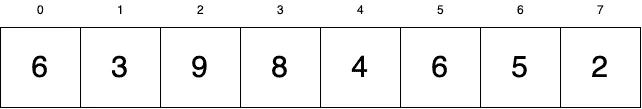

我们想对这个数组进行升序排序。

在冒泡排序中，我们多次遍历数组并交换值，直到它们都处于正确的顺序。更具体地说，当我们遍历数组时，我们检查当前数字是否大于与其相邻的数字。如果是这样，我们就地交换这两个数字。

需要注意的是，就地进行这些互换是很重要的。我们不需要额外的内存来执行冒泡排序。

遍历整个数组后，我们检查在迭代过程中是否进行了任何交换。如果我们已经完成了交换，我们需要再次遍历数组，以确保所有内容都已排序。如果任何值仍然没有排序，我们再次执行交换，并重复遍历整个数组的过程，直到它完全排序，不再需要交换。将这一过程形象化会使其更加清晰:

让我们从数组的开头开始。我们目前的价值是 6:

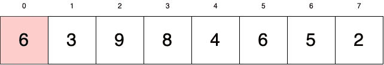

6 小于等于 3 吗？(即，它们的顺序正确吗？).不，所以我们需要交换这两个值。

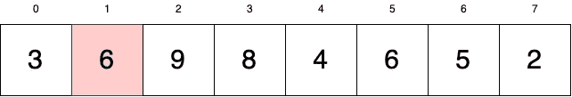

我们的当前值现在在位置 1。让我们看看右边的下一个值。6 小于等于 9 吗？是的。此时，6 将保持在这个位置，我们将当前值更改为 9。

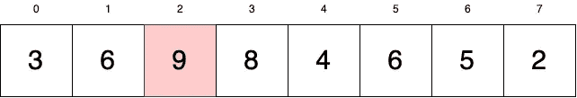

9 大于 8。让我们交换他们。

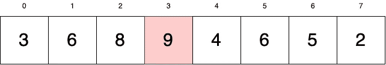

9 大于 4。我们交换吧。

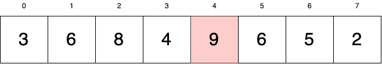

9 大于 6。我们交换吧。

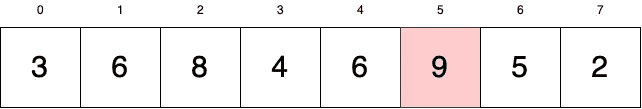

9 大于 5。我们交换吧。

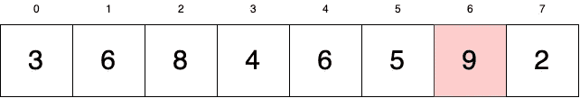

9 大于 2。我们交换吧。

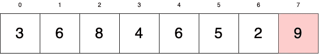

9 没有任何可交换的值。它的 ***冒了出来*** 到了我们的阵尾。这就是冒泡排序的本质。较大的值会一直冒泡到数组的末尾，直到数组排序完毕。

此时，我们已经完成了数组中的一次迭代。我们问自己，我们在迭代期间做了任何交换吗？我们做了很多。在这种情况下，我们需要返回并检查我们的数组，看看排序是否已经完成。从视觉上，我们看到它没有，当然，但是在我们的代码中了解这一点的方法是跟踪交换。

排序后的值为蓝色。我们不再需要在这些价值观上努力了。让我们来看看这个数组的其余部分。我们的下一个当前值又回到了起点。当前值= 3。

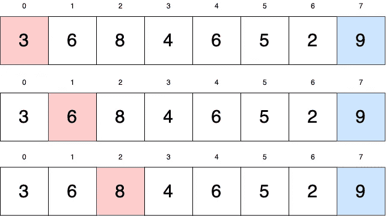

3 小于 6。我们不会用它做任何事情。我们看到 6 也小于 8。我们也不会做任何事情。让我们继续到 8。

视觉上，我们看到 8 大于它右边的所有值，直到它到达我们排序的 9。8 将像 9 一样与每个值交换，直到到达 9 之前的位置，完成迭代。

那么，我们有没有进行交换呢？是的。所以我们再来一轮。

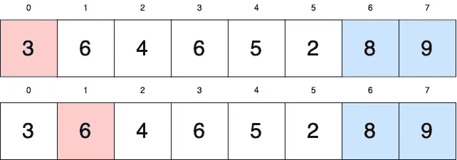

像以前一样，3 小于 6，所以它保持不变，我们继续下一个值。

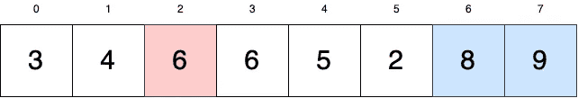

6 与 4 互换。我们现在比较 6 和 6。6 大于 6 吗？不会。索引 2 处的当前值 6 将保持不变，并在索引 3 处将当前值更改为下一个 6。

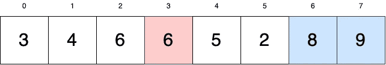

我们可以直观地看到，我们的当前值将在 8 之前冒泡。我们检查我们是否执行了交换，事实上我们已经执行了，让我们重新开始:

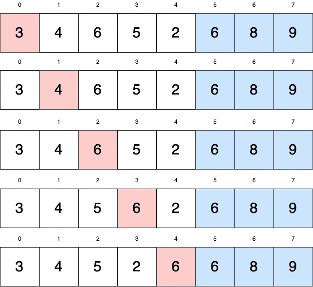

另一轮:

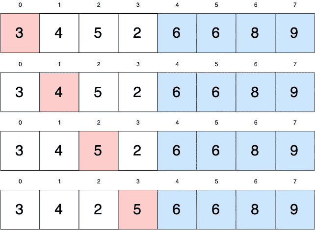

另一个:

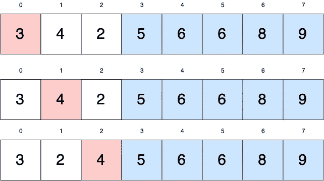

快到了:

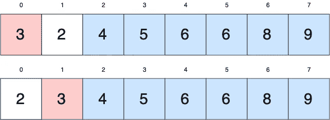

最后一个！

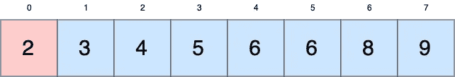

2 不能与任何东西交换，所以这一轮我们的交换是零。这意味着我们结束了！

# 时间和空间复杂性

你可能会想——这太乏味了。是的，你是对的。**泡排序慢**。更具体地说，在最坏的情况下，冒泡排序的时间复杂度为 **O(n )** 。在最好的情况下，我们得到一个排序数组来排序。我们仍然需要遍历数组一次来检查它是否排序，我们最好的时间复杂度是 O(n)。

如前所述，冒泡排序就地执行交换。我们没有分配任何额外的内存来执行排序，所以我们的空间复杂度是 O(1) 。

# 代码实现

让我们看看 Python 中的冒泡排序:

我们定义了我们的`bubbleSort`函数，它接受一个整数数组。最初，我们假设我们的输入数组没有排序，所以我们将标志`sorted`设置为 False。

```
def bubbleSort(array):
    sorted = False
```

现在，我们需要检查我们的数组。因此，虽然我们的数组没有排序，我们需要排序它。我们将开始我们的 while 循环，并暂时将我们的`sorted` 标志设置为 True。然后，我们开始 for 循环来遍历数组:

```
def bubbleSort(array):
    sorted = False
    while not sorted:
        sorted = True
        for i in range(len(array) - 1): 
```

请注意，我们一直迭代到`len(array) — 1`。原因是我们不能看数组中最后一个值的右边(那里什么也没有)。所以我们来检查一下。请记住，我们正在检查我们的当前值是否大于它右边的值，如果是这样，就进行交换。如果我们执行了一次交换，我们知道我们的数组没有被排序，所以我们把我们的`sorted`标志设置为假:

```
def bubbleSort(array):
    sorted = False
    while not sorted:
        sorted = True
        for i in range(len(array) - 1):
            if array[i] > array[i + 1]:
                array[i], array[i + 1] = array[i + 1], array[i]
                sorted = False
    return array
```

最后，一旦我们的数组被完全排序，我们的标志将为真，我们退出 while 循环。然后，我们的函数返回排序后的数组。

就是这样！我们已经建立了我们的冒泡排序函数！但是…我们可以做得稍微好一点。

如果回头看看我们的数组可视化，数组中的蓝色值不需要迭代，因为我们已经对它们进行了排序。目前，我们的代码每次都遍历整个数组。让我们把它改为只遍历未排序的值:

```
def bubbleSort(array):
    sorted = False
    counter = 0    
    while not sorted:
        sorted = True
        for i in range(len(array) - 1 - counter):
            if array[i] > array[i + 1]:
                array[i], array[i + 1] = array[i + 1], array[i]
                sorted = False
        counter += 1
return array
```

我们添加了一个计数器来检查我们循环数组的次数。每次我们遍历数组时，我们都从 for 循环将要遍历的索引范围中删除该值。

***注意:这种优化并没有让时间复杂度变得更好。还是会 O(n)。但是它让你的算法稍微好一点。***

这就是冒泡排序。很简单。很慢。但是学习是很重要的，希望它能帮助你理解为什么一些排序算法比其他的更好。

感谢阅读！

## 参考

 [## 冒泡排序算法

### 冒泡排序是一个简单的算法，用于对以数组形式提供的给定的 n 个元素进行排序

www.studytonight.com](https://www.studytonight.com/data-structures/bubble-sort)