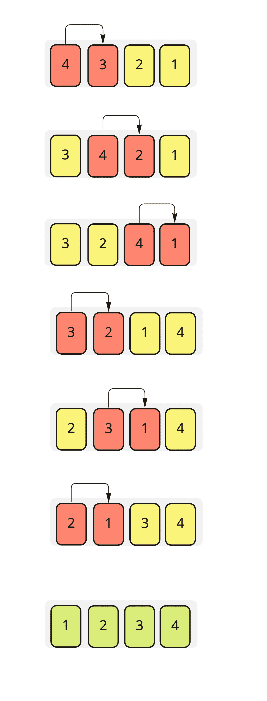
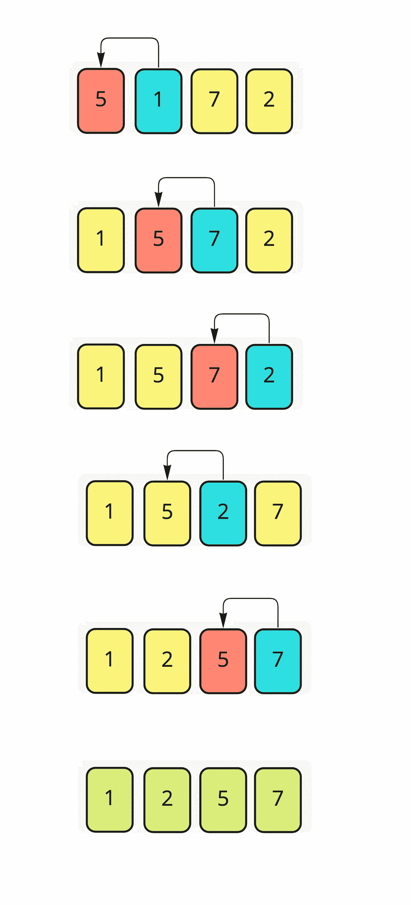

# 排序算法(冒泡和插入)

> 原文：<https://medium.datadriveninvestor.com/sorting-algorithms-part-1-5758f6ff90f6?source=collection_archive---------6----------------------->

在本文中，我们将讨论排序算法。

排序算法，顾名思义，就是用来将一组数据按顺序排列的算法。但是我们为什么需要对数据进行排序呢？

我们需要对数据进行分类，以使搜索操作更容易、更快。

[](https://www.datadriveninvestor.com/2019/03/22/the-seductive-business-logic-of-algorithms/) [## 算法诱人的商业逻辑|数据驱动的投资者

### 某些机器行为总是让我感到惊讶。我对他们从自己的成就中学习的能力感到惊讶…

www.datadriveninvestor.com](https://www.datadriveninvestor.com/2019/03/22/the-seductive-business-logic-of-algorithms/) 

在这里，我们讨论排序的主要思想，因为排序的方向(升序或降序)并不那么重要。

与搜索算法类似，我们可以使用排序算法的时间和空间复杂度来衡量排序算法的效率。

排序算法有很多种，我们可以根据自己的需求和效率进行选择。

**排序算法可分为:-**

*   冒泡排序
*   快速排序
*   选择排序
*   插入排序
*   合并排序
*   堆排序

现在，我们将更详细地讨论它们中的每一个。

# **冒泡排序:-**

**冒泡排序**是最简单的排序算法，从这个算法的名字来看，就是通过像冒泡一样把最低的值移到第一个索引来对数据进行排序。

**冒泡排序的步骤:-**

1-未排序的数据集，假设它是一个数组( **Arr** )

2-选择第一个元素( **Arr[0]** )。

3-将 **Arr[0]** 与下一个元素进行比较。

4-如果 **Arr[0]** 大于下一个元素，则在它们之间交换，移动到数组中的下一个元素，并重复从第 2 号到数组末尾的步骤。

从这一步我们可以说，如果数组包含了 **n** 个元素，我将重复数据元素之间的比较操作 **n-1** 次。

我认为下面的图片可以帮助理解这些步骤



这里有一段伪代码，可以让我们知道如何实现冒泡排序

```
func bubblesort3( var a as array )
    for i from 0 to N-1
        swaps = 0
        for j from 0 to N - i -1
           if a[j] > a[j + 1] 
              swap( a[j], a[j + 1] )
              swaps = swaps + 1
        if swaps = 0
            break
end func
```

请随意查看这个 git 库以了解我们如何在 Java 中实现冒泡排序。

**冒泡排序的复杂性:-**

时间复杂度最坏情况和平均情况:O(n)

时间复杂度最佳情况(当数组已经排序时):O(n)

空间复杂度是 O(1 ),因为我们只需要额外的空间用于交换元素。

# **插入排序:-**

现在我们来说说第二种排序算法，“**插入排序**”。

这种算法比冒泡排序更有效，但是对于大量的元素，最好寻找另一种算法。

在这个算法中，我们从索引(1)开始，而不是从索引(0)开始，它将这个元素放在数组中的正确位置。

**插入排序步骤:-**

1-未排序的数据集，假设它是一个数组( **Arr**

2-选取数组中的第二个元素，假设它是**关键元素** ( **Arr[1]** )

3-将 **Arr[1]** 与数组中的第一个元素( **Arr[0]** )进行比较

4-如果 **Arr[0]** 大于 **Arr[1]** ，我们将 **Arr[1]** 放在 **Arr[0]** 之前

5-如果 **Arr[0]** 小于 **Arr[1]** ，我们将 **Arr[1]** 放在 **Arr[0]** 之后

5-移动到第三个元素( **Arr[2]** )并使其成为**关键元素**，重复从 2 开始的步骤

下面的图片可以解释更多的步骤:-



这里有一个插入排序的伪代码，可以帮助了解如何实现这个算法

```
for i= 1 to n
   key = A [i]
   index = i
   while index > 0 and A[index-1] > key
    A[index] = A[index-1]
    index = index — 1
   end while
   A[index] = key
end for
```

请随意查看这个 git 库以了解我们如何在 java 中实现插入排序。

**插入排序的复杂性:-**

时间复杂度最坏情况和平均情况:O(n)

时间复杂度最佳情况(数组已经排序时):O(n)因为内循环条件永远不会为真，所以永远不会执行，只会执行外循环。

空间复杂度是 O(1 ),因为我们只需要为关键元素提供额外的空间。

接下来:[排序算法—第二部分](https://medium.com/datadriveninvestor/sorting-algorithms-part-2-7affaead363)

先前:[搜索算法(线性和非线性)](https://medium.com/datadriveninvestor/search-algorithms-linear-and-non-linear-739de13ceaf8)