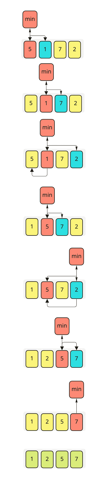
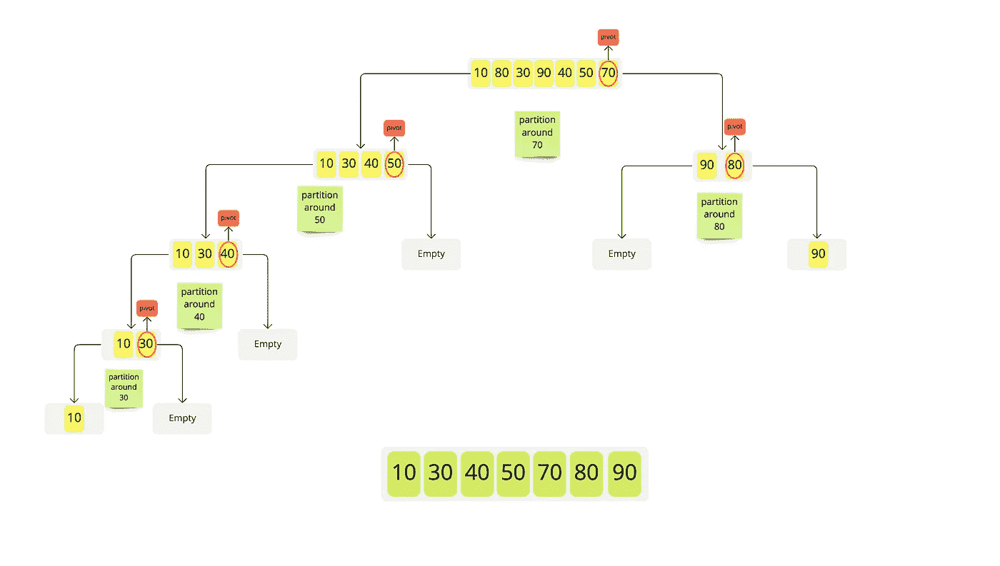

# 排序算法(选择和快速)

> 原文：<https://medium.datadriveninvestor.com/sorting-algorithms-part-2-7affaead363?source=collection_archive---------5----------------------->

在本文中，我们将继续讨论排序算法，我们将涵盖选择和快速排序算法。

随意查看第一部分[这里](https://medium.com/datadriveninvestor/sorting-algorithms-part-1-5758f6ff90f6)。

# **选择排序:-**

[](https://www.datadriveninvestor.com/2019/02/21/best-coding-languages-to-learn-in-2019/) [## 2019 年最值得学习的编码语言|数据驱动的投资者

### 在我读大学的那几年，我跳过了很多次夜游去学习 Java，希望有一天它能帮助我在…

www.datadriveninvestor.com](https://www.datadriveninvestor.com/2019/02/21/best-coding-languages-to-learn-in-2019/) 

该算法依赖于在一组数据中找到最小值(假设它是一个数组)并在它和数组中的第一个元素之间交换，然后在数组中找到第二个最小值并在它和数组中的第二个元素之间交换，这个过程重复进行，直到整个数组被排序。

**选择排序步骤:-**

1-未排序的数据集，假设它是一个数组( **Arr** )

2-选取数组中的第一个元素( **Arr[0]** )作为数组中的初始最小值。

3-将 **Arr[0]** 与下一个元素进行比较，并更新最小值，直到找到数组中的最小值。

4-用最后的最小值交换数组中的第一个元素。

5-从步骤 2 开始重复，但从索引 1 开始( **Arr[1]** )，依此类推，直到数组排序完毕。

我认为下面的图片可以帮助理解这些步骤



这里有一段伪代码，可以让我们知道如何实现选择排序:-

```
for j ← 1 to n-1
  smallest ← j
  for i ← j + 1 to n
    if A[ i ] < A[ smallest ]
       smallest ← i
     end if
  end for  
  Exchange A[ j ] ↔ A[ smallest ]
end for
```

请随意查看这个 git 库[以了解我们如何在 Java 中实现快速排序。](https://github.com/hebatarek1989/data_structure_algorithms/tree/master/src/LearnAlgorithmSelectionSort)

**选择排序的复杂性:-**

时间复杂度最坏情况和平均情况:O(n)

时间复杂度最佳情况(当数组已经排序时):O(n)

空间复杂度是 O(1 ),因为我们只需要最小索引的额外空间。

# **快速排序:-**

现在，我们将谈论“**快速排序**”，它是基于分而治之的概念。

我们将数据数组分成两半，并对每一半进行排序，直到整个数组排序完毕。

**快速排序的步骤:-**

1-未排序的数据集，比如说一个数组( **Arr** )

2-从数组中选择一个 **pivot** 元素，假设我们将选择右边的(我们可以选择左边的或者数组中的任意元素)。

3-按照这个 pivot 元素对所有元素进行排序，小于 pivot 的元素会在左边，大于 pivot 的元素在右边，这个过程叫做**分区**。

现在我们有两个子数组，在每个子数组上，我们重复从 2 开始的步骤，直到整个数组被排序。

我认为下面的图片可以帮助理解这些步骤



这里有一段伪代码，可以让我们知道如何实现快速排序

```
Quicksort(A as array, low as int, high as int){
    if (low < high){
        pivot_location = Partition(A,low,high)
        Quicksort(A,low, pivot_location)
        Quicksort(A, pivot_location + 1, high)
    }
}
Partition(A as array, low as int, high as int){
     pivot = A[high]
     i = l*ow – 1* for j= low to high-1{
         if (A[j] < pivot) then{
             i++
             swap(A[i], A[j])

         }
     }
     swap(A[i+1],A[high]) return i+1
}
```

请随意查看这个 git 库,了解我们如何用 Java 实现 Quicksort。

**快速排序的复杂度:-**

时间复杂度最佳情况和平均情况:O(n*log(n))

时间复杂度最坏情况:O(n)

空间复杂度为 O(n*log(n))。

接下来:[排序算法—第三部分](https://medium.com/datadriveninvestor/sorting-algorithms-part-3-979a0c9fd935)

上一篇:[排序算法—第 1 部分](https://medium.com/datadriveninvestor/sorting-algorithms-part-1-5758f6ff90f6)