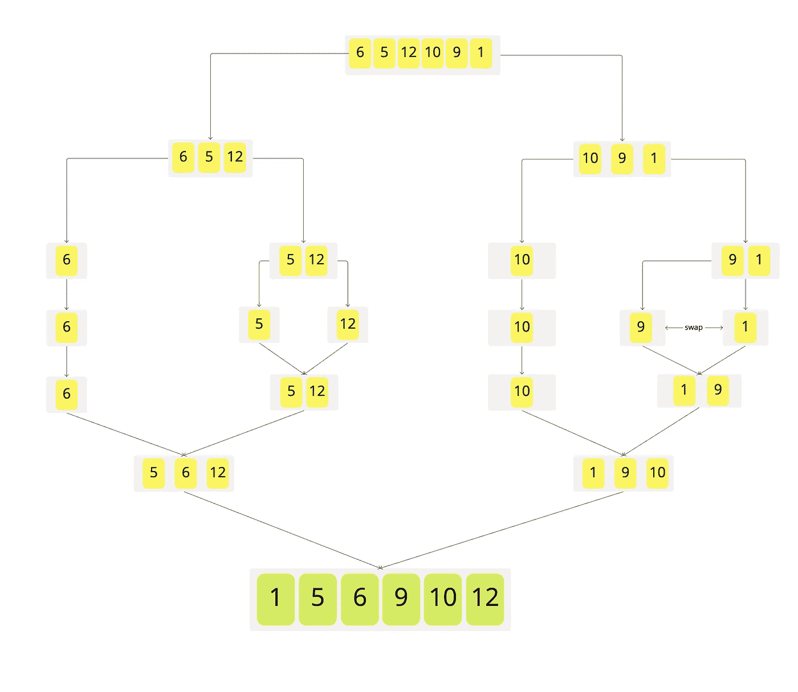
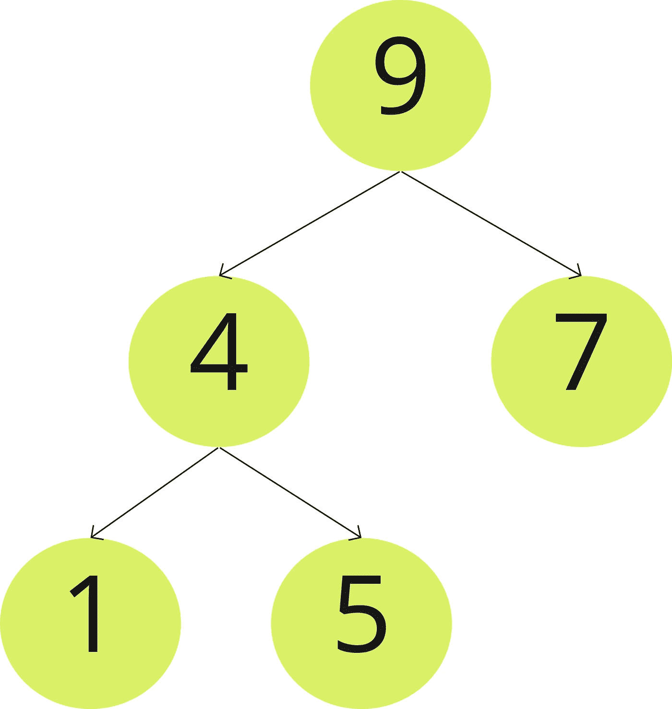
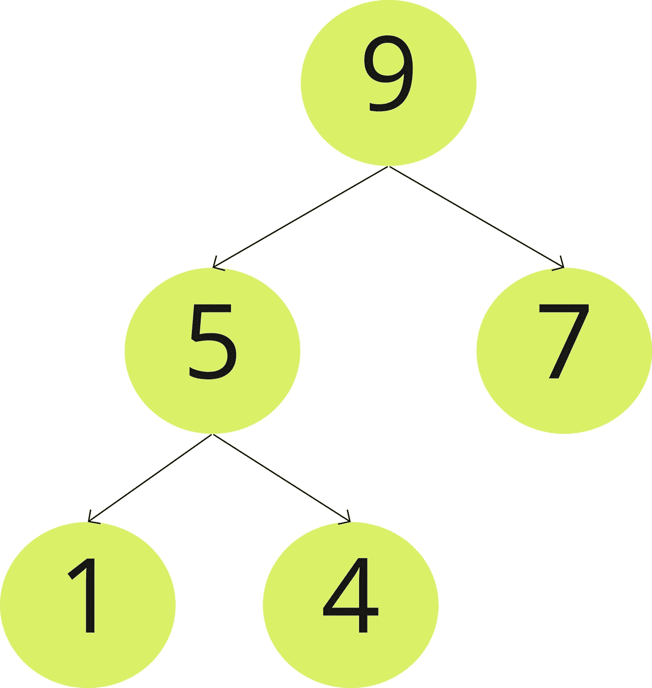
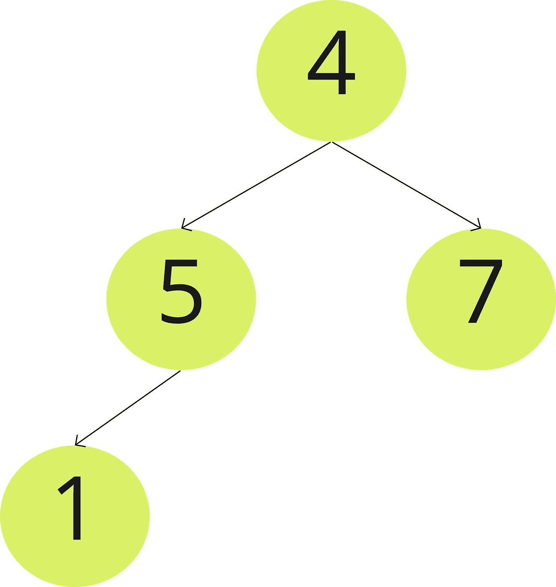
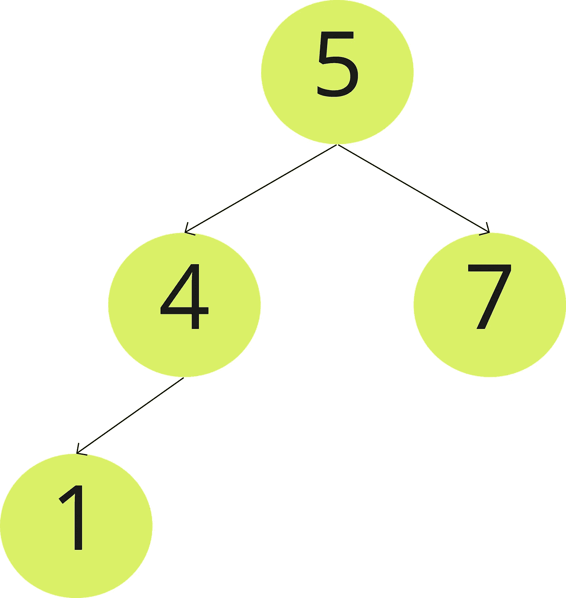
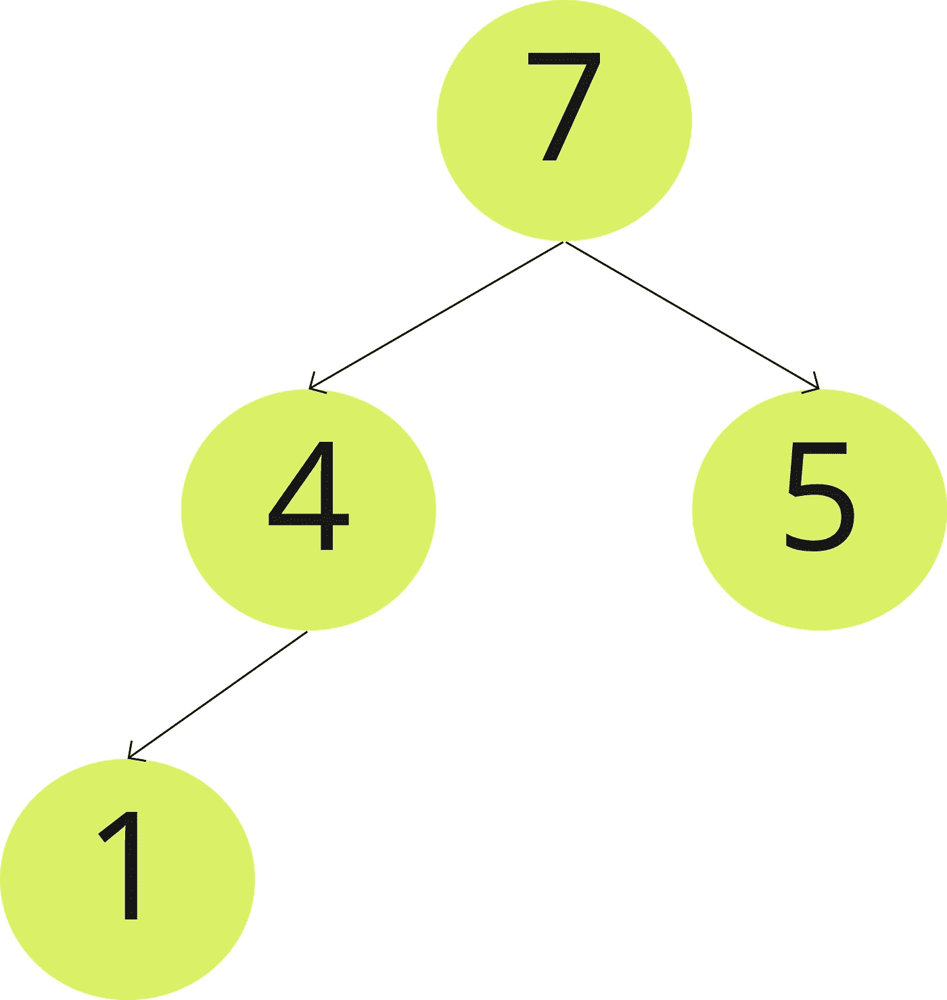
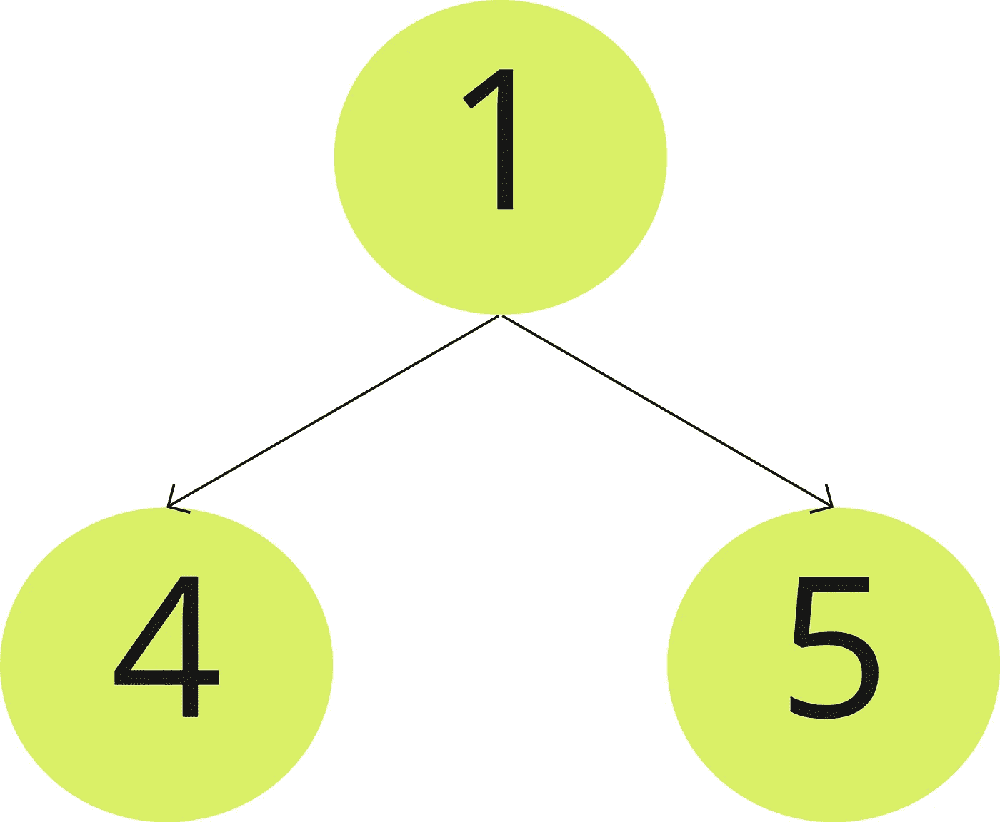
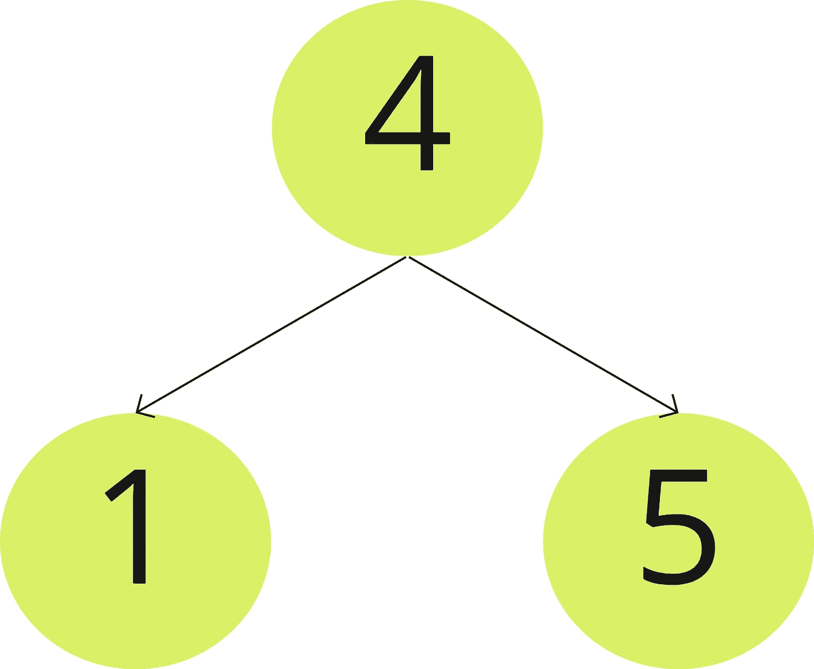
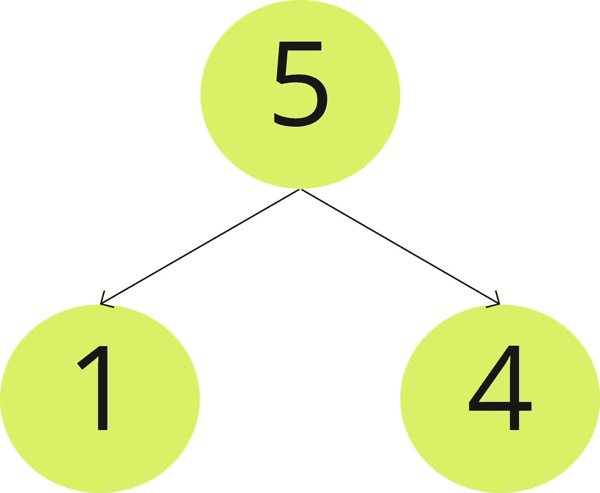

# 排序算法(合并和堆)

> 原文：<https://medium.datadriveninvestor.com/sorting-algorithms-part-3-979a0c9fd935?source=collection_archive---------8----------------------->

在本文中，我们将讨论最后两种排序算法。

# **合并排序:-**

这种算法基于与快速排序相同的分而治之的概念。

[](https://www.datadriveninvestor.com/2019/02/21/best-coding-languages-to-learn-in-2019/) [## 2019 年最值得学习的编码语言|数据驱动的投资者

### 在我读大学的那几年，我跳过了很多次夜游去学习 Java，希望有一天它能帮助我在…

www.datadriveninvestor.com](https://www.datadriveninvestor.com/2019/02/21/best-coding-languages-to-learn-in-2019/) 

在这个算法中，我们将数据数组分成两半，并对每一半进行排序，直到整个数组排序完毕。

**合并排序步骤:-**

1-未排序的数据集，假设它是一个数组( **Arr** )

2-找到数组中的中间元素( **(min + max)/2** )。

3-将阵列分成两半。

4-在每一半上调用合并排序，这意味着重复从 2

5-合并排序后的两半，得到排序后的数组，这一步是这个算法的核心逻辑。

我认为下面的图片可以帮助理解这些步骤



这里有一段伪代码，可以让我们知道如何实现快速排序

```
MERGE-SORT(Arr, low, high)
  if(low<high)
     middle= (low+high)/2
     MERGE-SORT(Arr, low, middle)
     MERGE-SORT(Arr, middle+1, high)
     MERGE(Arr, low, middle, high)MERGE (Arr, low, middle, high)
     n1 = middle - low + 1
     n2 = high - middle
     let L [1.. n1 + 1 ] and R[1.. n2 + 1 ]  be new arrays
     for i=1 to  n1
         L[i] = Arr[low+i-1]
     for j=1 to n2
         R[j] = Arr[middle+j]
     i = 1
     j = 1
     k = 1 
     while i < n1 && j< n2
        if L[ i ] <= R [ j ]
           Arr[ k ] = L[ i ]
           i = i + 1
        else 
           Arr[ k ] = R [ j ]
           j = j + 1
        k = k + 1
     while i < n1
        Arr[ k ] = L[ i ]
        i = i + 1
        k = k + 1
     while j< n2
        Arr[ k ] = R[ j ]
        j = j + 1
        k = k + 1
```

请随意查看这个 git 库以了解我们如何在 java 中实现合并排序。

**合并排序的复杂性:-**

时间复杂度最佳情况、最差情况和平均情况:O(n*log(n))

空间复杂度为 O(n)。

# 堆排序:-

这个算法类似于选择排序算法，我们找到最大值并把它放在数组的末尾。

堆排序是基于二叉树数据结构类型的(我们将在后面详细讨论)，但现在，我们需要知道的是，数据将被安排在看起来像树节点和级别的东西中。

二叉树中的第一个元素或节点称为**父节点，**其他称为**子节点** **节点**。

对于堆排序，父节点将包含元素的最大值或最小值。

二叉树可以用数组的形式来表示，因为数组可以节省空间。

其中节点的索引将在索引“ **x** 中”，左边的节点子将在索引“ **2*x+1** ”中，右边的节点子将在索引“ **2*x+2** ”中。

示例:-

```
[ 4 , 9 , 7 , 1, 5]
```

如何从数组中创建堆？

**4**→第一个节点将位于索引 **x=0**

**9**→左节点子节点将在索引 **2*0+1 = 1** 中

**7**→右节点子节点将在索引 **2*0+2 = 2**

**1**→9 的左节点子节点，其索引为 **2*1+1=3**

**5**→9 的右节点子节点，其索引将为 **2*1+2=4**


然后，我们创建最大堆，其中最大堆父节点是数据中的最大值

我们将在 9 和 4 之间交换



数据如下**【9，4，7，1，5】**

然后，我们在 5 和 4 之间交换得到



数据如下**【9，5，7，1，4】**

然后，我们交换数据中的第一个和最后一个元素，因此数据将如下所示 **[4，5，7，1，9]** ，我们将从树表示中删除 9



现在，我们将在 5 和 4 之间交换以获得



然后，我们将在 5 和 7 之间交换，得到



数据如下**【7，4，5，1，9】**

然后，我们在 7 和最后一个元素(9 之前的元素)之间交换，数据将是这样的**【1，4，5，7，9】**

我们还将从表示中删除 7



我们在 1 和 4 之间交换



然后，在 4 和 5 之间交换



数据将会是**【5，1，4，7，9】**

然后，我们在最后一个元素(7 之前的元素)之间交换，数据将如下**【1，4，5，7，9】，**并且在这里数据被排序。

在这个算法中，我们将数据数组分成两半，并对每一半进行排序，直到整个数组排序完毕。

**合并排序的步骤:-**

1-从输入数据构建最大堆。

2-最大的项存储在堆的根。

3-用堆的最后一项替换它

4-将堆的大小减少 1。

5-放大树根。

6-当堆的大小大于 1 时，重复上述步骤。

这里有一段伪代码，可以让我们知道如何实现堆排序

```
Heapsort(A as array)
    BuildHeap(A)
    for i = n to 1
        swap(A[1], A[i])
        n = n - 1
        Heapify(A, 1)BuildHeap(A as array)
    n = elements_in(A)
    for i = floor(n/2) to 1
        Heapify(A,i,n)Heapify(A as array, i as int)
    n = elements_in(A)
    left = 2i
    right = 2i+1 if (left <= n) and (A[left] > A[i])
        max = left
    else 
        max = i if (right<=n) and (A[right] > A[max])
        max = right if (max != i)
        swap(A[i], A[max])
        Heapify(A, max)
```

请随意查看这个 git 库以了解我们如何在 java 中实现堆排序。

**合并排序的复杂性:-**

时间复杂度最佳情况、最差情况和平均情况:O(n*log(n))

空间复杂度为 O(n)。

接下来:[数据结构—指针](https://medium.com/datadriveninvestor/data-structure-pointers-b75b0d04169)

上一篇:[排序算法—第二部分](https://medium.com/datadriveninvestor/sorting-algorithms-part-2-7affaead363)