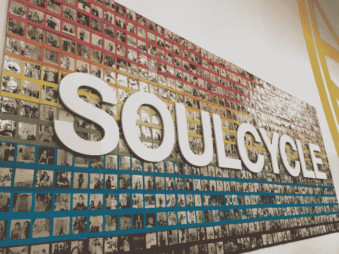
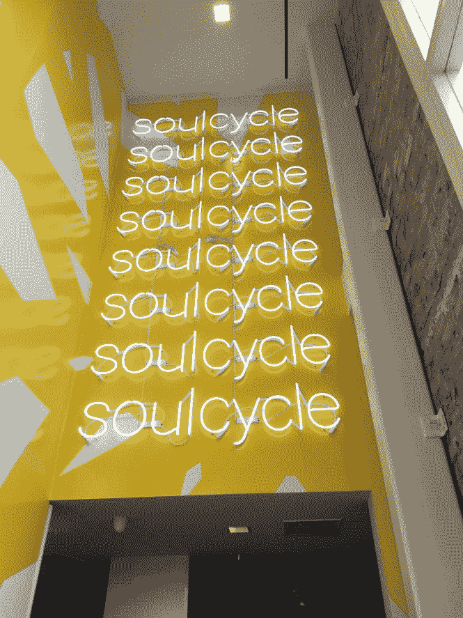
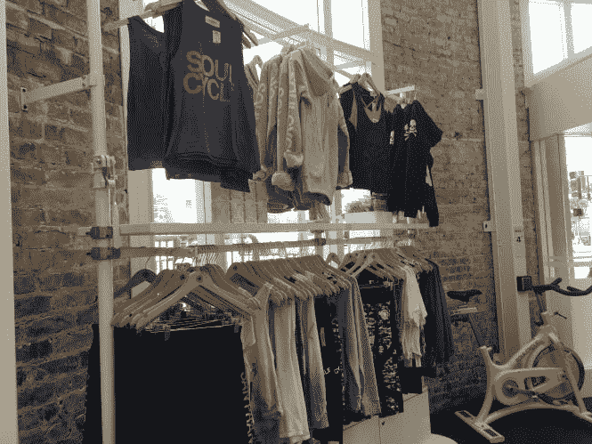
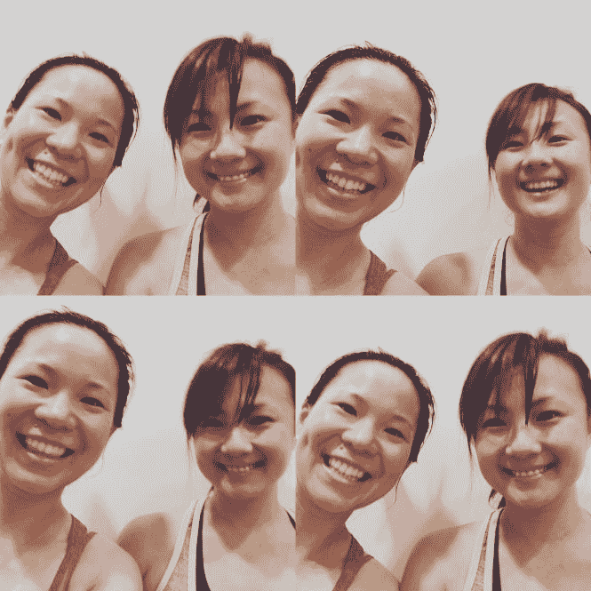

# 卡斯特罗的灵魂之旅！

> 原文：<https://medium.datadriveninvestor.com/soulcycle-in-the-castro-44176823857e?source=collection_archive---------0----------------------->

新的一天，新的工作室。我的首选工作室是 SOMA 地点，但由于我想带一个朋友来上课，我决定尝试 Castro 地点，尝试一些不同的东西。卡斯特罗美丽的 SoulCycle 工作室让我惊叹不已。充满活力的彩虹色，友好的前台工作人员欢迎我来到他们的工作室。

我喜欢走进 SoulCycle 时的能量和精神，进入工作室是我一天愉快的开始。我登记入住，等待我的朋友加入，然后在工作室周围徘徊。我和前台工作人员聊了聊，发现卡斯特罗的位置是湾区最新的位置。你能感受到工作室的能量和活力吗？它是如此的有感染力和令人惊奇——绝对是一次你可以亲身感受的经历！

在我的朋友整理好鞋子和水后，我们进入工作室帮助我的朋友适应她的自行车。我非常兴奋，我的朋友如此热情和开放地和我一起尝试 Bea 的课程。我**喜欢** Bea 和她的课，每次都是不同的体验！我也很感激，我可以带我的朋友来分享经验，让她在高强度的课堂上感觉良好，汗流浃背，这是一个多么美好的礼物啊！

这门课的主题。**灵魂幸存者**。这正是我和我朋友想要的。这堂课是一个小时，比通常 45 分钟的课稍微长一点，所以我很兴奋地体验了我的第一堂灵魂幸存者课。我喜欢比伊的新音乐——如此充满灵魂和感觉良好的节拍！

课堂上最精彩的部分。突破我认为可能的舒适区。Bea 提醒我们，每当我们在课堂上感到舒适时，就应该更上一层楼。以前，我会玩小游戏，稍微加大阻力，但这一次，我致力于超越我通常会做的事情。这绝对是值得的！课堂上充满了汗水、笑声和欢乐——谢谢，谢谢，谢谢！

我也喜欢卡斯特罗是唯一一个有迪斯科球的工作室！我的朋友有一件发光的绿色荧光衬衫，所以她在黑暗中也有发光的时候！我也喜欢一切都是黑暗的时刻，除了我们发光的白毛巾。和一群很棒的人在一起是一次很棒的经历，他们也致力于每天一起变得更好。

课堂大多在黑暗中进行也有所帮助。当我开始比较我应该走多快或我如何不在节拍上时，它帮助我避免自我意识。是自我产生了消极的想法。处于黑暗中有助于我专注于手头的任务，承认我的自我，但它也让我继续采取行动，平息内心的声音。

我喜欢我总是*【Bea】从课堂上获取我需要的东西，让我的一天/一周过得更好，这门课震撼了我的早晨。我喜欢我有意识地花时间将我的思想、身体和灵魂与老师的音乐和教导联系起来。我喜欢在浴室里和女士们随意聊天。我喜欢和志趣相投的人在一起。我喜欢花几分钟时间与前台员工谈论他们为什么喜欢 SoulCycle 以及它如何改变了他们的生活。这是一种鼓舞人心的感觉，我喜欢成为其中的一部分。*

*我非常喜欢和老师交流，因为他们有很多很棒的经验可以分享。我有一些燃烧灵魂的问题想问 [Bea](https://www.soul-cycle.com/instructors/201/bea/) ，我非常感谢她与我们分享她的答案。尽情享受吧！*

1.  ***你是如何开始 SoulCycle 之旅的？什么给了你最大的启发？***

*我开始是因为我想在精神上和身体上都感觉良好。我从小就喜欢跳舞和运动，所以保持活跃是我最初骑行的主要原因。我发现的一个额外收获是，当我走进一个灵魂循环的房间时，我感觉更有价值、潜力和爱。我找到了一个孕育幸福、同情和接纳的避难所。SoulCycle 很容易成为我自由和安全的出口，这只有当你敞开心扉体验时才能理解。经过几个月的骑行，我开始为 SoulCycle 兼职工作，并在 3 年后找到了试镜的勇气。所有这一切每天都激励着我，因为我知道地球上有人和有地方孕育了这种精神，我想与他人分享这种精神。*

1.  ***你最热爱什么？***

**我觉得我对很多事情都充满热情！家人…让你周围都是你爱的人，无论发生什么都支持你和联系。家庭可能是有血缘关系的亲戚或你所在的社区。我想我另一个最大的爱好是帮助别人。健身是感觉良好的最佳方式之一，我试图帮助人们每天都寻找感觉良好、强壮和有能力的感觉。激励他人去做他们喜欢的事情。帮助朋友或家庭成员完成任务或解决问题。我真的相信在这个世界上，我们在一起会更强大。**

1.  ***你从 SoulCycle 学到的最重要的经验/机会是什么？***

*在这段旅程中，我遇到了很多优秀的人。从纽约搬到旧金山是我多年来梦寐以求的机会，也是我人生中最重要的一课，每天都在不断地教会我一些东西。我很高兴我通过 SoulCycle 找到了它。我对自己了解了很多，并且还在学习！我学到的一件事是自我意识；我的行动，我的意图和我对这些事情的理解绝对让车轮转动。*

1.  ***当时代充满挑战时，是什么让你坚持下去？你是如何不断前进的？在课堂上和生活中？***

**首先也是最重要的，仅仅是存在或成为现在。意识到你正在处理的事情，而不是你不能控制的或者“可能的，应该的”这也有助于记住:深呼吸，你已经尽力了(是吗？)当然，还有和我爱的人讨论。**

1.  *你在灵魂循环课程中成功的秘诀是什么？在生活中？*

**三个字母的单词——试试！试一次再试一次。敞开心扉。听着。要诚实。如果你不能战胜恐惧，就带着恐惧去做吧！不要舒服太久。**

1.  ***你对健康和保健的未来最感兴趣的是什么？***

*我觉得越来越多的人越来越适应他们的健康需求。当我第一次发现 SoulCycle 时，有人试图告诉我这是一种时尚——错了。这个“趋势”惠及所有人！保持身体和精神健康是而且应该是每个人的首要任务！我认为现在是我们保持食物简单和身体活跃的时候了。我喜欢越来越多的人选择照顾自己。*

1.  *你有什么过健康快乐生活的最佳建议？*

**自知、自尊、移情、接纳、宽恕、正念和* ***爱。****

**原载于 2016 年 7 月 7 日*[*lovehealthandwellness.wordpress.com*](https://lovehealthandwellness.wordpress.com/2016/07/07/soulcycle-in-the-castro/comment-page-1/)*。**